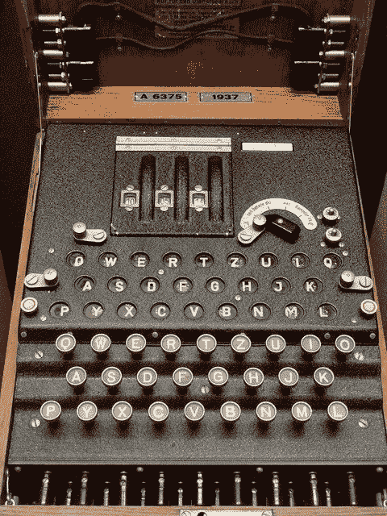
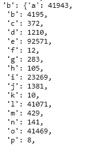
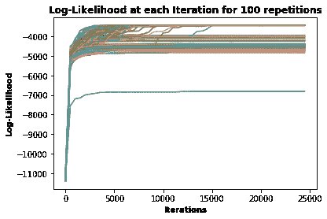
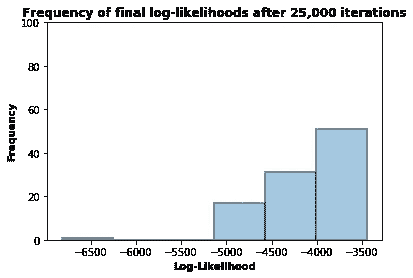
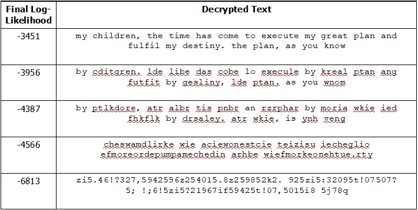

# 用 MCMC 破解 Python 中的 Enigma 代码(漫威主题)

> 原文：<https://towardsdatascience.com/breaking-the-enigma-code-in-python-with-mcmc-marvel-themed-9ceb358dd8ae?source=collection_archive---------25----------------------->



一台谜机。[来源](https://pixabay.com/photos/enigma-encryption-cryptologic-army-883925/)

知识就是力量。这条规则几乎可以应用于任何领域，但可以说它从来没有比战争时期更有意义。预测你的敌人下一步行动的能力同样困难，因为这是值得的，如果你能提前阅读他们的计划，这项任务会变得容易得多。

这是第二次世界大战期间各方都知道的事情，纳粹德国为确保他们通信的隐私和安全付出了巨大的努力。一个主要的工具是“Engima”，这种机器可以通过简单的字母转换过程(例如，所有的“a”都变成了“z”)来安全地加密和解密他们的通信。

虽然加密过程很简单(至少以今天的标准来看)，但对于盟军来说，找到正确的密钥来解密被截获的信息是一项艰巨的任务。更糟糕的是，这些按键每天都会切换，使得之前的所有努力都是徒劳的。当然，正如你可能知道的，艾伦·图灵和他的团队在布莱奇利公园遇到了挑战，这导致了计算的突破，并成为“人工智能”的基础。

然而，这篇文章不是关于图灵或他的方法(尽管他们有一些共同的品质)。这也不是关于解密纳粹通讯。相反，我们将采取更古怪的策略，看看神盾局特工截获的一条(虚构的)神秘信息，这条信息来自曾进行种族灭绝的泰坦军阀灭霸(漫威电影宇宙最初 22 部电影的主角)。**你**将扮演一个神盾局分析师的角色，他只有通过使用 Python 和他的马尔可夫链蒙特卡罗(MCMC)知识才能尝试解密代码并拯救宇宙。

如果你对真正的英格玛机以及它是如何被解密的感兴趣，我推荐你从这个数字迷视频开始:https://www.youtube.com/watch?v=G2_Q9FoD-oQ

```
"huvw !kzcq7nv3 qv3!hqv ,evwrhqv3rvq9qwi3qvhuv2cq,3vmk,7v,7zvbikb!kvhuvzqe3!7ufv3 qvmk,7nv,evuriv57r1nv!ev3rvieqv3 qvwreh!wvq73!3!qev57r17v,ev3 qv!7b!7!3uve3r7qev3rv1!mqv ,kbvrbv3 qvi7!;qceqvri3vrbvq9!e3q7wqverv3 ,3v3 qvr3 qcv ,kbvh,uv3 c!;qfvricv2cq,3qe3vw ,kkq72qv ,evtqq7vb!7z!72v3 qve3r7qev!7v3 !ev;,e3vi7!;qceqnvti3v7r1v3 quv,cqv1!3 !7vricv2c,emfv3 qvem,wqve3r7qnv57r1ev,kerv,ev3 qv3qeeqc,w3nvcqe!zqevr7v,e2,czfv,b3qcvkr5!evb,!kicqvr7vq,c3 nv3 rcv ,ev3,5q7v!3v,7zvmi3v!3v!7vrz!7ev;,ik3fv3 qvmr1qcve3r7qv!evr7vhrc,2fv!v ,;qvrczqcqzvcr7,7v3 qv,wwieqcv3rvcq3c!q;qv!3vbrcvhqnv!7vcq3ic7v!ve ,kkvzqe3cruv9,7z,cfv3 qvh!7zve3r7qv!evr7vq,c3 nv!vmi3v!3v!7v3 qve3,bbv!v2,;qv3rvkr5!nvti3v7r1v!v ,;qv q,czv3 ,3v!3v!evmr1qc!72v,vwutrc2v57r17v,ev3 qv;!e!r7fv3 qvcq,k!3uve3r7qv!evr7v3 qvwqkqe3!,kv q,zv57r17v,ev57r1 qcqfv!3v!ev1!3 v3,7qkqqcv3!;,7v!7v !evm,3 q3!wvwrkkqw3!r7nv2!b3qzv3rv !hvtuv3 qv,e2,cz!,7ev,b3qcv3 qvz,c5vqk;qevb,!kicqv!7v,wxi!c!72vbrcv3 qheqk;qefv3 qv3!hqve3r7qv!ev,kervr7vq,c3 nv1!3 v,v2crimvrbvercwqcqcenvwiccq73kuv2i,czqzvtuv3 q!cvkq,zqcnv3 qv,7w!q73vr7qfv3 qvk,e3ve3r7qnv3 qverikve3r7qnv ,evuq3v3rvtqvbri7znvti3v!v ,;qvmi3vhuvb,;ric!3qvz,i2 3qcnv2,hrc,nvr7v3rv!3ev3c,!knv,7zve qv ,ev7r3vz!e,mmr!73qzvhqvuq3fvr7wqv,ve3r7qv!evwrkkqw3qzv!v1!kkvtqv,tkqv3rv ,c7qeev!3evmr1qcvie!72v,v2,i73kq3v!v ,;qvrczqcqzv3 qvz1,c;qevr7v7!z,;qkk!cfv3 qv3!hqvbrcvwreh!wvrczqcv!ev7q,cnv,7zv1 q7v!vwrkkqw3v,kkv3 qve3r7qev!v1!kkv rkzvi7!;qceqv!7vhuv ,7zefv i2ev,7zv5!eeqenvv3 ,7re"
```

以上是我们截获的神秘信息。这些字符是字母数字，来自英语，包括一些分散的标点符号。我们也注意到了 7、3、v 等常见字符，但是手工解决这个是没有希望的。幸运的是，研究生院教了我们关于 MCMCs 的知识，我们觉得它可能很适合这个问题。MCMC 算法有 7 个步骤，如下所示:

**第一步** —选择一个随机的解决方案。

**第 2 步** —将解决方案应用于问题。

**第 3 步** —评估这种方法的效果如何。

**步骤 4** —对溶液进行 1 次调整。

第五步 —应用新的解决方案解决问题。

**第 6 步** —重新评估我们的解决方案。

**步骤 7 (a)** —如果新的解决方案具有更好的分数，它将成为当前的解决方案，我们从步骤 4 开始重复。否则:

**步骤 7(b)**-计算新解和旧解的比值，然后在 0 和 1 之间随机选择一个数字。如果比率超过该数字，则接受该解决方案。如果不符合，则拒绝该解决方案。不管怎样，我们从第 4 步开始重复。

注意，**步骤 7 (b)** 通过有时允许“更差”的解决方案最终提供更好的答案，允许探索更大百分比的潜在解决方案空间。接受这些“更差”解决方案的概率取决于它们有多差。这通常被称为“局部极小问题”。

然而，有一个问题:我们如何衡量解决方案的效果？我们需要一个经验分数来告诉我们两个解决方案中的哪一个更有可能是真正的解密消息。

为此，我们查看相邻的字母。例如，在加密的消息中，第一个字符串之一是“！kzcq7nv3”。我们可以计算在英语中,' k '跟在'！'后面的可能性有多大，或者“z”跟在“k”后面，依此类推。然后，如果我们随机改变一个字母，我们可以看到新的字母配对是更多还是更少可能来自英语单词。为了得到这些配对概率，我们将需要一个巨大的英语单词语料库——最好包括漫威单词，如复仇者联盟、灭霸或绿巨人。为此，我们可以抓取整个漫威维基(参见 GitHub ),并计算每个字母跟随另一个字母的频率。



Python 字典，包含漫威维基中“b”后面的字母的频率。

由此，我们发现字母配对“ba”出现了 41，943 次，而“bn”只出现了 141 次(“subnet”和“Kly'bn”，如果你想知道的话)。然后我们可以将这些计数转换成百分比。因为这些百分比往往很小，所以取它们的对数来使它们的值正常化是有意义的。这将把 0.0001%这样的值变成-4。现在我们有了每个字母配对及其各自对数似然性的字典，我们可以通过简单地将每个字母配对的所有对数似然性相加来评估任何解密消息的尝试。例如，如果我们评估字符串“hello ”,对数似然将是-8.6，而字符串“z9kk3”将是-32.6。这是因为在漫威维基(或任何英文文本)中，“他”远比“z9”更常见，等等。

假设我们现在有一个函数来评估任何潜在的解决方案，我们可以实现 MCMC 方法来尝试解密消息，代码如上。

我们从步骤 1 开始，随机选择一个解决方案，并评估其得分情况。应用第一种解决方案会呈现以下“解密”消息:

> *“我；1vd5awx47。VX；。d x；vnq1c x；。c；x:x1！。x；我；8wxn。；h5n4n4at！5td5 我；”*

这种可能性的对数为-11，396。然后，我们通过交换字母配对对解决方案进行一次更改，对模型重新评分，并确定这是否使解决方案更有可能或更不可能。冲洗并重复。到第 1000 次迭代时，分数显著提高到-4，792，解密后的消息现在为:

> *“fyalpimoc NHA sp as if aprtalef asea j lus afy AGC rsavmrrnoabumbimafya”。*

它仍然远不可读，但空间看起来很自然，数字/不当的标点符号已经消失了。

到第 3000 次迭代时，该消息开始看起来几乎是英语，得分为-3891:

> *《儿童》作者:hreas 氏族，mulmil 作者:*

在第 7000 次尝试时，我们可以读到信息的开头一行:

> *“我的孩子。是时候执行我的伟大计划，实现我的*

直到第 24，000 次迭代，上面的句号才被逗号正确地切换，分数才收敛到其全局最优值-3，451。最终解决方案如下(**警告** —漫威几部电影的部分剧透！):

```
My children, the time has come to execute my great plan and fulfil my destiny. The plan, as you know, is to use the cosmic entities known as the infinity stones to wipe half of the universe out of existence so that the other half may thrive. Our greatest challenge has been finding the stones in this vast universe, but now they are within our grasp. The space stone, knows also as the Tesseract, resides on Asgard. after Loki's failure on earth, Thor has taken it and put it in Odin's vault. The power stone is on Morag. I have ordered Ronan the accuser to retrieve it for me, in return I shall destroy Xandar. The mind stone is on Earth, I put it in the staff I gave to Loki, but now I have heard that it is powering a cyborg known as the Vision. The reality stone is on the celestial head known as Knowhere. It is with Taneleer Tivan in his pathetic collection, gifted to him by the Asgardians after the dark elves failure in acquiring it for themselves. The time stone is also on earth, with a group of sorcerers, currently guarded by their leader, the Ancient One. The last stone, the soul stone, has yet to be found, but I have put my favourite daughter, Gamora, on to its trail, and she has not disappointed me yet. Once a stone is collected I will be able to harness its power using a gauntlet I have ordered the Dwarves to make for me on Nidavellir. The time for cosmic order is near, and when I collect all the stones I will hold Universe in my hands. Hugs and kisses, Thanos
```

*(感谢超级漫威极客鲍勃·加德为我写下这篇文章。)*

你很快打印出这条信息，并迅速传给你的老板。几个小时后复仇者们就集合起来了，他们正在制定保护石头和击败灭霸的计划。你很快被提升为高级数据科学家，并获得了可观的加薪。

但是，根据漫威漫画，存在着具有无限可能性的无限宇宙。在所有这些中，你成功地破译了信息并击败了灭霸吗？为了测试这个假设，我们可以重新运行 MCMC 算法 100 次，看看它收敛到正确解的次数。



100 次独立重复的算法每次迭代的对数似然性。

从上面我们可以看到，它并不总是成功地达到全局最大值。事实上，我们可以看看最终对数似然的分布，看看这 100 次中有多少次我们接近最优。



100 次独立重复的最终对数可能性的频率。

从这里，我们发现在 100 个宇宙中，我们有 50%会正确地解密信息并拯救地球。但是其他 50 次呢？他们会看到什么信息？下表让你知道，根据算法收敛的分数，你会向你的老板尼克·弗瑞提出什么解决方案。



然而，很可能通过足够的迭代，大多数问题最终会找到正确的答案。

最后一个例外，它落入了一个几乎不可能恢复的陷阱。常见的字母几乎都被数字取代了。鉴于数字最有可能跟在其他数字后面，任何用字母替换单个字符的尝试都会遭遇对数似然性的灾难性下降，这几乎永远不会被接受。

就拿*“孩子”*这个词来说吧。在最低分的尝试中，它被解密为:*. 46！？327、*。如果该算法将*【2】*换成了**正确的**字符*【r】*，它将不会提高给定的分数*【32】**【27】*将会比漫威维基中的*【3r】*和*【r7】*出现得更频繁。

一个简单的解决方案是在算法开始时重复步骤 1-3(选择全新的随机解决方案并评估它们)几次，然后继续执行其中最高的执行。通过包括这一点，并将迭代次数增加到 100，000 次，我们能够在 100%的时间内接近解决方案(1 或 2 个不正确的字符)。这不仅拯救了我们的宇宙，也拯救了所有发现自己处于同样困境的多节诗。

GitHub:[https://GitHub . com/JackWillz/Projects/tree/master/MCMC % 20-% 20 enigma % 20 thanos](https://github.com/JackWillz/Projects/tree/master/MCMC%20-%20Enigma%20Thanos)

你已经看到文章的结尾了！我叫 Jack J，是一名将人工智能应用于竞技游戏和电子竞技的专业数据科学家。我是 [**iTero 的创始人。GG**T23](https://itero.gg/)[和**jung . GG**。你可以在](https://www.jung.gg/) [**Twitter**](https://twitter.com/JackJGaming) 上关注我，加入 [**iTero Discord**](https://discord.gg/hZmk3z6adP) 或者给我发邮件到 **jack@itero.gg** 。下一场见。

*原载于*[*https://itero.gg/blogs/.*](https://itero.gg/blogs/.)