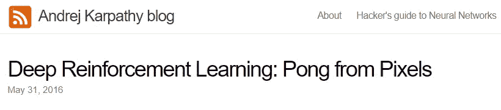
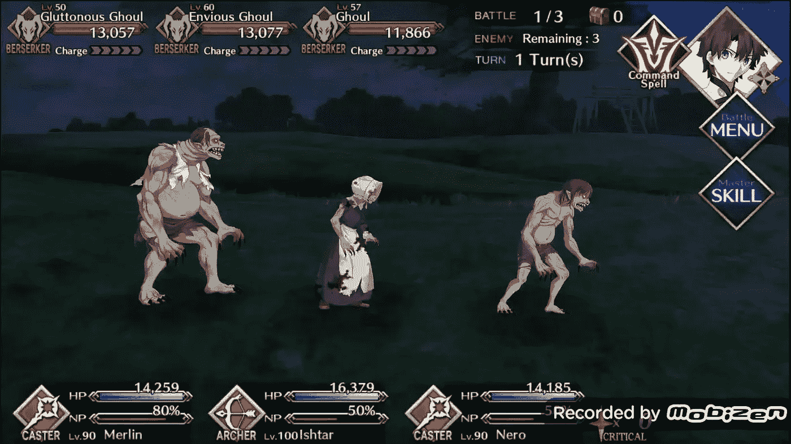
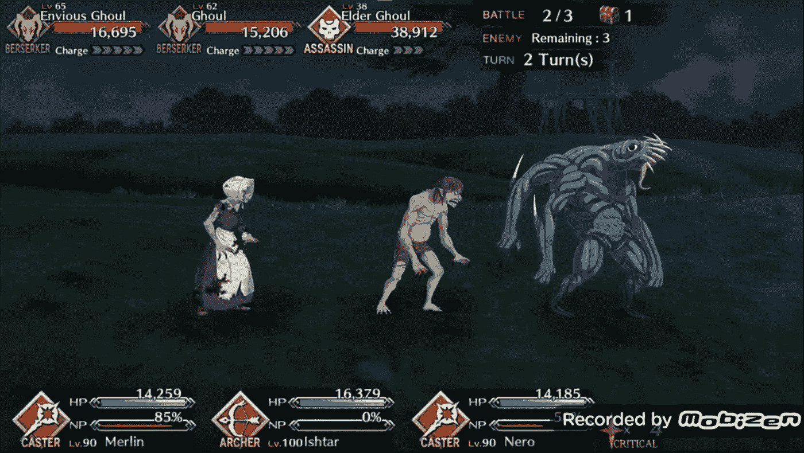
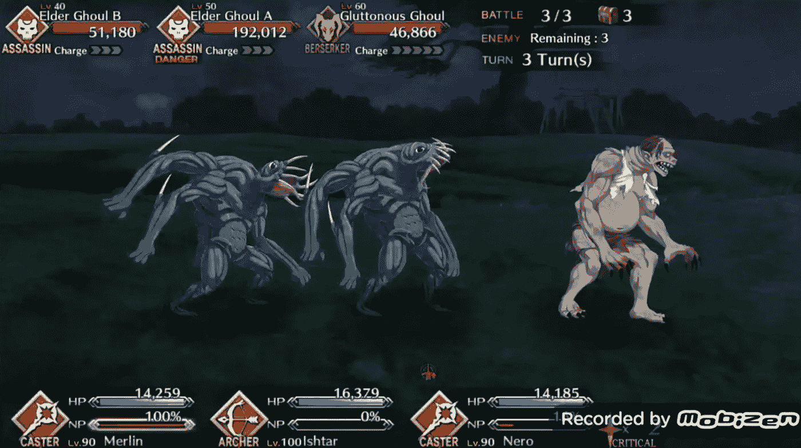
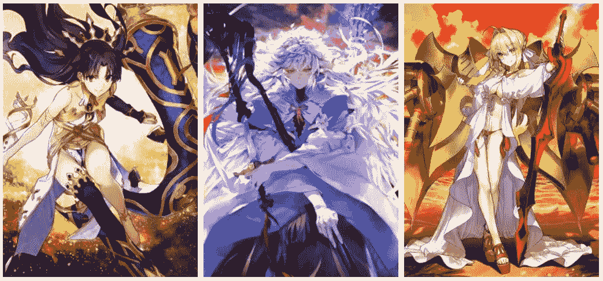
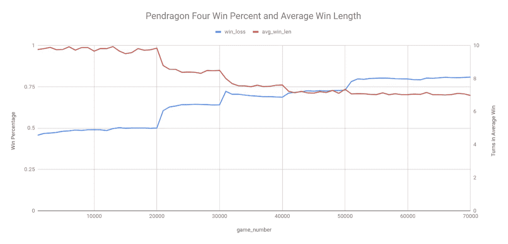
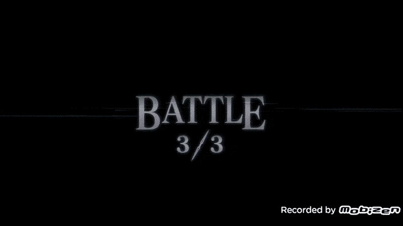
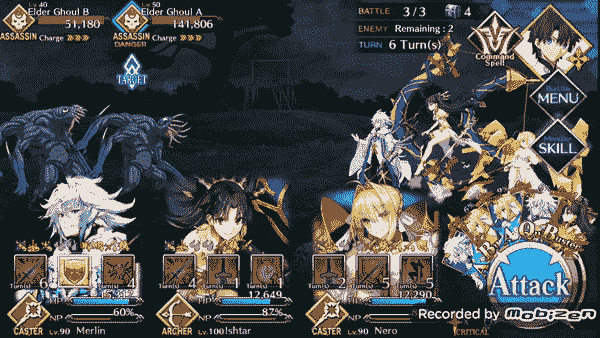
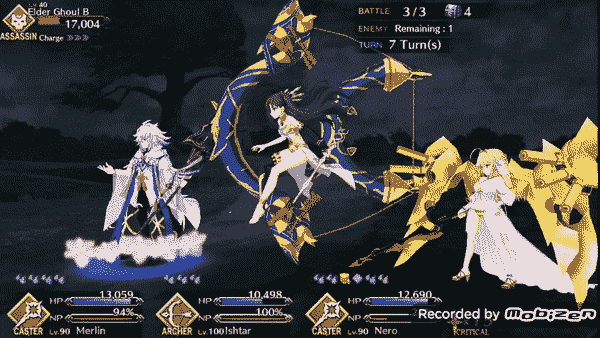

# 打破游戏:潘德雷肯四梅林的崛起

> 原文：<https://towardsdatascience.com/breaking-the-game-pendragon-four-rise-of-merlin-4d9acfe5fbd7?source=collection_archive---------36----------------------->

图片[此处](https://gamepress.gg/sites/default/files/styles/600x315/public/2019-09/merlin2.png?itok=cYa1fOot)

在我的第一个潘德雷肯四人组[博客](/pendragon-four-multi-agent-reinforcement-learning-with-fate-grand-order-80f6254754dd?source=---------5------------------)中，我介绍了我为手机游戏《命运大令》( FGO)设置的多智能体强化学习(RL ),我列出了几个目标:

> 1)为游戏添加支持

FGO 没有玩家对玩家的方面，基本上所有的角色都可以使用，但它仍然有一个合理定义的元。在游戏中，元粗略地描述了比其他人更占优势的策略、角色或武器。在 FGO，元在很大程度上是由支持角色定义的，这些角色可以实现强大的/主导的策略。对于 FGO 的北美服务器来说，第一个真正的游戏突破和元定义支持是 2018 年底发布的 Merlin。

花之法师梅林是 FGO 版的魔术师/巫师/德鲁伊，大多数人都熟悉他是亚瑟王传说中的国王创造者。我说梅林在《FGO》中是一个超定义角色，因为他提供治疗来帮助团队承受敌人的伤害，提供无敌能力，充能团队的终极能力，如果这些还不够，他还可以极大地放大团队的伤害输出。

因此，如果标题和过去的几个段落还不足以作为铺垫，我决定将梅林作为一个角色添加到我的游戏环境中，以训练一个代理人使用梅林的能力。

> 2)使用某种多代理框架清除最终游戏内容

我暂时不打算正式尝试清除任何种类的后期游戏内容，但加入梅林让我不得不这样做，以便为代理人提供足够的挑战。所以我选择了一个相对高级的任务来复制成一个环境，并建立了一个机器人团队来完成它。

*3)让这个项目的某个版本被某个地方接受为一个讲座。*

谁知道这是否会发生，但我肯定会尝试。

# 梅林打破了游戏

梅林对 FGO 的介绍基本上打破了游戏规则，因为他加入了大量的治疗和伤害提升，使得原本具有挑战性的内容变得相当简单。当我把他编进代码，开始和他一起训练机器人团队时，我发现梅林也破坏了我的游戏环境。

## Merlin 的技术实现

从技术角度来看，梅林和我以前的特工略有不同，他们都是伤害交易者类型的角色。我之前为他们制造的伤害制造者基本上都有影响他们自己或者整个团队的能力。因为每个角色有三种能力，所以每个角色的行动空间是 4，包括传球选项。然而，梅林最终的行动空间是 6。梅林的能力是全队增益，全队无敌，和有针对性的伤害提升。两个全队技能代表两个可能的动作，传球是第三个，目标伤害提升用三个可能的动作表示，动作空间为 6。有针对性的伤害提升是我的一个潘德雷肯特工新增加的，我基本上让一个技能有三种可能的行动，我让梅林特工选择谁是这个技能的目标，这样特工就可以选择对团队中的三个角色中的任何一个使用这个技能。

除了这些技能之外，梅林也是我添加的第一个终极技能，高贵幻象(NP)与伤害无关的角色。在我的自定义游戏环境中，当以前的角色将他们的 NPs 充能到 100%时，我会让他们只造成一些伤害，但对于梅林，我不得不做一些修改。梅林的 NP 被称为“阿瓦隆花园”，我实际上利用了我添加的机制来跟踪技能及其持续时间的效果。因此，每当梅林在游戏环境中将他的 NP 充到 100%时，他的 NP 就像技能一样应用到他自己和其他特工身上

## 直接后果

一旦我把梅林编码成一个角色，游戏环境能够处理他，我发现我有一个有趣的问题。在我最困难的游戏环境中，我的代理团队一初始化就赢了 90%以上的时间。从表面上看，这是一件坏事。我发现，在这种设置中训练的特工基本上什么都不做。他们不会使用技能，他们实际上永远不会做任何有趣的事情…相比之下，我以前的机器人做过的最好的事情是，一旦它们经过完全训练，胜率在 85-90%之间。

不同的是梅林。

原图[此处](https://fategrandorder.fandom.com/wiki/Merlin?file=Merlin02.png)

本质上，梅林作为一个角色提供了如此多的功能，机器人基本上可以做他们想做的任何事情，并且仍然获胜。他的 NP 阿瓦隆花园允许机器人有效地治疗团队受到的几乎所有伤害，梅林的伤害 buffs 允许代理团队赢得胜利，不管他们单独做了什么。在我的游戏环境的那个版本中，机器人团队的奖励基于胜利，胜利+1，失败-1。然而，在团队所做的一切都是胜利的情况下，得到强化的行动是最常见的。

每个角色有三种能力，每次任务允许使用一次。一个普通的任务持续 7-15 回合，所以大部分时间他们必须通过。所以有了这个设置，这意味着机器人学会了`pass`，因此什么也不做。

## 跟着梅林学习

我花了几天时间才想出如何处理这个问题，因为从技术上来说，机器人正在获胜，并且做得很好，但它们只是没有学会我认为有用的行为。我的一部分只是想继续让游戏环境变得越来越困难，但在某一点上，环境将不再像一个合理的 FGO 水平。所以训练环境将不再真正代表实际的比赛。

我在这里的突破来自于我重读安德烈·卡帕西的博客关于教一个 RL 代理玩乒乓的时候。

安德烈·卡帕西的[博客](http://karpathy.github.io/2016/05/31/rl/)很值得一读！

如果你还没有机会并且对 RL 感兴趣，它值得一读！无论如何，我在重读中注意到的是，Andrej 注意到我们应该做的是:

> 鼓励和劝阻大约一半的行为

这让我想到了我和梅林的情况，以及他造成的困难。在我目前的实现中，我没有贴现未来的奖励，只是根据输赢应用了一个简单的+1 和-1 奖励，所以博客中列出的一些方法并不适用。阻止一个代理人采取的大约一半的行动的概念确实如此，问题是如何阻止。

我做的第一件有效的事情是设置机器人必须获胜的回合限制，否则他们实际上会收到少量的负面奖励。例如，回合限制为 12，如果机器人在 10 回合中获胜，它将获得全额+1 奖励，如果它在 13 回合中获胜，它将获得-.25 奖励，如果它失败，它将获得全额-1 惩罚。这种奖励结构意味着机器人将会知道他们不能只是赢，而是必须快速赢。

然而，这种方法对机器人应该以多快的速度获胜施加了一个略微人为的限制。为了解决这个问题，我最终做的是让机器人必须比过去的自己赢得更快，才能获得全额奖励。

由于我已经跟踪了在 1000 个游戏周期内赢得的游戏数量，作为我训练指标的一部分，我开始记录这些游戏有多长，并使用一个 1000 个游戏周期内游戏的平均长度来设置为机器人团队收集全部+1 奖励所需的回合数。这意味着机器人总是试图比以前的自己赢得更快。

使用这种奖励方法，潘德雷肯四号学会了有趣的行为，即使是在加入梅林之后。所以，一旦我能够让机器人再次学习，并在我以前的游戏环境中获得 97%以上的胜率，我觉得是时候看看我是否可以训练机器人清除一些更难的 FGO 内容。FGO 任务的难度是根据通关团队的等级来评定的。到目前为止，我的大部分基准测试都是建立在一个中级任务的基础上的，这个任务在 40 级的农场中很常见。在 FGO，最高等级的任务实际上是 90 级，少数任务是 90+级，这通常是某种类型的 boss 战。我选择了一个 78 级的任务来构建更难的内容，这个任务被称为 FGO 故事中发生在塞勒姆女巫审判期间的绞架山上的处决地点。

# 行刑现场

虽然我可以选择一个不同的任务进行基准测试，但我选择 Gallows Hill Salem 任务的原因是因为它是游戏中我目前需要的一个名为“哭泣之夜之桩”的项目的最佳投放点。

[fgo wiki](https://vignette.wikia.nocookie.net/fategrandorder/images/3/35/Iron_Stake.png/revision/latest/scale-to-width-down/100?cb=20180423114330)

为了提升角色的属性，你通常需要收集特定的材料。我正在制作的一个角色需要哀嚎之夜的木桩，完全升级需要 216 根木桩，平均需要运行 1.5 次才能放下木桩。是的……这个游戏有很多关于农业的内容。

## 建立关卡

关卡的结构遵循了后来游戏 FGO 内容的标准格式。从第一波到第三波，有三个难度增加的级别。

第一波相当容易，三个敌人的总血量是 38000。高水平的团队可以很快解决这个问题。

第一波敌人

第二波通过增加更强壮的敌人增加了难度。作为快速基准，这一波的敌人有 70813 点生命值，一个敌人的生命值相当于整个第一波。

第二波敌人

现在进入最后一波，第三波。对于这个任务，wave 3 有 290，058 HP。所以是前两次浪潮总和的两倍多。如果你长时间困在上面，这个会变得棘手，因为拥有 192K HP 的主要敌人每 4 回合就会发动一次强大的攻击。在对我的潘德雷肯四代理进行基准测试时，随机初始化的团队通常会进行到第三波，然后在试图削减敌人的 HP 时陷入困境并死亡。

挥动三个敌人

所以在建造这个关卡的过程中，我想做两件事。首先，适当地调整等级，这样代理团队将必须通过一个真实的健康等级。第二，为了增加难度，我想让特工们在冲锋后用更强大的攻击来对付他们的敌人。

第一点，与我之前的困难等级相比，我在每一波都给敌人增加了更多的生命值。第一波有 30 点生命值，第二波有 55 点生命值，第三波有 140 点生命值，总共 225 点生命值，比我之前 180 点的最高值有所提高。

对于第二点，我增加了机制让敌人每 X 回合造成更多的伤害。例如，这最后一波每 4 回合造成正常伤害+ 10 点额外伤害。代理作为一个团队有 30 总生命值，所以第三波的长期战斗可以很容易地击败代理团队。

一旦新的机制和规格到位，是时候训练和基准潘德雷肯四。

# 培训和结果

在我的其他各种管道改进后，我能够将环境编码起来，并决定让代理人扮演的团队。

这支队伍将由两个伤害经销商组成，梅林作为支援角色。这两个伤害处理者是伊师塔，我之前把她编为一个有用的角色，还有一个新的伤害处理者，昵称是尼禄·卡斯特，我想用她，因为她在这个级别有很好的匹配。

[伊师塔](https://gamepress.gg/grandorder/servant/ishtar)、[梅林](https://gamepress.gg/grandorder/servant/merlin)和[尼禄施法者](https://gamepress.gg/grandorder/servant/nero-claudius-caster)

一旦团队就位，我们就可以开始行动了！

大致按照我对潘德雷肯四号的训练协议，我让机器人玩，并监控它们的进展。请参见下面的运行示例。训练开始于前 20，000 圈的高探索和学习率，这就是为什么在图的第一部分没有改善。然后我开始每转 10000 转左右降低探索率和学习率，直到 70000。正如我们所希望的，在训练过程中，输赢百分比会增加(蓝色)，而在同一时间内，输赢的回合数会减少。

超过 70，000 场游戏平均轮到赢(红色)从 9.75 开始，到 7 点左右结束。整体胜率从 45%开始，到 80%结束。

这些训练结果令人振奋，因为机器人似乎在学习，这对它们来说似乎是一个足够的挑战，因为胜率从来没有特别高。

所以在理论上这似乎是成功的，但现在潘德雷肯四正在玩更困难的内容，我想把它与自己玩的水平进行比较。

# 打破潘德雷肯四人的游戏

为了测试潘德雷肯四人组的表现，我让潘德雷肯四人组训练有素的特工和我自己在实际的 FGO 游戏中玩了 10 轮处决，我们都在相同的限制下玩。

1.  技能只能使用一次
2.  一旦一个角色的高贵幻象(NP)充能到 100%，它就必须被使用。
3.  波浪必须从前面打到后面(没有重新瞄准)

结果如下表所示:

为了进行基准测试，我包含了随机初始化的代理的运行。我在他们的“平均值”旁边加了星号，因为随机初始化的代理人会在前两波中蹒跚而行，到达第三波，然后因为长时间停滞不前而死去。我发现看这个令人沮丧，而且恢复一个团队并继续玩下去需要花费资源，这似乎对我来说是一种浪费，所以我在五轮左右后就停止了。相比之下，训练有素的潘德雷肯四特工和我本人实际上都没有失去水平。

作为一个人类玩家，我仍然利用了更多的游戏信息，比如每个人的指令卡属于哪个角色，我认为这帮助我比机器人玩得更快。然而，看到纸上的机器人行为，我实际上认为它会比我的人类策略差很多，但令人惊讶的是，机器人策略工作得很好，而且实际上相当一致。

在改进《潘德雷肯四》的过程中，我一直在做的一件事是，我想尽可能地把我自己和我对如何玩这个游戏的信念从管道中移除。这主要是通过切换到+1 和-1 奖励的纯政策梯度方法，并设计新的水平，而没有通过伤害提升或其他机制激励某些行动。看看这里的结果，我认为这种努力是相当成功的。

# 对立的策略

不管使用什么策略，对于这样一个任务来说，真正获胜的唯一方法是使用强大的伤害处理 NPs 来清除它。我的基本策略是保存我团队的 NPs，只在第三波的时候发射，以尽快清除他们。而潘德雷肯四号使用了一种非常不同的策略，实际上每场比赛两次发射本队的 NPs。

## 我的方法

作为一名玩家，我倾向于通过为最后一波敌人保留技能和 NPs 来玩 FGO，因为他们通常相当强大，为最后的艰难对抗保留火力是有意义的。所以从游戏性的角度来看，我通常会在第一波和第二波中不使用任何技能，或者只使用一些攻击 buffs 来更快地通过这些波。然后在第三波，我用我的团队的效用技能充能 NPs 到 100%并且相对快地赢了。所以在整个关卡中，我依赖于使用每个伤害制造者的 NPs 一次。

## 潘德雷肯四国的方法

然而，潘德雷肯四所做的几乎完全相反。潘德雷肯四号使用它的实用技能来攻击伊师塔和尼禄的 NPs，并立即清除前两波攻击，同时保留大部分战斗技能用于第三波攻击。一旦到了第三波，它开始发挥它的攻击 buffs 和梅林的支持能力，以增加它的回合伤害，治疗，并有能力重新充电到 100%的 NPs，并通过在关卡中第二次使用尼禄和伊师塔的 NPs 来赢得胜利。

# 打破潘德雷肯四人的方法

理论上，我认为这在实际的 FGO 等级中不会很顺利，因为我认为代理团队会在第三波中被卡住而死亡。然而，我感到惊喜，觉得我有一些东西要向代理商学习。

潘德雷肯四回合 1 伊师塔冲向她的 NP 并清除波浪

## 早期游戏:第一和第二波

从游戏性来看，似乎潘德雷肯四号使用它的 NPs 立即清除了前两波，因为它降低了可能的变化，并且非常一致地让机器人清除了那些初始波。它可能避免的一个危险是，有几次我以正常方式玩游戏，但意外地让 NPs 充满电，这意味着我被迫在糟糕的时候使用这些 NPs，并在不利的情况下进入第三波。这些跑了 9 圈或更多才完成，这意味着我比潘德雷肯平均速度慢 4 倍。所以潘德雷肯四人组决定使用那些 NPs 和实用技能，立即否定了这种潜在的危险。

潘德雷肯四回合 2:尼禄施法者给她的 NP 充电，并用它来清除波浪

进入第三波时，特工们的 NPs 充电量相对较少，所以作为一个人类，我会很担心，因为团队 NPs 的充电量越低，他们在 NPs 恢复之前在危险的第三波上花费的时间就越长。事实并非如此，因为潘德雷肯四号能够有效地使用梅林。

## 游戏后期:第三波

一旦游戏进行到第三波，潘德雷肯四号使用梅林的阿瓦隆花园，该花园给予队伍 5 轮治疗，每轮增加 5%的 NP。加上他的全队攻击 buff，每回合增加 20%的 NP 电荷，这意味着他可以在接下来的一段时间里给全队 45%的 NP 电荷。这与他所提供的持续性和不可战胜性相结合，给了团队足够的支持来度过任何潜在的伤害。

3 回合攻击 buffs 和梅林的 NP“阿瓦隆花园”。

我之前提到过梅林被压制了，我希望潘德雷肯四号能学会以有趣的方式使用梅林。我希望但不能保证看到的是，潘德雷肯四号学会了使用梅林提供的全队无敌技能来阻挡第三波的强大攻击。我提到过第三波每 4 回合使用强力充电攻击。潘德雷肯四号在训练中学会了这种模式，并利用梅林的全队无敌成功阻挡了这些攻击(见下文)。在正确的时间使用该技能，结合梅林用自己的 NP 提供的治疗，意味着机器人可以在第三波战斗中相当安全地战斗，直到他们通常能够为他们的 NP 充电并获胜。

梅林特工使用无敌来抵消充能敌人的伤害。

# 结束语

在这篇文章中，分解潘德雷肯四人组正在学习的策略是一次有趣的经历，因为我还没有真正研究过我的经纪人已经开发的战术方面。正如我提到的，我特别高兴的是，他们开发了一种不同于我用来玩 FGO 的游戏风格，因为它展示了强化学习方法的一些乐趣，并让代理自由探索他们的环境和行动空间。

比人类玩家更容易使用能力的倾向是我在其他 RL 项目中看到的有趣的一点，比如 OpenAI 的 OpenAI Five。人们对 OpenAI 五个代理人的评论是，他们对使用长冷却时间的能力没有人类那样有所保留，他们倾向于像我一样玩，并抓住能力寻找更“最佳”的时间来使用能力或冷却时间。这也可能是如何激励代理更直接地消费资源而不是保存资源的函数，因为如果他们保存了资源，就不能保证你将来会使用它。这种短期规划看起来很有趣，但我也想知道如何才能让代理在能力使用上更保守。看看我是否能让代理人在本质上更保守的想法可能是我试图让代理人更像“我”，而不是他们所需要的。

虽然他们的策略与我的不同，但仍然相当有效，我对他们的结果非常满意。我认为向他们扔一些不同结构的任务会很有趣。例如，有一些任务有非常强大的最终 bosses，我认为在任务早期燃烧法术很难清除。因此，这将是一次有趣的测试，看看潘德雷肯四人组如何适应这种难度。

展望未来，我认为我的很多工作将会围绕着增加更难的内容和训练代理人，这些代理人也许可以更好地概括不同的任务。我在 OpenAI 的作品中看到的一个有趣的笔记是关于等级和代理统计的随机化，以促进对他们环境的更大探索，以及他们的代理被训练成彼此的完美“克隆”的方式。这提供了一种可能性，有三个代理共享相同的重量，但可以自由地扮演任何一组 FGO 人物和明确的任务。

用伊师塔的 NP 结束游戏。尼禄·卡斯特上一轮用了她的。