# 使用 Unsplash API 为应用注入活力

> 原文：<https://towardsdatascience.com/breathe-some-life-in-to-power-apps-with-the-unsplash-api-450bb9473f1b?source=collection_archive---------45----------------------->

## 如何在 Microsoft Power Automate(又名 Flow)中使用 REST APIs 向您的 SharePoint 列表中添加随机但非常漂亮的图片

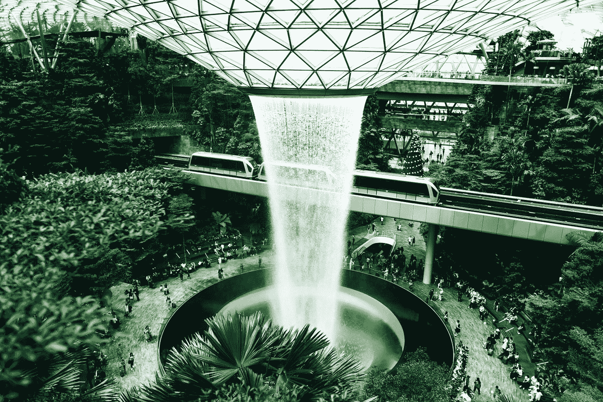

山顶上的新加坡樟宜机场。好照片让东西看起来更好。卡米尔·塔托尔在 [Unsplash](https://unsplash.com?utm_source=medium&utm_medium=referral) 上拍摄的照片

看 Power 应用教程有点像看草生长。油漆干燥时。当你等着水壶烧开的时候。令人失望的是，你的“带按钮的 SharePoint 列表”看起来是如此乏味，这足以让任何人去喝锁定的杜松子酒和滋补品。

不要烦恼。我们可以偷别人的照片，让他们看起来很漂亮。

# 电力应用程序很难看

下面是 SharePoint 的经典无个性[画布应用。](https://docs.microsoft.com/en-us/powerapps/maker/canvas-apps/app-from-sharepoint)

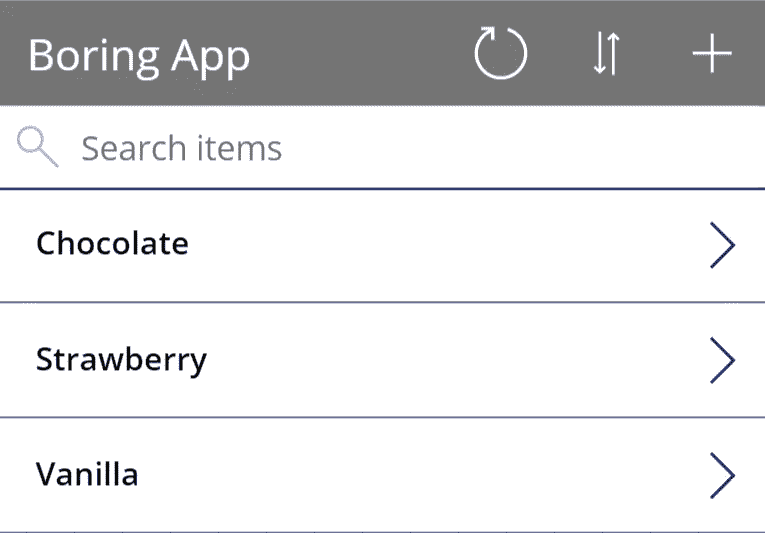

评分一个为什么大家都觉得 Power Apps 很垃圾的例子(对不起微软)。它们只是看起来很单调。来自微软的教程[来自 SharePoint 的画布应用](https://docs.microsoft.com/en-us/powerapps/maker/canvas-apps/app-from-sharepoint)。

不要误解我的意思，微软发布 Power 应用程序的速度比任何人了解它们的速度都快。他们可以做的事情并不缺乏，你可以延伸他们的长度。问题是，它们永远不会像你直接使用网络应用程序时那样好看(只要看看那些[花哨的引导主题](https://themes.getbootstrap.com/)

好吧，一个快速解决办法是添加一些图像，所以让我们开始从互联网的许多摄影师抢夺他们。

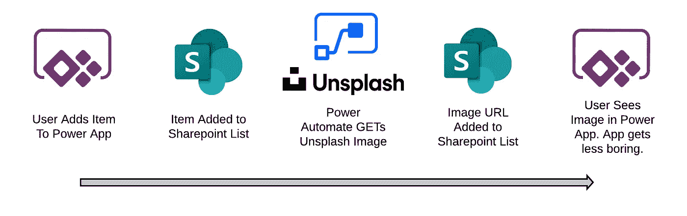

游戏计划

# SharePoint 列表图片字段

从微软教程中获取 SharePoint 列表，并添加一个“图片”类型的列。

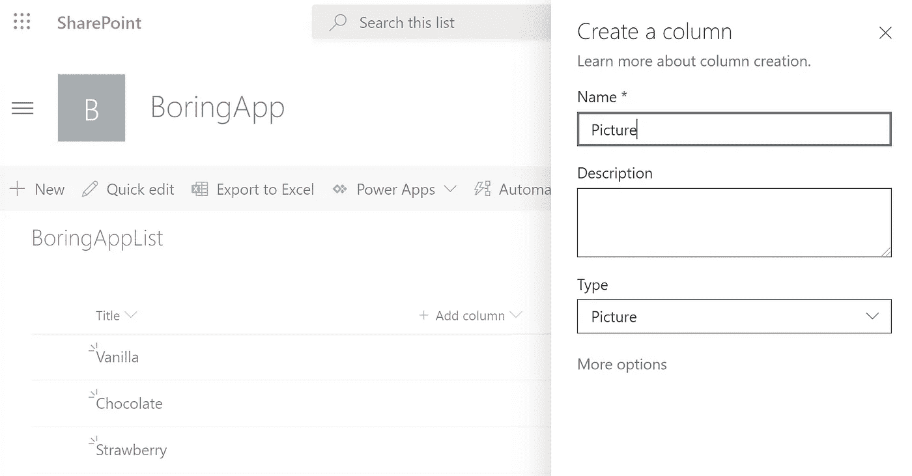

添加图片栏。有时候，列名的灵感来之不易。

添加或更新列表中的项目时，用户需要输入 URL 和可选文本字段。该字段的一个经典用例是使用它来存储您刚刚用 [Power Apps 相机控件](https://docs.microsoft.com/en-us/powerapps/maker/canvas-apps/controls/control-camera)放下的冰淇淋的图像 URL。

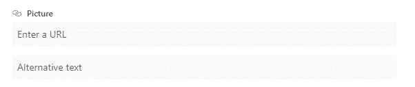

“图片”类型的 SharePoint 列表字段需要 URL

# 将非屏蔽 URL 放入列表

这个想法是，我们从 Unsplash 获得这些带有一些搜索参数的 URL。这将是很好的，如果这些是随机的(不要只是想一遍又一遍地相同的图片)，如果它自动完成。

在微软的世界里，用 Power Automate 实现自动化是最容易的。计划是这样的。

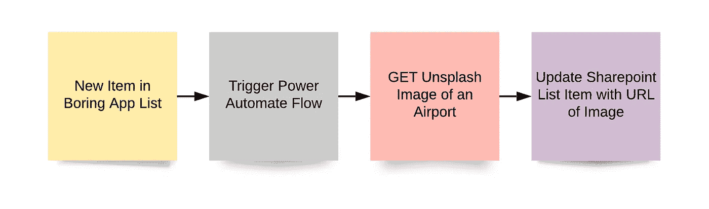

使用 Power Automate 的更明亮、更令人兴奋的 Power 应用程序的计划

## 1 - **创造权力自动化流程。**

当我们创建列表项时触发。

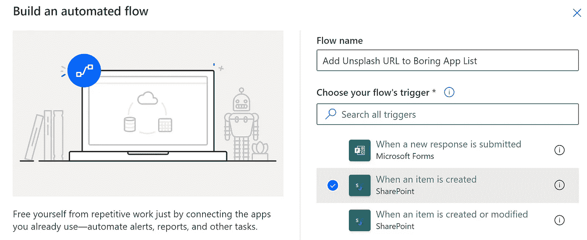

当我们在枯燥的应用程序 SharePoint 列表中创建新项目时，就会触发 Flow。

## 2 - **获得不光彩的形象。**

使用 SharePoint 项目的标题从 Unsplash 中检索照片的图像 URL。

[un splash 文档](https://unsplash.com/documentation#list-photos)相当全面，可能有点让人不知所措。下面是一个使用 HTTP 连接器(注意这是一个高级连接器)搜索与 SharePoint 列表项相关的图片的示例。

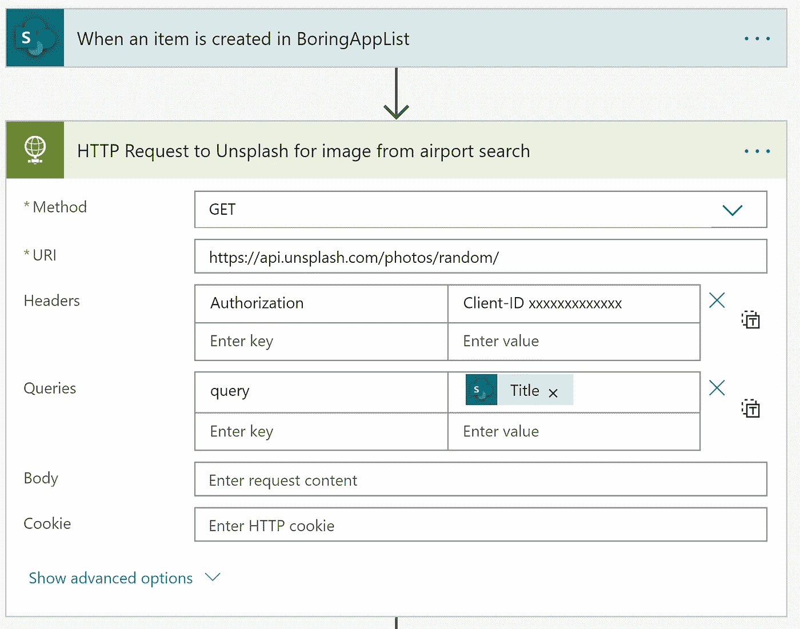

Client-ID 后面的 xxxxx 应该替换为您的 Unsplash 应用程序访问密钥。为此，你需要[在 Unsplash](https://unsplash.com/developers) 上建立一个开发者账户，并注册一个应用程序。

## 3 - **解析 Unsplash API** 返回的 JSON。

当我们更新 SharePoint 列表时，解析 JSON 允许使用响应中的字段。

Power Automate 可以通过“从样本生成”按钮为您找出 JSON 结构。将 Unsplash 响应的主体传递给该步骤的内容。

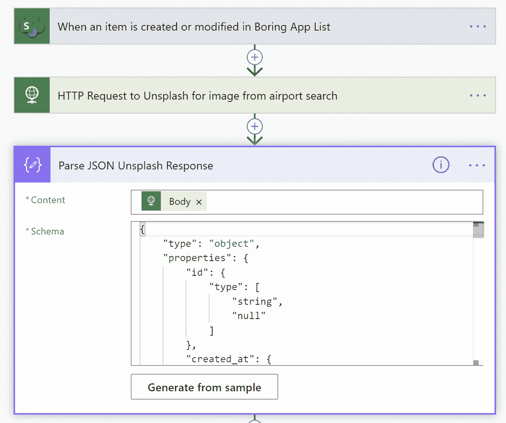

**Generate from sample** 将让 Power Automate 从示例响应中为您猜测模式。运行一个测试，从上面的 HTTP 请求中获得一个示例响应，或者使用[API 文档响应](https://unsplash.com/documentation#get-a-random-photo)(但是去掉注释)

用于响应 Unsplash HTTP 请求的 JSON 模式在这里的 [GitHub 上](https://github.com/fredwise/unsplash_sharepoint_list/blob/master/power_automate_json_schema)。这需要根据 Power Automate 自动生成的模式进行修改，以便允许字段为空(例如，Unsplash 遗漏了 Instagram 关注者的数量)。通过为 JSON 模式中的每个值提供两种类型的数组(例如["string "，" null"]，而不仅仅是" string ")，每个字段都可以为空。做一个查找和替换，否则，你会在那里很长一段时间。

## 4 - **使用 SharePoint REST API 请求 SharePoint 列表属性“ListItemEntityTypeFullName”。**

恼人的是，你不能在 Power Automate 中直接访问 SharePoint 列表“图片”字段。它们只是没有出现在*更新 SharePoint 项目*步骤中。

没事的。我们可以使用 SharePoint REST API 来更新列表项，这里有更多的文档来解释 SharePoint API 是如何工作的。

我们可以使用 Power Automate 中的 SharePoint HTTP 请求步骤来访问 SharePoint API，与一般的 HTTP 请求不同，这不是一个高级连接器。在这一步中，我们需要一个对列表的**属性的 GET 请求。不要忘记解析这个返回的 JSON。**

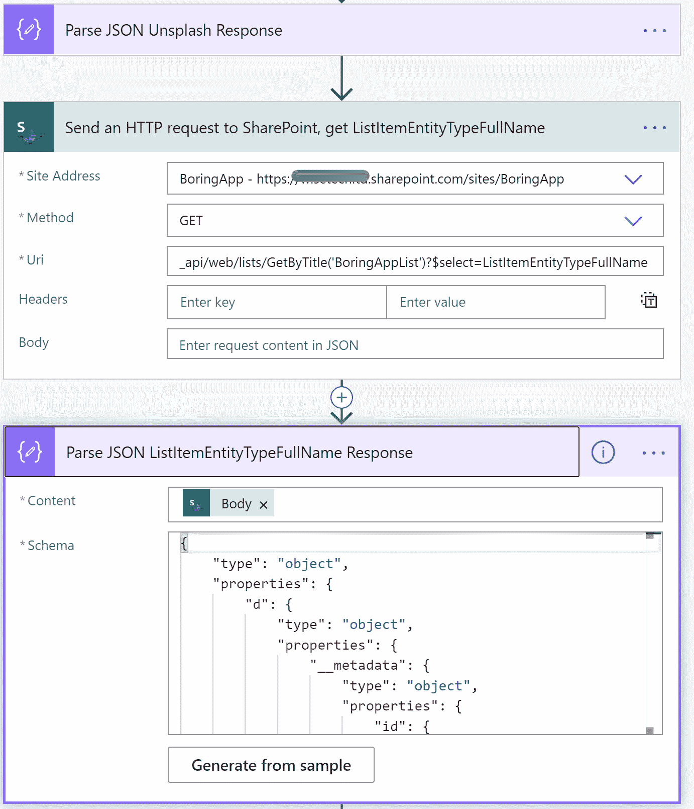

获取 SharePoint BoringAppList 的 ListItemEntityTypeFullName 属性

# 5 - **更新 SharePoint 列表项目图片字段**

SharePoint HTTP 请求再次提供了帮助。这一次发送了一个 POST 请求，将我们之前响应中的 Unsplash URL 粘贴到创建/修改的项目的图片字段中。

该请求中的标头非常重要。正文需要从 SharePoint 检索的 ListItemEntityTypeFullName 属性和从 Unsplash 检索的 URL。这里使用了*小的*URL(400 x400 ),照片描述放在 SharePoint 图像的可选文本中。

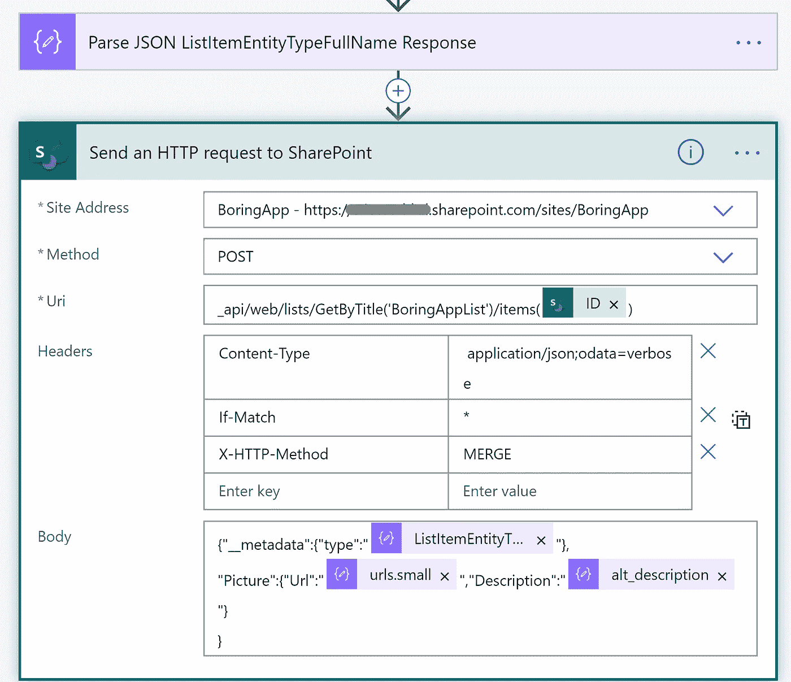

将请求发送到 SharePoint API，该 API 将取消屏蔽 URL 放入列表项中

一些副本和过去的友好位在 GitHub 的[上](https://github.com/fredwise/unsplash_sharepoint_list)。

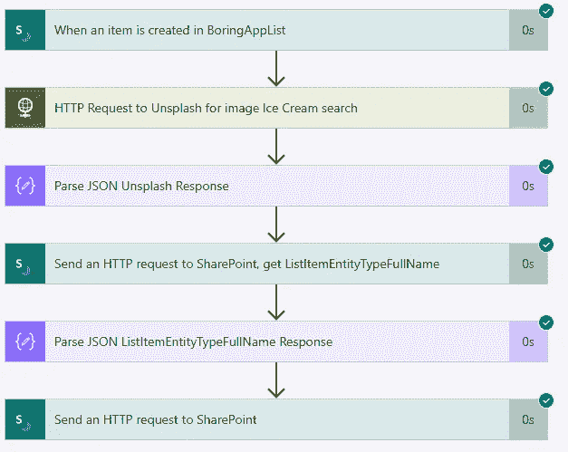

计划来了！

# 不那么无聊的应用程序

正如你所看到的，一些图片会产生很大的不同。就我个人而言，我迫不及待地想记录我的下一个冰淇淋。

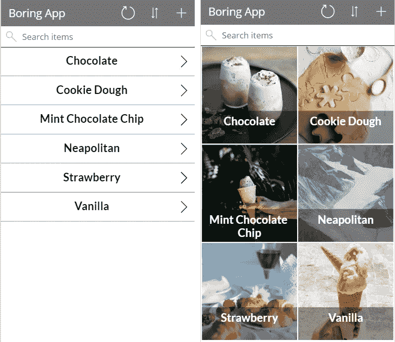

从 Unsplash 添加随机图片带来了一点色彩，并可能赢得那些讨厌的用户。在 Wise Technical，我们也制作适当的网络应用程序和数据平台，以最大限度地提高其商业效益。伸出手来！[https://www.wisetechltd.com/](https://www.wisetechltd.com/)

## 值得注意的琐事

*   在 Unsplash API 上，每小时只能收到 50 个请求
*   不要将 Sharepoint 项目更新的 POST 请求中的内容类型设置为 application/json(根据文档),而是将其设置为“application/JSON；odata=verbose "