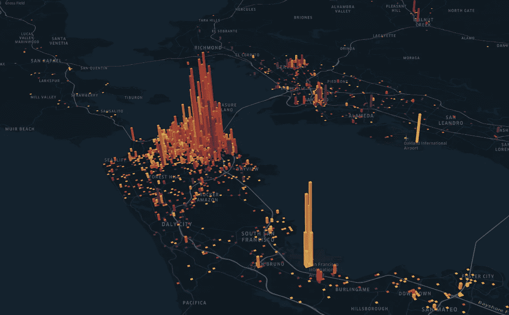
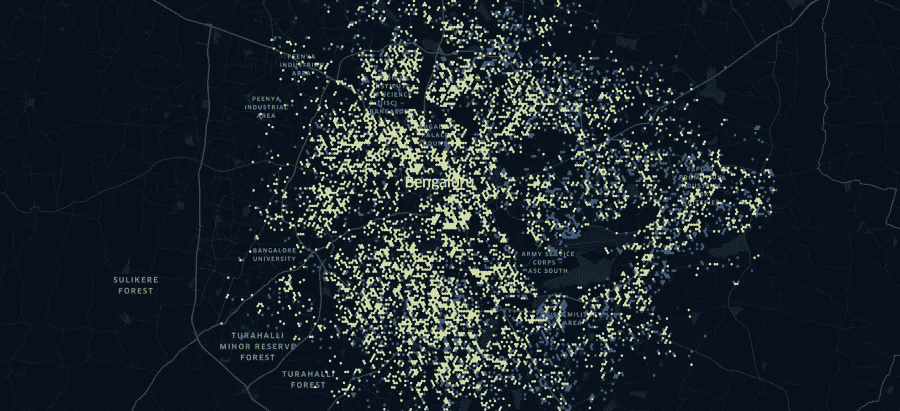
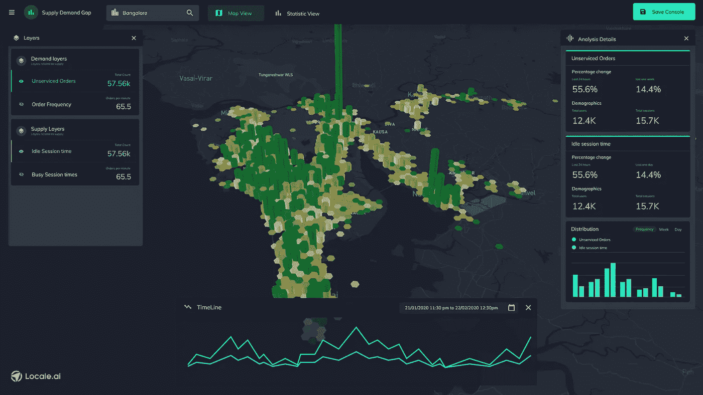
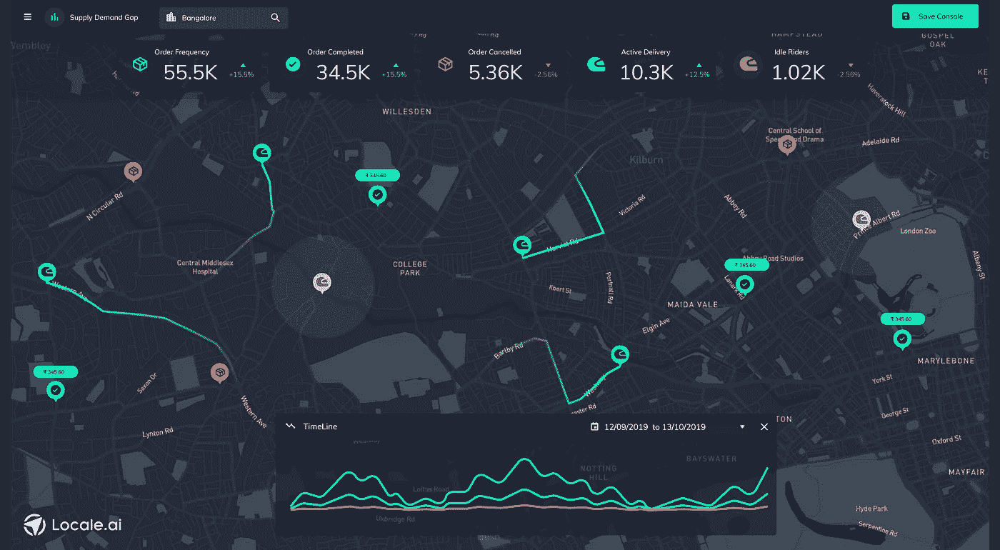
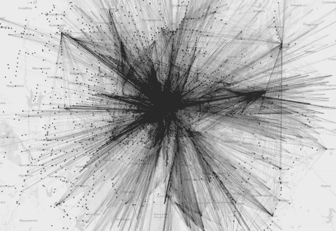
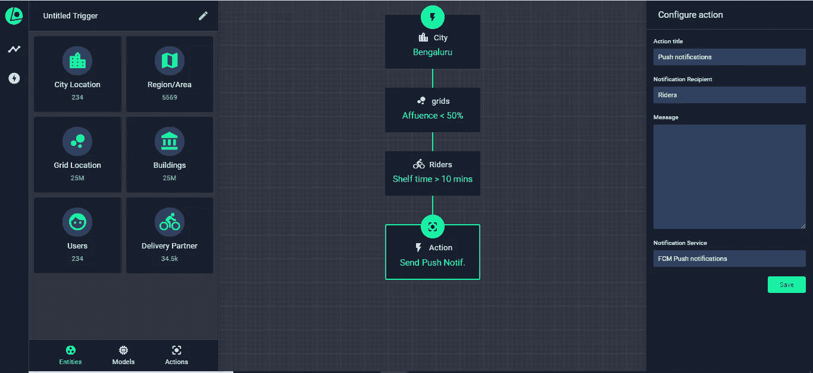

# 供需缺口对按需交付意味着什么？

> 原文：<https://towardsdatascience.com/bridging-supply-demand-gaps-in-last-mile-delivery-companies-geospatially-657a98bb1e01?source=collection_archive---------61----------------------->

## 地理空间分析和洞察

## 根据您的需求和供应在不同地区的表现，本地化您的匹配算法

注意:在阅读本文之前，我强烈建议您阅读本系列的第一部分，其中包括了供需分析的基础知识:

 [## 微移动公司如何在地理空间上提高资产利用率

### 这里有一个很好的问题，可以写在便利贴上，放在你的桌子上:“我们现在有什么资产是不…

blog.locale.ai](https://blog.locale.ai/how-micro-mobility-companies-can-increase-asset-utilization-geospatially/) 

如今，在我们的手机上点食物、杂货、香烟甚至酒已经成为一种常态。如果你像我一样，你可能会在一天中最奇怪的时间点所有的东西！

对于按需公司(又名“X 的优步”)，这主要是一个三方市场，匹配需求和供应是业务的核心，也是极具挑战性的。此外，现实世界引入了比模型中更多的变异，导致了更为严酷的结果。

当供需缺口存在时，我们要么失去订单，要么我们的骑手闲置——这两者都会导致亏损。但是，是什么导致了这些差距的存在呢？这可能是需求、供给或两者共同作用的结果。

# 案例 1:需求

## 订单丢失

由于骑手不在或他们出现在错误的位置而导致您随着时间的推移而丢失的订单数量。

## 订单速度

当你失去订单时，订单速度是怎样的？也就是说你的订单比平时多了还是少了？

# 案例 2:供应

## 闲散的骑手

闲置的乘客数量以及他们由于错误的位置或较少的需求而没有被利用的时间。

**注意:**空闲是一个时间点属性。因此，在进行历史分析时，我们需要分析指标*“空闲会话时间”。*

## 可用总供应量

当骑手空闲时，总骑手的可用性是什么样的？可用骑手的数量是增加了还是减少了？在对此进行历史分析时，我们需要分析指标*“总会话时间”。*

收到的订单与闲置供应。

# 解读差距的原因

在试图弥合差距之前，我们首先需要理解它们为什么会发生。如果订单丢失，可能是由于以下原因:

## 没有骑手

*   **错误的地点:**如果我们失去了订单，这可能意味着骑手不在，这意味着他们要么都很忙，要么在错误的地点闲着。
*   **供应过剩:**还有一种情况，我们满足了所有的需求，但却有过剩的闲置人员。或许有必要分析一下总供应量。

供需缺口。来源:Locale.ai

## 订单频率在下降

如果你在那天和那个时间收到订单的频率比平常少，那意味着你需要深入了解为什么会发生这种情况。

*   **类型:**是所有类型的订单还是只有某一种订单？*举例来说，是不是只有 A 类的订单量在下降？*
*   **生命周期:**在订单流程中，是否有一个特定的步骤会导致大量订单的减少？*例如，结账系统或支付网关是否存在一些挑战，导致用户无法完成订单？*

Locale.ai:监控供需缺口

## 订单未被分配

可能会有订单进来，但没有分配给骑手。如果发生这种情况，您使用的分配(或匹配)算法可能有问题。在这些情况下，最好向组织内部的相关人员提出这个问题。

在三方市场中，有时商店或餐馆可能会有分配问题。我自己也经历过很多因为问题出在餐厅而无法收到订单的情况。

要深入了解如何对商店或餐馆等静态位置进行分析，请查看:

 [## 在地理空间上优化静态定位的性能

### 对于一个公司来说，静态位置是他们的业务实体，不会移动久而久之。例如，对于一个…

blog.locale.ai](https://blog.locale.ai/optimizing-the-performance-of-static-locations-geospatially/) 

# 骑手们不接受命令

假设订单被分配给骑手，但他们不接受订单。这可能是由多种原因造成的。

*   **距离:**他们不接受订单是因为取货距离很远吗？
*   **区域:**他们不接受订单是因为他们不想前往提货地点吗？
*   **支付:**他们取消是因为用户的支付方式不可取吗？

供需缺口和重新定位

# 骑手们正在取消订单

通常，我们都有过骑手在接受订单后取消订单的经历——尤其是一旦他们知道了交货地点。

*   **距离:**他们取消订单是因为距离卸货点很远吗？
*   **区域:**他们取消订单是因为他们不想前往卸货地点吗？
*   **始发地-目的地:**是不是既不是始发地也不是目的地，而是路线？在这种情况下，大的激励措施也往往不起作用，因为骑手们只是不想穿越这些区域。

> 城市通常有隐形的墙，骑车人不愿意越过。这些墙在哪里？他们在一天中的什么时候最突出？

# 流

流动。[来源](https://github.com/geohacker/bmtc)

如前所述，供需匹配不仅仅是现在正在发生的事情。是关于**流的。**下一个需求会在哪里，它在不同的日子和不同的时间会如何变化？

> *理解最后一公里配送公司的流程非常重要。接下来哪个领域最有可能获得需求？离车手现在的位置有多远？*

例如，对于一家最后一英里配送公司，研究流程表明，配送伙伴开始向市中心移动，到了晚上，他们开始搬出去，因为他们大多数人住在郊区。但他们需要向内发展，因为这是他们获得订单最多的地区。

# 外部洞察力

*   **兴趣点:**另一个非常有趣的分析是分析供需如何受到不同兴趣点的影响，如学校、大学、商场或旅游目的地。
*   **外部事件:**分析不同的外部事件(如下雨、大型音乐会、体育比赛、抗议活动)如何影响贵公司的需求和供应也是很有见地的。
*   **群组:**群组是一组表现相似的用户、骑手或自行车。在不同的时间，我会失去什么样的用户和订单
*   星期几？什么样的车友大部分时间都很闲？

# 关于 Locale.ai

[Locale](http://locale.ai/) 是一个位置分析平台，这意味着我们可以将所有数据库和格式的原始纬度数据转换为有意义的见解，以便决策者可以就其地面运营做出非常精确的数据驱动型决策。

网络分析工具已经利用点击流数据帮助你改善了这些指标。然而，对于在地面上有移动资产的公司来说，不从地理空间的角度看问题是非常有害的！

区域设置:工作流模块

*在* [*场所*](http://locale.ai/) *，我们正在创建通过地理空间分析提高单位经济性、每次交付成本和利用率的公司范例。如果你是一名增长型经理，希望提高用户的获取、保留和转化，请在此处联系我进行演示***或通过*[*LinkedIn*](https://www.linkedin.com/in/aditi-sinha-6b774ba9/)*或*[*Twitter*](https://twitter.com/aditi1002)*联系我。**

**原贴* [*此处*](https://blog.locale.ai/bridging-supply-demand-gaps-in-last-mile-delivery-companies-geospatially/) *。**

## *类似阅读:*

* [## Carto vs Kepler vs Locale:哪个产品用于地理空间分析？

### Carto、Kepler.gl 和 Locale 是公司在分析中用来做出地面决策的三个工具

blog.locale.ai](https://blog.locale.ai/carto-vs-kepler-vs-locale-which-product-to-use-for-geospatial-analytics-2/)  [## 如何使用位置分析提高用户获取和转化

### 一家基于应用程序的送货公司可以随时随地将用户通过应用程序订购的任何东西送到用户的位置…

blog.locale.ai](https://blog.locale.ai/how-to-improve-user-acquisition-conversion-using-location-analytics/)*