# 弥合遗传学和神经网络之间的鸿沟

> 原文：<https://towardsdatascience.com/bridging-the-gap-between-genetics-and-neural-networks-4fdb91032f4b?source=collection_archive---------36----------------------->

## 基于遗传数据构建和分析神经网络

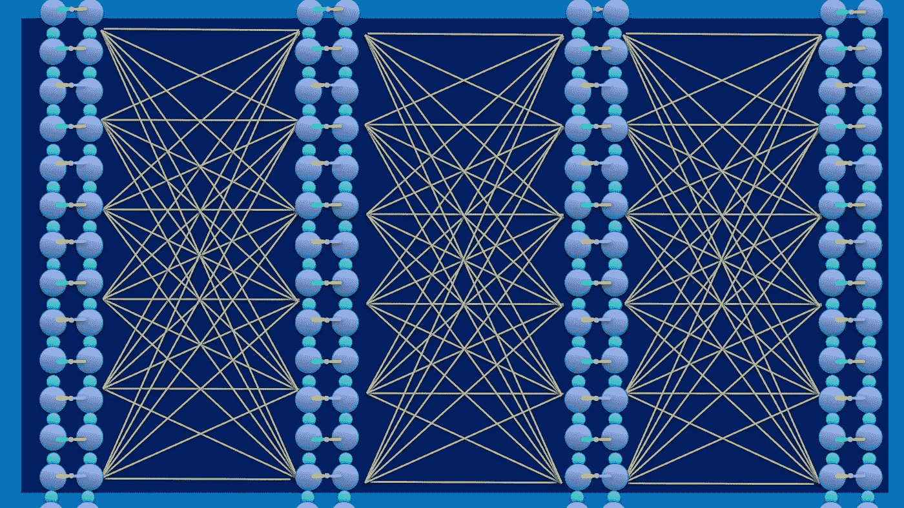

融合神经网络与 DNA 双螺旋(对齐)的轶事——作者绘制

我最近进行了基因序列的研究工作。关于这个问题，占据我头脑的主要问题是:“对于这个目的，哪一个最简单的建议神经网络与遗传数据最兼容？”在查阅了大量文献后，我发现与这个主题相关的最*【脚踏实地】*而又最引人入胜的工作发生在*[yo shua beng io 的](https://medium.com/u/98adb4b86b01)实验室。这篇名为*[*饮食网:脂肪基因组学的瘦参数*](https://arxiv.org/abs/1611.09340) *，*及其的论文主要目标是将 3450 个个体的基因序列分为 26 个种族。那篇论文启发了我，在这里我想解释一下构建神经网络来解决这类问题的基础。理解这个博客，不需要生物学的背景知识；我将尝试涵盖大部分必要的部分，直接进入计算部分。**

****动机****

**我们正面临着充满挑战的时代:新型冠状病毒 T21 病毒让我们对强大的自然力量束手无策。通过学习新工具:获得关于基因组数据的直觉，并探索哪些机器学习方法可以最好地概括这些数据；我希望我们可以联手起来，为更好的日子做出改变，或者至少使用神经网络令人难以置信的智能来做一些事情，除了开发娱乐应用程序，而是拯救我们的生活甚至我们的星球。**

**为什么我觉得遗传学如此吸引人？**

**你的基因不仅揭示了你的生物信息，还通过代表哪些主要部分存活了下来，揭示了你祖先的遗传历史。**

> **换句话说，它是你家族的生物进化编码，甚至更多，根据*达尔文进化论*，有机生物(植物、动物等)集合的整体。)都有相同的遗传原理。**

****直觉****

**让我带您浏览其他类型的数据，如图像和句子，以了解基因数据的独特性。一方面，图像是具有相邻关系的二维数据(或者对于体积是三维的)。句子是多达大约一千个值的一维向量，具有通过无监督方式训练的句子的层级性质。**

> **另一方面，遗传序列是至少几十万个值的一维向量(序列),在邻居之间没有明确定义的关系，并且远离具有预先训练的模型集。**

**因此，在图像处理中非常流行的 G *aussian* 平滑滤波器在这里是不相关的，以及视觉中所有预训练的模型(I [*mageNet，*](http://www.image-net.org/) *V* [*GG，*](https://arxiv.org/pdf/1409.1556.pdf)*R*[*es net**…*)和自然语言处理(W](https://arxiv.org/abs/1512.03385) [*ord2Vec，*](https://arxiv.org/pdf/1301.3781.pdf%C3%AC%E2%80%94%20%C3%AC%E2%80%9E%C5%93)**

**为什么说是挑战？**

**想象一个由成千上万个基因样本组成的数据库。你需要找到一种方法，能够很好地泛化(准确率 90%以上)千万种组合的输入数据。神经网络可能是一个很好的选择，因为它以一种其他“经典”算法所缺少的方式利用完全连接的单元的能力，如 *PCA、SVM、*和*决策树*，这些算法不单独管理数据。然而，构建最简单的网络体系结构需要在第一层的权重中有数千万个以上的自由参数。降维(避免过多的自由参数)是面对这个问题的一种方法；我们将在本博客稍后讨论它。**

****生物背景****

**为了把事情搞清楚，并且不对这个论坛的主要目的造成困难，我在这里只提出这个博客中需要的生物部分的一个高层次的观点。不用说，我们非常欢迎你进一步探索这些生物学话题。**

**什么是基因序列？**

**DNA 分子是由字母 A、C、G、t 代表的四种碱基组成的序列。序列的特定部分(即使位于远处)与表型相关。例如，最近的一项研究:[“一场与可能来自蝙蝠的新型冠状病毒相关的*肺炎爆发”*](https://www.nature.com/articles/s41586-020-2012-7) 表明 *ACE2* 基因可能是新型冠状病毒病毒的宿主受体(表型)。这个例子和许多其他例子显著地展示了仅基于你的 DNA 就可以获得的有价值的信息(罪犯检测、匹配大麻品种、营养和个性化药物)。**

**什么是 SNP 基因型？**

**如今，我们比以往任何时候都更接近于获得几乎全部的人类基因序列。然而，我们还远远没有涵盖它的全部。*单核苷酸多态性* SNPs 是基因组序列中特定的基因型位置，一般表示为 *RS* 【数字】。不同的人群有不同的序列不变量，但在家庭中可能是相同的(因此亚洲人看起来与欧洲人不同)。SNP 序列的分析将是贯穿本博客其余部分的关键点。**

# **方法**

**在本节中，我描述了数据和两个主要的网络架构(以及另一个具有改进参数的网络，以克服机器学习中的一些主要问题)以及一些技术提示…**

****数据****

**相对于其他数据类型，医疗数据集很难找到，主要是由于隐私限制。有鉴于此， [*1000 基因组计划*](https://www.nature.com/articles/nature15393) 通过发布 3450 个人类 DNA 样本的公共可用数据集，即 26 个全球人口中每个人口的 315，000 个 SNP，实现了显著突破。下图显示了从 *1000 个基因组*数据中得出的直方图，描述了每个群体(种族)中个体的[频率；每个群体的平均样本数约为 133 个遗传样本。](https://www.internationalgenome.org/category/population/)**

**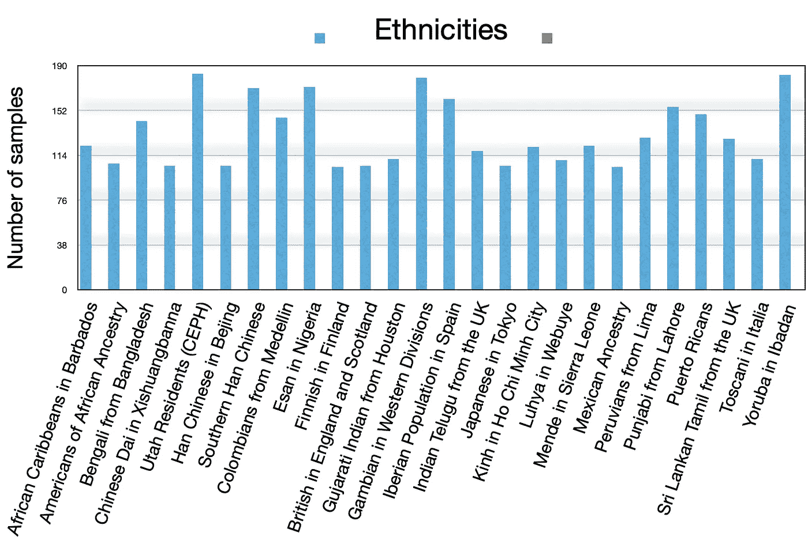**

**1000 个基因组人口分布(种族)**

****降维****

**如上所述，减少模型中自由参数的数量是首选(在我们的例子中，我们正在处理大约 3000 万个参数)。所提出的实现这一点的方法使用了另一个*辅助网络*，其位于输入每类直方图的判别网络之上(以无监督的方式计算的*嵌入*矩阵)。该网络的输出初始化判别网络的第一层的权重。嵌入矩阵是每个群体的归一化基因型直方图，其大小为 SNPs X [4x26]，其中 4 代表{00，01，11，NA}(双等位基因)，26 代表类别数(群体)。**

**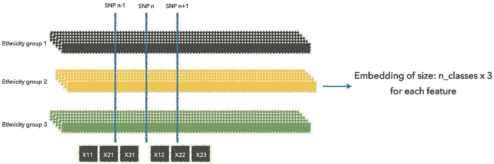**

**生成每类直方图**

**下面描述这种嵌入矩阵的实现。**

**无论如何，这是他们的解决方案；我的解决方案是减少隐藏单元层的数量(参见架构部分)。我将这种新架构称为*改进模型*，它的一个好处是克服过拟合，这将在后面的结果部分讨论。**

****建筑****

**这篇博客比较了两个主要的网络。两个网络都由两个完全连接的隐藏层和一个 softmax 层组成，但第二个(见下图)包括一个辅助网络，它预测 d *判别*网络的自由参数。a *辅助*网络将 e *嵌入 m* 矩阵作为输入，然后返回判别网络的第一个矩阵的权重(图 1)。**

**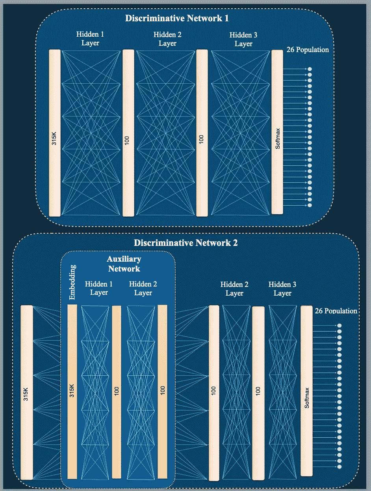**

**图 1:两个有区别的模型，无(上)和有辅助网络(下)。由作者绘制。注意辅助网络的嵌入维数是 10K(解释如下)。**

**在图 2 中可以看到该架构的详细描述:在每个完全连接的层之前，需要一个批规范，后面跟随着一个丢弃层。**

****

**图 2:内部网络架构**

****实施****

**我在 *Pytorch* 中从头开始写了这部作品的全部代码，它可以在公共 *GitHub* 资源库中找到，命名为“[人类基因组](https://github.com/miritrope/genome)”。以下是我认为与本论坛最相关的一些要点。**

1.  ****管理数据结构****

**为了获得客观的结果，我们生成五个折叠，每个实验一个，最后计算统计变量。**

*   **分裂和洗牌**

**我们将 3.5K 样本分为训练(60%)、验证(20%)和测试(20%)。像往常一样，我们随机打乱数据并对值进行归一化:**

```
**mu = x.mean(axis=0)
sigma = x.std(axis=0)
train[0] = (train[0] — mu[None, :]) / sigma[None, :]
valid[0] = (valid[0] — mu[None, :]) / sigma[None, :]
test[0] = (test[0] — mu[None, :]) / sigma[None, :]**
```

****2。降维****

**生成*嵌入*矩阵分两步进行:第一步通过`bincount()` 生成每类基因型的*直方图，第二步归一化该直方图。结果是维数减少了大约十个数量级。***

```
**for i in range(n_features):
    if i % 5000 == 0:
        print("processing snp no: ", i)
    for j in range(n_targets):
        # generate for each snp , a histogram of four bins, one for each allel's option
        embed[i, j*n_genotypes: j*n_genotypes + n_genotypes] += \
            np.bincount(genome[i, labels == j].astype('int32'), minlength=n_genotypes)# normalizing the result for each class
        embed[i, j*n_genotypes: j*n_genotypes + n_genotypes] /= \
            embed[i, j*n_genotypes: j*n_genotypes + n_genotypes].sum()**
```

**以下是特定 SNP 的每个类别的直方图示例:**

**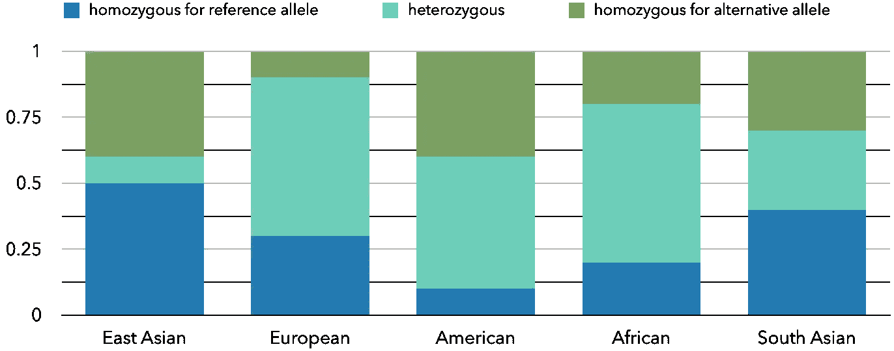**

**特定 SNP 的标准化每类直方图**

****3。连接网络****

**两个网络(辅助网络和判别网络)都有独立的计算图，没有以任何方式链接。包含损失的区别网络的计算图不具有关于损失和嵌入张量之间的依赖性的信息。一种解决方案可以是用判别网的梯度值手动设置嵌入张量的梯度值，并在嵌入网上调用 torch . autograded . backward()，因为在嵌入网的计算图中，张量之间的依赖关系是已知的。**

**训练循环是:**

*   **嵌入网中的正向传球**
*   **设置有嵌入值的判别网络中第一个隐层的权重**
*   **椎间盘网中的向前传球**
*   **嵌入网和区别网中的后向**
*   **更新参数**

**在*判别*模型的第一个隐藏层中，我们用*辅助*网络(即*嵌入*层)的输出初始化其 3000 万个权重**

```
**with torch.no_grad():
    self.hidden_1.weight.copy_(embedding)**
```

***前进传球*:**

```
**embedding = emb_model(feat_emb) *# forward pass in embedding net*discrim_model.hidden_1.weight.data = embedding  
embedding.grad = discrim_model.hidden_1.weight.grad**
```

**优化器应该更新两个网络的参数:**

```
**params = list(discrim_model.parameters()) + list(emb_model.parameters())
optimizer = torch.optim.Adam(params**,** lr=learning_rate)**
```

***向后传递*:**

**因为我们设置了嵌入网的计算图，所以嵌入网和判别网之间的依赖关系是已知的。**

```
**loss.backward(retain_graph=True) *# compute the gradient of the weights of the hidden layer in the embedding net* 
torch.autograd.backward(emb**,** emb.grad) # *backpropagation in the embedding net***
```

****4。培训课程****

**[丹尼尔·戈多伊](https://medium.com/u/c79695e37339?source=post_page-----4fdb91032f4b--------------------------------)在他的[博客](/understanding-pytorch-with-an-example-a-step-by-step-tutorial-81fc5f8c4e8e)中解释了培训过程，我想根据我们与*小批量*的工作扩大他的工作范围。**

*   **迷你批次和时代**

**函数:`loss_fn(y**,** yhat)`返回输入 y 中每个元素与目标 yhat 之间的均方误差(平方 L2 范数)。因为我们想要计算损失，我们需要将该值乘以批次大小，然后汇总每个*小批次*的所有返回值。**

```
**train_loss += loss * batch_size**
```

**最后，每个时期包含来自最后部分的累积值。因此，为了得到损失，我们需要除以该循环中的小批量数量。**

```
**test_loss = test_loss / len(test_minibatches)**
```

**我强烈建议您使用 [*提前停止*](https://github.com/Bjarten/early-stopping-pytorch/blob/master/MNIST_Early_Stopping_example.ipynb) ，其基本原理是根据验证损失自动决定何时停止训练并保存最佳的最后模型结果。**

****框架****

**以下是一些我觉得有用(而且免费)的酷工具:**

*   **神经网络库**

**我必须提到使用 [*Pytorch*](https://pytorch.org/) 作为最好的*神经网络库*的好处，从我的经验来看，与许多其他人相比，它在许多方面都是最好的。论文: [*“深度学习即服务框架的比较测量研究”*](https://arxiv.org/pdf/1810.12210.pdf) 对框架进行了实证分析: *TensorFlow、Caffe、Torch、*和 *Theano* 。**

*   **云上培训**

**您将受益于在云上训练您的模型并节省时间。 [Ashwin De Silva](https://medium.com/u/3efc011ea322?source=post_page-----4fdb91032f4b--------------------------------) 在他的[博客](/@ashwindesilva/how-to-use-google-colaboratory-to-clone-a-github-repository-e07cf8d3d22b)中描述了你如何在本地工作，提交并推送至你的 *GitHub* 库，在*云*上提交并运行你的培训。在我看来，花时间和精力用不同的参数来编写一些测试是值得的，比如隐藏单元的数量、丢弃值等等。**

# **结果**

**回顾过去，我在分析结果的过程中经历了数据科学家中的一些已知困难，并发现与您分享，为您提供开发此类网络的动态行为的真实证据非常重要。在调查您的网络性能时，我发现以下言论是主要特征:**

*   **失败**

**让我们从损失函数开始:这是网络性能的"*面包和黄油"*，随着时间的推移呈指数下降。此外，*很好地概括了*的模型保持了类似于训练损失的验证损失。原因很简单:模型在处理看不见的数据时会返回更高的损失值。如果你遇到不同的情况，你的模型很可能是*过度拟合*。*过度拟合*的解决方案可以是以下的一种或组合:首先是降低隐藏层的单元或移除层以减少自由参数的数量。正如我们上面讨论的，我们的*改进的*网络以及*辅助的*网络，*为了这个问题前来救援*。其他可能的解决方案是增加下降值或*正则化*。 [Mazid Osseni](https://medium.com/u/e3afa9dd37eb) ，在他的[博客](/different-types-of-regularization-on-neuronal-network-with-pytorch-a9d6faf4793e)中，解释了不同类型的正则化方法和实现。图 3 显示了在处理所谓的 [*过拟合*](https://www.baeldung.com/cs/learning-curve-ml) 问题之前(左图)和之后(右图)我的网络的更简单版本的损失函数。**

**我的解决方案是降低隐藏单元的大小(从 100 到 50 个单元)和增加第一层的下降值(从 0.5 到 0.8)。**

**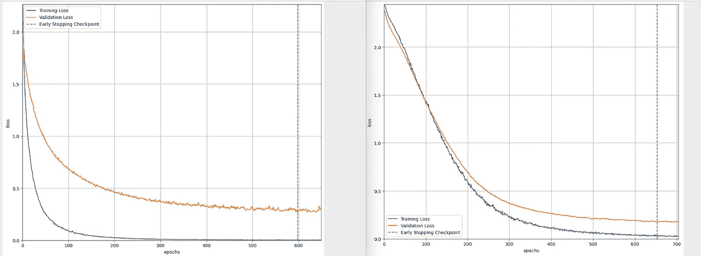**

**图 3:没有(左)和有(右)辅助网络时的损失函数(橙色表示训练，蓝色表示验证)**

*   **准确(性)**

**在每个体系结构中计算测试精度。令人惊讶的是，似乎克服过拟合或减少自由参数的数量并不能保证更高的精度。图 4 显示了三种架构的测试精度:请注意，尽管存在*过拟合*问题，但精度更高。**

**这种模型的第一层的自由参数的数量大约是特征(SNP)的数量×第一层的数量(~ 300kx100)。现在，我们使用一个辅助网络来预测那 300kx100 个自由参数。这个辅助网络将特征嵌入作为输入，这是每个特征 SNP 在患者中取值的向量的一些任意变换。问题是这种嵌入看起来像什么。如果我们遵循本文中考虑的嵌入，我们将对每类直方图进行 4x26 维嵌入，x 100 是第一层的数字单元。**

**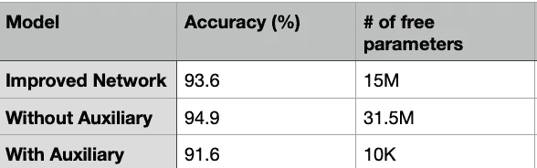**

**图 4:测试精度(批量:64)和第一层的自由参数个数。**

*   **批量大小**

**测试不同批量的性能是一项有趣的任务。[沈世爱](https://medium.com/u/c1ed18ad484c)，在他的[博客](https://medium.com/mini-distill/effect-of-batch-size-on-training-dynamics-21c14f7a716e)中，调查了批量大小对训练动态的影响。根据总的训练时间，可能因为数据的多样性，批量大小与训练时间成反比(图 6)。出于同样的原因，损耗与批量成正比(图 5)。**

**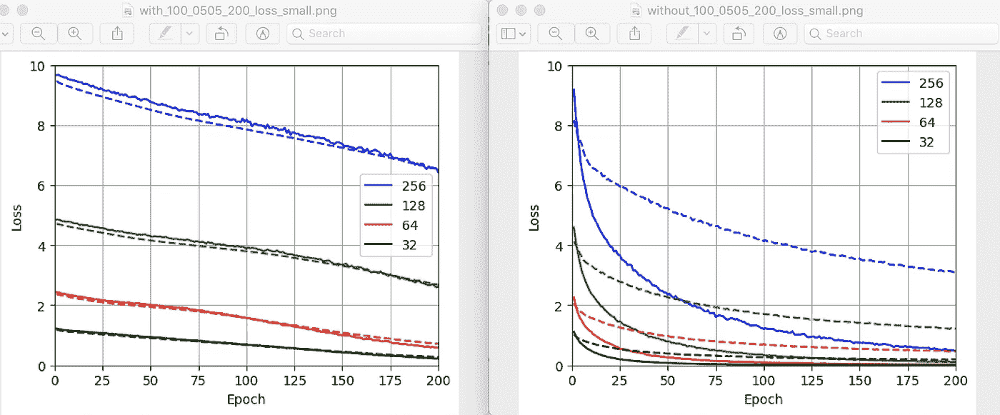**

**图 5:损失函数——不同批量的训练和验证(虚线)**

*   **培训时间**

**图 6 清楚地示出了在训练时间方面使用不同批量大小的行为，两种架构具有相同的效果:更大的批量大小在统计上更有效，但是不能确保通用性。阅读论文: [*“训练更长，泛化更好:缩小神经网络大批量训练中的泛化差距”*](https://arxiv.org/pdf/1705.08741.pdf) 了解更多关于*泛化现象*以及使用大批量保持训练时间完整的同时提高泛化性能的方法。**

**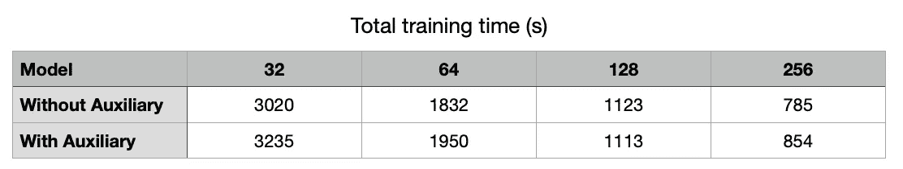**

**图 6:不同批量的总训练时间**

**注意改变架构对训练时间的影响(图 7)。在 1500 万个自由参数的情况下，训练时间明显低于辅助网络。**

**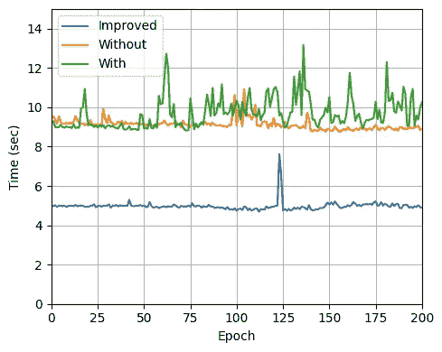**

**图 7:三种架构的纪元时间(批量:64)**

*   **替代机器学习方法**

**我还将改进模型的性能与决策树方法进行了比较，特别是数据科学领域常用的*光梯度增强机器*。然而，在错误分类错误方面，性能超出了我们的极限(更多细节请参见附录)。**

# **讨论**

**哪个是最好的型号？(一千美元问题)**

**在这篇博客中，我描述了两个主要网络:有和没有辅助网络，以及一个具有改进参数的附加网络。参数预测网络的好处是，当输入是非常高维度时，如在遗传序列中，它大大减少了模型第一层中自由参数的数量。**

**我展示了改变基本网络的参数如何在过度拟合方面产生更好的泛化能力。我在公开可用的 *1000 个基因组*数据集上验证了这些网络的方法，解决了基于 SNP 数据的祖先预测任务。这项工作证明了神经网络模型在处理样本数量与其高维度不匹配的任务方面的潜力，如 DNA 测序。**

**鉴于祖先预测任务中所达到的高准确度，我相信神经网络技术可以改进遗传数据分析中的标准实践。我希望这些技术能让我们解决更具挑战性的基因关联研究。**

# **感谢**

**感谢卡米尔·罗什福尔-布朗热(蒙特利尔大学)在实施过程中给了我一些很好的建议。**

**对于那些想知道我有哪台计算机的人:我想说一些关于我的 *MacBook Pro* 的好话，16 GB 的内存，*英特尔酷睿 i7* 让我能够完成如此惊人的任务，给我留下了那些令人满意的培训时间(见结果部分)，以及整个*“计算机实验室”*的体验(在*冠状病毒*关闭期间在家工作)。**

# **附录**

****使用决策树的结果****

**除了我在这篇博客中强调的神经网络方法，我想提一下我使用[梯度提升决策树](https://papers.nips.cc/paper/6907-lightgbm-a-highly-efficient-gradient-boosting-decision-tree.pdf) s 的体验结果。可以在这个 [*GitHub* 资源库](https://github.com/microsoft/LightGBM)中找到实现。该算法的参数是:**

```
**params = {
'task': 'train',
'boosting_type': 'gbdt',
'num_class': 26,
'objective': 'multiclass',
'metric': 'multi_logloss',
'num_threads': 36,
'zero_as_missing': True,
'verbose': 1
}**
```

**结果表明，决策树的分类误差较高，解释原因超出了博客的范围。**

**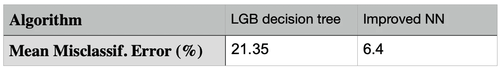**

**图 8:使用决策树和神经网络的误差比较**

# **关闭**

**亲爱的读者，感谢你阅读这篇博客；你的任何想法都将非常感谢；请随时给我发邮件(miritrope@gmail.com)或 [Linkedin](https://www.linkedin.com/in/miri-trope-916a194a/) 。**