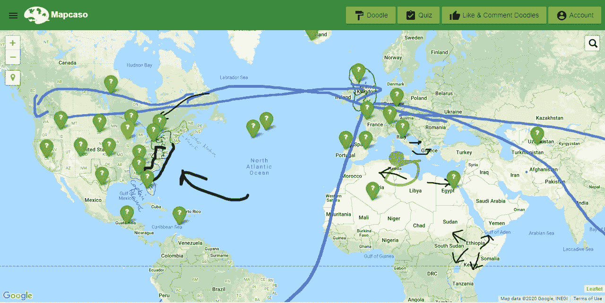
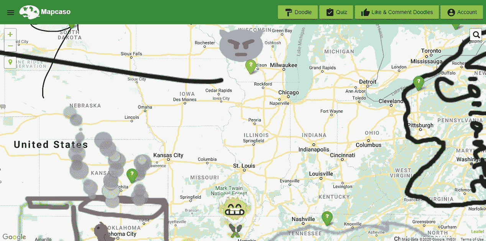
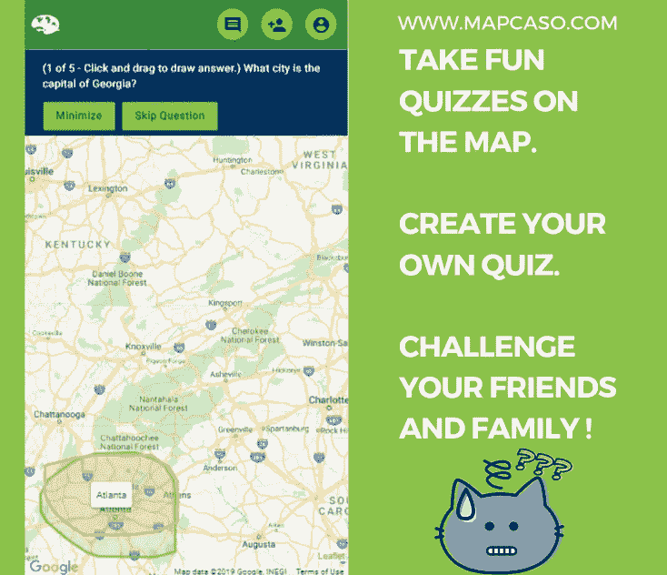

# 弥合纸质地图和技术之间的差距

> 原文：<https://towardsdatascience.com/bridging-the-gap-between-paper-maps-and-technology-363a19c2aa50?source=collection_archive---------55----------------------->

## 用现代网络和移动框架为学习地理的旧方法注入新的活力

## 为什么 [Mapcaso](https://www.mapcaso.com/) ？

本质上，我喜欢地理。在过去的几年里，我一直在努力寻找一种方法，将老派的展开和使用地图的触觉乐趣带到电子时代。在纸质地图上画出旅行计划，或者标出路线，或者只是在风景中寻找图案，都会带来某种满足感。这个概念始于我想帮助孩子们学习地理，并通过在地图上画画来获得一点乐趣。我记得小时候，老师给了我们一张地图的轮廓，并让我们用颜色标出该国哪些地方有铁、棉花等资源。被生产出来。这对我的空间思考能力有很大的影响。

几经周折后，我开发了一个应用程序，将画画的欲望与我们最近获得的缩放和平移的本能(以及将表情符号应用于一切事物)结合起来😂). [Mapcaso](https://www.mapcaso.com/) 是一个基于地图的学习平台，面向所有年龄段的孩子。它帮助孩子们通过在地图上涂鸦来学习地理和探索世界。成年人也可以玩得很开心，参加小测验，标记旅行计划，徒步旅行路线，或其他一百万的事情。

## 客户端应用、框架和库

我首先构建了一个客户端 SPA 应用程序。我选择的框架是 [VueJS](https://vuejs.org/) 。我真的很喜欢它快速构建原型的能力，我知道与其他 SPA 框架如 [Angular](https://angular.io/) 和 [ReactJS](https://reactjs.org/) 相比，它在开发人员生态系统和支持方面享有很高的声誉。对于地图框架，我知道我需要一个清晰的底图，具有良好的细节和熟悉感，这促使我选择了谷歌地图。我想要先进的绘图工具和更灵活的地图库，允许添加插件和其他图层类型。我选择带着[小叶子](https://leafletjs.com/)跑。我还开发了 web 应用 responsive(这将在以后带来显著的回报),并使用了谷歌的[材料设计](https://material.io/)框架和指南，使其易于为各种受众和设备所用。

## **空间数据库**

有各种各样的数据库支持空间功能，如关系空间中的 [Oracle](https://www.oracle.com/index.html) 、 [SQL Server](https://docs.microsoft.com/en-us/sql/relational-databases/spatial/spatial-data-sql-server?view=sql-server-ver15) 、 [PostgreSQL](https://www.postgresql.org/) 。Cassandra 、 [CouchDB](https://couchdb.apache.org/) 和其他一些 NoSQL 数据库选项也可以，但是我决定使用 [MongoDB](https://www.mongodb.com/) 。我也不想花费大量时间来托管和准备扩展我的数据库基础架构。 [mLab](https://mlab.com/) 似乎是自然的选择:它是 MongoDB 的数据库即服务平台。此外，MongoDB 与 GeoJSON(我用来存储和提供空间数据的格式)配合得很好。

## 服务器 API

在我用过的众多服务器端编程语言中，C#。Net 有严格的、强类型的支持，这在您编写可能被各种实体使用的强大 API 代码时非常有用。我唯一不喜欢的是。Net 应用程序过去需要在 Windows 服务器上运行。但值得庆幸的是，微软在过去几年里在拥抱 Linux 方面取得了惊人的进步，并推出了[。Net Core](https://dotnet.microsoft.com/download/dotnet-core) 支持在 Windows 和 Linux 服务器上托管。这使得它成为开发 Mapcaso 的 API 的最佳选择。我使用亚马逊的 S3 服务来托管静态图片和其他静态资产。我还需要任务调度来管理发送用户简讯、运行数据库维护等等。为此，我依赖于 T21 自动气象站。

## 部署和托管

容器化使得跨不同环境的部署变得非常容易，并提供了应用程序良好的稳定性和可用性。Docker 和 [Kubernetes](https://kubernetes.io/) 是最受欢迎的两个。但是 Visual Studio 有内置的 Docker 支持，所以我使用了 Docker 容器。最后，我在 Docker 容器中部署了我的 web 应用程序和 API，并通过[亚马逊的 ECS](https://aws.amazon.com/ecs/) 托管它们。整个过程帮助我了解了很多关于 DevOps 的知识，我非常尊重那些夜以继日保持应用程序平稳运行的工程师。

## 混合移动应用

在我有了最低可行产品后，我想转向移动。我是一个开发团队:所以构建一次并使用相同的代码库来部署移动应用程序是有意义的。幸运的是，我已经开发了我的 web 应用程序，可以很好地与桌面、平板电脑和各种手机屏幕兼容。我使用了 Cordova，这是一个用 HTML、CSS&JS 构建移动应用的包装器。我用 Cordova 包装了我的 VueJS 客户端项目，经过一些 Android 和 iOS 构建的努力，我能够成功地构建两个平台。然后我注册了谷歌和苹果的开发者项目，并在他们的应用商店上发布了 Mapcaso 应用。

## 结束语

构建和维护这个应用程序对我来说是一次很好的学习经历，我觉得这个应用程序的功能将成为广大受众传统教育的补充。尤其是现在，当许多孩子远程上课和在家学习时，我认为 Mapcaso 可以成为一种有趣和免费的方式，创造性地吸引您的孩子。虽然您可以保持内容的私密性，但您也可以通过在平台和社交媒体上创建和共享涂鸦和新的测验内容来回馈 Mapcaso 社区:帮助他人更多地了解您的国家、州或我们的世界！

让我们不要忘记，即使在这些艰难的时刻，这个世界也是一个巨大而神奇的地方。我们可以让我们的思想在虚拟的世界中漫游，变得有创造力并在线联系！

在[谷歌 Play 商店](https://play.google.com/store/apps/details?id=com.demosdistributed.mapcaso)获得免费的 Android 应用程序

在[苹果商店下载](https://apps.apple.com/us/app/mapcaso/id1457452165)获得免费的 iOS 应用程序