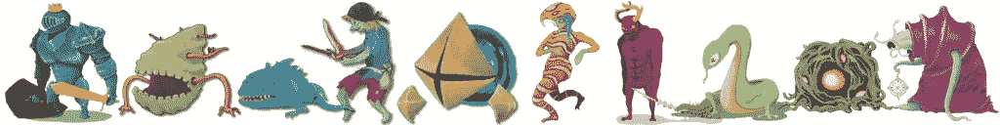
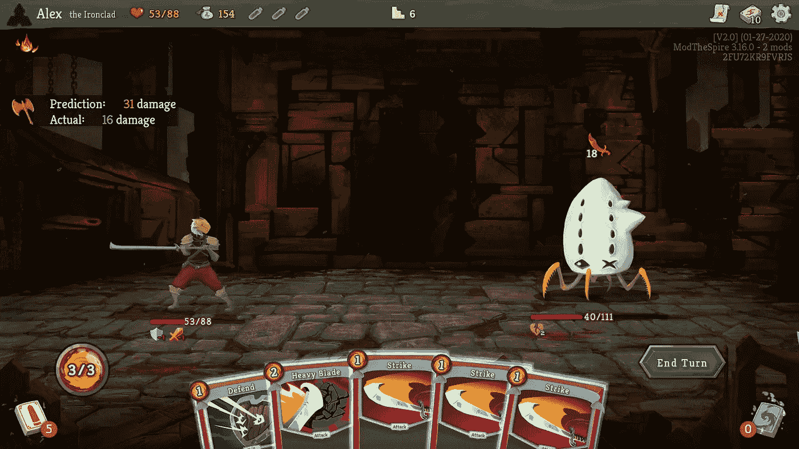
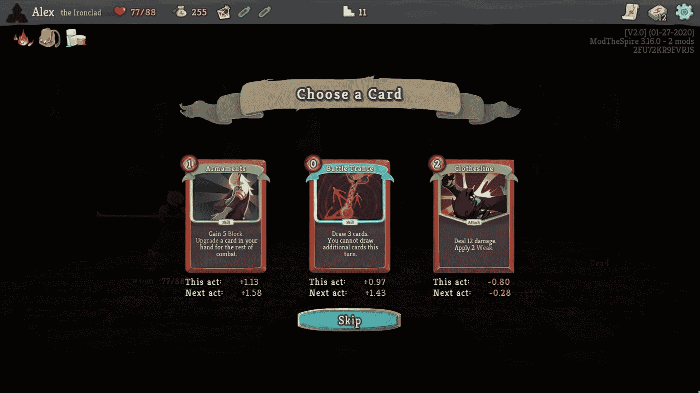
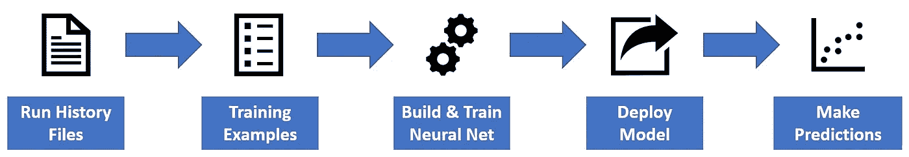
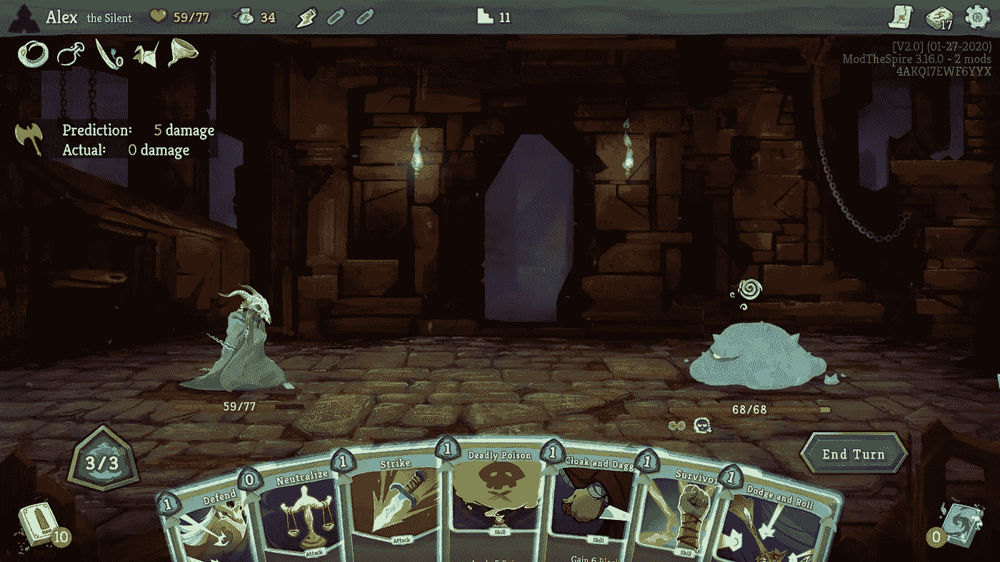
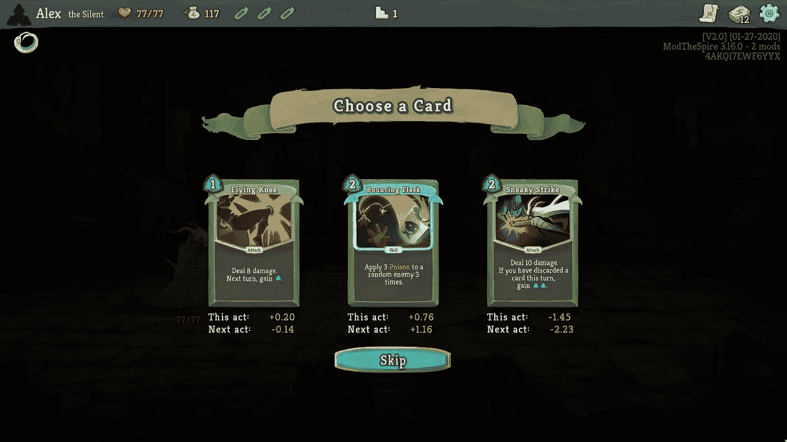
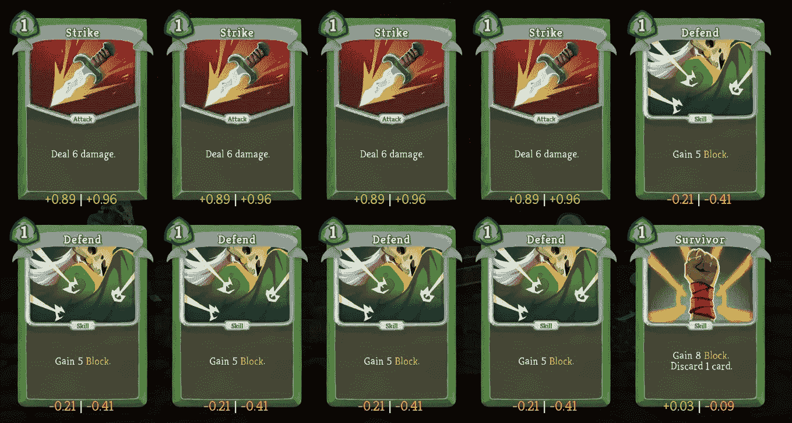

# 带来深度神经网络杀死尖塔

> 原文：<https://towardsdatascience.com/bringing-deep-neural-networks-to-slay-the-spire-a2971d5a5115?source=collection_archive---------13----------------------->

## [内部 AI](https://towardsdatascience.com/in-depth-analysis/home)

## 用 Keras 和 TensorFlow 预测战斗结果和评估卡片

[斩杀尖塔](https://store.steampowered.com/app/646570/Slay_the_Spire/)是我最喜欢的视频游戏之一，结合了盗贼般的地牢爬虫和甲板建筑的元素。刚刚在大学最后一年完成了一门深度学习课程，我认为 Slay the Spire 将是我第一个机器学习项目的一个很好的平台。

# 甲板建造是一个很难解决的问题

选择将哪些牌添加到你的牌组中是《杀死塔尖》中最重要的战略决策之一。玩家需要添加好牌，移除坏牌，升级重要牌，以提高他们的牌组，并在一次运行中击败越来越难对付的敌人和老板。在不同的情况下决定最好的牌加入你的牌组是非常困难的，世界上最好的玩家仍然一直在努力知道什么是正确的选择。



各种敌人在斩杀尖塔。图片来源:[斩杀尖塔不和](https://discord.com/channels/309399445785673728/407369143386505216)

为了进一步增加评估哪张牌更适合加入你的牌组的问题，不同的牌对不同的敌人表现更好。通常情况下，攻击所有敌人的牌在与多个敌人的战斗中比与单个敌人的战斗中更好。此外，在整个游戏过程中，一副牌中的牌相对于其他牌的强度是变化的。例如，平庸的攻击卡通常是玩家在游戏早期艰苦战斗中的主要伤害来源，因此，相当有价值。然而，当玩家获得更好的伤害源时，这些相同的牌相对于玩家牌组中的其他牌要差得多。


可玩角色:铁甲，沉默，叛变，守望者。图片来源:[斩杀尖塔不和](https://discord.com/channels/309399445785673728/407369143386505216)

每个可玩的角色都有一套不同的 75 张独特的卡片，这些卡片可以以多种方式组合，创造出各种各样的牌组和玩法。如果玩家将一张牌添加到他们的牌组中，根据战斗中减少的**平均伤害**来评估这张牌，是一种相对于这些牌组创建牌组的公正方法。向玩家提供这个指标有助于他们在每个决策节点做出最佳选择。

# 介绍 Slay-I

Slay-I 是在 [Steam Workshop](https://steamcommunity.com/sharedfiles/filedetails/?id=2157144906) 上提供的一个 mod，它可以预测你在 Slay the Spire 的战斗中会受到多少伤害，并根据战斗中减少的平均伤害来评估添加、升级和移除牌。这包括战后卡片选择，玩家可以从 3 张卡片中选择 1 张加入他们的卡片组，在营火和活动中升级卡片，在商店和活动中移除卡片。



预测这场战斗中受到的伤害与实际受到的伤害。作者图片



评估向牌组中添加一张新牌。作者图片

# 高级概述

Slay-I 的核心是一个模型，它根据玩家的卡片、玩家的遗物、玩家正在战斗的敌人以及其他一些特征来预测战斗中受到的伤害。接下来，我将解释这个模型如何用于评估卡片。

在训练和部署 Slay-I 模型时使用了三个主要组件:

1.  将运行历史文件转化为训练样本的 Python 脚本( [GitHub repo](https://github.com/alexdriedger/SlayTheSpireFightPredictor)
2.  Google Colab 上的 Python 脚本，使用 Keras 和 TensorFlow 建立和训练神经网络( [Colab 笔记本](https://colab.research.google.com/drive/1JU10qdwnqTMWkmJo7_Vu9xMbBNdsW5tA?usp=sharing))
3.  Java mod 运行训练有素的模型，斩杀 Spire 玩家可以下载并运行他们的游戏( [Steam Link](https://steamcommunity.com/sharedfiles/filedetails/?id=2157144906) )



作者的形象

# 创建培训示例

任何机器学习项目中最不性感的部分几乎总是数据预处理。但这很重要！

实验了运行历史文件的两个不同的数据集。第一个数据集来自于 [Jorbs](https://www.youtube.com/user/JoINrbs) ，一个 YouTuber 和 Twitch streamer，被广泛认为是最好的 Slay the Spire 玩家之一。第二组数据来自 Spire Logs 网站，玩家可以上传他们的跑步数据并查看分析。

运行历史文件具有类似事件的格式:

```
// Example Run History File
{
  "damage_taken":[
    {"damage":7,"enemies":"2 Louse","floor":1,"turns":2},
    ...
  ],
  "campfire_choices":[
    {"data": "Combust", "floor": 6, "key": "SMITH"},
    ...
  ],
  "card_choices":[
    {"picked": "Clothesline", "floor":1, ...},
    ...
  ],
  "event_choices":[
    {"cards_removed":["Strike_R"], "floor": 22, ...},
    ...
  ],
  "items_purged":["Pain", ...]
  ...
}
```

单个训练样本是一轮比赛中一场比赛的数据。这些数据包括玩家牌组中的牌、玩家的遗物、玩家正在战斗的敌人以及其他特征。通过遍历运行历史文件的类似事件的格式来逐层重建运行，从而创建训练样本。

```
// Training sample
{
    "cards": [
        "Strike_R",
        "Strike_R",
        "Defend_R",
        "Defend_R",
        "Clothesline",
        "Iron Wave",
        "True Grit",
        ...
    ],
    "relics": [
        "Burning Blood",
        "Pen Nib",
        ...
    ],
    "max_hp": 82,
    "entering_hp": 82,
    "ascension": 20,
    "enemies": "Lots of Slimes",
    "potion_used": false,
    "damage_taken": 14 // Y-value used in training
}
```

经过处理后，Jorbs 数据集产生了 2 000 个训练样本，Spire Logs 数据集产生了 325 000 个训练样本。

# 编码输入

现在的问题是，如何对训练样本进行编码，以传入神经网络。`max_hp`、`entering_hp`、`ascension`、`potion_used`已经是数字(或布尔)。`enemies`是一个热编码。

使用改进的 one hot 方法对`cards`、`relics`进行编码。每张牌都有一个热点编码，然后将热点向量相加，计算出每副牌中有多少张。同样的过程被用于文物。

> 注:升级卡被视为完全不同的卡。

```
# Used for cards vector and relics vector
def encode_list(list_to_encode, category):
  np_array = np.array(list_to_encode)
  encoder = OneHotEncoder(categories=[category], sparse=False)
  n_by_1 = np_array.reshape(len(np_array), 1)
  onehot_encoded = encoder.fit_transform(n_by_1)
  summed = np.sum(onehot_encoded, axis=0)
  return summed
```

编码后的`cards`、`relics`、`enemies`和其他特征被连接成一个单一的向量以提供给模型。

```
np.concatenate((cards, relics, encounter, num_and_bool_data))
```

使用`MaxAbsScaler`对输入进行缩放，因此在缩放过程中不会丢失稀疏性。

```
max_abs_scaler = MaxAbsScaler()
X_train_maxabs = max_abs_scaler.fit_transform(x_train)
X_test_maxabs = max_abs_scaler.transform(x_test)
```

输出(战斗中受到的伤害)上限为-100 和+100，除以 100 可以将输出调整为-1 到 1 之间的值。

# 构建和训练模型

Keras 让构建深度神经网络变得轻而易举。添加脱层有助于减少过拟合。如果你想自己构建和训练模型，可以在[这里](https://colab.research.google.com/drive/1JU10qdwnqTMWkmJo7_Vu9xMbBNdsW5tA?usp=sharing)找到 Google Colab 笔记本。

```
model = tf.keras.models.Sequential([
  tf.keras.layers.Dense(400, input_shape=(970,), activation='relu'),
  tf.keras.layers.Dropout(.2),
  tf.keras.layers.Dense(40, activation='relu'),
  tf.keras.layers.Dropout(.1),
  tf.keras.layers.Dense(1)
])model.compile(
  optimizer=keras.optimizers.RMSprop(learning_rate=.001),
  loss='mean_absolute_error'
)history = model.fit(X_train, Y_train, batch_size=32, epochs=5, validation_split=0.2)
```

使用平均绝对误差(MAE)作为损失函数有两个主要原因:

1.  在数据集上，MAE 比均方误差(MSE)具有更低的验证损失。
2.  MAE 代表预测的平均误差。例如:“在这场战斗中，你将损失 7 HP +/- X HP”，其中 X 是平均绝对误差乘以 100。

# 评估模型

> 损失* 100 =平均损失误差

## Jorbs 模型统计

*   培训损失= 0.0718
*   验证损失= 0.0767
*   **测试损耗= .0878**

这意味着模型平均在战斗结果的+/- 9 HP 范围内。

## Spire 日志统计

*   培训损失= 0.0584
*   验证损失= 0.0705
*   **测试损耗= 0.0679**

这意味着模型平均在战斗结果的+/- 7 HP 范围内。

**更大的数据集有 23%更好的测试损失！**有趣的是，在 Spire Logs 数据上训练的模型，在使用 Jorbs 数据作为测试数据时(0.0758)，比只在 Jorbs 数据上训练的模型(0.0878)有更好的测试损失。

## 关于统计的想法

1.  由于游戏固有的随机性(有时称为 RNG ),多次使用相同的卡片和遗物进行相同的战斗可能会有许多不同的结果。这使得数据本身就有噪声，模型需要大量数据来弥补噪声。
2.  对于 Jorbs 模型，没有足够的数据(970 个参数只有 2000 个训练样本)来弥补数据中的噪音。
3.  根据 Jorbs 数据训练的模型预测的值非常接近 0。这可能是因为乔伯斯是一个非常优秀的玩家，他在很多战斗中只受到很少的伤害(或者治疗)。对于一般玩家来说，这不是一个准确的样本。

# 模型的后续步骤

模型有过度拟合的问题。一些可能的解决方案包括:

1.  为卡片、遗物和敌人使用嵌入层。嵌入层可用于学习卡片之间的关系，并将卡片映射到向量。
2.  获取更多(和多样化的)数据。

# 部署模型

Slay the Spire 是用 Java 8 开发的，所以在游戏中使用了 Java TensorFlow 2.x 绑定来部署训练好的模型。玩家可以下载并运行这个模型，看看这个模型如何预测他们在战斗中的表现！



模型预测在这场战斗中受到 5 点伤害。作者图片

# 评估卡片

现在我们有了一个模型，可以预测一套卡和遗物在不同的战斗中的表现，我们可以使用这些信息来评估一张卡有多好。卡牌是通过每场战斗的平均伤害来评估的，游戏中更重要的战斗(老板和精英)的权重更大。这是通过在行动中的每一场比赛中将该副牌与添加了该牌的副牌进行比较来完成的。



根据战斗中受到的平均伤害来评估牌。作者图片

同样的过程适用于评估移除卡和升级卡。



卡移除屏幕。正值表示要移除的牌是好的。作者图片

# 承认

感谢 Spire Logs 和 Jorbs 提供您的数据集。同时也要对 Spire #modding 社区的不和谐大声疾呼(特别是 Gk，他帮助了 mod 的用户界面)。如果你发现了一个 bug 或者有兴趣贡献的话，项目每个部分的所有代码都在 GitHub 上。