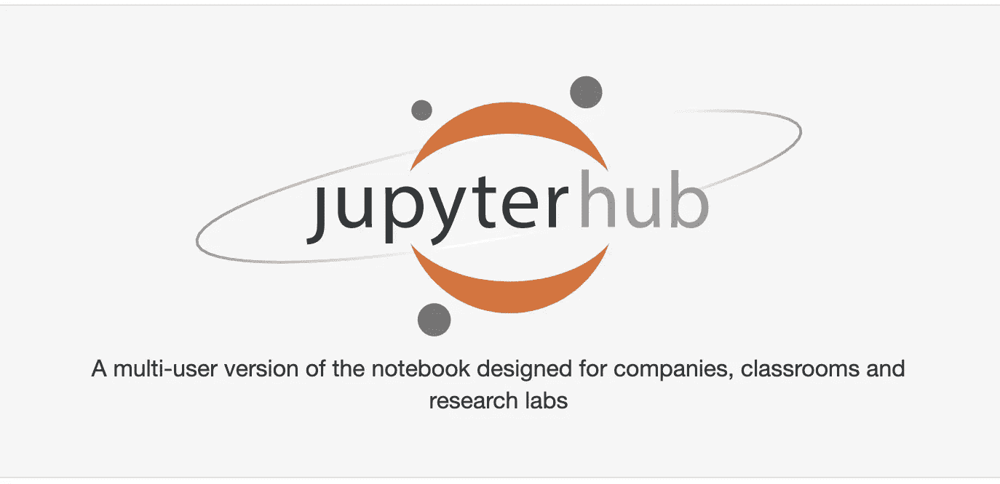
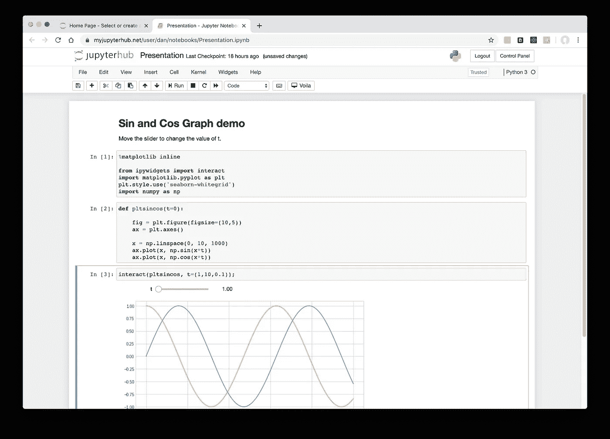
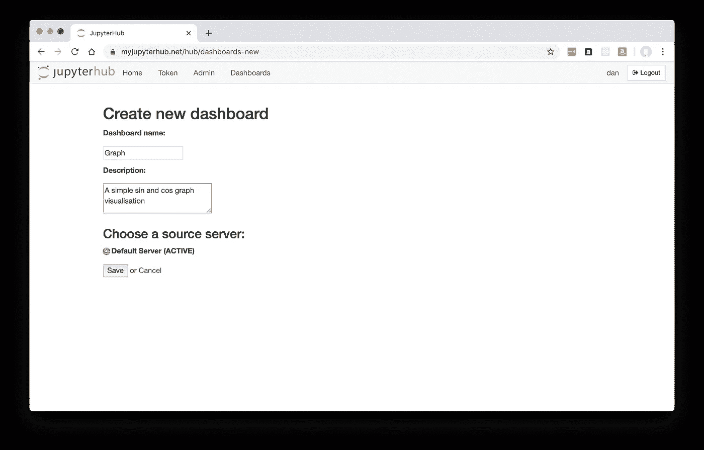
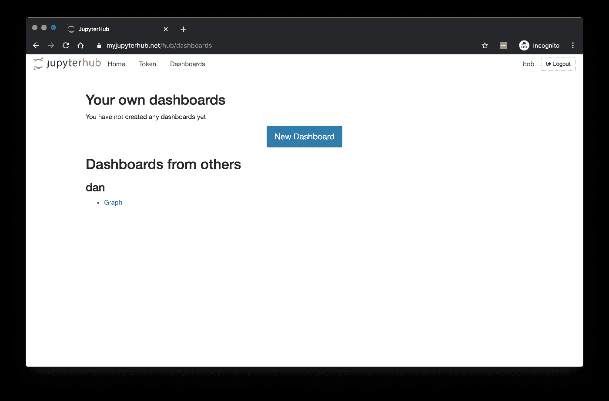
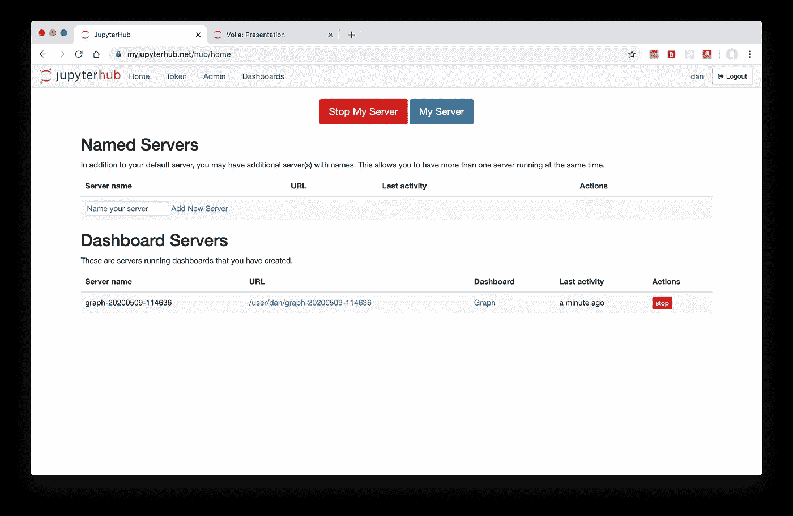

# 将非技术用户引入 JupyterHub

> 原文：<https://towardsdatascience.com/bringing-non-technical-users-into-jupyterhub-a7f9acf83571?source=collection_archive---------30----------------------->

## 扩展 JupyterHub，以便同事和客户可以与您的笔记本电脑的用户友好的安全版本进行交互

[Jupyter notebooks](https://jupyter.org/) 是一种交互式探索和开发数据科学模型的简单方法。 [JupyterHub](https://jupyterhub.readthedocs.io/en/stable/) 是一个可以在 web 服务器上配置的独立项目，允许组织集中管理一个托管多个 Jupyter 笔记本环境的服务器，每个数据科学团队成员一个或多个。除了标准化用户开发环境和减轻个体数据科学家的维护负担，JupyterHub 还提供了一个认证框架——例如，基于企业电子邮件帐户实现单点登录访问。

总是有办法与其他团队成员共享文件系统，但 JupyterHub 通常被视为组织数据科学家实验的一种方式——非技术同事不会被邀请。也许一名数据科学家通过笔记本电脑与一名客户交谈，而他们都在看着同一个屏幕。也许有时，最有可能是不幸的是，一个非技术用户得到一个 JupyterHub 帐户，上面有在笔记本上 shift+enter 的指令，这样他们就可以自己研究结果…


手拿笔记本的非技术同事应接不暇……(照片由来自 [Pexels](https://www.pexels.com/photo/pile-of-covered-books-159751/?utm_content=attributionCopyText&utm_medium=referral&utm_source=pexels) 的 [Pixabay](https://www.pexels.com/@pixabay?utm_content=attributionCopyText&utm_medium=referral&utm_source=pexels) 拍摄)

# 打开 JupyterHub

过去几年的新项目让 JupyterHub 做得更多。本文描述了如何将其他免费开源项目引入到您的 JupyterHub 中，使其成为一个有用的工具，以安全、自动化和用户友好的方式展示您的笔记本成果。

至关重要的是，如果您或您的 IT 部门拥有配置 JupyterHub 的资源，那么您只需要扩展配置就可以引入这个额外的功能。

我们努力实现的工作流程:

*   数据科学家编写了一个 Jupyter 笔记本，可能会显示基于模型的不同输入的交互式图表
*   当准备好分享时，他们点击几个按钮，旋转他们的笔记本的独立克隆，以用户友好的仪表板风格运行(即，查看者看不到代码，或者需要按 shift+enter！)
*   任何可以访问 JupyterHub 的非技术用户(例如通过他们的公司 Google 电子邮件)都可以安全地查看仪表板并与之交互
*   同时，数据科学家可以不受阻碍地继续使用他们的原始笔记本

为 JupyterHub 带来这种魔力的关键技术是 [Voila](https://github.com/voila-dashboards/voila) ，这是 Jupyter 服务器的用户友好版本，它隐藏了代码单元，并将笔记本作为 web 应用程序运行。

其他一些默默无闻的开源项目也有助于实现这一点，所有的胶水都被一个新的叫做[仪表盘](https://github.com/ideonate/cdsdashboards)的 JupyterHub 扩展混合在一起。



JupyterHub [主页上的标志](https://jupyter.org/)

## 配置 JupyterHub

有三种主要方法可以为您的组织在服务器上安装 JupyerHub:

*   在 Kubernetes 集群上，通过 [Zero-to-JupyterHub](https://zero-to-jupyterhub.readthedocs.io/en/latest/) 提供的方法—这种重量级的方法目前还不能支持这里描述的仪表板设置。
*   通过[最小的 JupyterHub](http://tljh.jupyter.org/en/latest/)(TLJH)——一种在单台机器上设置和配置 JupyterHub 的标准化方法。这有一个很好的命令行工具，可以轻松地设置 HTTPS 证书和其他配置，但对您的服务器有一些重要的基本要求。
*   自己在一台服务器上安装。让 JupyterHub 在任何基于 Linux 的服务器上运行相对容易，但是你必须安装你自己的 HTTPS 证书，并找到一种方法来监督 JupyterHub 服务器进程。

我们将主要假设您正在使用 TLJH，但是您自己的手动安装步骤将是相似的。

TLJH 的初始安装和设置在 [TLJH 的安装文档](http://tljh.jupyter.org/en/latest/install/index.html)中针对各种云提供商(或您自己的服务器)进行了描述。

## 码头工人的重要性

Docker 是一项真正的革命性技术，它允许我们将每个 Jupyter 笔记本服务器作为一个独立的(轻量级)虚拟机来运行，这样我们就不需要担心 JupyterHub 进程本身或我们的多个用户的服务器相互冲突。

这种虚拟化可以在没有 Docker 的情况下建立——事实上，默认的 TLJH 安装在服务器上本地构建了精心构建的进程隔离。从 Dashboard 的角度来看，Docker 的真正天才之处是能够轻松地指示 Docker 拍摄 Jupyter 环境的快照，以便我们可以立即旋转它的新克隆，除了这一次使用用户友好的 Voila 前端而不是常规的 Jupyter 界面来启动它。

我们需要指示 JupyterHub 使用“DockerSpawner”启动新的独立 Jupyter 服务器。

如果你的 TLJH 安装还没有运行 Docker，请[查看这里的说明](https://ideonate.com/DockerSpawner-in-TLJH/)。

**更新:最新版本的 ContainDS 不需要 Docker！** [**无对接器安装说明在此**](https://cdsdashboards.readthedocs.io/en/stable/chapters/setup/tljh.html) **。**

## 安装容器仪表板

到目前为止，一切都给了我们一个标准的最小 JupyterHub 设置。

最后的配置步骤是安装 ContainDS 仪表板。这为 JupyterHub 添加了一个额外的“仪表板”菜单，您可以在其中创建或查看其他用户制作的仪表板。

SSH 到您的服务器，如果不在那里，运行:

```
sudo /opt/tljh/hub/bin/python3 -m pip install cdsdashboards
```

添加一个额外的配置片段，告诉 TLJH 加载仪表板片段:

```
sudo vi /opt/tljh/config/jupyterhub_config.d/cdsdashboards.py
```

将以下内容粘贴到 vi 编辑器中:

```
c.JupyterHub.allow_named_servers = True

from cdsdashboards.app import CDS_TEMPLATE_PATHSfrom cdsdashboards.hubextension import cds_extra_handlers

c.JupyterHub.template_paths = CDS_TEMPLATE_PATHS
c.JupyterHub.extra_handlers = cds_extra_handlersc.CDSDashboardsConfig.builder_class = 'cdsdashboards.builder.dockerbuilder.DockerBuilder'
```

*(如果不熟悉 vi 文本编辑器:启动时，按‘I’进入插入模式；粘贴文本；按 escape 键，然后键入':wq '和 enter 键来编写文件并退出。)*

要试用并检查您的 JupyterHub 是否正常工作:

```
sudo tljh-config reload
```

从 web 浏览器访问您的 JupyterHub 安装，并看到它仍然像预期的那样运行。

# 构建仪表板

在您的 JupyterHub 中，点击“我的服务器”以访问您的 Jupyter 笔记本电脑服务器。创建你想要制作和分享的任何原型或可视化。为了跟随这个教程，你可以在这里找到一个简单的例子[粘贴到你的笔记本单元格或者只是上传为一个 ipynb 文件。](https://github.com/danlester/binder-sincos/blob/6cce3da1296714fc8545c201891ebea789b916df/Presentation.ipynb)



我们在朱庇特笔记本上的代码

当您准备好分享时，点击返回“控制面板”，然后进入新的“仪表板”菜单:


空仪表板屏幕

点击“新仪表板”并填写屏幕:



新的仪表板屏幕

最重要的事情是输入一个名称，然后选择您正在工作的 Jupyter 服务器克隆到仪表板中。在这种情况下，只有我们的“默认服务器”可供选择。

您将看到 ContainDS 构建了新的仪表板。准备就绪后，您可以点击它，查看您闪亮的全新用户友好型仪表盘:


瞧，笔记本的版本

## 让你的非技术同事参与进来

创建仪表板的过程很简单，但是当您的非技术同事或客户亲眼看到您的工作时，这种设置的真正威力会大放异彩——而不是让他们阅读您的代码！

当另一个用户登录到 JupyterHub 并点击仪表板菜单时，他们将能够看到其他用户创建的所有仪表板。查看“来自其他人的仪表板”下的“图表”仪表板:



另一个用户访问我们的仪表板

其他用户可以点击进入仪表板，并以用户友好的形式与它进行交互，这一切都是安全的，并且不必在您的代码中按 shift+enter 键，甚至看不到任何内容！

# 这一切是如何运作的

在幕后，ContainDS Dashboards 使用 Docker 将原始的 Jupyter 服务器克隆为“映像”。然后，它启动了一个基于该图像的新服务器，只不过这次是通过 Voila 的服务器而不是常规的 Jupyter 服务器来运行。

无论哪个用户拥有仪表板，都可以在其主页上看到服务器的仪表板版本:



显示仪表板服务器的扩展主页

如果他们停止和/或删除它，这很好。如果任何其他用户尝试再次查看仪表板，将会启动一个新的仪表板服务器。

就 JupyterHub 而言，dashboard 服务器只是另一个 Jupyter 服务器，它现在独立于您原来的 Jupyter 服务器运行。这意味着您可以返回并对笔记本电脑进行更改，而不会影响仪表板。而且仪表盘的用户不会影响你原来的笔记本。

ContainDS Dashboards 配置中的选项允许您隐藏 dashboard 服务器列表，因此您的用户无需担心它们。

# 结论

这里的一切都建立在成熟的技术之上——最著名的是 Jupyter 笔记本和 JupyterHub。这意味着您或您的 IT 部门可以轻松访问这里描述的基础架构的核心。

最近的一些发展使得这个仪表板解决方案成为可能: [Voila](https://github.com/voila-dashboards/voila) 本身，以及一个名为 [jhsingle-native-proxy](https://github.com/ideonate/jhsingle-native-proxy) 的小项目，它提供了围绕 Voila 的 Jupyter-Hub 认证。当然，[包含了仪表盘](https://github.com/ideonate/cdsdashboards)将所有东西联系在一起。

在基于项目的数据科学团队中，每个数据科学家可能最适合在他们自己的 Jupyter 环境中解决问题。通常，使用破坏性的临时流程将结果转移到 web 服务器或其他部署系统，以便非技术客户或同事可以充分欣赏笔记本电脑中演示的模型。

我希望这种生产安全可靠的笔记本“仪表板”版本的新能力将使数据科学家与非技术利益相关者的交流变得愉快和丰富。能够自动和即时地做到这一点意味着分享结果不需要等到项目的最后——然后变成一个漫长而痛苦的过程，危及结果本身的可靠性。