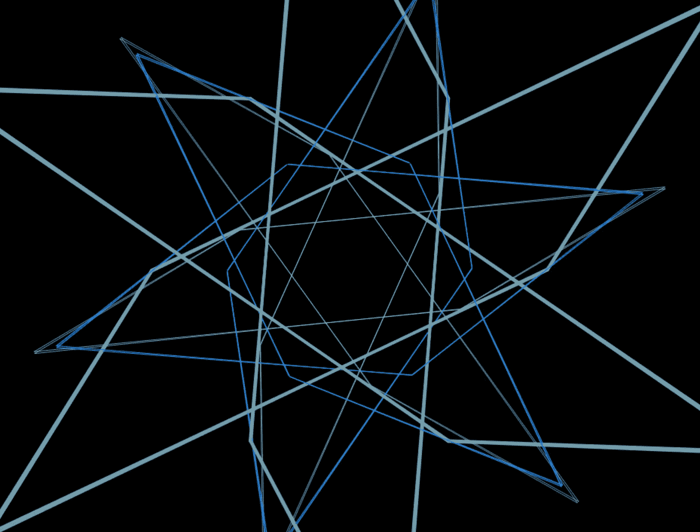
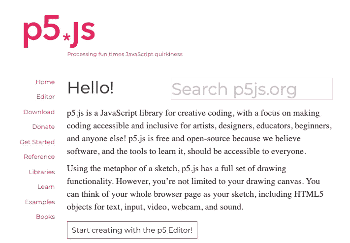

# 通过音乐可视化将歌曲带入生活

> 原文：<https://towardsdatascience.com/bringing-songs-to-life-through-music-visualization-8beee9573b7b?source=collection_archive---------34----------------------->

## 使用 p5.js 库将低音、高音和中音能量映射到动态视觉组件



去年秋天，当我在哥本哈根留学的时候，我遇到了这个设计师，他正在用 Javascript 做很多很酷的可视化项目。聊了几句，我就完全被他的创作世界吸进去了。我被他在 Instagram 上分享音乐可视化的帖子迷住了，我最终掉进了一个兔子洞，这让我发现了许多其他做类似工作的创意天才。我给自己做了一个记录，总有一天我会回到这个灵感的源泉，用我自己的项目来弄脏我的手。

在我们开始之前，让我先澄清一下我在创意公寓里的挣扎。我没有天马行空的想象力——我的艺术品味很大程度上局限于那些看起来令人满意、或许有点催眠的几何设计。因此，毫无疑问，弄清楚从哪里开始是这个项目最困难的部分。

奇怪的是，我这个项目的主要灵感来自电视节目*这就是我们*。无可否认，这是一部相当感人的戏剧——请不要因为我看了它就对我评头论足。然而，有一件事我并不羞于承认，那就是我是悉达多·科斯拉为该剧原创配乐的超级粉丝。我认为他是一位杰出的作曲家，有时我会在晚上反复播放他的音乐来哄我入睡。我想进一步探索这些曲目，看看我是否能创造一个视觉组件，可以像音频一样舒缓。


悉达多·科斯拉和*中的几个场景这就是我们，来源:* [*NPR*](https://www.npr.org/sections/world-cafe/2018/03/12/592296791/siddhartha-khosla-on-world-cafe)

# P5.js 库

第一步是熟悉 p5 Javascript 库。p5.js 是一个专门为艺术家、设计师、教育工作者和初学者定制的库，目的是使 Javascript 更容易被希望实现不同类型的应用程序的程序员访问。



p5.js 主页

我仔细阅读了大量的例子，以找出如何处理音频。首先，我摆弄了一下[声音频谱](https://p5js.org/examples/sound-frequency-spectrum.html),看看音频被映射到某种视觉的基本例子。然后，我了解了一个名为 **getEnergy()** 的函数，它返回特定频率下的能量(体积)数量，或者两个频率之间的平均能量数量。此外，预定义的频率范围(“低音”、“中低音”、“中低音”和“高音”)可以传递到函数中。唯一的规定是必须首先调用 **analyze()** 函数，因为 **getEnergy()** 函数依赖于来自该函数调用的分析频率数据。

# 音频→视频

我的项目的频率提取代码非常简单:

```
var fft = new **p5**.**FFT**();
fft.**analyze**();
var bass = fft.**getEnergy**("bass");
var treble = fft.**getEnergy**("treble");
var mid = fft.**getEnergy**("mid");
```

将音频映射到视觉组件需要大量的角度和数学上的反复试验。最后，我使用鼠标定位来指定可视化中多边形的线段数和半径。

```
pieces = **map**(mouseX, 0, width, 4, 8);
radius = **map**(mouseY, 0, height, windowHeight / 4, windowHeight/2);
```

然后，我为线段制作了一些贴图和缩放变量。

```
var map_mid = **map**(mid, 0, 255, -radius, radius);
var scale_mid = **map**(mid, 0, 255, 1, 1.5);var map_treble = **map**(treble, 0, 255, -radius, radius);
var scale_treble = **map**(treble, 0, 255, 1, 1.5);var map_bass = **map**(bass, 0, 255, -100, 800);
var scale_bass = **map**(bass, 0, 255, 0, 0.8);
```

最后，我编写了一个 for 循环来定义低音、中音和高音多边形环，它们将旋转到整首歌的音频频率。

这段代码的结果可以在下面的视频中看到。

# 附加功能

## 预装轨道

我选择使用*这是我们*原声带中的歌曲“杰克在 AA”的一个主要原因是因为我碰巧在我的电脑上有它的 MP3，可以很容易地上传到可视化中。我希望能够可视化其他歌曲，所以我实现了一个预加载的轨道功能，允许您单击数字键来切换正在播放的轨道。附加曲目选项(不包括预载为 0 号曲目的“AA 中的插孔”)包括:

1.  我想去的地方
2.  露天看台-狂野的心
3.  设计师-熊猫
4.  拉赫曼-发自内心再保险
5.  哈利德-眩晕
6.  Shakey Graves -家族和属
7.  蒙福之子乐团-我会等的
8.  特拉维斯·斯科特，房间里最高的
9.  玻璃动物，丹泽尔·库里-东京漂流

这些曲目代表了各种各样的流派。事实上，在不访问粗略的、充满病毒的、可能是非法的网站的情况下获取 MP3 文件是一个相当大的挑战。也就是说，如果你有一个. mp3，你可以选择上传自己的歌曲。wav 或者。ogg 文件。

## 调色板切换

可视化的着色非常简单。四种颜色的阵列用于组成调色板。四种颜色按以下顺序给出:[(背景)，(低音)，(中音)，(高音)]。

为了允许颜色切换，我提出了总共 5 个调色板(红色、橙色、绿色、蓝色和紫色)，然后添加了一个简单的按键监听器来遍历调色板。按下“Enter”键以及双击都会触发此功能。

## 切换播放/暂停

您可以通过点击“空格键”或点击左下角的切换按钮来暂停或播放曲目。

# 例子

在上面的演示中，我们看到歌曲“我想去的地方”被形象化了。这首歌有一个典型的快节奏，每当频率根据节拍变化时，多边形的频繁收缩就反映了这一点。在每一拍中按下“输入”键也是非常令人满意的，因为颜色的变化使视觉化感觉非常有活力，就像你在迪斯科舞厅或夜总会看到的一样。

玻璃动物和丹泽尔·库里的歌曲《东京漂移》是我最近最喜欢的一首歌。我的好朋友不久前把它发给了我，我不明白这种炒作是怎么回事，但每次听它，我都会更加欣赏它。我在上面的视频中录制了一段可视化片段，主要是因为这首歌的介绍很吸引人。由于在歌曲的前几秒钟没有很多音频通道同时混合在一起，每个半令人毛骨悚然的声音都与一些视觉成分直接相关。然后，在 0 点 27 分，有一个巨大的节拍下降，完全将你吸入轨道的其余部分。节拍在整首歌中相当突出，其意义体现在视频中浅蓝色所代表的每个节拍脉动的大小上。

# 与未来相关的愿望

*   自动从一些音乐流媒体服务中提取新音乐，以便我(和其他人)可以访问这个可视化应用程序来聆听和体验新音乐。
*   根据歌曲或艺术家开发更具创造性的音乐可视化，而不是几何图形。
*   制作一个以更优雅的方式运行这些代码的移动应用程序(这个 web 应用程序中的一些组件有点简单)。
*   建立一个持续产生音乐的 GAN。

# 结束语

源代码可以在这里找到:

[](https://github.com/sejaldua/music-viz) [## sejaldua/音乐-即

### 使用 P5.js 库探索音乐可视化

github.com](https://github.com/sejaldua/music-viz) 

这只是我第一个使用 Javascript 的音乐可视化项目。我肯定打算继续改进这个项目，我也希望转向其他有趣的应用程序和与音乐相关的开发工具。如果你想给我任何反馈或灵感，请通过 sejaldua@gmail.com 或我的[网站](https://sejaldua.com)联系我。

感谢您的阅读！