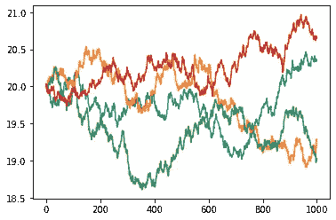

# 用 Python 实现布朗运动

> 原文：<https://towardsdatascience.com/brownian-motion-with-python-9083ebc46ff0?source=collection_archive---------4----------------------->

## 我们展示了如何使用简单的 Python 代码来模拟布朗运动，这是应用广泛的最著名的随机过程。


图片来源: [Pixabay(免费商业使用)](https://pixabay.com/illustrations/colour-smoke-rainbow-color-design-1885352/)

**免责声明**:本文的灵感来源于 [**佐治亚理工学院在线分析硕士(OMSA)**](https://www.gatech.edu/academics/degrees/masters/analytics-online-degree-oms-analytics) 项目学习资料。我很自豪能继续这个优秀的在线硕士项目。你也可以[在这里查看详情。](http://catalog.gatech.edu/programs/analytics-ms/#onlinetext)

# 什么是布朗运动？

## 物理起源和属性

B 它是由粒子与流体中快速运动的分子(由于内部热能而被激发)的随机碰撞产生的。前述流体应该处于所谓的[热平衡](https://en.wikipedia.org/wiki/Thermal_equilibrium)，在那里不存在优先流动方向(与各种[运输现象](https://en.wikipedia.org/wiki/Transport_phenomena)相反)。

## 发现和早期解释

布朗运动是以苏格兰植物学家罗伯特·布朗·T21 的名字命名的，他在 1827 年通过显微镜观察浸泡在水中的花粉时首次描述了这一现象。

长期以来，科学界对此并不重视。然后，在 1905 年，一个 26 岁的瑞士专利办事员通过借助热力学定律分析现象，改变了物理世界。


图片来源:[维基百科](https://en.wikipedia.org/wiki/Annus_Mirabilis_papers#/media/File:Einstein_patentoffice.jpg)

阿尔伯特·爱因斯坦发表了一篇开创性的论文**[](http://www.maths.usyd.edu.au/u/UG/SM/MATH3075/r/Einstein_1905.pdf)**，其中他模拟了花粉的运动，受单个水分子的影响，并取决于液体的热能。虽然这篇论文相对来说不如他 1905 年的其他论文出名，但它是他被引用最多的出版物之一。事实上，爱因斯坦对布朗运动的解释是第一个从数学角度证明分子存在的有力证据。****

****你可以阅读这篇[令人愉快的文章，纪念爱因斯坦论文](https://arxiv.org/pdf/cond-mat/0504610.pdf)发表 100 周年。****

# ****作为随机过程的布朗运动****

## ****多体相互作用****

****[多体相互作用](https://en.wikipedia.org/wiki/Many-body_problem)，产生了复杂而美丽的布朗运动模式，无法通过解释分子详细运动的第一原理模型来解决。因此，**只有应用于分子群体的概率宏观模型**才能用来描述它。****

****这是布朗运动描述背后的推理**主要是作为一个现代形式的纯粹随机过程**。几乎所有的实际应用也采用这种方法。****

## ****维纳过程****

****美国数学家[诺伯特·维纳](https://en.wikipedia.org/wiki/Norbert_Wiener)首先分析了一维布朗运动的数学性质。由此产生的形式是一个实值连续时间随机过程，称为维纳过程****

****它是**最著名的随机过程之一，具有吸引人的性质**，如[平稳性](https://en.wikipedia.org/wiki/Stationary_process)和[独立增量](https://en.wikipedia.org/wiki/Independent_increments)。因此，它在广泛的领域中发现了频繁的应用，包括纯数学和应用数学，定量金融，经济建模，量子物理，甚至进化生物学。****

## ****常见应用****

****布朗运动的概念和数学模型在现代数学中起着至关重要的作用，如[](https://en.wikipedia.org/wiki/Stochastic_calculus)**[**扩散过程**](https://en.wikipedia.org/wiki/Diffusion_process) 。维纳过程也用于表示白噪声[高斯过程](https://en.wikipedia.org/wiki/Gaussian_process)的积分，该过程通常充当电气和电子工程中无处不在的噪声模型**。同样的想法也适用于**滤波器设计**中的模型噪声和误差以及**控制理论**中的随机/未知力。********

****

****噪声信号**(来源: [Pixabay](https://pixabay.com/illustrations/sound-wave-noise-frequency-waveform-3870974/) )**

**在**量子物理**中，借助布朗运动研究与[福克-普朗克](https://en.wikipedia.org/wiki/Fokker%E2%80%93Planck_equation)和[朗之万方程](https://en.wikipedia.org/wiki/Langevin_equation)相关的扩散现象。它也是量子力学的严格路径积分公式形成的基础。例如，使用[费曼-卡奇公式](https://en.wikipedia.org/wiki/Feynman%E2%80%93Kac_formula)，著名的**薛定谔方程**的解可以用维纳过程来表示。**物理宇宙学**中的[永恒膨胀](https://en.wikipedia.org/wiki/Eternal_inflation)模型，灵感来自布朗运动动力学。**

**在**金融和计量经济学建模**的世界里，布朗运动拥有神话般的地位。它在几乎所有主要的金融数学理论中都占有显著的地位。特别是著名的 [**布莱克-斯科尔斯**](https://en.wikipedia.org/wiki/Black%E2%80%93Scholes) **期权定价模型**，为此[迈伦·斯克尔斯](https://en.wikipedia.org/wiki/Myron_Scholes)获得 1997 年诺贝尔经济学奖，就依赖于这种形式主义。**

****

****量化金融大量使用布朗运动**(来源: [Pixabay](https://pixabay.com/photos/stock-trading-monitor-business-1863880/) )**

# **Python 实现**

## **一个相当简单的等式**

**按照布朗运动动力学生成数据点的核心方程相当简单，**

****

**其中 ***【易】***可以是一个基本的[随机过程](https://en.wikipedia.org/wiki/Stochastic_process)如随机游走或来自正态分布的样本。**

## **一门`Brownian`课**

**实现 [**的 Jupyter 笔记本可以在这里**](https://github.com/tirthajyoti/Stats-Maths-with-Python/blob/master/Brownian-motion-with-Python.ipynb) 找到。**

**在下面的 Python 代码中，我们用一些有用的方法定义了一个类`Brownian`,**

*   **`gen_random_walk()`:从随机行走过程生成运动**
*   **`gen_normal()`:从正态分布绘制生成运动**
*   **`stock_price()`:使用所谓的**‘几何布朗运动’**公式来模拟股票价格**

```
class Brownian():
    """
    A Brownian motion class constructor
    """
    def __init__(self,x0=0):
        """
        Init class
        """
        assert (type(x0)==float or type(x0)==int or x0 is None), "Expect a float or None for the initial value"

        self.x0 = float(x0)

    def gen_random_walk(self,n_step=100):
        """
        Generate motion by random walk

        Arguments:
            n_step: Number of steps

        Returns:
            A NumPy array with `n_steps` points
        """
        # Warning about the small number of steps
        if n_step < 30:
            print("WARNING! The number of steps is small. It may not generate a good stochastic process sequence!")

        w = np.ones(n_step)*self.x0

        for i in range(1,n_step):
            # Sampling from the Normal distribution with probability 1/2
            yi = np.random.choice([1,-1])
            # Weiner process
            w[i] = w[i-1]+(yi/np.sqrt(n_step))

        return w

    def gen_normal(self,n_step=100):
        """
        Generate motion by drawing from the Normal distribution

        Arguments:
            n_step: Number of steps

        Returns:
            A NumPy array with `n_steps` points
        """
        if n_step < 30:
            print("WARNING! The number of steps is small. It may not generate a good stochastic process sequence!")

        w = np.ones(n_step)*self.x0

        for i in range(1,n_step):
            # Sampling from the Normal distribution
            yi = np.random.normal()
            # Weiner process
            w[i] = w[i-1]+(yi/np.sqrt(n_step))

        return w

    def stock_price(
                    self,
                    s0=100,
                    mu=0.2,
                    sigma=0.68,
                    deltaT=52,
                    dt=0.1
                    ):
        """
        Models a stock price S(t) using the Weiner process W(t) as
        `S(t) = S(0).exp{(mu-(sigma^2/2).t)+sigma.W(t)}`

        Arguments:
            s0: Iniital stock price, default 100
            mu: 'Drift' of the stock (upwards or downwards), default 1
            sigma: 'Volatility' of the stock, default 1
            deltaT: The time period for which the future prices are computed, default 52 (as in 52 weeks)
            dt (optional): The granularity of the time-period, default 0.1

        Returns:
            s: A NumPy array with the simulated stock prices over the time-period deltaT
        """
        n_step = int(deltaT/dt)
        time_vector = np.linspace(0,deltaT,num=n_step)
        # Stock variation
        stock_var = (mu-(sigma**2/2))*time_vector
        # Forcefully set the initial value to zero for the stock price simulation
        self.x0=0
        # Weiner process (calls the `gen_normal` method)
        weiner_process = sigma*self.gen_normal(n_step)
        # Add two time series, take exponent, and multiply by the initial stock price
        s = s0*(np.exp(stock_var+weiner_process))

        return s
```

## **初始值为零并使用随机行走的过程**

**我们可以使用一个基本的随机过程，如 [**随机行走**](https://en.wikipedia.org/wiki/Random_walk) ，来生成布朗运动的数据点。**

****

**随机漫步(图片来源:[维基百科](https://en.wikipedia.org/wiki/Random_walk#/media/File:Eight-step_random_walks.png))**

```
b = Brownian()for i in range(4):
    plt.plot(b.gen_random_walk(1000))
plt.show()
```

****

## **初始值为 20 并使用正态分布的过程**

**我们可以从[正态分布](https://en.wikipedia.org/wiki/Normal_distribution)中得出布朗运动数据。**

```
b = Brownian(20)for i in range(4):
    plt.plot(b.gen_normal(1000))
plt.show()
```

****

## **股票价格模拟**

**我们在类中实现了几何布朗运动模型作为一种方法。**

****

**股票价格的几何布朗运动模型**

**在演示中，我们模拟了 52 个时间段的多个场景(假设一年有 52 周)。注意，所有的股票价格都从同一点开始，但是沿着不同的轨迹随机变化。**

**请注意，动态由基础正态分布的均值和方差参数控制。这在某种程度上模仿了股票的增长趋势和“波动性”。**

**例如，具有正增长趋势的股票将具有正的含义。对于这个特定的模拟，选择均值(μ)为 0.2，选择标准差(方差的平方根)为 0.68。**

**我们首先为绘图定义一个效用函数。**

```
def plot_stock_price(mu,sigma):
    """
    Plots stock price for multiple scenarios
    """
    plt.figure(figsize=(9,4))
    for i in range(5):
        plt.plot(b.stock_price(mu=mu,
                               sigma=sigma,
                               dt=0.1))
    plt.legend(['Scenario-'+str(i) for i in range(1,6)],
               loc='upper left')
    plt.hlines(y=100,xmin=0,xmax=520,
               linestyle='--',color='k')
    plt.show()
```

**请注意，尽管这些情景看起来足够随机，但它们有下降趋势。这是因为即使是正平均值，我们也有稍高的利差或波动性。**

```
plot_stock_price(mu=0.2,sigma=0.7)
```

****

## **波动性的微小变化**

**我们用**稍微小一点的波动性(但是和以前一样的均值)**再次模拟股票价格，这次得到了完全不同的结果。趋势看起来是中性的，即一些情景显示股价在 52 周后上涨，而一些情景显示股价下跌。**

```
plot_stock_price(mu=0.2,sigma=0.65)
```

****

## **进一步降低波动性**

**如果我们降低波动性，甚至更多，我们会得到一个明显的积极趋势。**

```
plot_stock_price(mu=0.2,sigma=0.6)
```

****

## **二维绘图**

**在下面的例子中，我们展示了一个二维布朗运动，很像流体介质中实际悬浮的粒子所经历的运动。**

```
b1 = Brownian()
b2 = Brownian()

x = b1.gen_normal(1000)
y = b2.gen_normal(1000)

plt.plot(x,y,c='b')
xmax,xmin,ymax,ymin = x.max(),x.min(),y.max(),y.min()
scale_factor = 1.25
xmax,xmin,ymax,ymin = xmax*scale_factor,xmin*scale_factor,ymax*scale_factor,ymin*scale_factor
plt.xlim(xmin,xmax)
plt.ylim(ymin,ymax)
plt.show()
```

****

# **摘要**

**我们展示了如何生成随机数据集对应于布朗运动在一维和二维。我们还展示了这一思想在使用几何布朗运动模型的股票价格模拟中的应用。**

**对于这个重要的随机过程，拥有一个现成的 Python 实现是极其重要的，因为它在各种实际应用程序中无处不在。**

**例如，**数据科学从业者在分析定量金融或物理模型时，可以很容易地将这种实现与他们的随机过程模型**相集成。**

**同样，Jupyter 实现 [**的笔记本可以在这里**](https://github.com/tirthajyoti/Stats-Maths-with-Python/blob/master/Brownian-motion-with-Python.ipynb) 找到。欢迎读者根据自己的需求来叉和扩展。**

**A lso，你可以查看作者的 [**GitHub**](https://github.com/tirthajyoti?tab=repositories) **知识库**获取机器学习和数据科学方面的代码、思想和资源。如果你和我一样，对人工智能/机器学习/数据科学充满热情，请随时[在 LinkedIn 上添加我](https://www.linkedin.com/in/tirthajyoti-sarkar-2127aa7/)或[在 Twitter 上关注我](https://twitter.com/tirthajyotiS)。**

**[](https://www.linkedin.com/in/tirthajyoti-sarkar-2127aa7/) [## Tirthajyoti Sarkar - Sr .首席工程师-半导体、人工智能、机器学习- ON…

### 通过写作使数据科学/ML 概念易于理解:https://medium.com/@tirthajyoti 开源和有趣…

www.linkedin.com](https://www.linkedin.com/in/tirthajyoti-sarkar-2127aa7/)**