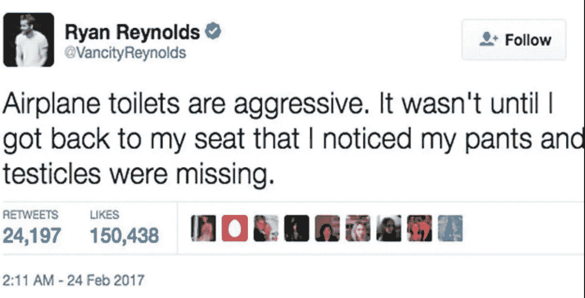

# NLP 数据科学家不会告诉你的残酷事实

> 原文：<https://towardsdatascience.com/brutal-truths-that-nlp-data-scientists-will-not-tell-you-7f387de66cd5?source=collection_archive---------5----------------------->

## 由数据科学家分享

答根据 Tractica 的[报告](https://www.tractica.com/newsroom/press-releases/natural-language-processing-market-to-reach-22-3-billion-by-2025/)，人工智能 NLP 软件市场预计将从 2016 年的**1.36 亿美元增长到 2025 年**的 54 亿美元**。这大约是 **10 年**增长 **40 倍**！**

另一方面，计算语言学协会(ACL)，杂志*计算语言学的发起者*一直在举行年会，吸引了数十位 NLP 科学家提交他们的作品。仅 2019 年[提交的科学论文](http://acl2019pcblog.fileli.unipi.it/?p=156)就比 ACL 2018 年增加了 **75%** 。

你可能会想——嘣！我要努力工作，在不久的将来成为一名 NLP 数据科学家！我爱 NLP！

这是否意味着你应该进入这个领域，只是因为它的光明前景？

事情是这样的。你所读到的一切都表明 NLP 的未来是光明的，它会很棒。然而，你不应该在不知道 NLP 数据科学家在做什么的情况下进入这个领域。我希望你能充分了解实际情况，以便你能更好地决定是否进入 NLP 领域。

在这篇文章中，我将与你分享作为一名 NLP 数据科学家的真相。

**什么是 NLP？**

简而言之，它涉及**对人类自然语言和语音进行分析的计算技术**。

嗯嗯..这是什么意思？🤔

这意味着你要处理不同形式的文本。我跟大家分享一下一个 NLP 数据科学家时不时会面临的一些情况。

## 情况 1

我们来看看下面的推文。

想象你正在分析这篇文章。你的目标是理解课文的意思。比方说，你认为主语是“我的裤子”,动词是“失踪”。那么，你从这条推文中得到了什么？

“裤子不见了。”..？？！

这显然不能代表推文的意思吧？

## 情况 2

现在，假设您正在执行基于方面的情感分析。基于方面分析包括情绪(正面或负面)和目标(观点)。

例如，“餐馆提供的服务很好”。这里，方面是“服务”，情绪是“积极的”。

为什么这很重要？这是因为餐馆的老板不仅知道顾客的体验很好，而且他们提供的服务也很棒。

假设您在数据集中看到了这篇评论。

> 这个真空吸尘器真的很烂。

这里的主题是真空吸尘器，但情绪应该是什么？“糟透了”这个词通常代表一种负面情绪，但你可以看到当它和吸尘器搭配在一起时，这个意思可能会发生变化。

真空吸尘器通过产生吸力来清洁。当你说它真的很烂的时候，你是在描述这台吸尘器很好用，不是吗？

## 情况 3

让事情变得更复杂。考虑下面这个问题。

> 嘿老弟，去哪里吃好吃的啊？

这句话的意思是食物很好吃吗？不，这实际上只是一个问题。

## 情况 4

另一种情况是，当你在处理文本时，你不知道它是什么意思。例如，你懂英语、汉语和马来语。但是，贵公司正在进行日语文本分类项目。所以，当你在试图理解你的模型出了什么问题的时候，你会很难受。

解决方案之一可能是使用谷歌翻译将句子转换成你知道的语言。然而，谷歌翻译并不完美。有些情况下，提供的翻译没有意义，你需要咨询你的母语是日语的人。

## 情况 5

此外，假设您正在进行文本分类任务。目标是检测商品名称是属于葡萄酒还是果汁。

也许你正在考虑使用关键字列表作为一项功能。在你花了几个小时找到一些有用的关键字来区分这两个类别之后，你会想到:

首先，您决定为每个类创建一组关键字列表。例如，葡萄酒类的关键字列表是['葡萄酒'，'葡萄汁']，而果汁类的关键字列表是['果汁']。如果在项目名称中找到关键字列表中的元素，那么该元素将作为一个特征被输入到模型中。

然而，您的模型的性能结果低于 90%的准确性的基准。

你该怎么办？你耐心地检查每一个错误分类的测试数据。当你发现葡萄酒有许多错别字时，你感到震惊:wne，wyne 等等。因此，您必须更新列表或对您的训练数据集执行一些错别字检查，以期提高准确性。

然而，这并不是故事的结尾。准确度确实提高了，但是您仍然对结果不满意。同样，你盯着错误分类的数据，找出这个有趣的项目名称:

> "由发酵的葡萄汁制成的黑皮诺"

你从标题中提取的关键字是“果汁”,因此你的模型将其归类为果汁类，这是错误的！黑皮诺是红酒，因此它应该被归类为葡萄酒！

## 结论

文字既有趣又恶心。因此，大多数时候，NLP 数据科学家会看着数据，挠你的头，试图想办法让你的模型理解上下文。

因此，如果你认为 **NLP 数据科学家只是打个电话。在 sklearn** 中 fit()，你应该马上改变方向。

如果你只能从这篇文章中得到一样东西，那就是这个。

**你应该期待你 80%的时间，不管你是在执行分析、特征工程、模型改进，还是在查看文本数据。因此，请确保您很好地理解您的数据，并能预见未来可能发生的一些潜在情况。**

# 最终想法

恭喜你！你一直读到文章结束。我希望我没有降低你成为 NLP 数据科学家的兴趣。我写这篇文章的目的只是为了帮助你在进入 NLP 领域之前更好地理解一些重要的信息。

当然，这只是我的 2 美分，我欢迎你在下面发表评论，分享你作为 NLP 数据科学家的个人经验！🤗

让我引用一句话来结束这篇文章。

> 我知道你已经听过一千遍了。但这是真的——努力是有回报的。如果你想变好，你必须练习，练习，再练习。如果你不喜欢什么，那就不要做。—雷·布雷德伯里

# 关于作者

[低伟鸿](https://www.linkedin.com/in/lowweihong/?source=post_page---------------------------)是 Shopee 的数据科学家。他的经验更多地涉及抓取网站，创建数据管道，以及实施机器学习模型来解决业务问题。

他提供爬行服务，可以为你提供你需要的准确和干净的数据。你可以访问[这个网站](https://www.thedataknight.com/)查看他的作品集，也可以联系他获取**抓取服务**。

你可以在 [LinkedIn](https://www.linkedin.com/in/lowweihong/?source=post_page---------------------------) 和 [Medium](https://medium.com/@lowweihong?source=post_page---------------------------) 上和他联系。