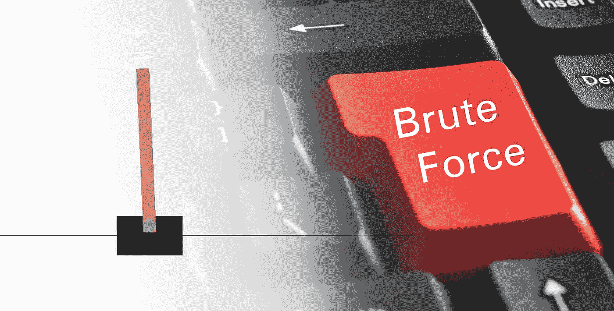

# 蛮力翻筋斗问题

> 原文：<https://towardsdatascience.com/brute-forcing-the-cartpole-problem-4d04c9c34b12?source=collection_archive---------43----------------------->

## 用穷举法快速解决横竿问题。

基地图片由[穆罕默德·贾希尔](https://unsplash.com/@eye__cup)在[上刷屏](https://unsplash.com/?utm_source=medium&utm_medium=referral)

[翻筋斗问题](https://gym.openai.com/envs/CartPole-v0/)是强化学习中一个突出的基准问题，它在 OpenAI 的健身房中的实现最为人所知。[也是他们排行榜上最受欢迎的](https://github.com/openai/gym/wiki/Leaderboard)s；这很有道理，是经典控制中比较容易出现的问题之一。但是这有多简单呢？

目前，一个解决方案需要在 100 集内平均平衡 195 步(或更多)。请记住，每集在 200 步后结束，因此解决方案确实需要有一定的稳定性。

一段时间以来，我一直认为在 200 步内保持平衡太容易了。因此，为了证实我的怀疑，我强行解决了这个问题。

如果你想了解我使用的所有代码，请随意在这里查看:[https://github . com/Adam price 97/Control/blob/master/bruteforcecartepole . ipynb](https://github.com/adamprice97/Control/blob/master/BruteForceCartepole.ipynb)

在密码学中，暴力攻击首先计算所有可能的密码字符串。然后，它反复应用这些密码，直到找到正确的密码。为了在控制中使用类似的方法，我们需要生成一系列的策略来控制横向拉杆。这对于连续的状态空间是不可能的，所以我们必须将状态空间离散化。

小车问题有 4 个观察值:“小车位置”、“小车速度”、“极角”和“极速度”。我们将完全忽略“推车位置”和“推车速度”，200 个时间步不足以让推车移动足够远来结束这一集。这给我们留下了“极角”和“极速度”，它们都将被“离散化”到 3 个独立的箱中，创建 9 种可能的环境状态。

掷骰子问题只有 2 个动作，因此有 9 个状态，我们有 512 个(2⁹)确定性贪婪策略的极限。我们现在需要的是生成这些策略的方法，然后我们可以尝试使用蛮力来解决:

在每个状态-动作对中，购物车将向左或向右移动(0 或 1)。因此，为了创建策略，我们只需为从 0 到 511 的每个数字生成二进制数。然后，字符串被重新整形，形成一个 3×3 的矩阵，以便于流水线操作。

完全评估每个策略的计算成本很高，因此，首先，我们对问题运行每个策略一次，并跟踪得分高于 195 的策略。

当我们运行这个脚本时，我们发现最初的 512 个策略中有 34 个是潜在的解决方案。为了进一步检查它们，我们需要运行这些潜在的解决方案 100 集，并平均它们的性能。

当我们运行时，我们在 39.1 秒内找到了 8 个解决方案。所以，我们有它。我们成功地暴力破解了翻筋斗问题！

这显然是一个解决控制问题的糟糕方法。我们发现的解决方案是非常不稳定的，没有一个能够平衡极点超过 300 个时间步。为了找到更好的解决方案，我们需要在状态空间中使用更多的桶，鉴于这种方法的二次复杂性，尝试这种方法是非常愚蠢的。

然而，我们已经找到了有效的解决办法。作为一个基准问题，这是对 cartpole 的谴责吗？我不这么认为。问题可能仍然很难，你只需要更长时间地平衡杆子。将平均奖励提高到 490，上限为 500，可能会使这种暴力方法变得多余。

另外，基准甚至需要有难度吗？求解 cartpole 的算法通常通过在求解环境之前所需的集数来进行比较。这种强力算法需要 512 次非评估迭代，这将是健身房排行榜上的最后一次…

编辑:在这篇文章的结尾，我声称:

> 将平均奖励提高到 490 分，上限为 500 分，可能会让这种暴力方法变得多余。

事实证明我错了。这个笔记本有这样的证明:[https://github . com/Adam price 97/Control/blob/master/bruteforcecartepole 2 . ipynb](https://github.com/adamprice97/Control/blob/master/BruteForceCartepole2.ipynb)

事实上，这种方法可以在合理的时间框架内解决 500 个步骤。