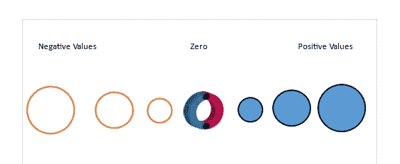

# 气泡图，为什么和如何

> 原文：<https://towardsdatascience.com/bubble-charts-why-how-f96d2c86d167?source=collection_archive---------22----------------------->

## **用泡泡讲故事**

图片由来自 Unsplash 的 Braedon McLeod 提供

**又名:**泡泡图，泡泡图

**原因:**气泡图用于确定至少**三个数值变量** **是否相关**或共享某种模式。在特殊情况下，它们可以用来显示一段时间内的趋势或比较分类变量。它们被认为是散点图的自然延伸，其中的点被气泡或**圆盘所取代。**

**如何**:针对一对数值变量(A，B)的每次观察绘制一个气泡或圆盘，在笛卡尔坐标系中，根据变量 A 的值水平定位圆盘，根据变量 B 垂直定位圆盘。第三个数值变量通过气泡的**区域表示。您甚至可以在不同的气泡中使用不同的颜色来合并第四个数据集(D:数字或分类)。**

这个故事是从这些数据点产生的形状以及气泡或圆盘的相对大小的差异来叙述的。对于不同的类别，必须有适当的图例，用颜色和某种类型的刻度来表示，以便我们推断出气泡大小所表示的数值。

图 1:气泡图的示意图。该图形是由 Seaborn 开发的。

上图显示了变量 A 和变量 b 之间的直接(正)关系。位置(60，225)所示的磁盘显然是一个异常值。通过关键字 *bbox_to_anchor* ，分类变量的图例和用于推断第三个变量数值的标度位于图表之外。使用此关键字，您可以更好地控制手动图例的放置；我强烈建议把它放在右上方的位置(Marplotlib.org，#1)。

就像散点图一样，可以在气泡图中找到数据集的三个重要特征:1 .- **离群值**，与数据集中所有其他数据非常不同并且似乎不符合相同模式的数据。这些异常值可能代表有价值的分析信息；2.-**gap**，不包含数据的区间。数据之间差距的可视化证明了解释其存在的深入分析的合理性；3.- **聚类**，孤立的数据气泡组，也值得对其在图表中出现的原因进行具体分析。以前，必须验证异常值、缺口或聚类的存在不是由于数据收集方法中的错误。

下面的气泡图描述了世界各地区**发育迟缓**与**获得基本卫生服务**的患病率。研究表明，恶劣的卫生条件导致儿童发育迟缓，发育迟缓儿童的大脑神经元连接比正常儿童少。随着技术正在取代常规工作，对高级认知技能和更强适应性的需求正在上升，即使在发展中国家也是如此。但是，发育不良的儿童在未来劳动力市场所需的技能方面将处于劣势。图表左上角黄色气泡的出现表明，撒哈拉以南非洲地区构成了一个明显的国家集群，那里有数百万儿童在没有未来基本生活技能的情况下成长。由于圆盘的大小与该地区的人口相对应，该图还显示了为南亚数百万儿童带来安全卫生设施的迫切需要(世界银行，2018 年，#2)。

图 2:世界各区域阻碍获得基本卫生服务的发育迟缓的普遍程度。来源:世界银行，2018 年。

最著名的泡泡图属于**汉斯·罗斯林的 TED 演讲**。罗斯林(1948-2017)是瑞典医生和统计学家，卡罗林斯卡医学院国际卫生教授。在他的 TED 演讲中，他将巨大的数据集转化成关于世界、经济和人类未来的视觉故事。我强烈推荐看他 2006 年的第一个视频:“你见过的最好的统计”(#3)和 2013 年的“神话之河”(#4)。

**温馨提示&警告(** &！！)**

**当我们想要显示三个或四个变量之间的**关系**而不是它们的确切值时，气泡图是合适的。例如，在业务中，您可以通过在气泡图中可视化不同业务备选方案之间的成本、价值和风险等维度的关系来做出投资决策。

！！你应该经常验证第三个或第四个变量的增加是否会改善故事的讲述。如果没有，尝试切换到更简单的替代表示，如散点图。

！！气泡图的主要缺点在于数字变量之间的比较非常困难，因为我们用两种不同的尺度来表示它们:位置和大小。人类的大脑很容易识别位置，但是区域却很难比较。

**！！永远记住，圆盘的面积与半径不成正比，而是与其平方成正比。**

**笛卡尔平面 x-y 不一定要从(0，0)开始。你必须根据你的数据所能讲述的最好的故事来选择你的坐标系的原点(见图 4)。

！！与散点图不同，**气泡图不会随着数据点数量的增加而改善。相反，每条信息都迫使观众计算相应气泡的大小，如果我们添加颜色来显示一些分类变量，这将变得更加复杂。虽然我们很容易掌握气泡大小的差异，但并不是每个人都会立刻联想到圆盘面积与半径的平方成正比。**

！！它们不应用于表示零或负值，因为没有负或零区域。如果这种表示是必不可少的，建议使用实心圆表示正值，空心圆表示负值。在得出这种表示法之前，一定要分析备选方案，就像一种颜色的正值和一种非常不同的颜色的负值(蓝色对红色，如下图所示)。另一种方法是在一个坐标轴上定位带有负值的变量。**永远记住，在气泡图中不小心使用负值可能会让观众困惑。**例如，100 的圆和-100 的圆大小相同。

图 3:负值、零值和正值的建议表示。使用 Publisher 2010 制作的图表。

**气泡数量的增加可能会导致拥塞和**重叠**。在这种情况下，应该使用可视化工具提供的半透明替代品。当然，存在一定程度的重叠，超过这一程度，观众可能会感到困惑，尤其是在图表中有大量气泡或密集的气泡群时。此时，建议使用更简单的可视化替代方案。

**要用气泡图显示一段时间内的趋势，您必须将时间作为一个变量放在横轴上。另一种方法是使用某种动画，就像汉斯·罗斯林在他的 TED 演讲中所做的那样。

！！以“逻辑”大小显示整个图形的需要不允许很好地比较磁盘中的大小差异。因此，它们之间的微小差异不容易显现出来。

**用气泡讲故事:白葡萄酒的品质**

2017 年，全球生产了 2.5 亿百升葡萄酒。西班牙是世界葡萄酒销售的领导者，2018 年为 2280 万百升(西班牙葡萄酒市场观察站，2019)。紧随西班牙之后的是意大利(2140 万)，法国(1540 万)，智利(980 万)和澳大利亚(8)。不过从人均摄入来看，**葡萄牙**是世界领先的国家。葡萄牙人每年人均消费超过 51 升，是西班牙人的两倍。

葡萄酒是食品和饮料行业的一个特例，因为专家意见，尤其是所谓的**大师**的意见，通过在消费者中产生原型或质量模型，对葡萄酒市场产生了重大影响。对葡萄酒质量的感知与产品的特性有关。葡萄酒的感官特性(香气、味道、颜色、风味或触觉)由评委、专家或葡萄酒专业人士作为一个单一的多维属性在一个标尺上进行评估，该标尺在左端和右端具有“低质量”和“高质量”锚。

由于普通的葡萄酒消费者缺乏专家和专业人士的知识和经验，因此能够建立量化参数来帮助消费者做出购买一瓶葡萄酒的决定是很重要的。

图片由来自 Unsplash 的 Blake Barlow 提供

一个有趣的 Kaggle 竞赛是关于葡萄酒质量探索和分析葡萄牙“Vinho Verde”葡萄酒的红色和白色变种。

数据可在 https://archive.ics.uci.edu/ml/datasets/Wine+Quality**获得，包括 1500 种白葡萄酒和 1500 种红葡萄酒的 11 种化学和物理特性。该项目的目的是评估以下哪些化学或物理特性影响葡萄酒的质量:固定酸度、挥发性酸度、柠檬酸、残糖、氯化物、游离二氧化硫、总二氧化硫、密度、pH 值、硫酸盐和酒精。这组葡萄酒由三位专家评估，他们为每种葡萄酒提供了 0(差)到 10(优)之间的质量分数。**

****

**表 1:葡萄酒数据集的前五条记录。**

**在研究结束时，还不清楚是什么区分了低质量的葡萄酒和中等质量的葡萄酒，只是根据一些化学性质区分了高质量葡萄酒的细微差异。一个重要的限制是数据集中缺少大量的低质量葡萄酒。总之，很明显，特定葡萄酒的质量是各种化学性质复杂结合的结果。**

**尽管如此，我们还是决定恢复该文件，并使用一些数据可视化技术来提供关于这样一个复杂主题的一些知识。考虑到质量是我们研究对象的基本属性，经过多次试验和大量图表，我们得出了以下气泡图:**

****

**图 4:葡萄牙“Vinho Verde”葡萄酒的质量、酒精、残糖和游离二氧化硫之间的关系。该图形是由 Seaborn 开发的。**

**横轴上表示的**酒精**，是指葡萄酒的酒精等级。这个参数是由许多因素决定的:葡萄的品种、收获的时间、随后发生的发酵过程以及随后的处理。**

**每升葡萄汁中含有大约 200 克糖，是葡萄糖和果糖的混合物。发酵时，糖大部分消失，留下酿酒师所谓的**残余糖**。葡萄酒中残留的糖分通常是发酵中断的结果(酵母死亡或无法消耗剩余的糖分)。酒瓶标签通常会标明残糖量。**

**葡萄酒行业使用**二氧化硫**的抗氧化和抗菌特性，防止颜色变化，尤其是在白葡萄酒中。由于消费者中不良反应的逐渐记录，二氧化硫的使用已经成为一个有争议的问题，消费者可能对二氧化硫的存在有轻度过敏(因此，在标签上指示其用途已经成为一些葡萄酒法规的一部分)。**

**图 4 中显示的气泡图清楚地表明，高品质的葡萄牙“Vinho Verde”葡萄酒(由绿色和蓝色圆盘表示)的酒精等级在 12%和 14 %之间，残糖水平低于 15 g/l。该图还表明，二氧化硫水平(由圆盘区域表示)对最终产品的质量没有相关影响。**

**所以，下次你买一瓶酒时，试着记录下酒精含量、残糖量和游离二氧化硫水平。虽然这不是一件容易的事情，但是通过数字尺度来量化葡萄酒的质量。通过这种方式，你将了解最适合你口味的化学参数。尽情享受吧！！**

**如果你对这篇文章感兴趣，请阅读我以前的:**

**簇状和重叠条形图，为什么和如何**

** [## 簇状和重叠条形图

### 为什么和如何

towardsdatascience.com](/clustered-overlapped-bar-charts-94f1db93778e) 

堆积条形图，为什么和如何，讲故事和警告

 [## 堆积条形图，为什么和如何

### 讲故事和警告

towardsdatascience.com](/stacked-bar-graphs-why-how-f1b68a7454b7) 

*参考文献*

# 1:[https://matplotlib . org/3 . 2 . 2/tutorials/intermediate/legend _ guide . html #](https://matplotlib.org/3.2.2/tutorials/intermediate/legend_guide.html)

# 2:[https://www . world bank . org/en/news/feature/2018/12/21/year-in-review-2018-in-14 图表](https://www.worldbank.org/en/news/feature/2018/12/21/year-in-review-2018-in-14-charts)

# 3:[https://www . ted . com/talks/Hans _ rosling _ the _ best _ stats _ you _ ve _ ever _ seen/抄本？language=es#t-67035](https://www.ted.com/talks/hans_rosling_the_best_stats_you_ve_ever_seen/transcript?language=es#t-67035)

第四名:[https://www.youtube.com/watch?v=lYpX4l2UeZg](https://www.youtube.com/watch?v=lYpX4l2UeZg)**