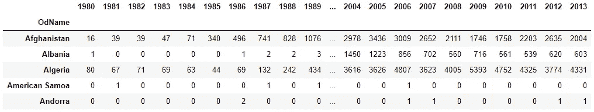
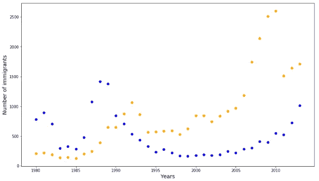
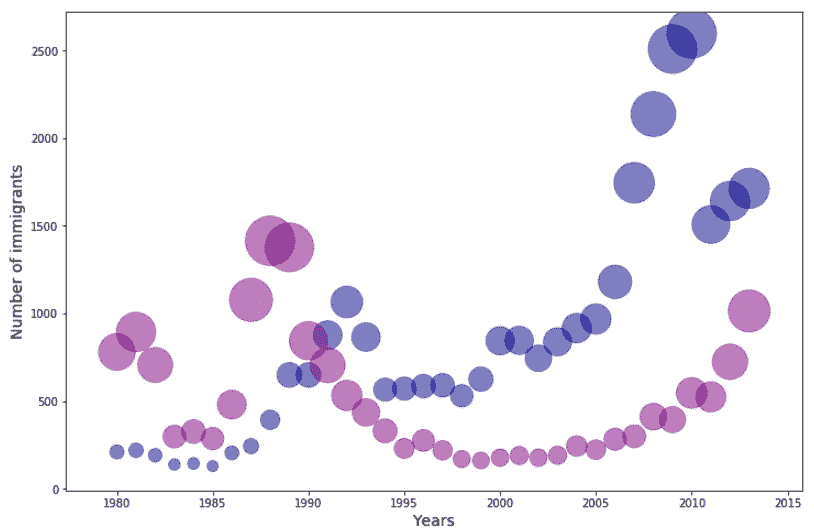
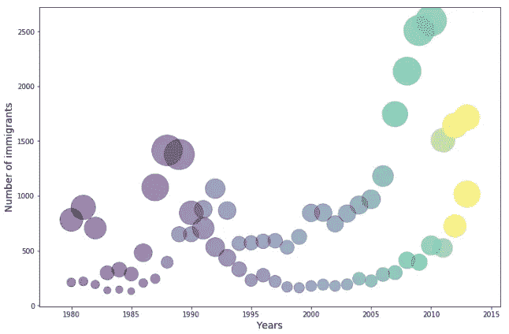
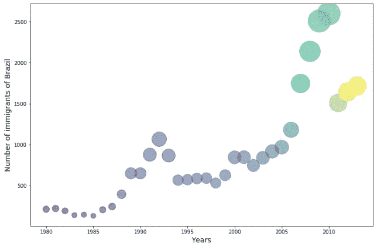

# Matplotlib 中的气泡图

> 原文：<https://towardsdatascience.com/bubble-plots-in-matplotlib-3f0b3927d8f9?source=collection_archive---------8----------------------->

## 通过使用 Python 的 Matplotlib 库的例子学习绘制气泡图

气泡图是散点图的改进版本。在散点图中，有两个维度 x 和 y。在气泡图中，有三个维度 x、y 和 z。其中第三个维度 z 表示权重。这样，气泡图比二维散点图在视觉上提供了更多的信息。

## 数据准备

对于本教程，我将使用包含加拿大移民信息的数据集。它有 1980 年至 2013 年的数据，包括来自 195 个国家的移民人数。导入必要的包和数据集:

```
import numpy as np  
import pandas as pd 
df = pd.read_excel('[https://s3-api.us-geo.objectstorage.softlayer.net/cf-courses-data/CognitiveClass/DV0101EN/labs/Data_Files/Canada.xlsx'](https://s3-api.us-geo.objectstorage.softlayer.net/cf-courses-data/CognitiveClass/DV0101EN/labs/Data_Files/Canada.xlsx'),
                       sheet_name='Canada by Citizenship',
                       skiprows=range(20),
                       skipfooter=2)
```

数据集太大。所以，我不能在这里显示截图。让我们看看列的名称。

```
df.columns#Output:
Index([    'Type', 'Coverage',   'OdName',     'AREA', 'AreaName',      'REG',
        'RegName',      'DEV',  'DevName',       1980,       1981,       1982,
             1983,       1984,       1985,       1986,       1987,       1988,
             1989,       1990,       1991,       1992,       1993,       1994,
             1995,       1996,       1997,       1998,       1999,       2000,
             2001,       2002,       2003,       2004,       2005,       2006,
             2007,       2008,       2009,       2010,       2011,       2012,
             2013],
      dtype='object')
```

我们不会用到很多列。我只是删除了这些列，并将国家的名称(' OdName ')设置为索引。

```
df = df.drop(columns = ['Type', 'Coverage', 'AREA', 'AreaName',      'REG', 'RegName', 'DEV', 'DevName',]).set_index('OdName')
df.head()
```



这个练习我选择了爱尔兰和巴西的数据。没有什么特别的原因。我随机选择了他们。

```
Ireland = df.loc['Ireland']
Brazil = df.loc['Brazil']
```

## 标准化数据

有几种不同的方法来标准化数据。我们将数据标准化，使数据处于相似的范围内。爱尔兰和巴西移民数据的范围不同。我需要把它们带到从 0 到 1 的范围。我只是用爱尔兰数据除以爱尔兰数据系列的最大值。我对巴西的数据序列做了同样的处理。

```
i_normal = Ireland / Ireland.max()
b_normal = Brazil / Brazil.max()
```

我们将绘制爱尔兰和巴西的数据。把这些年列在清单上会很有用。

```
years = list(range(1980, 2014))
```

## 制作气泡图

为了看出区别，我们先画散点图。

```
import matplotlib.pyplot as plt
plt.figure(figsize=(14, 8))
plt.scatter(years, Ireland, color='blue')
plt.scatter(years, Brazil, color='orange')
plt.xlabel("Years", size=14)
plt.ylabel("Number of immigrants", size=14)
plt.show()
```



现在，画出气泡图。我们必须输入我们之前定义的大小。

```
plt.figure(figsize=(12, 8))
plt.scatter(years, Brazil, 
                  color='darkblue', 
                 alpha=0.5,
                 s = b_normal * 2000)plt.scatter(years, Ireland, 
                  color='purple', 
                 alpha=0.5,
                 s = i_normal * 2000,
                 )
plt.xlabel("Years", size=14)
plt.ylabel("Number of immigrants", size=14)
```



我们可以通过气泡的大小来了解移民的数量。泡沫越小，移民人数越少。

我们也可以把这块地做成彩色的。为了使它更有意义，我们需要对数据序列进行排序。你很快就会明白原因。

```
c_br = sorted(Brazil)
c_fr = sorted(France)
```

现在我们将传递这些值来改变颜色。

```
plt.figure(figsize=(12, 8))
plt.scatter(years, Brazil, 
                  c=c_br,
                 alpha=0.5,
                 s = b_normal * 2000)plt.scatter(years, Ireland, 
                  c=c_fr,
                 alpha=0.5,
                 s = i_normal * 2000,
                 )
plt.xlabel("Years", size=14)
plt.ylabel("Number of immigrants", size=14)
```



现在我们增加了另一个维度，颜色。颜色随着移民的数量而变化。但是当我们画两个变量的时候，就没那么好了。因为在这个过程中，我们没有明确地定义单个变量的颜色。但是当我们在 y 轴上画一个变量时，它做得很好。让我们画出每年来自巴西的移民人数，看看这些年的趋势。

```
plt.figure(figsize=(12, 8))
plt.scatter(years, Brazil, 
                  c=c_br,
                 alpha=0.5,
                 s = b_normal * 2000)
plt.xlabel("Years", size=14)
plt.ylabel("Number of immigrants of Brazil", size=14)
```



我敢肯定，你可以在这里非常清楚地看到颜色随着移民数量的变化。

这就是 Matplotlib 中的气泡图。我希望它有帮助。

这是另一个很酷的可视化教程:

[](/waffle-charts-using-pythons-matplotlib-94252689a701) [## 使用 Python 的 Matplotlib 的华夫饼图表

### 如何使用 Matplotlib 库在 Python 中绘制华夫饼图表

towardsdatascience.com](/waffle-charts-using-pythons-matplotlib-94252689a701) 

推荐阅读:

[Matplotlib 中的基本绘图:Python 中的可视化](/basic-plots-in-matplotlib-visualization-in-python-13013c9e4ee4)

[用 Python 中的单变量和多变量图表和绘图理解数据](/understand-the-data-with-univariate-and-multivariate-charts-and-plots-in-python-3b9fcd68cd8)

[如何在 Python 中呈现多个变量之间的关系](/how-to-present-the-relationships-amongst-multiple-variables-in-python-fa1bdd4f368c)

[Numpy 中 1D、2D 和 3D 数组的索引和切片](/indexing-and-slicing-of-1d-2d-and-3d-arrays-in-numpy-e731afff0bbe)

[熊猫数据透视表数据分析](https://medium.com/swlh/data-analysis-with-pivot-table-in-pandas-ac0b944cd7bc)

[用于数据建模的探索性数据分析](/exploratory-data-analysis-intro-for-data-modeling-8ff019362371)