# 用于边界框注释的预算自动化

> 原文：<https://towardsdatascience.com/budget-automation-for-bounding-box-annotation-500a76b4deb7?source=collection_archive---------31----------------------->

## [实践教程](https://towardsdatascience.com/tagged/hands-on-tutorials)

## 了解如何使用 TensorFlow.js 加速数据注记

# 介绍👋

[最初发布于 bitsy.ai](https://www.bitsy.ai/automate-bounding-box-annotation-with-tensorflow-and-automl/)

数据收集和准备是每个机器学习应用的基础。你以前听说过:“垃圾输入，垃圾输出”，指的是算法纠正不准确、质量差或有偏见的输入数据的能力有限。

高质量标注数据的成本促使工具/平台的家庭工业加速数据标注过程。除了 SaaS/本地创业生态系统，每个主要的云提供商(AWS、微软、谷歌)在过去两年都推出了自动化数据标签产品。可以理解的是，开发这些服务时通常会考虑到高级/企业用户、功能和价位。

## 在有限的预算下，我是不是只能手工给*的所有东西*贴标签？

好消息。稍加努力，你就可以为你自己或一个小团队自动化边界框注释。在这篇博文中，我将向您展示我用来快速原型化 3D 打印故障检测模型的自动化技术。

您将学习如何:

1.  为人类贴标机创建详细的说明
2.  训练制导模型
3.  使用 [Microsoft VoTT](https://github.com/microsoft/VoTT) (可视对象标记工具)和 TensorFlow.js 自动标注边界框

图为:自定义 TensorFlow 模型在微软 VoTT(可视对象标记工具)中自动标注一个视频帧。

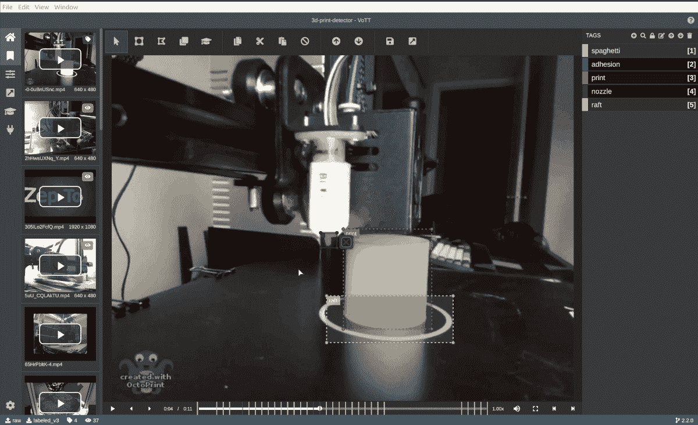

自定义张量流模型在 Microsoft VoTT(可视对象标记工具)中自动注释视频帧。图片作者。

# 第一遍注释🏷

如果您是从没有标签的地方开始，您确实需要硬着头皮手工注释一些数据。为注释决策创建书面指南和评估标准，需要手动标记至少几百个示例。

## 从源代码安装 VoTT(视觉对象跟踪工具)

Microsoft VoTT 是一个开源工具，用于用边界框(对象检测)和多边形(分割)来注释图像和视频。我使用 VoTT 是因为它:

*   支持多种导出格式
*   可以作为 web 应用程序托管
*   让我从 TensorFlow.js 模型预填充边界框建议

安装先决条件:

*   NodeJS (>= 10.x)和 NPM。我推荐 [NVM](https://github.com/nvm-sh/nvm) (节点版本管理器)来管理 NodeJS 安装和环境。

克隆 VoTT repo 并从源安装:

```
$ git clone https://github.com/microsoft/VoTT 
$ cd VoTT 
$ npm ci 
$ npm i @tensorflow/tfjs@2.7.0 
$ npm start
```

要使用较新的 ops，必须升级 TensorFlow.js 包。

参考[使用 VoTT](https://github.com/microsoft/VoTT#using-vott) 创建新项目并设置数据连接。

寻找数据集？[试试谷歌的数据集搜索](https://datasetsearch.research.google.com)。

## 手动标记一些示例

您需要手动标记的图像数量取决于问题领域，从几十个图像到几千个图像。我通过以下方式为我的问题(检测 3D 打印缺陷)获得了合理的结果:

*   5 个标签(分布如下)
*   67 个打印延时视频，每秒采样 3 帧
*   浏览了 6 248 张图片
*   在 3，215 幅图像上绘制了 9，004 个边界框，平均每幅图像 3 个边界框。
*   八小时，分几天完成。我在没有早晨通勤的情况下赶上了我一直忽略的播客。

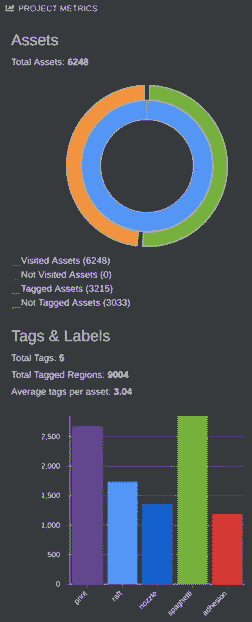

VoTT(视觉对象跟踪工具)提供的数据集统计。图片作者。

## 编写注释指南

当这个任务还历历在目时，花点时间写下清晰的指南(如下例),以保持标签的一致性，并涵盖常见的边缘情况。请随意使用我的指示作为你自己的模板。

# 边界框注释指南

## 概念

2-3 句话介绍任务/概念

*该数据集包含失败的 3D 打印作业的延时视频。图像是按时间顺序排列的。您的任务是在所有可识别的像素周围画出紧密的方框，以匹配打印缺陷或对象。*

## 标签

id、文本名称、标签和边缘案例的书面描述、正面和负面示例

*   标签应该从 0 还是 1 开始？
*   0 是否为背景/未知类保留？

## 0 背景

## 1 个喷嘴

打印喷嘴是一个金属物体，它挤出热丝。

如果喷嘴被部分遮挡，围绕整个对象(包括遮挡的像素)绘制一个边界框。

如果喷嘴完全堵塞，不要贴标签。

## 2 个木筏

“筏”是围绕印刷品前几层的薄轮廓。

如果筏子被部分遮挡(通常被印迹遮挡)，在整个筏子周围画一个边界框。

## 3 打印

正在打印的对象。如果要打印多个对象或多个部分，请在每个不同的对象周围画一个边框。

## 4 附着力

…

## 5 根意大利面条

…

## 指导方针

*   输入格式
*   标签格式
*   每帧 1 个还是多个对象？
*   每个对象“实例”有 1 个还是多个盒子？
*   盒子是紧的还是松的？
*   标签反射(镜子，水)？

## 用 AutoML 训练制导模型🤖

AutoML(自动机器学习)是一种属于“强力”算法类别的技术。基于云的 AutoML 平台是一个很好的工具，用来验证你的问题*可以*和*应该*用机器学习来解决。

即使你计划训练一个模型，也要考虑先把 AutoML 模型放在客户面前。尽早收集客户反馈，并将这些信息整合到定制模型的开发中。一些见解的例子…

*   客户对误报不敏感(通过短信报告缺陷，但打印没问题)。
*   大多数客户喜欢印刷进度的可视化更新，即使检测机不正确。
*   令人惊讶的是，一些客户报告的假阳性引起了安全感。

我使用了[谷歌云自动视觉](https://cloud.google.com/vision/automl/object-detection/docs) Edge(物体检测)，我选择它是因为:

*   [S](https://cloud.google.com/vision/automl/object-detection/docs/edge-quickstart) 支持模型导出到 TensorFlow Lite、TensorFlow.js 和 ops，兼容 Edge TPU、ARM 和 NVIDIA 硬件加速。
*   披露:我是一名[谷歌开发专家](https://developers.google.com/community/experts)🤓

## 从 VoTT 导出数据集

在项目的导出设置中，选择 CSV 提供程序。选中“包括图像”，保存配置，然后导出数据。如果您要导出数千幅图像，这将需要几分钟时间。休息一下！

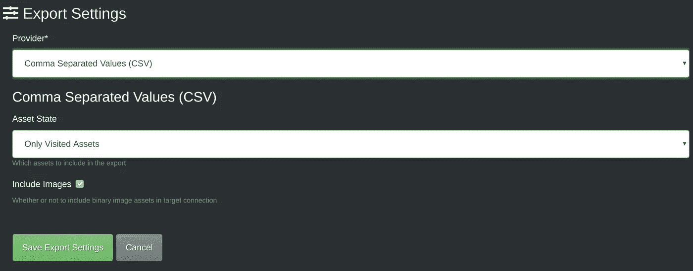

VoTT 导出设置。图片作者。

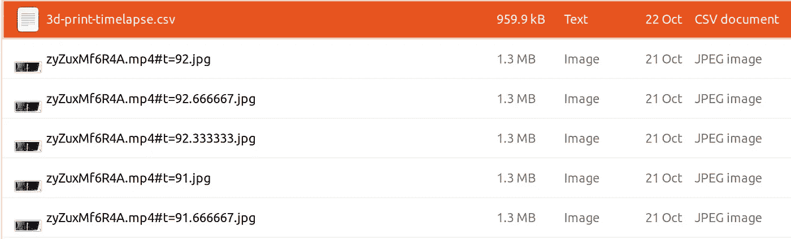

从 VoTT 导出的文件。图片作者。

## 检查和预处理数据

如果提供了两个顶点，AutoML Vision 需要以下格式的 CSV 数据:

`SET,gs://path/to/img,label,x_min,y_min,,,x_max,y_max`

坐标必须是相对于图像尺寸的**，落在范围【0，1】内。**

[Github Gist](https://gist.github.com/leigh-johnson/293f3380f15c496934e2846ec7f9ad16) 中提供的代码

```
import pandas as pd

# load VoTT CSV export
# notice: coordinates are absolute
df = pd.read_csv('/path/to/vott-csv-export/{project name}-export.csv')
df.head()
```

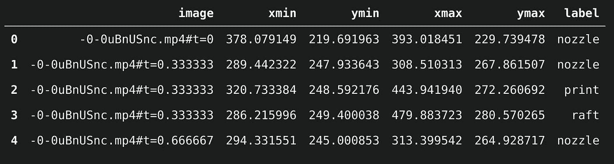

图片作者。

```
import cv2

base_path = '/path/to/vott-csv-export/'

LOG_INTERVAL=2000

# convert absolute coordinates to relative coordinates in [0, 1] range
for index, row in df.iterrows():
    if index % LOG_INTERVAL == 0:
        print(f'finished {index} / {len(df)}')
    filename = row['image_path'].split('/')[-1]
    img = cv2.imread(f'{base_path}{filename}')
    height, width, channels = img.shape
    df.at[index, 'x1_n'] = row['x1'] / width
    df.at[index, 'x2_n']= row['x2'] / width  
    df.at[index, 'y1_n'] = row['y1'] / height
    df.at[index, 'y2_n'] = row['y2'] / height

# replace relative image paths with a Google Storage bucket path
df['set'] = 'UNASSIGNED'
df['gs_path'] = df['image'] + 'gs://bucket-name/path/to/upload'

# write CSV with columns expected by AutoML Vision
# the "none" columns are required for boxes defined by 2 vertices
df['none'] = ''
df.to_csv('/home/leigh/datasets/spaghetti/labeled/vott-csv-export/spaghetti_v1-normalized-export.csv', 
    columns=['set', 'image_path', 'label', 'x1_n', 'y1_n', 'none', 'none', 'x2_n', 'y2_n', 'none', 'none'],
    index=False
    )
```

有关更多信息，请参考[准备您的培训数据](https://cloud.google.com/vision/automl/object-detection/docs/prepare)。

## 上传数据

将数据上传到谷歌云存储桶。**注意:**如果您正在创建一个新的时段，AutoML Vision exports 在后面的步骤中要求目标时段在 us-central-1 地区。

*   新来 GCP 吗？在开始设置项目和认证之前，遵循[中的步骤。](https://cloud.google.com/vision/automl/docs/edge-quickstart#before_you_begin)
*   [安装 gsutil](https://cloud.google.com/storage/docs/gsutil)
*   `gsutil rsync -r /path/to/vott-csv-export gs://your-bucket-name/vott-csv-export/`

## 将数据导入 AutoML Vision

*   在 GCP 的控制台中打开 [AutoML 视觉数据集浏览器](https://console.cloud.google.com/vision/datasets)。
*   创建新的数据集。在导入选项卡中，从存储桶中选择您的 CSV 文件。

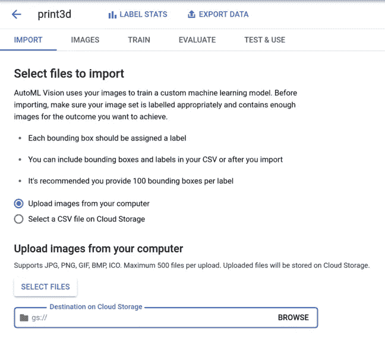

图片作者。

数据导入时休息一下！👏

在训练之前，对导入的数据进行全面检查，并验证标签是否正确。


3D 打印的“筏”是一次性的支撑结构。图片作者。

## 火车模型

AutoML 的价格体系是基于**节点小时，**与“挂钟”或运行时间不同。我的一个批评是，提前为培训工作定价需要一些额外的努力。

[AutoML Vision 定价](https://cloud.google.com/vision/automl/pricing?_ga=2.231171871.-1460275601.1603318024#free-trial)(美元价格如下所示)因功能而异，不同的定价表适用于:

*   云托管分类和对象检测—3.15 美元/节点小时，75.6 美元/ 24 小时
*   边缘(分类)-4.95 美元/节点小时，118.80 美元/ 24 小时
*   边缘(物体检测)——18.00 美元/节点小时，432 美元/ 24 小时

如果这些价格超出了您项目的预算，我将在未来的帖子中介绍我如何使用 [TensorFlow 的对象检测 API](https://github.com/tensorflow/models/tree/master/research/object_detection) 训练模型。关注或[订阅我的简讯](https://www.bitsy.ai/)以获得出版通知。

对于这个特殊的问题(检测 3D 打印缺陷)，我看到了使用我的数据集大小的推荐训练时间(24 节点小时)的合理结果。深入到单个标签，“喷嘴”检测的表现明显比其他标签差。

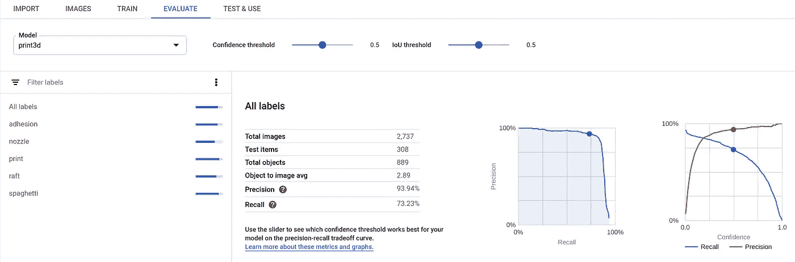

所有标签的指标。图片作者。

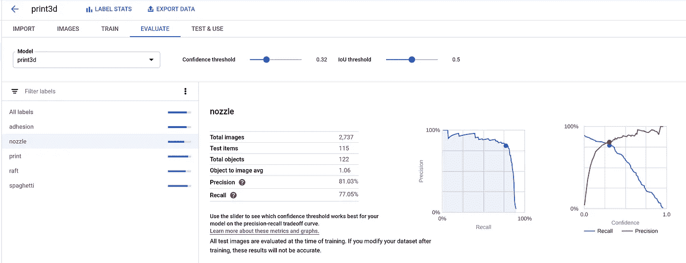

“喷嘴”标签的指标。图片作者。

左:所有标签的精度/召回曲线。右图:“喷嘴”的精度/召回曲线

经过更仔细的检查，我发现高的假阳性率显著影响了模型的精度分数。精度是*真阳性/(真阳性+假阳性)之和。我很兴奋地发现了一些例子，在这些例子中，我没有在地面真实数据中标注喷嘴。*

🤯即使我在第一次贴标签的过程中变得草率，指导模型已经足够好来捕捉这些错误。哇！如果我不得不手动标记这些数据的整体，它将充满错误。

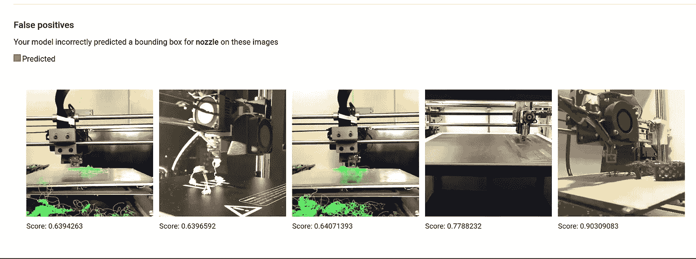

我的模型自信地在这些图像中检测到“喷嘴”物体，由于人为错误标记地面真实数据，这些物体被评为“假阳性”。图片作者。

## 使用 TensorFlow.js 自动标注 VoTT🤖

下一节将向您展示如何使用自定义 TensorFlow.js 模型来建议具有 VoTT“主动学习”功能的边界框。

“主动学习”使用 TensorFlow.js 模型在帧上执行推理，应用非最大抑制，并为每个检测到的对象绘制最佳框建议。

## 导出 TensorFlow.js 模型

模型训练完成后，您可以在“测试和使用”选项卡中导出 TensorFlow.js 包。该模型将导出到一个存储桶中(目标桶必须在美国中部-1 地区)。

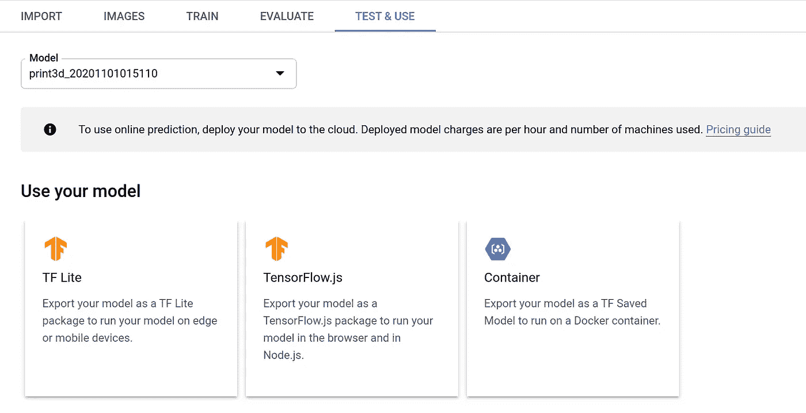

谷歌云自动视觉边缘导出。图片作者。

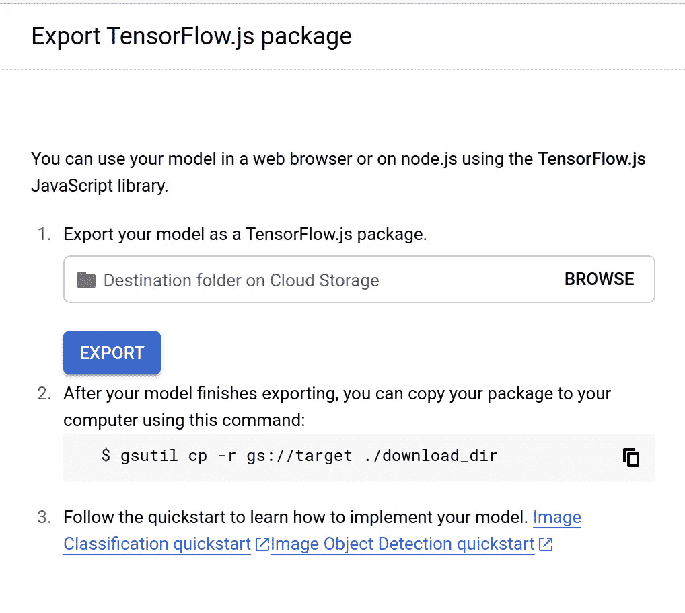

谷歌云自动视觉边缘导出。图片作者。

## 创建 classes.json 文件

我手动修复了这个。AutoML Vision Edge 导出新行分隔的标签文件。VoTT 要求的格式如下。标签索引必须从 1！

```
[{"id":1,"displayName":"nozzle"}, ... ]
```

## 修补 VoTT 以修复 TensorFlow 1.x -> 2.x 错误

VoTT 自带@tensorflow/tfjs 的 v1。AutoML Vision Edge 模型使用需要更新版本的操作系统(如 AddV2)。我用以下补丁修复了几个小问题:

*   模型需要 float32 输入
*   使用较新的 TF . image . nonmaxsupressionasync()fn

```
diff --git a/src/providers/activeLearning/objectDetection.ts b/src/providers/activeLearning/objectDetection.ts
index 196db45..a8dff06 100755
--- a/src/providers/activeLearning/objectDetection.ts
+++ b/src/providers/activeLearning/objectDetection.ts
@@ -151,6 +151,8 @@ export class ObjectDetection {
         const batched = tf.tidy(() => {
             if (!(img instanceof tf.Tensor)) {
                 img = tf.browser.fromPixels(img);
+                // model requires float32 input
+                img = tf.cast(img, 'float32');
             }
             // Reshape to a single-element batch so we can pass it to executeAsync.
             return img.expandDims(0);
@@ -166,7 +168,8 @@ export class ObjectDetection {
         const result = await this.model.executeAsync(batched) as tf.Tensor[];

         const scores = result[0].dataSync() as Float32Array;
-        const boxes = result[1].dataSync() as Float32Array;
+        // tf.image.nonMaxSepressionAsync() expects tf.Tensor as input
+        const boxes = result[1].dataSync()

         // clean the webgl tensors
         batched.dispose();
@@ -177,10 +180,8 @@ export class ObjectDetection {
         const prevBackend = tf.getBackend();
         // run post process in cpu
         tf.setBackend("cpu");
-        const indexTensor = tf.tidy(() => {
-            const boxes2 = tf.tensor2d(boxes, [result[1].shape[1], result[1].shape[3]]);
-            return tf.image.nonMaxSuppression(boxes2, maxScores, maxNumBoxes, 0.5, 0.5);
-        });
+        const boxes2d = tf.tensor2d(boxes, [result[1].shape[0], result[1].shape[1]]);
+        const indexTensor = await tf.image.nonMaxSuppressionAsync(boxes2d, maxScores, maxNumBoxes, 0.5, 0.5);

         const indexes = indexTensor.dataSync() as Float32Array;
         indexTensor.dispose();
@@ -188,7 +189,9 @@ export class ObjectDetection {
         // restore previous backend
         tf.setBackend(prevBackend);

-        return this.buildDetectedObjects(width, height, boxes, maxScores, indexes, classes);
+        // _.buildDetectedObjects expects Float32Array input
+        const fboxes = boxes as Float32Array
+        return this.buildDetectedObjects(width, height, fboxes, maxScores, indexes, classes);
     }
```

## 自动包围盒建议✨

*   修补 VoTT 后运行`npm start`
*   在“主动学习”选项卡中，配置“模型路径”以指向您的 TensorFlow.js 导出。我建议启用“自动检测”功能，否则你必须手动按 ctrl/cmd+d 来对每一帧执行检测。

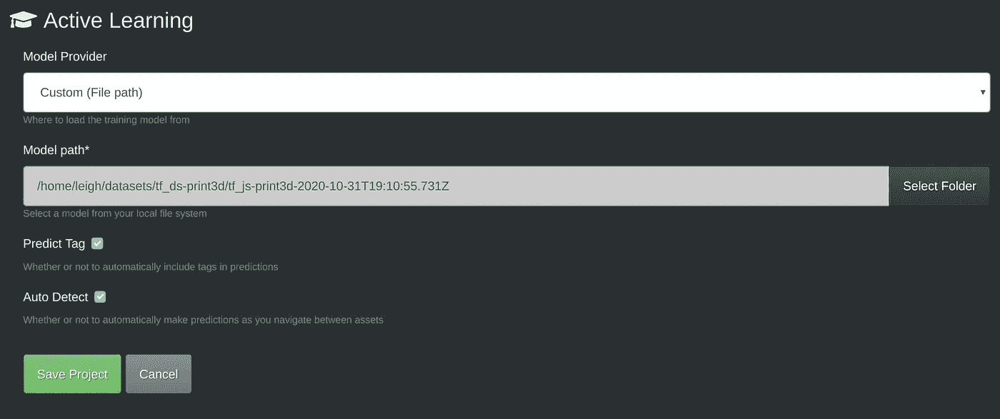

微软 VoTT 主动学习配置。图片作者。

## 包扎

您刚刚学习了如何将几个小时和几百美元用于自动边界框注释工作流。作为一个额外的奖励，指导模型可以适用于原型甚至是初始生产运行。我希望这能为你的下一个物体探测项目节省一点时间/精力！

与其他云产品相比，AutoML 产品价格昂贵——但它们远不如从零开始开发一个可比较的模型或甚至使用重量转移学习这样的资源密集型产品*或*。

你目前正在使用物体探测器解决问题吗？请在下面的评论中告诉我更多关于你的理念和方法。

订阅我的时事通讯@ [bitsy.ai](https://www.bitsy.ai/) 获取更多关于 Raspberry Pi、Arduino 和其他小型设备的 ML 应用的技巧、教程和详细文章。我目前正在为 [Octoprint](https://octoprint.org/) 打造一个隐私优先的 3D 打印监控插件。