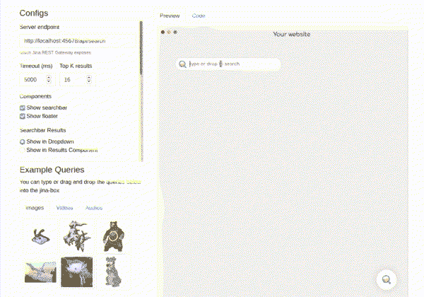
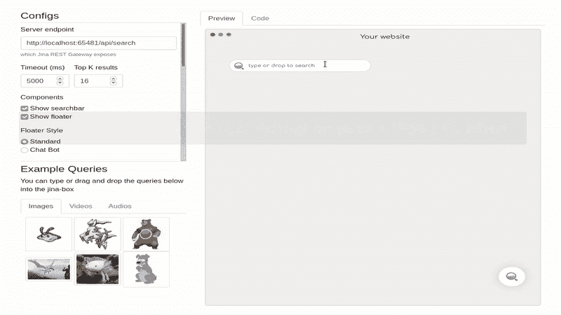
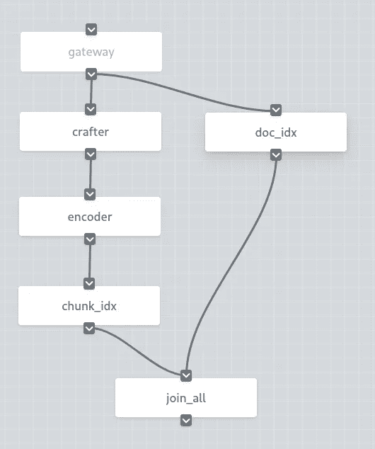
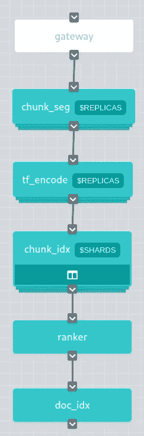

# 为《星际迷航》建立一个基于 BERT 的语义搜索系统

> 原文：<https://towardsdatascience.com/build-a-bert-based-semantic-search-system-for-star-trek-7d7d28414cd8?source=collection_archive---------20----------------------->

## 使用人工智能大胆搜索，就像以前没有人搜索过的那样，所有这些都在 30 分钟内完成，并且只需几行代码


改编自[维基共享资源](https://commons.wikimedia.org/wiki/File:U.S.S._Enterprise_NCC_1701-D.jpg)

如果你读了我的[上一篇关于走向数据科学](/gpt-3-is-the-future-but-what-can-nlp-do-in-the-present-7aae3f21e8ed)的文章，你会知道我是一个有点星际迷航的书呆子。只有一件事比《星际迷航》更让我喜欢，那就是用人工智能建造很酷的新东西。所以我想我应该再一次把这两者结合起来！

在本教程中，我们将构建自己的搜索引擎来搜索《星际迷航:下一代》中的所有内容。我们将使用[纪娜](https://github.com/jina-ai/jina/)，这是一个神经搜索框架，它使用深度学习来支持我们的 NLP 搜索，尽管如果我们想的话，我们可以很容易地将其用于图像、音频或视频搜索。

我们将涵盖:

*   基本设置
*   运行我们的应用程序的演示(是的，甚至在我们编码之前)
*   使用 cookiecutter 创建项目和样板代码
*   下载我们的星际迷航数据集
*   加载、索引和搜索我们的数据集
*   深入了解幕后
*   如果事情出错了该怎么办

如果你是人工智能或搜索的新手，不要担心。只要你对 Python 和命令行有所了解，你就没问题了。如果有帮助的话，把自己想象成少校数据科学。


通过 [Giphy](https://giphy.com/gifs/reaction-229P3dnAW8RzceKbps)

# 尝试一下

在经历下载、配置和测试搜索引擎的麻烦之前，让我们先了解一下最终产品。在这种情况下，它与我们正在构建的内容完全相同，但使用了《南方公园》中的台词，而不是《星际迷航》:



通过 [Jinabox](https://github.com/jina-ai/jinabox.js/)

纪娜有一个预建的 Docker 图像，带有来自南方公园的索引数据。您可以使用以下命令运行它:

```
docker run -p 45678:45678 jinaai/hub.app.distilbert-southpark
```

在 Docker 启动并运行后，您可以开始搜索那些南方公园线。

## 用 Jinabox 查询

Jinabox 是一个简单的基于网络的神经搜索前端。您可以在本教程顶部的图形中看到它。

1.  在浏览器中转至 [jinabox](https://jina.ai/jinabox.js)
2.  确保您将服务器端点设置为`[http://localhost:45678/api/search](http://localhost:45678/api/search)`
3.  在搜索栏中键入一个短语，然后查看出现了哪些南方公园线路

**注意:**如果第一次超时，那是因为查询系统还在预热。几秒钟后重试！

## 用`curl`查询

或者，您可以打开您的 shell 并通过 RESTful API 检查结果。匹配结果存储在`topkResults`中。

```
curl --request POST -d '{"top_k": 10, "mode": "search", "data": ["text:hey, dude"]}' -H 'Content-Type: application/json' 'http://0.0.0.0:45678/api/search'
```

您将看到 JSON 格式的结果输出。每个结果看起来像:

现在回到运行 Docker 的终端，点击几次`Ctrl-C`(或者 Mac 上的`Command-C`)以确保你已经停止了一切。

# 交战！

现在你已经知道我们在构建什么了，让我们开始吧！

您将需要:

*   Python 的基础知识
*   安装了 Python 3.7 或更高版本，以及`pip`
*   Mac 或 Linux 电脑(纪娜目前不支持 Windows)
*   8gb 或更多的 RAM

## 克隆回购

让我们准备好行动所需的基本文件:

```
git clone git@github.com:alexcg1/my-first-jina-app.git 
cd my-first-jina-app
```

## 运行 Cookiecutter


通过 [Giphy](https://giphy.com/gifs/sesame-street-cookies-cookie-monster-HGe4zsOVo7Jvy)

```
pip install -U cookiecutter
cookiecutter gh:jina-ai/cookiecutter-jina
```

我们使用 cookiecutter 创建一个基本的纪娜应用程序，让你不必做大量的输入和设置工作。

对于我们的 Star Trek 示例，使用以下设置:

*   `project_name` : `Star Trek`
*   `project_slug` : `star_trek`(默认值)
*   `task_type` : `nlp`
*   `index_type` : `strings`
*   `public_port` : `65481`(默认值)

对所有其他字段使用默认值即可。cookiecutter 完成后，让我们看看它创建的文件:

```
cd star_trek
ls
```

您应该会看到一堆文件:

*   `app.py`——主 Python 脚本，您在其中初始化并将数据传递到您的流中
*   `Dockerfile` -让你启动一个 Docker 实例来运行你的应用
*   `flows/` -保存流程的文件夹
*   `pods/` -夹住你的豆荚的文件夹
*   `README.md` -自动生成的自述文件
*   `requirements.txt` -所需 Python 包的列表

在`flows/`文件夹中，我们可以看到`index.yml`和`query.yml`——它们定义了你的应用程序的索引和查询流程。

在`pods/`中，我们看到`chunk.yml`、`craft.yml`、`doc.yml`和`encode.yml`——这些 pod 是从流程中调用的，用于处理索引或查询数据。

稍后会有更多关于流量和 pod 的内容！

## 安装要求

在您的终端中运行以下命令，下载并安装所有必需的 Python 包:

```
pip install -r requirements.txt
```

## 下载数据集

我们的目标是当用户查询一个短语时，找出《星际迷航》中谁说了什么。来自 Kaggle 的[星际迷航数据集](https://www.kaggle.com/gjbroughton/start-trek-scripts)包含了从*星际迷航:原系列*一直到*星际迷航:企业号*的所有剧本和个别角色台词。

我们在这个例子中只是使用了一个子集，包含了《星际迷航:下一代》中的角色和台词。这也已经从 JSON 转换为 CSV 格式，这更适合纪娜处理。

现在，让我们确保我们回到了基本文件夹，并通过运行以下命令下载数据集:

下载完成后，让我们回到`star_trek`目录，确保我们的数据集拥有我们想要的一切:

```
cd star_trek
head data/startrek_tng.csv
```

您应该看到由字符(如`MCCOY`)、分隔符(`!`)和字符说出的行(`What about my age?`)组成的输出:

```
BAILIFF!The prisoners will all stand.
BAILIFF!All present, stand and make respectful attention to honouredJudge.
BAILIFF!Before this gracious court now appear these prisoners to answer for the multiple and grievous savageries of their species. How plead you, criminal? 
BAILIFF!Criminals keep silence!
BAILIFF!You will answer the charges, criminals. 
BAILIFF!Criminal, you will read the charges to the court.
BAILIFF!All present, respectfully stand. Q
BAILIFF!This honourable court is adjourned. Stand respectfully. Q MCCOY!Hold it right there, boy.
MCCOY!What about my age?
```

注意:你的角色台词可能会有点不同。没关系！

## 加载数据

现在我们需要将`startrek_tng.csv`传递给`app.py`，这样我们就可以索引它。`app.py`开箱即用有点太简单了，所以我们来做些改动:

在编辑器中打开`app.py`并检查`index`功能，我们目前有:

如您所见，这仅索引了 3 个字符串。让我们用`filepath`参数加载我们的 Star Trek 文件。只需替换函数的最后一行:

## 索引更少的文档

当我们在这里时，让我们减少我们索引的文档数量，只是为了在我们测试时加快速度。我们不想花费大量的时间来索引，只是为了以后有问题！

在`config`功能上方的部分，让我们更改:

收件人:

这将使我们的测试速度提高 100 倍！一旦我们确认一切正常，我们就可以将它设置回`50000`来索引更多的数据集。

现在我们已经有了加载数据的代码，我们将开始编写我们的应用程序并运行我们的流程！流是我们的应用程序执行的不同任务，如索引或搜索数据。

# 索引

首先，我们需要为我们的文件建立一个索引。稍后使用查询流时，我们将搜索这个索引。

```
python app.py index
```

您的应用程序将在终端中显示大量输出，但是当您看到以下行时，您将知道它已经完成:

```
Flow@133216[S]:flow is closed and all resources should be released already, current build level is 0
```

第一次可能要花一点时间，因为纪娜需要下载语言模型和标记器来处理数据。你可以认为这些是支持搜索的神经网络背后的大脑。

# 搜索

要启动搜索模式运行:

```
python app.py search
```

过一会儿，您应该会看到终端停止滚动，并显示如下输出:

```
Flow@85144[S]:flow is started at 0.0.0.0:65481, you can now use client to send request!
```

⚠️一定要记下端口号。我们需要它来制作`curl`和 jinabox！在我们的例子中，我们假设它是`65481`，我们在下面的例子中使用它。如果您的端口号不同，请确保使用该端口号。

ℹ️ `python app.py search`不会弹出搜索界面——为此你需要通过`curl`、Jinabox 或另一个客户端进行连接。

## 用 Jinabox 搜索



Via [Jinabox](https://github.com/jina-ai/jinabox.js/)

1.  在浏览器中转到 [jinabox](https://jina.ai/jinabox.js)
2.  确保您将服务器端点设置为`[http://localhost:65481/api/search](http://localhost:65481/api/search)`
3.  在搜索栏中键入一个短语，看看会出现哪些星际迷航的台词

## 用 curl 搜索

```
curl --request POST -d '{"top_k": 10, "mode": "search", "data": ["text:picard to riker"]}' -H 'Content-Type: application/json' 'http://0.0.0.0:65481/api/search'
```

`curl`将会以 JSON 格式给出大量*信息——不仅仅是您正在搜索的行，还有关于搜索及其返回的行的各种元数据。查找以`"matchDoc"`开头的行以找到匹配项，例如:*

恭喜你！你刚刚建立了你自己的搜索引擎！

# 它实际上是如何工作的？

要更全面地了解什么是神经搜索以及它是如何工作的，请查看我以前的文章。纪娜本身只是构建神经搜索引擎的一种方式，它有几个重要的概念:**flow**和 **Pods** :

*   这个流程告诉纪娜要对数据集执行什么任务，比如索引或搜索。每个流都是由单独的豆荚构成的。
*   这些豆荚组成了流程，并告诉纪娜*如何*一步一步地执行每项任务，比如将文本分成块、索引等等。它们定义了我们在神经搜索中使用的实际神经网络，即像`distilbert-base-cased`这样的语言模型。(我们可以在`pods/encode.yml`中看到)

## 流


途经[纪娜 101](https://github.com/jina-ai/jina/tree/master/docs/chapters/101)

就像植物管理其分支的营养流和生长率一样，流管理一组豆荚的状态和环境，协调它们完成一项任务。无论一个 Pod 是远程的还是在 Docker 中运行的，一个流都控制着它们！

我们在`app.py`中定义流来索引和查询我们的 Star Trek 数据集中的内容。

在这种情况下，我们的流以 YAML 格式编写，并加载到`app.py`中:

真的就这么简单！或者，您可以在`app.py`本身[中构建流，而无需在 YAML](https://docs.jina.ai/chapters/flow/index.html) 中指定它们。

无论你处理的是文本、图形、声音还是视频，所有的数据集都需要被索引和查询，而且做每一件事的步骤(分块、矢量编码)或多或少都是相同的(即使你执行每一步的*方式*不同——这就是 pod 的用武之地！)

## 索引

每一股水流都有井，有流向它。不同的 Pod 沿着流程传递数据，一个 Pod 的输出成为另一个 Pod 的输入。以我们的索引流程为例:



通过[纪娜仪表盘](https://github.com/jina-ai/dashboard)

如果你看一下`startrek_tng.csv`，你会发现它只是一个大的文本文件。我们的能量流将它加工成更适合纪娜的东西，由能量流中的圆荚体来处理。每个吊舱执行不同的任务。

您可以在`flows/index.yml`中看到以下窗格:

*   `crafter` -将文档分割成块
*   `encoder` -将每个块编码成一个向量
*   `chunk_idx` -建立组块索引
*   `doc_idx` -存储文档内容
*   `join_all` -加入`chunk_idx`和`doc_idx`路径

完整的文件实际上只是一个包含参数和一些设置的 pod 列表，位于文件的顶部:

幸运的是，YAML 是相当可读的。我经常感谢[银河大鸟](https://memory-alpha.fandom.com/wiki/Great_bird_of_the_galaxy)它不是克林贡语，或者更糟，XML！

*   前几行初始化流并启用日志服务器(我们在本教程中不使用)。
*   之后，我们可以看到 pod 列表，它们有自己的 YAML 路径和传递给每个 pod 的额外参数。

这是所有的豆荚吗？不完全是！我们总是有另一个舱在安静地工作——`gateway`舱。大多数时候我们可以安全地忽略它，因为它基本上为流程做了所有肮脏的编排工作。

## 搜索



经由[纪娜仪表盘](https://github.com/jina-ai/dashboard)

在查询流中，我们有以下窗格:

*   `chunk_seg` -将用户查询分割成有意义的块
*   `tf_encode` -将查询的每个单词编码成一个向量
*   `chunk_idx` -为块建立索引，以便快速查找
*   `ranker` -排序结果列表
*   `doc_idx` -存储文档内容

`flows/query.yml`再次给出了一些设置选项，并按使用顺序列出了面板:

当我们建立索引时，我们把文档分成几块来建立索引。对于查询，我们做同样的事情，但是这次文档是用户输入的查询，而不是 Star Trek 数据集。我们将使用许多相同的 pod，但是需要记住一些不同之处。总体而言:

*   Index 有一个并行处理文档和块索引的双路径设计，这加快了消息传递的速度
*   查询只有一个管道

深入研究`flows/query.yml`，我们可以看到它比`flows/index.yml`多了一个吊舱和一些参数:

*   `rest_api:true`——使用纪娜的 REST API，允许像 jinabox 和`curl`这样的客户端连接
*   `port_expose: $JINA_PORT` -连接纪娜 API 的端口
*   `polling: all` -将`polling`设置为`all`可确保所有工人轮询消息
*   `reducing_yaml_path: _merge_topk_chunks` -使用`_merge_topk_chunks`减少所有复制品的结果
*   `ranker:` -按相关性排列结果

纪娜如何知道它应该是索引还是搜索？在我们的 RESTful API 中，我们在 JSON 主体中设置了`mode`字段，并将请求发送到相应的 API:

*   `api/index` - `{"mode": "index"}`
*   `api/search` - `{"mode": "search"}`

## 分离舱


途经[纪娜 101](https://github.com/jina-ai/jina/tree/master/docs/chapters/101)

正如我们上面讨论的，流程告诉纪娜*要执行什么任务，并且由 pod 组成。一个 Pod 告诉纪娜*如何*执行那个任务(也就是说，工作的正确工具是什么)。荚和流都是在 YAML 写的。*

让我们从查看索引流中的一个 Pod 开始，`flows/index.yml`。不要看第一个 Pod `crafter`，让我们看看更简单的`encoder`:

正如我们在上面的代码中看到的，`encoder` Pod 的 YAML 文件存储在`pods/encode.yml`中，看起来像:

Pods 使用内置的`TransformerTorchEncoder`作为它的执行器。每个 Pod 根据其任务有不同的执行器，一个执行器代表一个算法，在本例中是编码。执行者根据被编码的内容而不同。对于视频或音频，你可以使用不同的。`with`字段指定传递给`TransformerTorchEncoder`的参数。

*   `pooling_strategy` -将单词嵌入合并到组块嵌入的策略
*   `model_name` -我们正在使用的型号名称
*   `max_length` -截断标记化序列的最大长度

当 Pod 运行时，数据从前一个 Pod 传入，`TransformerTorchEncoder`对数据进行编码，Pod 将数据传递给流程中的下一个 Pod。

如果你想更深入地了解 pod、Flows、Executors 和其他任何东西，你可以参考[纪娜 101](https://github.com/jina-ai/jina/tree/master/docs/chapters/101) 。

# 解决纷争


通过 [Giphy](https://giphy.com/gifs/star-trek-riker-tng-tYelSVzQPtLdm)

## 找不到模块

确保在开始之前运行`pip install -r requirements.txt`，并确保您的`tmp`分区中有大量 RAM/交换空间和空间(参见以下问题)。这可能需要一段时间，因为有许多先决条件需要安装。

如果此错误不断出现，请查看输出到终端上的错误，尝试找到哪个模块丢失了，然后运行:

`pip install <module_name>`

## 我的电脑挂起

机器学习需要大量资源，如果您的机器挂起，这通常是因为内存不足。要解决这个问题，如果你使用 Linux，尝试[创建一个交换文件](https://linuxize.com/post/how-to-add-swap-space-on-ubuntu-20-04/)。在 macOS 上这不是一个问题，因为它会自动分配交换空间。

## `ERROR: Could not install packages due to an EnvironmentError: [Errno 28] No space left on device`

这通常是由于你的`/tmp`分区空间不足，所以你需要[增加它的大小](https://askubuntu.com/questions/199565/not-enough-space-on-tmp)。

## `command not found`

对于此错误，您需要在您的系统上安装相关的软件包。在 Ubuntu 中，这可以通过以下方式实现:

```
sudo apt-get install <package_name>
```

# 恭喜你！我们做到了！


通过 [Giphy](https://giphy.com/gifs/star-trek-booze-scotty-3ornjJpj2rAla2DLCE)

在本教程中，您已经学习了:

*   如何安装纪娜神经搜索框架
*   如何从文件中加载和索引文本数据
*   如何用`curl`和 Jinabox 查询数据
*   纪娜流量和豆荚背后的本质
*   如果一切都出错了，该怎么办

现在你已经大致了解了事情是如何工作的，你可以尝试一些更多的[示例教程](https://github.com/jina-ai/examples)来构建图像或视频搜索，或者继续关注我们基于你的 Star Trek 应用的下一组教程。

有关于星际迷航和/或神经搜索的教程的想法吗？我的 commbadge 现在出故障了，但是你可以在这篇文章上留下评论或笔记让我消化！

[Alex C-G](http://www.twitter.com/alexcg) 是[纪娜人工智能](https://github.com/jina-ai/jina/)的开源传道者，也是一个超级星际迷航极客。