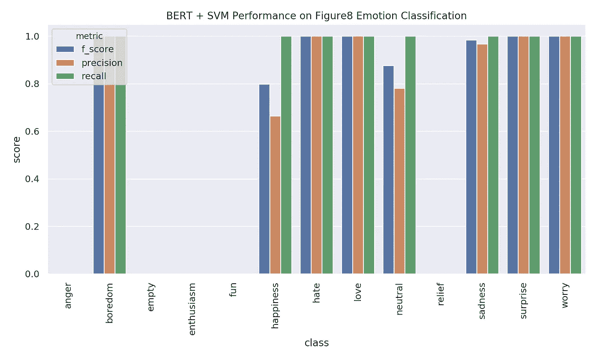
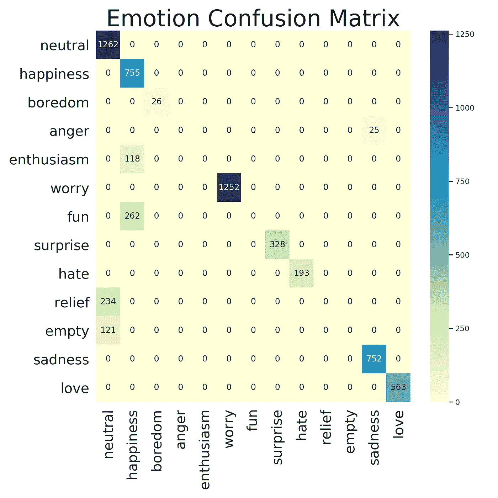

# 建立一个伯特科学工具包变压器

> 原文：<https://towardsdatascience.com/build-a-bert-sci-kit-transformer-59d60ddd54a5?source=collection_archive---------10----------------------->

## BERT 可以在许多 NLP 任务中为您提供最先进的结果，并且只需要几行代码。


[作为变形人的伯特](https://teespring.com/shop/bert-transformer?aid=marketplace&tsmac=marketplace&tsmic=error&pid=369&cid=6512)(图片由作者提供)

# 介绍

在 NLP 中获得最先进的结果曾经是一项痛苦的任务。你必须设计各种管道，做词性标注，将这些链接到知识库，将你的单词词汇化，并构建疯狂的解析器。现在把你的任务扔给伯特，你可能会做得很好。本教程的目的是用 BERT 和 Sci-kit Learn 建立一个句子级分类的最小示例。我不会详细讨论什么是 BERT 或者它是如何工作的。我只想用最少的工作量向你展示如何通过 Sci-kit Learn 轻松使用这个模型。在这篇博文的最后，我们将有一个世界级的 Ekman 情绪检测模型和 BERT 打包到一个模块化的 Sci-kit Learn transformer 中，我们可以通过任何现有的 Sci-kit 管道在一行代码中即插即用！

# 为什么是伯特？

机器学习的很大一部分是找出什么样的好特性适合你的任务。如果你有代表你的问题空间的特征，那么学习就是小菜一碟！困难在于很难，或者至少传统上很难，为一项语言任务创造好的特性。每项任务都有自己的特色，并且需要做大量的工作来确定模型中应该包含哪些信息以及如何包含。

BERT 是一个基于大量文本的深度转换模型。大量的预训练与模型架构和一些巧妙的训练技巧相结合，使得 BERT 能够学习 NLP 任务的“好”特性。在这里，我们将利用所有这些优秀的工作，并使用 [PyTorch transformer 库](https://github.com/huggingface/transformers)来创建一个可重用的特征提取器。我们将能够把这个特征提取器插入任何 Sci-kit 学习模型。关于 BERT 如何工作的更多信息，请阅读 Jay Alamar 关于 [BERT](http://jalammar.github.io/illustrated-bert/) 和[使用 BERT](http://jalammar.github.io/a-visual-guide-to-using-bert-for-the-first-time/) 的精彩博文。

# 为 Sci-kit Learn 创建 BERT 特征提取器

对于我的大多数项目，我试图从简单开始，看看我能用 Sci-kit Learn 走多远。我个人喜欢使用他们的 [pipeline API](https://scikit-learn.org/stable/modules/generated/sklearn.pipeline.Pipeline.html) ，其中任何给定的模型都是由转换器和估算器组成的。每当像 BERT 这样的新方法出现时，我都会为它建立一个转换器或估计器。然后，我可以轻松地将它合并到我现有的任何管道中，而无需做太多工作。因此，让我们为 BERT 创建一个 Sci-kit 学习转换器，我们可以即插即用任何估计器。

这个转换器应该将字符串列表映射到与该字符串相关联的相应 BERT 特征。所以我们的类型签名应该是*列表*[*str**→火炬。漂浮者*

使用[拥抱面部变形库](https://huggingface.co/transformers/)有三个主要步骤来进行这种变形:

1.  将字符串分解成整数编码的标记
2.  对编码的记号运行 BERT 以获得单词和句子的 BERT 表示
3.  将 BERT 表示的部分提取为我们模型所需的特征。

## 标记化

标记化只有两行代码。我们定义我们想要的记号赋予器，然后运行 **encode_plus** 方法，该方法允许我们设置像最大大小和是否包含特殊字符这样的事情。

```
tokenizer = BertTokenizer.from_pretrained("bert-base-uncased")
tokenized_dict = tokenizer.encode_plus(
    "hi my name is nicolas",
    add_special_tokens=True,
    max_length=5
    )
```

该函数的输出是:

```
{'overflowing_tokens': [2003, 9473],
 'num_truncated_tokens': 2,
 'special_tokens_mask': [1, 0, 0, 0, 1],
 'input_ids': [101, 7632, 2026, 2171, 102],
 'token_type_ids': [0, 0, 0, 0, 0]}
```

您会注意到，我们将最大序列长度设置为 5，在我提供的输入中只有 5 个单词，但它显示有两个截断的标记。这是因为我们将 **add_special_tokens** 设置为 True。对于 BERT 模型，这意味着添加一个[CLS]“class”标记和一个[SEP]“separator”标记。这两个标记构成了五个单词的最大值，所以我们最终删除了两个单词。这只是需要注意的一点。有了这个字典，我们只需要 **input_ids** 字段，它保存我们将传递给 BERT 模型的标记化单词的整数编码。

CLS 令牌保存嵌入的句子，分隔符令牌用于告诉 BERT 下一个句子将出现。对于我们的基本句子分类任务，我们将使用 CLS 嵌入作为我们的特征集。

## 模型

下一步是使用 BERT 分类器生成句子嵌入。transformer 库再次为我们完成了大部分工作。我们可以创建一个简单的 BERT 模型，并对我们的符号化输出运行预测。

```
bert_model = BertModel.from_pretrained("bert-base-uncased")tokenized_text = torch.tensor(tokenized_dict["input_ids"])with torch.no_grad():
  embeddings = bert_model(torch.tensor(tokenized_text.unsqueeze(0)))
```

请注意，BERT 模型需要接受一个形式为[batch_size，sentence_length]的张量，这意味着我们需要取消一维矩阵的排队。

还要注意我们在这里如何使用 **torch.no_grad()** 。我第一次处理大量样本时忘记了这样做，服务器内存不足。所以，记得在运行预测之前关闭梯度，否则你会保存太多的梯度信息，并有一个糟糕的时间。默认情况下，返回的元组有两个字段，第一个是大小为:

*批量* × *句子长度* × *嵌入维度*

对于基本的 BERT 模型和我们的例子，这最终是[1，5，768]。第一个张量包含我们对分类感兴趣的嵌入。第二个张量保存汇集的输出。在训练下一个句子时，汇集的输出是通过线性层和双曲正切激活函数后的[CLS]嵌入。对于本教程，我们可以忽略它。

# 提取嵌入内容

要完成我们的 BERT 特征提取器，我们需要做的最后一件事是将最终的嵌入组合成一个用于分类的向量。对于大多数分类任务来说，只需抓住[CLS]标记的嵌入就可以做得很好。我们可以用这个函数来实现:

```
get_cls = lambda x: x[0][:, 0, :].squeeze()
```

这将获取嵌入和汇集输出的元组，获取嵌入并获取所有批次，仅第一个 CLS 令牌，以及所有嵌入的神经元。

但是，也许你想变得花哨，并使用其他功能。假设您想要使用所有嵌入进行预测，我们可以使用不同的函数将它们连接在一起:

```
flatten_embed = lambda x: torch.flatten(x[0])
```

这将返回一个由序列中每个标记的嵌入组成的大向量。通过定义在最终层上操作的函数，我们可以更灵活地使用用于下游分类的特征。这在 Sci-kit 学习转换器的上下文中更有意义。

# 把所有的放在一起

这三个基本的片段就是我们为一个句子获取嵌入所需要的全部。为了方便地与 Sci-kit 学习方法联系起来，我们希望对大量句子进行操作。我们可以通过建立一个 Sci-kit 学习变压器来做到这一点(我们正在做一个变压器变压器！).这样我们就可以传递一个列表给它，调用 **transform** 函数，我们的分类器就可以开始学习了。我们创建了一个名为 BertTransformer 的新类，它继承了 BaseEstimator 和 TransformerMixin，并将我们在上面工作的代码作为标记化步骤和预测步骤。

BERT Sci-Kit 学习转换器代码

这个转换器使用我们之前在第 25–39 行编写的所有标记化代码，以及第 41–46 行的预测和提取代码。我们唯一要做的另一件事是用一个**转换**方法将所有句子连接起来，这个方法使用一个单一的列表理解来标记，然后将所有句子嵌入到一个列表中，这发生在第 51-52 行。

现在，我们可以使用 BERT 的所有功能和经典 Sci-kit Learn 模型的所有简单性来制作超级简单的管道！

# 数据集

对于我们的数据，我们将使用 8 字形[情感分析:文本中的情感](https://data.world/crowdflower/sentiment-analysis-in-text)数据集。这个数据集有 4 万条推文，分为 13 种不同的情绪状态。我只是将数据加载到 pandas 数据框架中，并将数据随机分为 70%的训练集、15%的验证集和 15%的测试集。

```
figure8_df = pd.read_csv("text_emotion.csv")split = np.random.choice(
    ["train", "val", "test"],
    size=figure8_df.shape[0],
    p=[.7, .15, .15]
)
figure8_df["split"] = splitx_train = figure8_df[figure8_df["split"] == "train"]
y_train = x_train["sentiment"]
```

# 训练模型

训练模型非常简单。我们只是用一个转换器和一个估计器来定义一个流水线。

```
bert_transformer = BertTransformer(tokenizer, bert_model)
classifier = svm.LinearSVC(C=1.0, class_weight="balanced")model = Pipeline(
    [
        ("vectorizer", bert_transformer),
        ("classifier", classifier),
    ]
)model.fit(x_train["content"], y_train)
```

就这样，我们结束了。这将训练一个关于伯特 CLS 嵌入的 SVM，但是如果我们也想要一些经典的 TF-IDF 特性呢？这也很简单！我们只需制作一个[特征联合](https://scikit-learn.org/stable/modules/generated/sklearn.pipeline.FeatureUnion.html)，并将其传递给我们的分类器。

```
from sklearn.feature_extraction.text import (
   CountVectorizer, TfidfTransformer
)

tf_idf = Pipeline([
    ("vect", CountVectorizer()),
    ("tfidf", TfidfTransformer())
    ])

model = Pipeline([
    ("union", FeatureUnion(transformer_list=[
        ("bert", bert_transformer),
        ("tf_idf", tf_idf)
        ])),
        ("classifier", classifier),
    ])
```

我喜欢使用管道的原因是它们非常灵活，我可以轻松地创建这些可塑的组件。从现在到永远，我们可以用一行代码将 BERT 特性添加到任何 Sci-kit 学习模型中！

# 结果

运行上述模型后，我们在验证集上获得了相当好的结果。有些课程做得很糟糕，但大多数都非常出色。看一看。在我们的验证集上，对许多类有几乎完美的分类。这个模型只使用了来自伯特变换器的 CLS 嵌入和一个 SVM，它在所有主要标签上得到几乎完美的预测！这太疯狂了。



这些结果出乎意料的好，所以我看了看混淆矩阵，看起来*的热情*和*的乐趣*都被归类为*的快乐*，对此我 100%同意。看起来真正有问题的孩子是空虚的和解脱的，但是如果我完全诚实的话，我甚至不知道那些情绪是什么🤷‍♂:所以我要把它标记为成功。



# 结论

Sci-kit 学习变形金刚超级方便。现在，我们可以轻松地将基于 BERT 的特性插入到任何我们想要的 Sci-kit 学习模型中！这只是定义我们的 BERT 模型并将其作为一个特性化步骤添加到管道中的问题。Sci-kit Learn 会处理剩下的事情。尝试将这些功能整合到您的旧型号中，看看它是否能提高性能。对我来说是的。