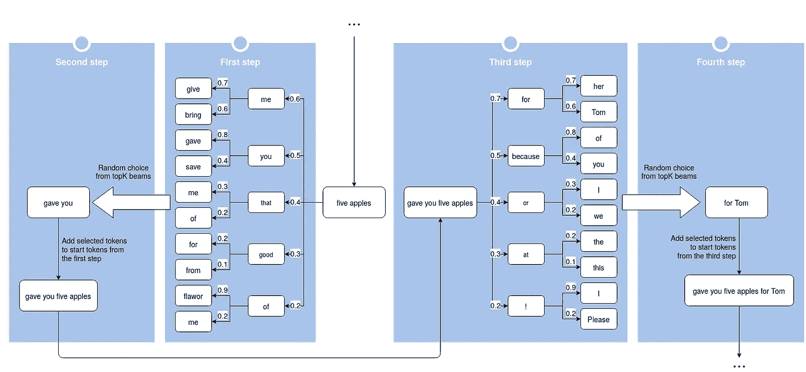

# 用 XLNet 构建一个双向文本生成器

> 原文：<https://towardsdatascience.com/build-a-bidirectional-text-generator-with-xlnet-49d9d37b48a9?source=collection_archive---------41----------------------->

## 使用置换语言建模以新的方式生成文本


照片由[布伦丹·丘奇](https://unsplash.com/@bdchu614?utm_source=unsplash&utm_medium=referral&utm_content=creditCopyText)在 [Unsplash](https://unsplash.com/?utm_source=unsplash&utm_medium=referral&utm_content=creditCopyText) 上拍摄

当前基于[变形金刚](https://arxiv.org/abs/1706.03762)的模型，像 GPT-2 甚至 GPT-3，在[文本生成](https://huggingface.co/blog/how-to-generate)(根据之前的单词序列预测下一个可能的单词)的任务中表现出令人难以置信的成就。这些模型可以创建长的、有创意的和有凝聚力的文本，但通常它们只能在一个方向上生成文本，从左到右。我想知道是否有一种方法可以双向生成文本，并有一些开始短语(例如“文本生成很酷”)来看看围绕它会展开什么故事。解决方案是:由于使用了输入序列分解顺序的所有排列，这个模型可以帮助生成任何方向的文本。

在本文中我们不会详细研究 XLNet 的内部原理(精彩的简要说明你可以在这里找到)。相反，我们将立即开始试验:我们将使用 XLNet 在屏蔽字预测方面做一点练习，尝试实现 top-K 双向生成，然后实现一种结合波束搜索和 top-K 采样的更有效的方法。

在文章的最后，我们将获得一个能够根据起始短语(以粗体突出显示)创建此类文本的生成器:

> *跟进我最初的想法:* ***文字生成很酷*** *！它非常适合创建博客标题等。您将需要 Word 2013*

# 安装所需的模块

我们开始吧。我们将在 Google Collab Notebook(带 GPU 环境)中进行我们所有的实验，这是通过这个[链接](https://colab.research.google.com/drive/1RhHiKTp0os2_q5z6pKS6vQUz0SM1EXrM)可用的，所以我们需要安装的唯一模块是优秀的[变形金刚](https://huggingface.co/transformers/)库。这个库提供了一个简单的 XLNet 接口，以及许多其他基于变压器的模型。

```
!pip install transformers
```

# 使用 XLNet 预测屏蔽词的示例

XLNet 的一个优点是，这个模型在兼顾之前上下文的同时，可以完美应对几个相关屏蔽词的预测。比如我会在文中提到我给了你三个苹果，然后通过给模型喂一句带假面词的句子让模型告诉我现在谁拥有一些苹果:“<mask>手里有<mask>个苹果”。结果，我们会看到模型完美地理解了谁有苹果，有多少。</mask></mask>

在我们开始与模型通信之前，我们需要加载它，并加载一个标记器，将输入的文本处理成模型可以理解的数字形式。在基本形式中，标记化是将文本分割成单词或子单词，然后将它们转换成 id。每个模型都要求文本以特定的方式进行标记。XLNet 使用了 SentencePiece 方法。你可以在[链接](https://huggingface.co/transformers/tokenizer_summary.html)了解更多关于令牌化过程的信息。

此外，我们需要添加一个填充文本，以帮助 XLNet 的简短文本是由阿曼俄罗斯提出的[。](https://medium.com/@amanrusia/xlnet-speaks-comparison-to-gpt-2-ea1a4e9ba39e)

预测每个<mask>单词的前 5 个单词。为了进行预测，我们需要为模型提供标记化的文本、屏蔽词索引和置换屏蔽。需要置换掩码来禁用输入令牌以处理掩码令牌。你可以阅读更多关于模型参数[在这里](https://huggingface.co/transformers/model_doc/xlnet.html#xlnetlmheadmodel)。</mask>

输出:

```
predicted word: <mask> 0
word and logits You -9.070054054260254
word and logits I -10.822368621826172
word and logits We -12.820359230041504
word and logits Now -14.133552551269531
word and logits They -14.863320350646973
predicted word: <mask> 1
word and logits three -23.045528411865234
word and logits the -24.3369083404541
word and logits these -25.59902000427246
word and logits two -25.809444427490234
word and logits your -25.947147369384766
```

# Top-k 双向生成

现在，当我们知道如何用 XLNet 预测屏蔽词时，是时候创建一个 top-k 双向文本生成器了。它的工作原理很简单。我们将创建一个循环，在每次迭代中，该模型将预测起始短语右侧或左侧屏蔽词的前 k 个标记。之后，我们将 topK 中的随机令牌添加到起始短语中，并重复迭代 n 次。

输出:

```
• 1 1 User reviews and says:? The text generation is cool for me to see and the font size seems right
```

没什么印象。有很多重复，整篇文章看起来毫无意义。但是我们会找到更好的解决办法。

# Top-k-beam 双向文本生成

正如我们所看到的，这个模型仍然很难从右向左生成文本。我们经常会得到一个不太适合上下文的单词，这会导致下一个更不适合的单词。结果，生成的文本变得不连贯。

我们可以通过不是在起始短语的每一边生成单词，而是通过创建一定数量的单词序列束并选择一定长度的最有可能的一束来增加找到相连单词序列的机会。

因此，我们得到了 top-k 采样和波束搜索的某种组合。由此产生的方法的原理如图所示。



图片由 Rostyslav Neskorozhenyi 用 [draw.io](https://draw.io/) 创建

双向生成过程包括 n 次迭代。为了更好地理解，我将每次迭代分为四个步骤:

*   在第一步中，我们获得一个起始短语，并在其左侧从右到左生成一定数量的一定长度的束(在束搜索的每个阶段，我们使用 top-K 采样来选择下一个候选标记)。
*   在第二步中，我们从前 K 个最可能的波束中随机选取一个波束，并将其添加到起始短语中。
*   产生的新短语作为第三步的开始短语，在第三步中，我们在新开始短语的右侧生成一定数量的波束。
*   在第四步中，我们从第三步中获得的前 k 个波束中随机选取一个波束，并将该波束添加到新的起始短语中。产生的短语作为下一次迭代的起点。

我希望这个描述足够清楚，这个图表可以帮助你理解它。主要是，根据我的实验，这种方法在大多数情况下允许你双向生成相当连贯的文本。

让我们用代码实现这个方法。首先，我们将创建一个函数，该函数将获取标记化的起始句、一系列标记候选项及其概率，并在右侧或左侧生成下 n 个可能的标记候选项序列。我们将迭代地使用这个函数，因此从上一次迭代中生成的令牌序列将作为下一次迭代的输入。

现在我们将创建 **beam_gen** 函数，该函数将使用由 **candidates_gen** 提出的令牌候选者生成给定长度(深度)的令牌波束列表。

**beam_gen** 函数将返回按概率排序的最终波束列表。

让我们将所有部分聚集在一个 **bi_gen** 函数中。 **bi_gen** 将能够从左到右(参数**方向** = '右')、从右到左(参数**方向** = '左')或两个方向(参数**方向** = '两者')生成文本

如果**两个**方向都被选择，发生器将以如下方式工作:在左侧产生 **n_tokens** ，之后在右侧产生 n 个 tokens，然后在左侧产生 n 个 tokens，依此类推。它将重复多少次，保存在**迭代**参数中。

我们将在 **first_sample_size** 参数中单独指示波束搜索第一阶段的候选数目。该数目可以高于下一阶段中的候选数目(在变量 **sample_size** 中指定)，因为为第一令牌获得足够的候选是重要的，所有后续序列都将基于第一令牌。根据我的观察，这种方法增加了生成连贯的和合理的可能的记号序列的可能性。

我们将使用高**温度**参数来降低模型在其顶部令牌选择中的置信度。这使得生成更加多样化，并且不会被最有可能重复的记号序列卡住。

最后，我们将尝试我们的双向文本生成器，以“文本生成很酷”开始。

结果文本:

```
Follow the trend: Graphic design is cool, **text generation** is cool, data manipulation and algorithms are cool, etc.
```

# 结论

它也开始看起来有点像我们正在进入一个主要由人工智能控制的新世界，基于其长期操纵、管理和适应我们日常生活的能力。

之前的整个段落都是由我们新的文本生成器生成的。这篇课文很有说服力，不是吗？因此，请接受我的祝贺。我们几乎创造了同类产品中的第一个**基于变压器的双向文本生成器**。虽然它仍然会犯很多错误，但它可以用来创造很多有趣的故事，这些故事将围绕你脑海中出现的任何短语发展。