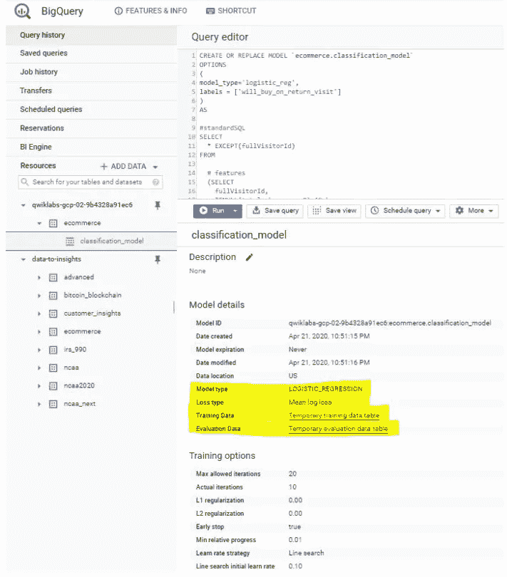

# 在 BigQuery 中建立分类模型——面向电子商务的机器学习

> 原文：<https://towardsdatascience.com/build-a-classification-model-in-bigquery-machine-learning-for-ecommerce-761f1df895b4?source=collection_archive---------28----------------------->

## 如何使用 BigQuery ML 在 Google 云平台上部署机器学习模型

# 1-描述 **:**

贵公司的数据分析师团队将一个电子商务网站的 Google Analytics 日志导出到 BigQuery 中，并创建了一个包含所有原始电子商务访问者会话数据的新表，供我研究。利用这些数据，我将尝试回答几个问题。

**问题 1:** 在访问我们网站的所有访问者中，有百分之多少的人进行了购买？

**问题 2:** 有多少访问者在随后的访问中购买了该网站？

**问题 3:** 典型的电子商务客户会浏览但不会购买直到下次访问的一些原因是什么？

**问题 4:** 在 BigQuery 中创建一个机器学习模型，预测新用户未来是否有可能购买。识别这些高价值用户可以帮助营销团队针对他们开展特别促销和广告活动，以确保他们在访问您的电子商务网站时进行比较。

# 2-构建机器学习模型的说明:

1-选择要素并创建您的训练数据集。

2-创建一个 BigQuery 数据集来存储模型。

3-选择 BQML 模型类型并指定选项。

4-评估模型性能。

5-通过特征工程提高模型性能。

预测哪些新访客会回来购买。

# **3-定义**:

*   Google BigQuery 是一个可扩展的、全面管理的、经济高效的交互式专用查询系统，用于分析结构化和半结构化嵌套数据。
*   BigQuery ML 使用户能够使用标准的 SQL 查询在 BigQuery 中创建和执行机器学习模型。BigQuery ML 通过让 SQL 从业者使用现有的 SQL 工具和技能来构建模型，使机器学习民主化。BigQuery ML 通过消除移动数据的需要提高了开发速度。
*   Google Analytics 是 Google 提供的网络分析服务，用于跟踪和报告网站流量，也用于跟踪网站活动，如会话持续时间、每次会话的页面数、跳出率等。使用该网站的个人信息，以及流量来源的信息。
*   有一个新的可用的[电子商务数据集](https://www.en.advertisercommunity.com/t5/Articles/Introducing-the-Google-Analytics-Sample-Dataset-for-BigQuery/ba-p/1676331#)，其中有数百万条关于[谷歌商品商店](https://shop.googlemerchandisestore.com/)的谷歌分析记录加载到 BigQuery 中。在本实验中，您将使用这些数据运行一些典型的查询，企业希望了解他们客户的购买习惯。

— — — — — — — — — — — — — — — — — — — — — — — — — —

> **注:此处** **所有代码均可用** [**。**](https://github.com/Ahmed0028/Google-Cloud-Platform-BigQuerML-/blob/master/code.txt)

**设置您的环境**

*   登录谷歌云平台

谷歌云控制台

*   从导航菜单打开 BigQuery 控制台

*   通过此[链接](https://console.cloud.google.com/bigquery?p=data-to-insights&d=ecommerce&t=web_analytics&page=table&pli=1)访问谷歌分析数据集

[谷歌商品商店](https://shop.googlemerchandisestore.com/)的谷歌分析数据集样本

有关数据集的更多信息:

# BigQuery ML 中的机器学习模型

**问题 1:**

**结果:2.69%**

**问题 2:**

以下是前 5 名产品的结果:

问题 3:

分析结果，我们可以看到(11873 / 741721) = 1.6%的总访问者会从网站返回并购买。*这包括在第一次会议上购买，然后回来再次购买的访问者子集*。

典型的电子商务客户会浏览但不会购买，直到后来访问的一些原因是什么？

虽然没有一个正确的答案，但一个普遍的原因是在最终做出购买决定之前，在不同的电子商务网站之间进行比较。对于奢侈品来说，这是很常见的，顾客在做出决定之前需要进行大量的前期研究和比较(比如购买汽车)，但对于该网站上的商品(t 恤、配饰等)来说，这种情况在较小程度上也是如此。

在网络营销的世界里，根据这些未来客户的首次访问特征来识别和营销他们，将会提高转换率，减少向竞争对手网站的流失。

**确定一个目标**

现在，您将在 BigQuery 中创建一个机器学习模型，以预测新用户将来是否有可能购买。识别这些高价值用户可以帮助您的营销团队针对他们开展特别促销和广告活动，以确保他们在访问您的电子商务网站时进行比较。

**1-选择特征并创建您的训练数据集。**

Google Analytics 捕捉了关于用户访问该电子商务网站的各种维度和衡量标准。在这里浏览字段的完整列表，然后[预览演示数据集](https://bigquery.cloud.google.com/table/data-to-insights:ecommerce.web_analytics?tab=preview)以找到有用的功能，帮助机器学习模型理解访问者第一次访问你的网站的数据与他们是否会回来购买之间的关系。

我决定测试这两个字段是否是我的分类模型的良好输入:

*   totals.bounces *(访问者是否立即离开网站)*
*   totals.timeOnSite *(访问者在我们网站停留的时间)*

**问题:**只使用以上两个字段有什么风险？

**回答:**机器学习的好坏只取决于输入其中的训练数据。如果模型没有足够的信息来确定和学习输入特征和标签之间的关系(在这种情况下，访问者是否在未来购买)，那么我们将不会有一个准确的模型。虽然只在这两个领域训练模型是一个开始，但我们将看看它们是否足以产生一个准确的模型。

**问题:**哪些字段是输入要素和标注？

**答:**输入为**弹跳**和**现场时间**。标签是**将 _ 购买 _ 返回 _ 访问**。

**问题:**访客第一次会话后知道哪两个字段？

**回答:** **弹回**和 **time_on_site** 在一个访客的第一次会话后就知道了。

**问题:**哪个领域是以后才知道的？

**回答:****will _ buy _ on _ return _ visit**第一次访问之后就不知道了。同样，你预测的是返回你的网站并购买的用户子集。因为你不知道未来的预测时间，你不能肯定地说，是否会有新的游客回来购买。建立一个 ML 模型的价值是基于他们第一次会议收集的数据得到未来购买的可能性。

**2-创建一个大查询数据集来存储模型。**

**3-选择一个 BQML 模型类型并指定选项。**

既然我们已经选择了初始特性，我们现在准备在 BigQuery 中创建您的第一个 ML 模型。

**注意:**在机器学习中有许多额外的模型类型(如神经网络和决策树)，可以使用像 [TensorFlow](https://www.tensorflow.org/tutorials/) 这样的库来获得。在撰写本文时，BQML 支持上面列出的三种。

**你应该选择哪种型号？**

由于我们将访问者分为“将来会购买”或“将来不会购买”，我们将在分类模型中使用 logistic_reg。

以下查询创建一个模型并指定模型选项。运行此查询来训练模型:

**注意:**我们无法在训练期间将所有可用数据输入模型，因为我们需要保存一些看不见的数据点用于模型评估和测试。为了实现这一点，添加一个 WHERE 子句条件，用于在 12 个月的数据集中仅对前 9 个月的会话数据进行筛选和训练。

我们可以看到上面强调的任何机器学习模型的四个主要参数:

模型类型、损失函数类型、训练数据和评估数据集。

**4-评估模型性能。**

对于 ML 中的分类问题，我们希望最小化误报率(预测用户会退货并购买而他们没有)和最大化真报率(预测用户会退货并购买而他们确实有)。

这种关系可以用 ROC(受试者操作特征)曲线来表示，如下图所示，我们试图最大化曲线下面积或 AUC:

分类模型的 ROC 曲线

**5-利用特征工程提高模型性能。**

正如前面所暗示的，数据集中有更多的要素可以帮助模型更好地理解访问者的第一次访问与他们在后续访问中购买的可能性之间的关系。

我们将添加一些新功能，并创建第二个机器学习模型，名为***classification _ model _ 2***:

*   访问者在第一次访问时在结账过程中走了多远。
*   访问者来自哪里(流量来源:有机搜索，参考网站等..).
*   设备类别(手机、平板电脑、台式机)。
*   地理信息(国家)。

通过运行以下查询创建第二个模型:

**6-预测哪些新访客会回来购买。**

分类模型 2 的 RUC 曲线

接下来，您将编写一个查询来预测哪些新访问者会回来购物。

下面的预测查询使用改进的分类模型来预测首次访问 Google 商品商店的用户在以后的访问中购买商品的概率:

我们的模型现在输出对 2017 年 7 月电子商务会议的预测。我们可以看到三个新添加的字段:

*   *predicted _ will _ buy _ on _ return _ visit:模型是否认为访问者以后会购买(1 =是)*
*   *predicted _ will _ buy _ on _ return _ visit _ probs . label:表示是/否的二元分类器*
*   *predicted _ will _ buy _ on _ return _ visit . prob:模型对其预测的置信度(1 = 100%)*

**结论:**

*   在前 6%的首次到访者中(按预测概率降序排列)，超过 6%的人会在以后的访问中进行购买。
*   这些用户代表了在以后的访问中进行购买的所有首次访问者的近 50%。
*   总体而言，只有 0.7%的首次访客会在以后的访问中进行购买。
*   与瞄准所有人相比，瞄准前 6%的首次营销投资回报率提高了 9 倍！

— — —— — — — — — — — — — — — — — — — — — — — — — —

参考资料:

1-[https://cloud.google.com/bigquery-ml/docs/bigqueryml-intro](https://cloud.google.com/bigquery-ml/docs/bigqueryml-intro)

2-Qwiklabs.com

模式识别和机器学习。