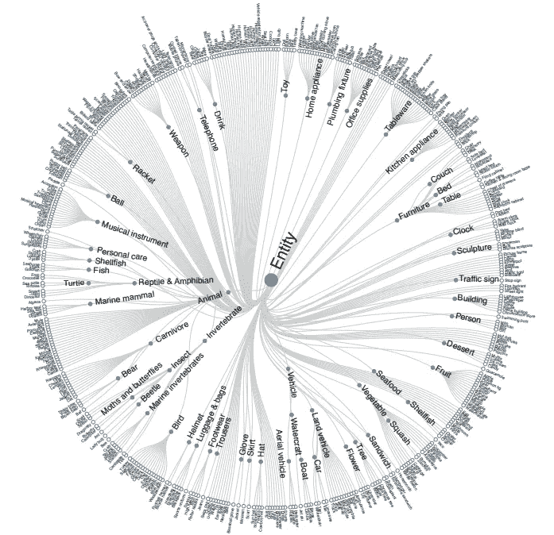
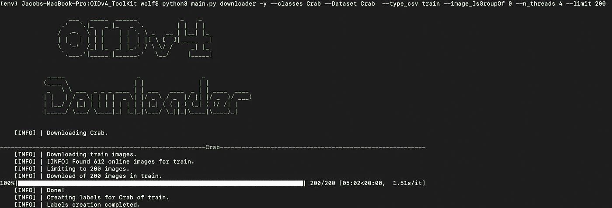
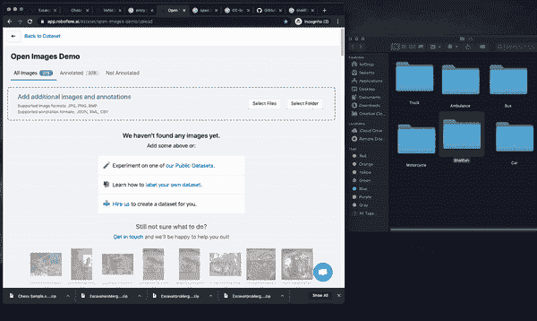
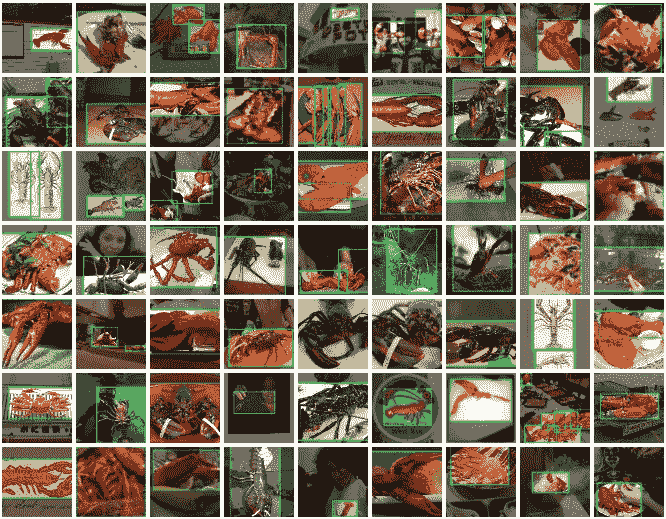
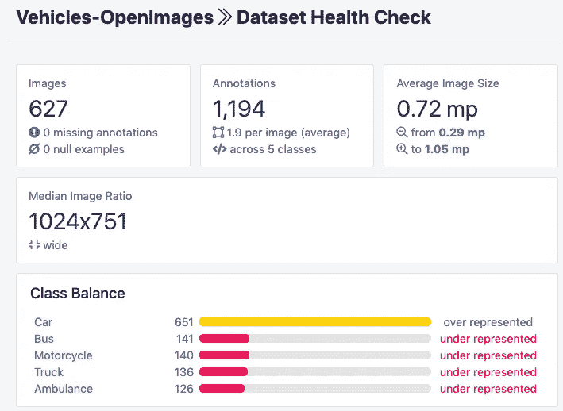
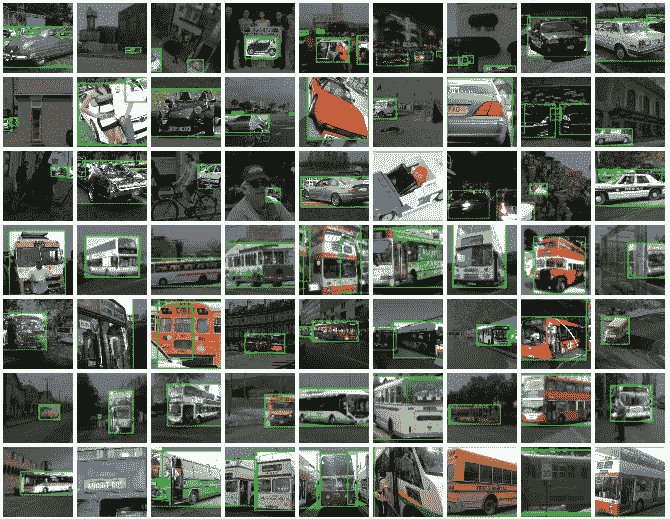

# 构建用于对象检测的自定义开放图像数据集

> 原文：<https://towardsdatascience.com/build-a-custom-open-images-dataset-for-object-detection-9eab73b6a410?source=collection_archive---------33----------------------->

## 注意:我们还在博客上发布了[自定义开放图片](https://blog.roboflow.com/custom-open-images-datasets/)。如何打开计算机视觉数据的海洋，即开放的图像数据集。

我们很高兴地宣布与开放图像数据集的集成，以及封装开放图像数据集子域的两个新公共数据集的发布:[车辆物体检测](https://public.roboflow.ai/object-detection/vehicles-openimages)和[贝类物体检测](https://public.roboflow.ai/object-detection/shellfish-openimages)。

在本帖中，我们将介绍如何创建您自己的自定义开放图像数据集。

车辆和贝类只是开放影像数据集广阔景观的一个小窗口，旨在提供可使用开放影像构建的数据集的小示例。



[开放图像数据集中的大量子域](https://arxiv.org/pdf/1811.00982.pdf)。我们如何让它变得易于处理？

# 关于打开的图像

Open Images 是 Google 在 CC BY 4.0 许可下发布的开源计算机视觉检测数据集。数据集包含大量数据，涵盖图像分类、[对象检测](https://blog.roboflow.com/the-ultimate-guide-to-object-detection/)，以及跨越数百万图像和边界框注释的视觉关系检测。开放图像数据集为计算机视觉研究提供了广泛而大规模的基础事实。

# 为什么要创建自定义开放图像数据集？

创建自定义开放影像数据集的用途有很多:

*   尝试创建自定义对象检测器
*   在收集*和标记*您自己的数据之前，评估检测类似物体的可行性
*   扩充和现有的训练集
*   训练自定义检测器模型检查点，以应用于数据较少的更适合的自定义任务
*   当然，为了好玩😁

请记住，这些都是免费的、有标签的计算机视觉数据，存在于知识共享空间中。

# 打开图像查询工具

整个开放的影像数据集大约有 1tb…要下载原始数据，您需要运行一些命令，例如:

```
aws s3 --no-sign-request sync s3://open-images-dataset/train [target_dir/train] (513GB)
aws s3 --no-sign-request sync s3://open-images-dataset/validation [target_dir/validation] (12GB)
aws s3 --no-sign-request sync s3://open-images-dataset/test [target_dir/test] (36GB)
```

幸运的是，开源社区已经创建了一些工具，使得查询开放图像数据库变得简单易用。为了构建我们的[自定义开放图像数据集](https://public.roboflow.ai/object-detection/shellfish-openimages)，我们使用了 [OIDv4_ToolKit](https://github.com/EscVM/OIDv4_ToolKit) 。OIDv4_ToolKit 使您可以轻松地查询 OID 的子域，并限制到特定的类。只需一行 python 代码，您就可以指定所需图像的类别和数量。它有边框和所有的东西！

从公开图片下载 200 只带标签的龙虾:

```
python3 main.py downloader -y --classes Lobster --Dataset Lobster  --type_csv train --image_IsGroupOf 0 --n_threads 4 --limit 200
```



从开放图像下载带注释的螃蟹

# 转换开放图像注释格式

我们很高兴地宣布，我们现在支持 Roboflow 的开放图像数据格式。当您下载 Open Images 数据时，您将收到一个大型的难处理的 CSV 文件，其中包含整个数据集中的所有注释以及一个类别映射。您还将收到`.txt`文件，为每幅图像添加注释，这要容易处理得多。我们支持这两种格式，但是我推荐使用`.txt`文件。

为了将您的注释转换成任何格式，您只需使用 [Roboflow](https://roboflow.ai) 创建一个免费帐户，并将您的图像拖到数据上传流程中。



上传打开的图像数据以转换到 [Roboflow](https://roboflow.ai)

创建数据集后，您将能够以任何想要的格式导出。举几个例子，您将能够:

*   将打开的图像转换为 Coco Json
*   将开放图像转换为 Pascal Voc XML
*   转换打开的图像以创建 ML Json
*   将开放图像转换为 YOLO 暗网
*   将打开的图像转换为亚马逊鼠尾草生成器
*   将打开的图像转换为 Amazon Rekognition
*   将打开的图像转换为 TFRecord
*   将开放图像转换为 YOLO 暗网
*   将打开的图像转换为 YOLOv5 Pytorch

然后你就可以用你喜欢的任何型号来训练你的自定义探测器了！在写这篇文章的时候，我主要是在[训练 YOLOv5](https://blog.roboflow.ai/how-to-train-yolov5-on-a-custom-dataset/) [探测器](https://blog.roboflow.com/the-ultimate-guide-to-object-detection/)。

您还可以**将新的自定义数据集与另一个数据集合并**以增加覆盖范围。

# 介绍 Roboflow 的公共自定义开放图像数据集

我们创建了两个公共自定义开放图像数据集，并在我们的公共数据集之间共享:[车辆目标检测](https://public.roboflow.ai/object-detection/vehicles-openimages)和[贝类目标检测](https://public.roboflow.ai/object-detection/shellfish-openimages)。


[贝类对象检测](https://public.roboflow.ai/object-detection/shellfish-openimages)类分布



[贝类物体检测](https://public.roboflow.ai/object-detection/shellfish-openimages)示例图像



[车辆物体检测](https://public.roboflow.ai/object-detection/vehicles-openimages)类分布



[车辆物体检测](https://public.roboflow.ai/object-detection/vehicles-openimages)示例图像

它们已经在我们的[公共计算机视觉数据集](https://public.roboflow.ai/)上公开使用。

# 结论

现在，您知道了如何使用完全免费的计算机视觉数据和开源工具来构建自定义的开放图像数据集。

我们期待看到您用开放图像构建的东西！🚀

如果您对扩大这些数据集或创建自己的数据集感兴趣，请[给我们写信](https://roboflow.ai/contact)！