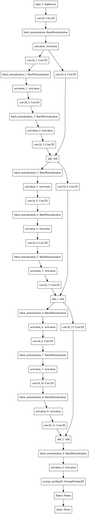

# 从头开始构建具有所需深度的自定义 ResNetV2

> 原文：<https://towardsdatascience.com/build-a-custom-resnetv2-with-the-desired-depth-92892ec79d4b?source=collection_archive---------18----------------------->

## 本教程将帮助您从头开始构建一个具有任意深度/层数的 ResNet 模型

ResNet 一直是我最喜欢的架构之一，我已经多次使用其跳过连接的核心思想。它现在已经相当老了，因为 2015 年& 2016 年 [ResNetV1](https://arxiv.org/abs/1512.03385) (用于图像识别的深度残差学习) [ResNetV2](https://arxiv.org/abs/1603.05027) (深度残差网络中的身份映射)都出现了，但今天它的核心概念仍被广泛使用。所以你一定在想…为什么要在 2020 年出这个教程。

本教程有两个主要原因:

1.  构建任意深度的 ResNetV2，而不仅仅是 ResNet50、ResNet101 或 ResNet152(包含在 keras 应用程序中)
2.  Tensorflow 2.xx 的使用

本教程分为两部分。第 1 部分将简要讨论 ResNet，第 2 部分将重点讨论编码部分。请记住，本教程的主要目标是展示从头开始构建具有任意深度/层数的 ResNet 模型的编码部分。

# 第 1 部分:ResNet 简介

任何深度学习网络的最大问题之一是消失，爆炸梯度。这限制了我们深入网络。如果你不知道或不想更新，请参考视频。

## 所以问题是 ResNet 如何解决这个问题？

我会试着用简单的话来表达。ResNet 的核心思想是基于跳过连接，也就是说，它允许从一个层获取激活，并将其提供给未来的层(可以更深)。考虑梯度消失的问题，当我们深入时，一些神经元将不会有任何贡献，因为它们的权重已经显著降低。但现在，如果我们从早期层激活，并在激活前添加到当前层，现在它肯定会有所贡献。

参考这段视频，从数学角度更好地理解它

现在，不浪费时间，让我们转向编码部分

# 第 2 部分:编码

注意:我已经发布了包含所有代码的回购协议，可以在这里找到。

1.  首先，我们必须创建一个剩余块，它是 ResNet 的构建块。它被用作跳过连接器。ResNetV2 带来了一个微小的修改，与 V1 相反，首先使用卷积层，然后批量归一化。

在网络内部，有时不会首先使用卷积层，因此我们必须使用 if-else 循环。

2.接下来是添加层。出于同样的目的，我们将使用 Keras functional API

**让我们一行一行来**

→在第 7 行，我们接受输入

→第 10 行用于在分成两个路径之前创建卷积层。这里，我们使用的是之前创建的同一个剩余块。

→从第 13 行到第 55 行，用于创建剩余单元的堆栈。让我们更详细地讨论这个问题。在第 10 行之后，网络被分成两部分&稍后添加。现在在第一部分中执行三个操作，

**批量定额→激活→ Conv。**

这个过程重复三次，最后相加。从 ResNet 的角度来看，在分裂之后，在一个子网中，我们执行一些操作(如上所述),并将其激活添加到我们分裂的状态中。所以你可以看到我们跳过了三层。

> 为什么是三层？这取决于你的直觉。它可以是两个或四个或任何东西。我发现用三层效果最好&作者也建议用两层或三层。

是时候深入研究代码了…稍微…:)

→第 13 行开始在 for 循环中追加剩余块的堆栈。(这里跳过所需层的一个简单技巧是在该范围内循环开始)

→第 30–44 行用于在执行分割后，在一个子网中添加卷积层。

> 这里你可以看到我已经用了三个剩余块。为什么是三个？因为我跳过了三次激活

→第 45–53 行:执行分割后，第二个子网络必须是卷积层，可以跳过，稍后添加。

→第 54 行是所有魔法发生的地方:)。这里我们添加我们的两个子网络。

3.最后一部分是连接一个 ***完全连接到*** 层网络之上。

这部分你可以随意定制。

深度为 11 的模型架构示例

## 一些需要注意的关键事项

1.  我写了一个注释“深度应该是 9n+2 ”,因为这里我跳过了三个激活，为了匹配分割前后的张量形状，深度必须根据公式选择。
2.  在步幅和内核大小上做了大量的调整来匹配张量的形状。我建议你在纸上写下一个循环，看看所有的调整，更彻底地理解它。
3.  不要被跳过的连接器或残留的块所迷惑。它们之间的连接如下:在执行分割之后，创建了两条路径。路径一将具有三层或三个 ***残余块*** ，路径二将具有一层或一个 ***残余块*** (现在该块与分割前相同)。现在，来自路径二的这个剩余块将被带到路径一，并在激活之前被添加。因此，该块跳过或跳过了三个块&，从而成为一个 ***跳过连接器。***

# 第 3 部分:结尾注释和一些附加内容

我建议你浏览一下我的 GitHub repo '[ResNet-builder](https://github.com/Akashdesarda/ResNet-builder)，因为它包含了很多我认为可能超出了本博客范围的 API。这个博客仅限于建立一个 ResNet 网络。但是要构建一个完整的 ResNet 系统，我们将需要更多的功能，如数据加载器、推理生成器、可视化模型性能等。我已经包含了所有这些 API。

回购还支持多种配置来构建模型。

我试图让 API 尽可能直观，尽管如果你有任何困惑，你可以通过 [Linkedin](https://www.linkedin.com/in/akashdesarda/) 联系我。