# 用 Python 构建定制的对象检测模型

> 原文：<https://towardsdatascience.com/build-a-custom-trained-object-detection-model-with-5-lines-of-code-713ba7f6c0fb?source=collection_archive---------2----------------------->

## 使用 Detecto 简化计算机视觉，Detecto 是构建在 PyTorch 之上的 Python 包

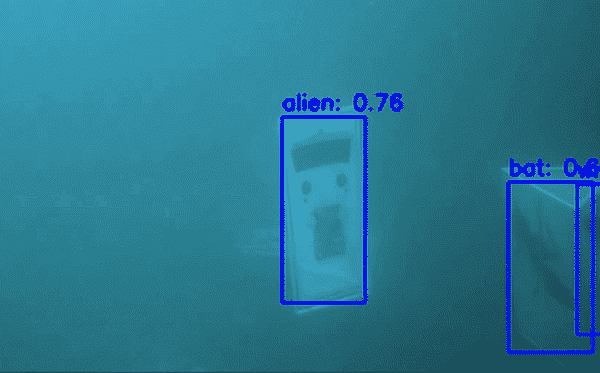

本教程的最终结果！

如今，机器学习和计算机视觉都很热门。我们都看过关于自动驾驶汽车和面部识别的新闻，并且可能会想象构建我们自己的计算机视觉模型有多酷。然而，想要打入这个领域并不容易，尤其是没有很强的数学背景。如果您只想尝试一些小东西，像 PyTorch 和 TensorFlow 这样的库可能会很难学。

在本教程中，我将向任何人介绍一种简单的方法，只需几行代码就可以构建功能齐全的对象检测模型。更具体地说，我们将使用 [Detecto](https://github.com/alankbi/detecto) ，这是一个构建在 PyTorch 之上的 Python 包，它使这个过程变得简单，并对所有级别的程序员开放。

 [## alankbi/detecto

### Detecto 是一个 Python 包，它允许你用…

github.com](https://github.com/alankbi/detecto) 

# **快速简单的例子**

为了演示使用 Detecto 有多简单，让我们加载一个预先训练好的模型，并对下图进行推理:

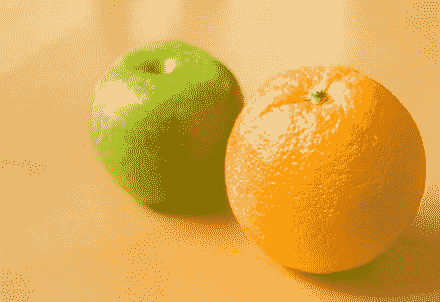

来源:[维基百科](https://en.wikipedia.org/wiki/Apples_and_oranges)

首先，使用 pip 下载 Detecto 包:

```
pip3 install detecto
```

然后，将上面的图像保存为“fruit.jpg ”,并在与图像相同的文件夹中创建一个 Python 文件。在 Python 文件中，编写以下 5 行代码:

运行此文件后(如果您的计算机上没有支持 CUDA 的 GPU，可能需要几秒钟；稍后将详细介绍)，您应该会看到类似于下图的内容:

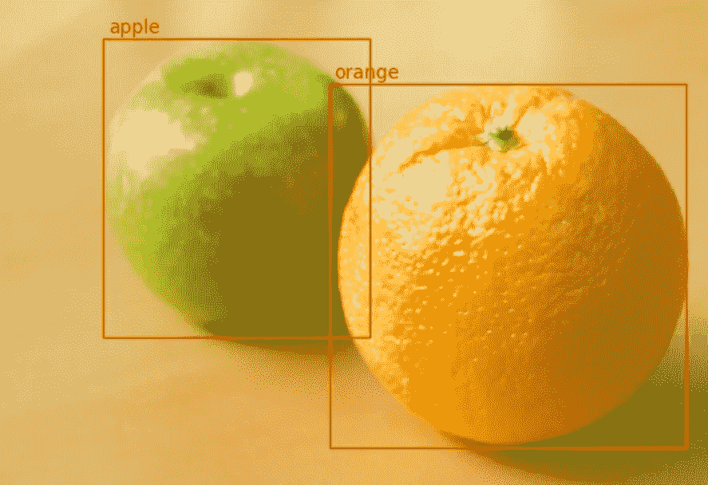

从原始图像中裁剪以获得更好的视觉效果

厉害！我们只用了 5 行代码就做到了这一切。以下是我们在每个案例中所做的:

1.  进口探测器模块
2.  读入图像
3.  初始化预训练模型
4.  在我们的图像上生成了顶部预测
5.  绘制了我们的预测

Detecto 使用 PyTorch 的模型动物园中速度更快的 R-CNN ResNet-50 FPN ，它能够检测大约 80 种不同的对象，如动物、车辆、厨房用具等。然而，如果你想检测自定义对象，如可口可乐与百事可乐罐，或斑马与长颈鹿？

您会很高兴地知道，在自定义数据集上训练 Detecto 模型也同样容易；同样，您所需要的只是 5 行代码，以及一个现有的数据集或一些花在标记图像上的时间。

# **构建自定义数据集**

在本教程中，我们将从头开始构建自己的数据集。我建议你也这样做，但如果你想跳过这一步，你可以在这里下载一个样本数据集[(修改自斯坦福的](https://github.com/alankbi/detecto/blob/master/docs/_static/dog_dataset.zip)[狗数据集](http://vision.stanford.edu/aditya86/ImageNetDogs/main.html))。

对于我们的数据集，我们将训练我们的模型来检测来自 [RoboSub](https://robonation.org/programs/robosub/) 比赛的水下外星人、蝙蝠和女巫，如下所示:

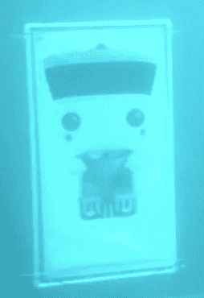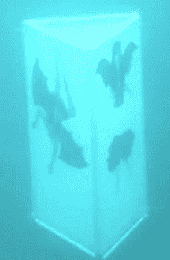

外星人、蝙蝠和女巫(从左到右)

理想情况下，每个类至少需要 100 张图片。好的一面是你可以在每张图像中有多个物体，所以如果每张图像包含你想要检测的每一类物体，理论上你可以得到总共 100 张图像。此外，如果您有视频素材，Detecto 可以轻松地将该素材分割成图像，然后用于数据集:

上面的代码取“video.mp4”中的每第 4 帧，并将其作为 JPEG 文件保存在“frames”文件夹中。

生成训练数据集后，您应该有一个类似于以下内容的文件夹:

```
images/
|   image0.jpg
|   image1.jpg
|   image2.jpg
|   ...
```

如果您愿意，还可以有第二个包含一组验证图像的文件夹。

现在到了耗时的部分:贴标签。Detecto 支持 PASCAL VOC 格式，在这种格式中，XML 文件包含图像中每个对象的标签和位置数据。要创建这些 XML 文件，您可以使用如下的开源工具:

```
pip3 install labelImg    # Download LabelImg using pip
labelImg                 # Launch the application
```

您现在应该会看到一个弹出窗口。在左侧，单击“打开目录”按钮，并选择要标记的图像文件夹。如果一切正常，您应该会看到类似这样的内容:

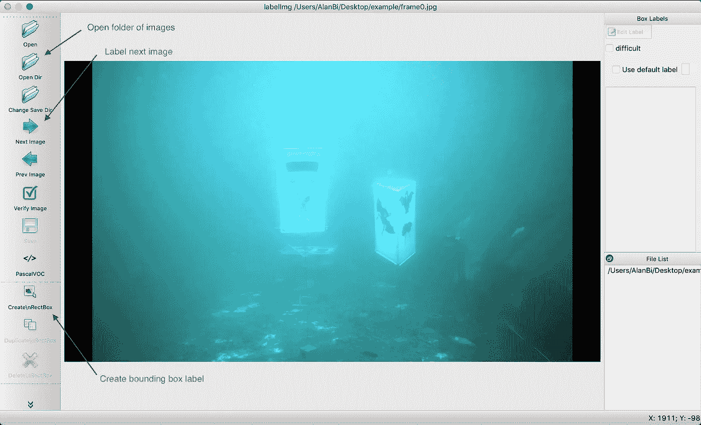

要绘制边界框，请点按左侧菜单栏中的图标(或使用键盘快捷键“w”)。然后，您可以在对象周围拖出一个框，并写入/选择一个标签:

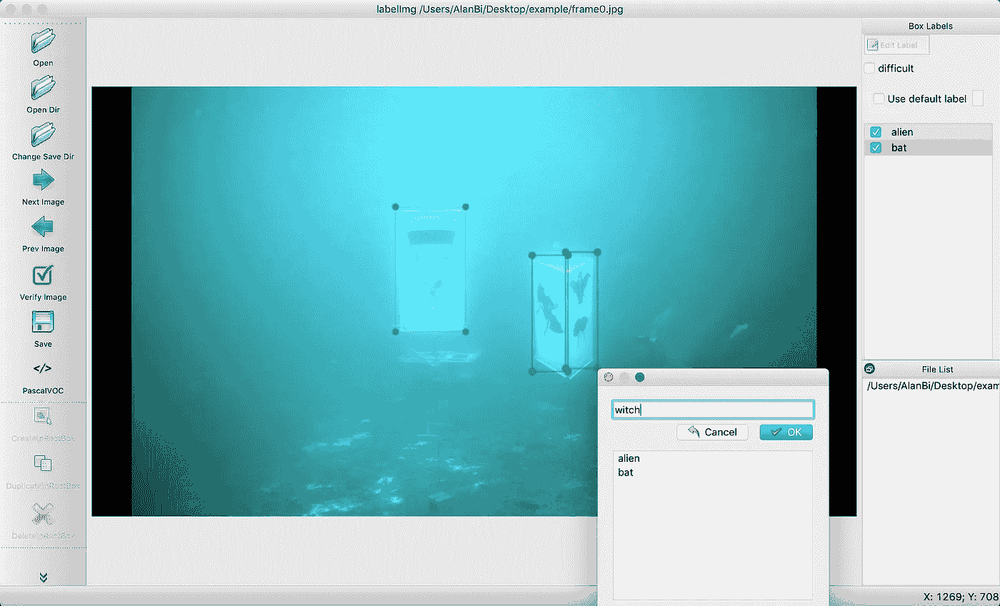

当您完成标记图像时，使用 CTRL+S 或 CMD+S 来保存您的 XML 文件(为了简单和快速，您可以只使用它们自动填充的默认文件位置和名称)。要标记下一幅图像，请点按“下一幅图像”(或使用键盘快捷键“d”)。

完成整个数据集后，您的文件夹应该如下所示:

```
images/
|   image0.jpg
|   image0.xml
|   image1.jpg
|   image1.xml
|   ...
```

我们几乎准备好开始训练我们的对象检测模型了！

# **访问 GPU**

首先，检查你的电脑是否有支持 CUDA 的 GPU 。由于深度学习使用大量的处理能力，在典型的 CPU 上进行训练可能会非常慢。值得庆幸的是，大多数现代深度学习框架，如 PyTorch 和 Tensorflow，都可以在 GPU 上运行，从而使事情变得更快。确保您已经下载了 PyTorch(如果您安装了 Detecto，应该已经有了)，然后运行下面两行代码:

如果打印出来是真的，太好了！你可以跳到下一部分。如果打印错误，不要担心。按照以下步骤创建一个[谷歌合作实验室](https://colab.research.google.com/notebooks/intro.ipynb)笔记本，这是一个带有免费可用 GPU 的在线编码环境。对于本教程，您将只是在 Google Drive 文件夹中工作，而不是在您的计算机上。

1.  登录 [Google Drive](http://drive.google.com/)
2.  创建一个名为“检测教程”的文件夹，并导航到这个文件夹
3.  将您的训练图像(和/或验证图像)上传到此文件夹
4.  右键单击，转到“更多”，然后单击“谷歌合作实验室”:

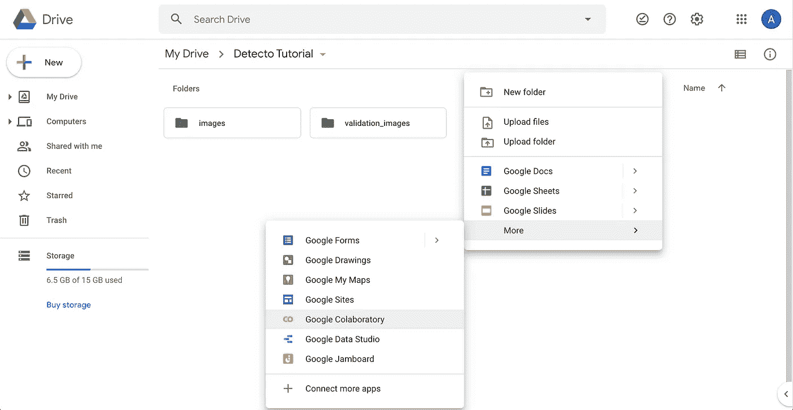

创建您的 Google Colab 笔记本

您现在应该会看到这样的界面:

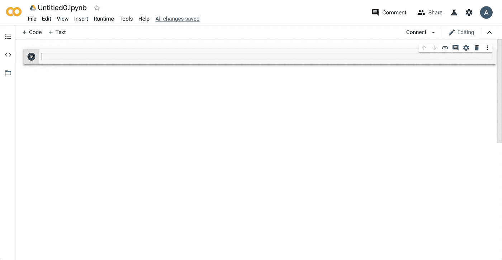

Google Colab 笔记本环境。点击了解更多关于环境的信息[。](https://colab.research.google.com/notebooks/intro.ipynb)

5.给你的笔记本起个名字，然后进入编辑->笔记本设置->硬件加速器，选择 GPU

6.键入以下代码以“挂载”您的驱动器，将目录更改为当前文件夹，并安装 Detecto:

为了确保一切正常，您可以创建一个新的代码单元并键入`!ls`来检查您是否在正确的目录中。

# **训练一个定制模型**

最后，我们现在可以在自定义数据集上训练模型了！正如所承诺的，这是容易的部分。它只需要 4 行代码:

让我们再次分解我们对每行代码所做的工作:

1.  进口探测器模块
2.  从“images”文件夹创建了一个数据集(包含我们的 JPEG 和 XML 文件)
3.  初始化一个模型来检测我们的自定义对象(外星人、蝙蝠和女巫)
4.  在数据集上训练我们的模型

根据数据集的大小，这可能需要 10 分钟到 1 个多小时的时间，因此请确保您的程序在完成上述语句后不会立即退出(即，您使用的是 Jupyter/Colab 笔记本，它在活动时会保留状态)。

# **使用训练好的模型**

现在你有了一个训练好的模型，让我们在一些图像上测试它。要从文件路径中读取图像，可以使用`detecto.utils`模块中的`read_image`函数(也可以使用上面创建的[数据集](https://detecto.readthedocs.io/en/latest/api/core.html#detecto.core.Dataset)中的图像):

如您所见，模型的`predict`方法返回一个由 3 个元素组成的元组:标签、框和分数。在上面的例子中，模型预测到一个外星人(`labels[0]`)在坐标【569，204，1003，658】(`boxes[0]`)处，置信度为 0.995 ( `scores[0]`)。

根据这些预测，我们可以使用`detecto.visualize`模块绘制结果。例如:

使用您收到的图像和预测运行上面的代码，应该会产生如下所示的结果:

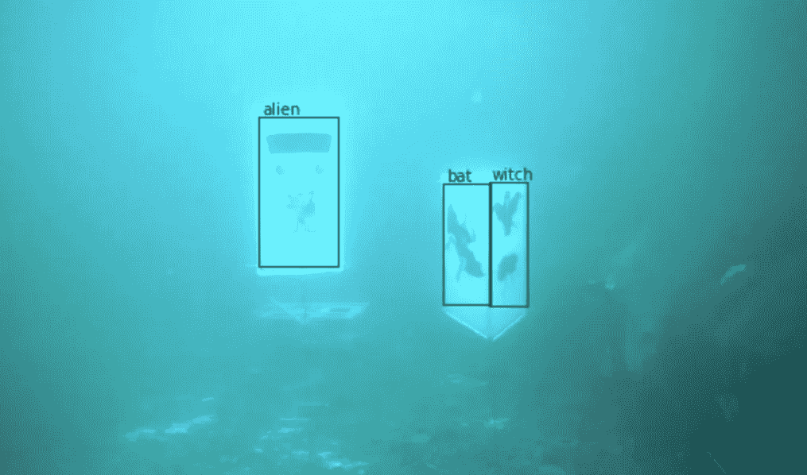

如果您有视频，您可以在其上运行对象检测:

这将接收一个名为“input.mp4”的视频文件，并生成一个包含给定模型预测的“output.avi”文件。如果你用 [VLC](https://www.videolan.org/vlc/index.html) 或其他视频播放器打开这个文件，你应该会看到一些有希望的结果！


视频检测器产生的输出短片

最后，您可以从文件中保存和加载模型，允许您保存您的进度并在以后返回:

# 高级用法

你会很高兴地知道 Detecto 不仅仅局限于 5 行代码。比方说，这个模型没有你希望的那么好。我们可以通过用 [torchvision transforms](https://pytorch.org/docs/stable/torchvision/transforms.html) 扩充我们的数据集并定义一个定制的 [DataLoader](https://detecto.readthedocs.io/en/latest/api/core.html#detecto.core.DataLoader) 来提高它的性能:

这段代码对数据集中的图像应用随机水平翻转和饱和度效果，增加了数据的多样性。然后我们用`batch_size=2`定义一个 DataLoader 对象；我们将把它传递给`model.fit`而不是数据集，告诉我们的模型分批训练 2 张图像，而不是默认的 1 张。

如果您之前创建了一个单独的验证数据集，现在是在培训期间加载它的时候了。通过提供一个验证数据集，`fit`方法返回每个时期的损失列表，如果是`verbose=True`，那么它也会在训练过程中打印出来。下面的代码块演示了这一点，并自定义了其他几个培训参数:

所得到的损失图应该或多或少地减少:

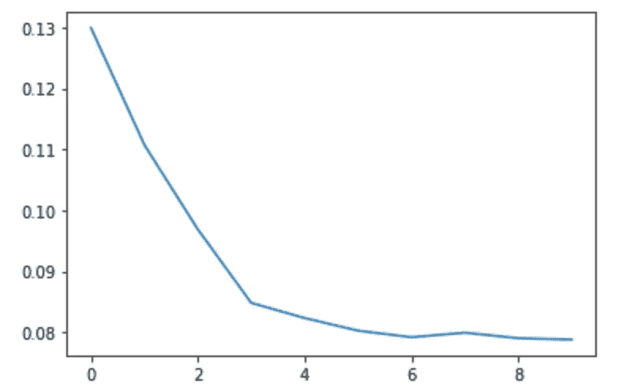

为了更加灵活和控制你的模型，你可以完全绕过 Detecto`model.get_internal_model`方法返回所使用的底层 torchvision 模型，您可以随意修改。

# 结论

在本教程中，我们展示了计算机视觉和物体检测并不具有挑战性。你需要的只是一点时间和耐心来创建一个带标签的数据集。

如果您有兴趣进一步探索，请查看 GitHub 上的 [Detecto 或访问](https://github.com/alankbi/detecto)[文档](https://detecto.readthedocs.io/en/latest/)以获得更多教程和用例！

 [## alankbi/detecto

### Detecto 是一个 Python 包，它允许你用…

github.com](https://github.com/alankbi/detecto)