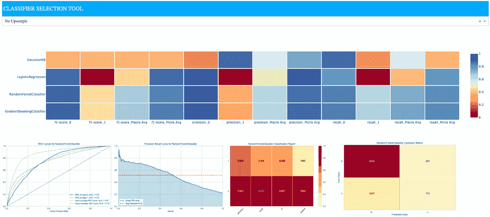

# 为二进制分类模型选择构建一个 Dash Web 应用程序

> 原文：<https://towardsdatascience.com/build-a-dash-web-app-for-binary-classification-model-selection-56ee1636b461?source=collection_archive---------44----------------------->

## [现实世界中的数据科学](https://towardsdatascience.com/data-science-in-the-real-world/home)

## 自动管理机器学习视觉诊断的汇编



作者图片

这篇文章展示了我开发的[分类器 dash](https://github.com/taylorplumer/classifiers-dash) web 应用工具的一个用例，该工具用于自动管理二进制分类问题的机器学习视觉诊断汇编。这款网络应用程序提高了现有从业者的效率，增强了他们在建模选择过程中的交互性。此外，崭露头角的数据科学家和机器学习工程师可以获得一个额外的好处，即磨练他们对常见分类评估评分指标和基准的直觉。

## 灵感

这篇文章和网络应用的灵感来自于 [Yellowbrick](https://www.scikit-yb.org/en/latest/) 项目的[问题](https://github.com/DistrictDataLabs/yellowbrick/issues/1044)“创建多个模型分数的一目了然的表示，以便我可以轻松地比较和对比不同的模型实例。”这种工具也有助于分析师在进入*超参数调整*阶段之前获得对*算法选择*的直觉。

利用 [Dash by Plotly](https://plotly.com/dash/) 的交互性，我扩展了这个概念，以合并现有的黄砖分类可视化，命名为 visualizers。在上面的标题图像中可以找到我们将在此用例中使用的内容的快照。

## 用例

本例中使用的数据是来自 UCI 机器学习知识库的[‘信用卡客户数据集的默认值’](http://archive.ics.uci.edu/ml/datasets/default+of+credit+card+clients)。该数据集由台湾的客户违约付款组成。我们将使用它对分类的二元结果(可信或不可信的客户端)的模型性能进行评分。

数据集包括一个二元变量“默认付款”，作为响应变量。有 23 个预测变量，包括人口统计信息、过去付款历史、账单金额等。

数据已经被清理了，所以我们可以进入有趣的部分——建模！

## 用于模型选择的模型

在深入研究该工具之前，提供该工具在工作流中最有用的位置的上下文会很有帮助。我是 Arun Kumar 等人提供的[模型选择三重](http://pages.cs.wisc.edu/~arun/vision/SIGMODRecord15.pdf)框架的粉丝

这三个阶段是:


Benjamin Bengfort 演讲的幻灯片，[“用 Scikit-Yellowbrick 可视化模型选择:开发可视化工具简介”](https://www.slideshare.net/BenjaminBengfort/visualizing-model-selection-with-scikityellowbrick-an-introduction-to-developing-visualizers)

我们的用例位于“算法选择”阶段，因为我们将使用 web 应用程序来缩小搜索空间，而不是执行详尽的搜索。

*那么，为什么要用仪表板来分析模型性能呢？* **因为视觉诊断对于建立更有效的机器学习的直觉至关重要！**

..仪表板的交互性有助于获得更加无缝的 UX 体验，因为您可以避免在笔记本电脑上查看型号性能输出时看似无限的滚动。如果有大量支持数据可视化，这种滚动密集型练习尤其如此。

## 装置

首先，克隆 Github 存储库

```
git clone [https://github.com/taylorplumer/classifiers-dash](https://github.com/taylorplumer/classifiers-dash)
```

创建虚拟环境(推荐)后，可以使用以下命令安装依赖项:

```
pip install -r requirements.txt
```

## 配置

config.py 将是最需要动手操作的文件，因为我们将在这里为手头的问题进行必要的配置。

在此使用案例中，我们将探索各种流行的二元分类算法，这些算法可用作 sklearn 估计器，如高斯朴素贝叶斯、逻辑回归、随机森林和梯度增强。

使用的黄砖可视化工具来自现有分类可视化工具的[套件。](https://www.scikit-yb.org/en/latest/api/classifier/)

*请注意，需要导入克隆的 repo 中默认情况下未提供的任何 sklearn 评估程序和/或 yellowbrick 可视化程序。

## 数据处理

在项目的根目录中运行以下命令来设置数据和图像。目标变量应该是 csv 文件中的第一列，然后是许多预测变量。

```
python3 process_data.py credit.csv
```

保存的输出如下:

1.  sk learn . metrics . classification _ report 中每个模型的模型分数的 csv 文件
2.  黄砖可视化保存为 png 文件。

## 仪表板应用

在描述组件之前，让我们运行 Dash Plotly web 应用程序。

```
python3 app.py
```

该应用程序将在本地运行于 [http://127.0.0.1:8050/](http://127.0.0.1:8050/) (或您选择的任何端口)。我们直播了！

部署到 Heroku 的演示可在以下地址查看:[https://classifier-dash-app.herokuapp.com/](https://classifier-dash-app.herokuapp.com/)

该演示不适用于移动设备，因此请在桌面/PC 上查看完整功能。

web 应用程序由三个组件组成:

1.  一个下拉菜单，允许用户查看带有训练数据的模型，这些数据可以是原样的，也可以是合成的上采样数据，以解决任何类别不平衡的问题。

*   默认情况下没有上采样
*   utils 目录中的 upsample.py 模块可以提供有关上采样方法的详细信息。

2.包含每个 sklearn 模型的精确度、召回率和 f1 分数的热图，以及以下内容:

*   宏观平均值:平均每个标签的未加权平均值
*   加权平均值:平均每个标签的支持加权平均值

3.将鼠标悬停在 sklearn 模型的热图中的关联行上时，将出现 matplotlib 图的模型特定图像，这些图像是利用 Yellowbrick 分类可视化工具填充的。

*   ROCAUC:绘制接收器工作特性和曲线下面积的图形。
*   精确度-召回曲线:绘制不同概率阈值的精确度和召回率。
*   分类报告:可视化的分类报告，以热图的形式显示每个类别的精确度、召回率和 F1 值。
*   混淆矩阵:类别对混淆矩阵的热图视图。

## 它告诉我们什么？

我们可以清楚地看到，高斯朴素贝叶斯模型表现不佳(至少在给定参数集的情况下)。由于类别不平衡，逻辑回归模型是有偏差的，并且对于阳性病例在精确度和召回率上表现不佳。我们看到，当向上采样应用于训练数据时，它的性能更好，但它仍然没有达到类似于随机森林和梯度增强模型所代表的集成方法的性能。

可视化暗示集成方法表现更好，但是我们能更好地区分哪一族集成方法更好吗——bagging 还是 boosting？这可以通过编辑 config.py 文件合并额外的树和 AdaBoost 分类器来完成。

初始诊断还有助于告知我们如何分配时间向前发展，即查看决策树中的特征重要性，然后在这些算法中进行更详尽的超参数调整。

机器学习是一个迭代的探索过程，所以我们可能会在模型选择的三个阶段之间来回穿梭。

## 后续步骤

如果你对 process_data.py 和 app.py 文件感兴趣，那么我鼓励你去看看 [github repo](https://github.com/taylorplumer/classifiers-dash) ！

如果您有任何问题和/或想法要使该工具更加有效，请提出问题。编码快乐！

[1]库马尔、阿伦&麦肯、罗伯特&诺顿、杰弗里&帕特尔、吉格内什。模型选择管理系统:高级分析的下一个前沿(2016)，ACM SIGMOD 记录。44.17–22.10.1145/2935694.2935698.