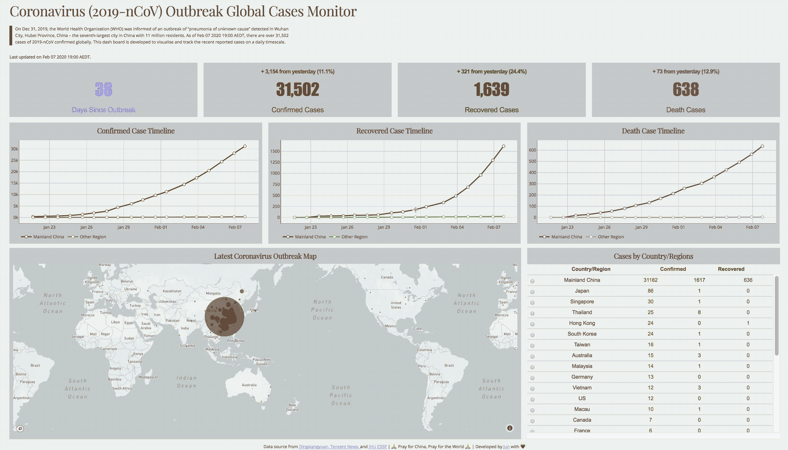
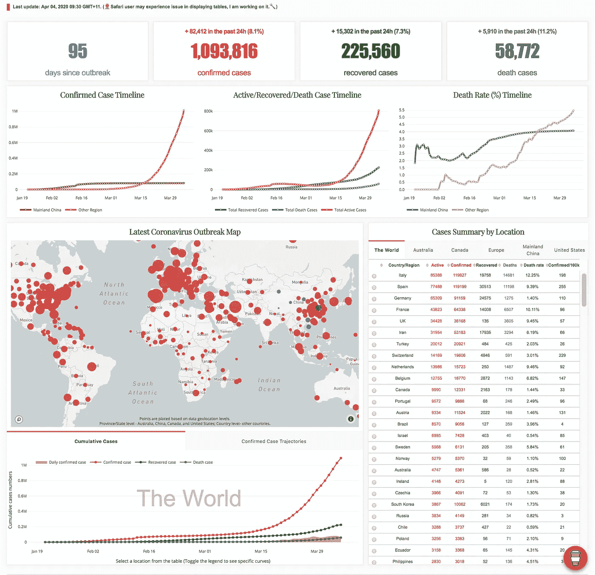
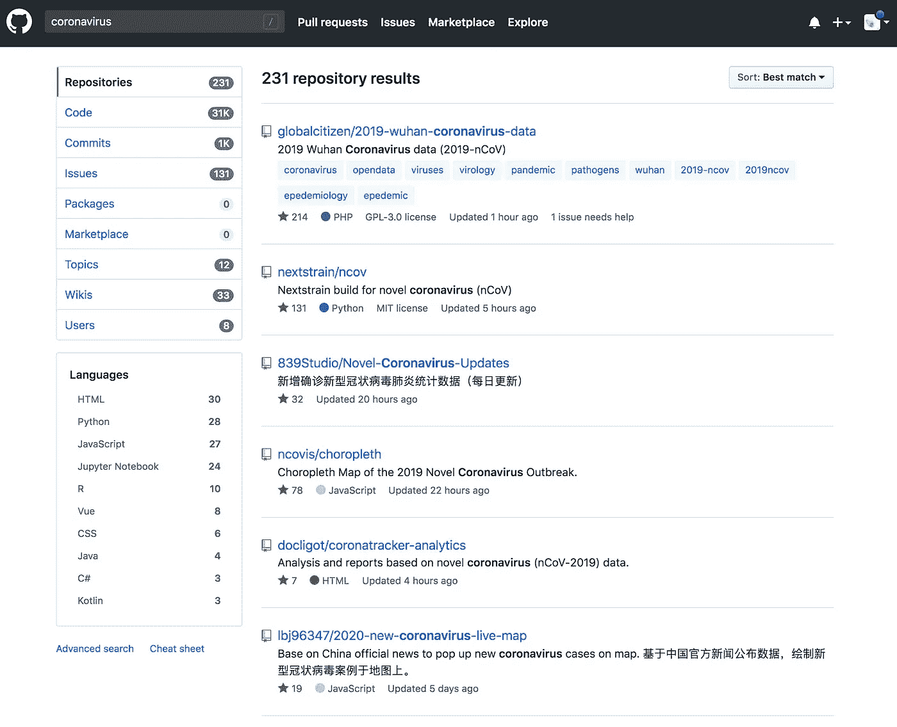
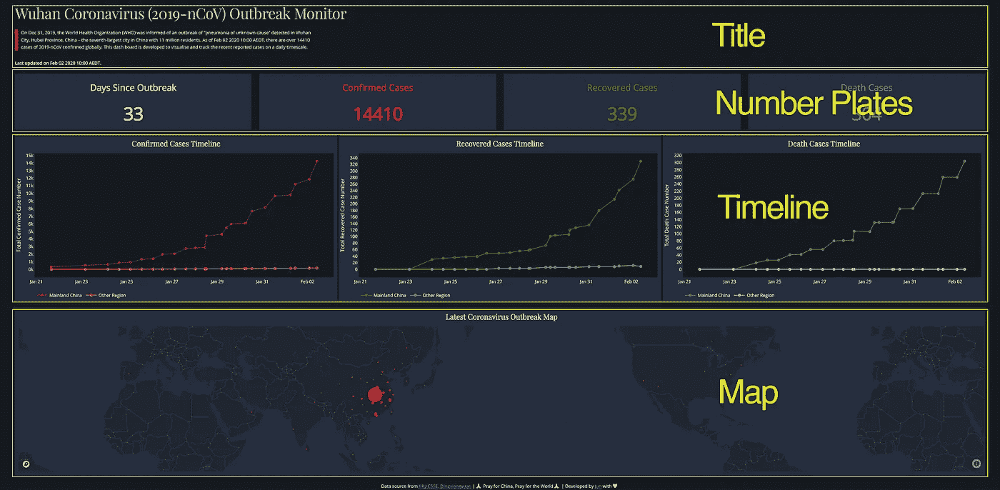
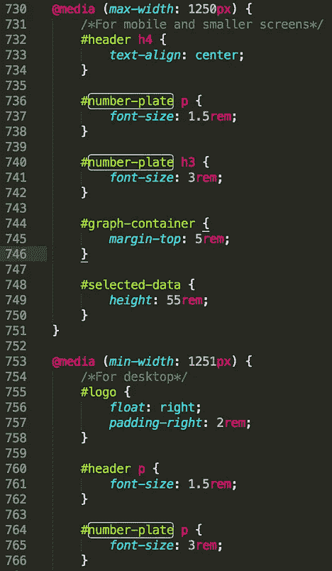
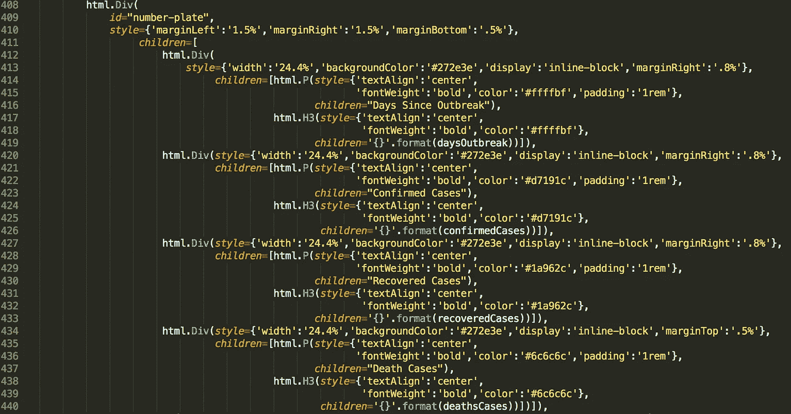
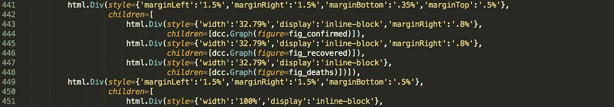
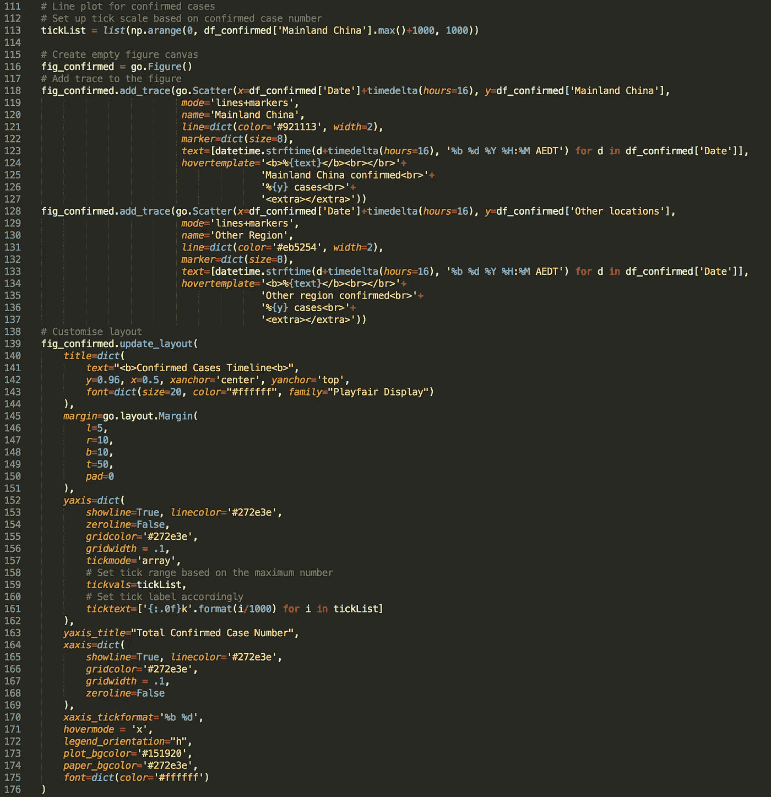

# 使用 Dash 构建一个仪表板来跟踪冠状病毒的传播

> 原文：<https://towardsdatascience.com/build-a-dashboard-to-track-the-spread-of-coronavirus-using-dash-90364f016764?source=collection_archive---------10----------------------->



[新冠肺炎全球病例监测](https://dash-coronavirus-2020.herokuapp.com/)

## 全球冠状病毒(新冠肺炎)确诊、康复和死亡病例的实时视图

*更新:仪表板自从这篇帖子后变化很大，* [*看看吧！*](https://dash-coronavirus-2020.herokuapp.com/)



上个月我发表了四篇帖子，和大家分享我使用`matplotlib`的经验。得益于对给定[图](/create-an-infographic-using-matplotlib-3fbb546c1628)上元素的完全控制，`matplotlib`被视为数据可视化的基本 python 库，并被许多其他库(如`seaborn`和`pandas`)用作绘图模块。这也是为什么我认为学习`matplotlib`是成为数据科学从业者必不可少的一部分，这有助于建立对数据可视化工具背后逻辑的深入理解。

然而，巨大的灵活性伴随着错综复杂的层次和复杂的语法。使用`matplotlib`制作一个可发布的情节通常会令人望而生畏。换句话说，`matplotlib`不应该是我们唯一的数据可视化工具，我们需要在我们的工具箱中始终配备备选方案来处理不断发展的需求。

当需要效率、互动和基于网络的可视化时，`[plotly](https://plot.ly/graphing-libraries/)`和`[dash](https://dash.plot.ly/introduction)`是必须学习的工具。这些工具的美妙之处在于，我们不需要掌握 JavaScript、CSS 和 HTML 来制作交互式 web 可视化，因为这两种工具已经为我们处理好了。它们用 JavaScript(例如 React.js、Plotly.js 和 d3.js)将我们联系起来，使图形反应灵敏而且美观。我们需要提供的只是纯 python 环境下的简单代码。

在这篇文章中，我将在抽象的层面上剖析一个仪表板的代码，我建立这个仪表板是为了跟踪最近爆发的冠状病毒(新冠肺炎/2019-nCoV)的传播。从[这个仪表板](https://dash-coronavirus-2020.herokuapp.com/)，你可以实时了解全球冠状病毒病例的数量，包括确诊、痊愈和死亡病例，以及它们在世界地图上的分布。

像往常一样，你可以从[我的 Github](https://github.com/Perishleaf/data-visualisation-scripts/tree/master/dash-2019-coronavirus) 访问所有需要的数据和 jupyter 笔记本。由于它仍在积极开发中，本文中使用的版本可能与您下载的版本不同。然而，本文的主要框架还是一样的。此外，请随时提供您的建议或帮助，使这个仪表板更加有用和准确。

> 仪表板是实现一个或多个目标所需的最重要信息的可视化显示；整合并排列在单个屏幕上，以便可以一目了然地监控信息
> 
> -斯蒂芬·诺什

## **框架**

为了帮助你快速理解代码(可以从 app.py 中找到代码)，我先声明一下它们背后的逻辑。一般来说，通过`dash`构建这个 dashboard 应用程序的框架(即我的思考过程)遵循:**数据准备- > Dashboard 布局确定- >内容生成和插入**，尽管你可能会在代码中发现第三部分发生在第二部分之前。那是 Python 阅读代码的方式，不是我们。记住这个框架，让我们深入研究代码。

## 数据收集和清理

许多来源为跟踪冠状病毒的传播提供了实时数据(如在 GitHub 上搜索“冠状病毒”，有 231 个储存库，图 1)。至于我的仪表板，我从两个来源(即[约翰霍普金斯 CSSE](https://docs.google.com/spreadsheets/d/1yZv9w9zRKwrGTaR-YzmAqMefw4wMlaXocejdxZaTs6w/htmlview?usp=sharing&sle=true#) 和[丁香园](https://ncov.dxy.cn/ncovh5/view/pneumonia?scene=2&clicktime=1579582238&enterid=1579582238&from=singlemessage&isappinstalled=0))收集数据，他们在那里为这次突发公共事件保存了及时准确的病例数。因为这部分的代码非常简单，所以我在这里只对关键点做简单的说明。



图 1 | Github 上关于冠状病毒的知识库

首先，在这个阶段，我每天手动下载并检查这两个来源的数据，并将其存储在 Excel 数据表中。随着紧急情况的发生，Excel 文件中的工作表数量也在增加。我使用了`pandas.ExcelFile()`函数(你需要安装`xlrd`库来使用这个函数)将工作表作为独立的数据帧导入，并存储在一个字典对象中(即`dfs`)。因此，我可以通过使用字典的键(即`keyList`)来访问任意给定日期的数据。

读入 excel 数据表并将数据存储在字典中

第二，由于我们将在全球地图上制作散点图，以显示冠状病毒病例的分布，每个位置都应分配有坐标(即纬度和经度)。这里我使用了由 [OpenCageGeocode](https://opencagedata.com/) 提供的服务来调用坐标。由于使用限制(即每天 2500 个 API 请求)，重复调用每个工作表中每个位置的坐标是不可行的。我们只需要调用最新日期(即`dfs[keyList[0]]`)的数据坐标，并在地图上绘制最新数据。

使用 OpenCageGeocode 调用坐标

## 仪表板组件和布局

由于它是一个基于 web 的应用程序，因此不可避免地要处理布局的 HTML 结构。不要慌，不是我们自己写 HTML，`dash`给我们提供了`dash-html-components`库来处理。我们基本上只需要使用 Python 结构组成布局。请注意，布局设计有时会非常令人沮丧，但是，我们将在这个仪表板中坚持使用非常基本的布局。

首先，我们需要了解`html.Div()`。您可以将它视为一个层次树结构中内容的**容器/部分**。如图 2 所示，仪表板中有四个容器(实际上应该是五个，包括脚注)。具体来说，在标题容器中，它有一个标题(即`html.H4()`)和两个段落(即`html.P()`)组件。对于号牌容器，它有四个子容器(即`html.Div()`)，每个子容器由一个段落(即`html.P()`)和一个标题(即`html.H3()`)组成。简单吧？我相信您现在可以找出代码中剩余的容器了。



图 2 |布局图

在`html.Div(id, style={}, children=[])`中有三个参数，其中`id`是可选的，如果你不想使用`css`文件(`css`文件是一个用于格式化网页内容的级联样式表文件)来样式化子内容。简单来说，通常在你的应用程序文件夹(也就是我们这里的`dash-2019-coronavirus`文件夹)里面，会有一个`assets`文件夹，里面包含了`css`文件，用来指定应用程序的格式。您指定一个`style`(例如，边距、字体和颜色等。)和`id`在`css`文件中，如果你想在应用布局中使用这个样式，而不是每次想使用相同的样式时都要在`html.Div()`内重复添加`style={}`，只需要在`html.Div()`内分配相同的`id`即可。因此`dash`知道如何使用`assets`文件夹中的`css`文件中相应的`style`来样式化`html.Div()`容器中的子内容。

例如，从图 3 中可以看到，我在`html.Div()`容器中指定了一个`id=”number-plate”`(右面板第 409 行)，相应地，在`css`文件(左面板)的第 736、740 和 764 行，我为与这个`id`相关的内容设置了不同的字体大小，以不同的屏幕尺寸显示(例如桌面或平板电脑)。因此，当用户在一个小屏幕上打开应用程序时，`dash`知道对`html.P()`元素中的字体使用 1.5 雷姆，对`html.H3()`中的字体使用 3 雷姆(‘雷姆’是相对于根 em 设置的单位，为了不使你进入睡眠状态，我们暂时跳过这一点)。除了这个，我主要用 python 代码设计组件，因为你可以在每个容器中找到`style={}`。



图 3 |与 html 的应用程序(左)和 python 代码相关联的 css 文件。Div()牌照部分(右)

我们需要知道的最后一件事是，**在每个** `**html.Div()**` **容器中，样式设置为** `**‘display’:‘inline-block’**` **，它的子元素按照从左到右、从上到下的顺序填充那个容器中的空白空间。**例如，在号牌容器(图 2)中，当前四个号牌的宽度分别设置为屏幕全宽的 24.4%(即`style={‘width’:‘24.4%’}`，图 3，左侧面板，第 413、420、427 和 434 行)。因此，他们首先从左到右填满一行中的所有空白空间。假设现在你有一个同样宽度的第五个号码牌，它将自动放在同一个容器中第二行的开头。

> 要成为一个实用的房子，一旦我们完成了建造，接下来的事情就是把家具搬进房子里。

## **内容生成和插入**

从图 4 中可以看出，我们为图形组件构造了子容器(即三个散点图和地图)。每个子容器都有一个名为`dcc.Graph()`的子组件。这个函数来自`dash_core_components`库，可以用来渲染任何 plot-powered 数据可视化，作为`figure`参数传递。换句话说，我们使用`plotly`制作一个漂亮的图形，并将其传递给`dcc.Graph()`并且`dash`知道如何处理该图形，就是这样。



图 4 |内容插入代码

如果您熟悉`matplotlib`背后的语法逻辑，您会发现`plotly` 图形对象(图 5)的语法也很容易理解。它们基本遵循相同的逻辑。我们首先通过调用`fig = go.Figure()`实例化一个空画布。然后加上`trace`(类似于`matplotlib`中`axes`的概念)。在`plotly`中，我们可以通过`figure.update_layout()`定制图表中的几乎所有元素。



图 5 |第一个散点图的代码

## 在 Heroku 中运行应用程序和部署

要在本地运行应用程序，只需在包含所有其他必需文件(即 assets/、data.xlsx 等)的文件夹中键入`python app.py`。).将`http`站点复制并粘贴到您的首选浏览器中，如果一切正常，您将看到该应用程序。

```
Running on [http://127.0.0.1:8050/](http://127.0.0.1:8050/)
Debugger PIN: 707-347-654
 * Serving Flask app "app" (lazy loading)
 * Environment: production
   WARNING: This is a development server. Do not use it in a production deployment.
   Use a production WSGI server instead.
 * Debug mode: on
```

相反，如果您想要公开共享您的应用程序，我们需要将它部署在服务器上。我个人发现 Heroku 是一个非常用户友好的选项，并提供了[分步教程](https://devcenter.heroku.com/articles/getting-started-with-python)，dash 也提供了[教程](https://dash.plot.ly/deployment)用于在 Heroku 中部署。有一点需要注意，我用`conda create`为我的应用程序创建了一个虚拟环境，而不是像`dash`教程中所说的那样使用`virtualenv`。

这里有一些链接和帖子，我在学习如何构建这个 Dash 应用程序时发现很有用:

*   [用 plotly 绘制图形的多种方法](https://plot.ly/python/creating-and-updating-figures/)
*   [学习布局](https://learnlayout.com/)
*   [学习编写 HTML 和 CSS 代码](https://learn.shayhowe.com/html-css/)
*   [https://dev center . heroku . com/articles/getting-started-with-python # deploy-the-app](https://devcenter.heroku.com/articles/getting-started-with-python#deploy-the-app)
*   [https://radumas.info/blog/tutorial/2017/08/10/codeday.html](https://radumas.info/blog/tutorial/2017/08/10/codeday.html)
*   [https://Timothy renner . github . io/data science/2017/08/08/finding-Bigfoot-with-dash-part-1 . html](https://timothyrenner.github.io/datascience/2017/08/08/finding-bigfoot-with-dash-part-1.html)
*   [https://medium . com/a-r-g-o/using-plot Lys-dash-to-deliver-public-sector-decision-support-dashboards-AC 863 fa 829 FB](https://medium.com/a-r-g-o/using-plotlys-dash-to-deliver-public-sector-decision-support-dashboards-ac863fa829fb)

和往常一样，我欢迎反馈、建设性的批评以及听到关于您的数据科学项目的信息。你可以在 Linkedin 上找到我，现在也可以在我的网站上找到我。