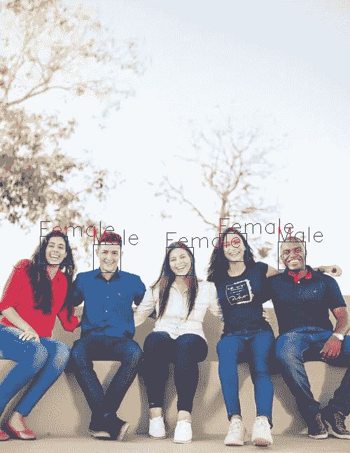
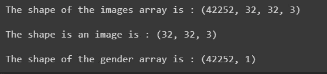
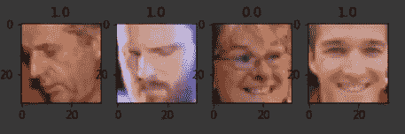
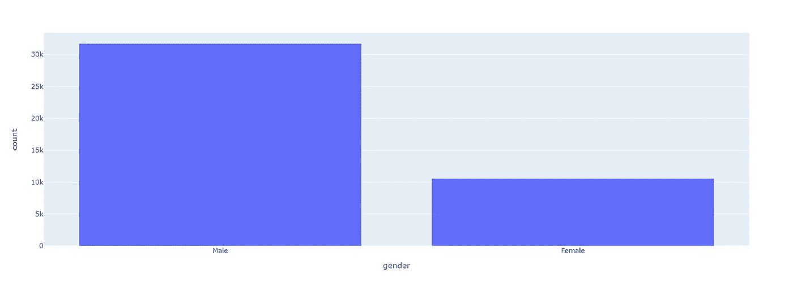
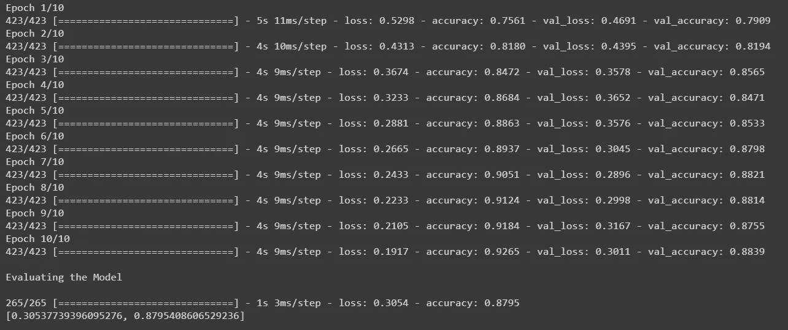
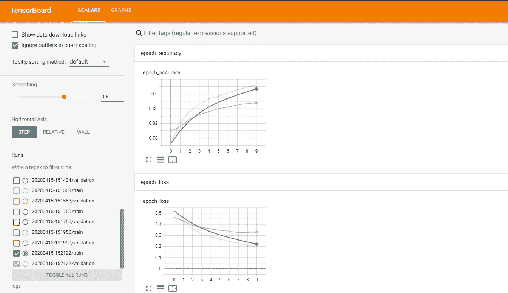
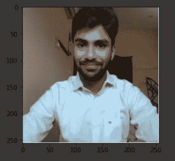
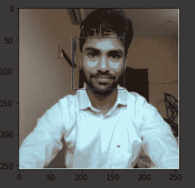

# 使用 TensorFlow 和 Keras 在 Google Colab 中构建性别分类器

> 原文：<https://towardsdatascience.com/build-a-gender-classifier-in-google-colab-using-tensorflow-keras-and-tensorboard-2cd6f952d8aa?source=collection_archive---------30----------------------->

## 使用 TensorFlow 和 Keras 在 Google Colab 中从头开始构建一个基于 CNN 的性别分类器。使用 TensorBoard 可视化模型的训练



在这篇文章的结尾你将会得到什么。(来源: [Unsplash](https://images.unsplash.com/photo-1517486808906-6ca8b3f04846?ixlib=rb-1.2.1&ixid=eyJhcHBfaWQiOjEyMDd9&auto=format&fit=crop&w=500&q=60) )

你好朋友们。在本文中，我们将使用 TensorFlow 和 Keras 提供的 API 来构建一个基于 CNN 的性别分类器。我们将在 Google Colab 上编写和执行代码。Colab 提供免费的 GPU 服务。我们将使用这些来快速训练我们的模型。

我将使用来自 IMDB-WIKI 数据集的维基百科图片。我已经对数据集进行了预处理，从图像中裁剪出所有的脸，并将它们作为对象存储在。pickle 格式在我的 Google Drive 里。如果你已经准备好数据集，你可以继续，如果你想准备一个和我在这篇文章中使用的数据集一样的数据集，你可以阅读我的另一篇文章，在那里我解释了如何创建一个 Colab 笔记本，处理数据并存储它们。

[](https://medium.com/@nachi2muthu13/preprocess-and-prepare-a-face-dataset-ready-for-cnn-models-885867907eb0) [## 预处理和准备面部数据集，为 CNN 模型做好准备

### 苦苦寻找数据集？，让我们使用…从 IMDB-WIKI 数据集为 CNN 模型准备一个现成的人脸数据集

medium.com](https://medium.com/@nachi2muthu13/preprocess-and-prepare-a-face-dataset-ready-for-cnn-models-885867907eb0) 

在这篇文章中，我解释了每一行代码，最后，你会有信心自己构建一个多类分类器。

# 让我们编码

在 Google Colabs 上创建一个新的笔记本，并安装您的 Google drive。不要错过在您的笔记本中将您的运行时类型更改为 GPU。

如果你是 Google Colab 的新手，不知道怎么做，你可以在我的[以前的文章](https://medium.com/@nachi2muthu13/preprocess-and-prepare-a-face-dataset-ready-for-cnn-models-885867907eb0)中学习。

首先，让我们导入这段代码中需要的所有包。在一个新的单元格中导入所有的包。

代码块 1:导入所需的包。

现在我们已经导入了所有需要的包，让我们加载我存储在 Google Drive 中的数据集(PS:我已经在我的另一篇文章中展示了如何预处理数据并存储它。如果你没有自己的数据集，请阅读它。我已经在前面的部分添加了链接)。

代码块 2:导入数据集。

**第 1 行:**读取存储的数据。二进制模式的 pickle 格式。

**第 2 行:**使用 pickle 包将其转换为 python 对象。

**第 4–5 行:**从加载的数据集中单独提取图像和性别数据。

**第 6 行:**显示图像数组的形状，单个图像的形状和性别数组的形状。



图 1:显示输入的形状

在上面的输出中，我们可以看到有 42252 个图像，每个都是 32x32 的 RGB 图像。我们还有一个 2D 数组格式的每张图片的性别标签，每个子数组包含性别值(1.0:男性，0.0:女性)。为了更好地理解，您可以打印数组并进行检查。

接下来，让我们看看我们将使用什么样的图像来训练模型。

代码块 3:查看我们拥有的图像

**第 4–11 行:**从我们的数据集中打印 4 张随机图像并显示它们。



正如您在上面的输出中看到的，我们将用来训练我们的模型的图像只包含人脸及其性别。

我们现在将可视化我们的数据分布，以深入了解我们的数据。

代码块 4:绘制数据集的直方图。

**第 1–12 行:**我创建了男性和女性两个类别，并将其添加到“性别绘图”变量中。使用这些分类数据，我们可以使用 Plotly 绘制直方图。



图 2:我们数据集的直方图。

我们有 30k 男像，10k 女像。这些图像足够了，因为我们正在执行二元分类。

我们现在开始登船。执行下面的代码

```
%tensorboard --logdir "logs"
```

在“logdir”参数中，您应该给出保存模型日志数据的目录的路径。TensorBoard 将在给定的目录中搜索日志并显示出来。如果您想将日志文件保存在 Google Drive 中，您可以给出相应的路径。在几个步骤中，我将向您展示如何向我们的模型添加回调来保存日志文件。

是时候创建我们的 CNN 模型了。首先，我们将模型所需的所有层添加到一个列表中，然后使用 Keras 中的顺序类创建模型。虽然这是一个二进制分类问题，而不是在最后一层使用 sigmoid 激活函数，但我使用了“二进制交叉熵”作为损失函数。我已经把这个问题当作一个只有两类的多类分类问题。我这样做是为了让你知道如何使用 CNN 实现多类分类。

代码块 5:创建我们的 CNN 模型。

**第一行:**模型中的第一层是输入层。我们将图像的形状作为参数传递给它。

**第 3 行:**创建一个元组，其中包含我们模型中特定 Conv2D 层将分别拥有的过滤器数量。

**第 5–11 行:**遍历上面创建的元组，创建 Conv2D 层，Conv2D 层具有“Relu”激活功能。然后为每个 Conv2D 函数添加一个“BatchNormalization”函数和 MaxPooling2D。MaxPooling2D 的池大小为 2x2，每步 2 步。您可以更改这些值。

**第 13–26 行:**每当在 Conv2D 层之后添加一个密集层时，应该在它们之间添加一个展平层。该图层会将 Conv2D 图层的权重从 2D 格式转换为密集图层可以使用的一维格式。每个密集层被赋予一个“Relu”激活函数和“BatchNormalization”函数。添加了 Dropout 函数，以防止模型过拟合。函数内部传递的参数是丢弃概率，如果传递 0.1，则意味着 10 个输入中有 1 个将被随机丢弃。

**第 27–28 行:**当我们使用 2 个类进行分类时，我们使用输出大小为 2 的密集层。最后一个密集图层中输出大小的数量与您希望模型进行分类的类的数量相同。我们还将 softmax 层用于分类问题，因为它为每个预测返回一个列表，该列表包含图像属于相应类别的概率，并且该图像被分配到具有最高概率的类别。

第 31 行:然后，我们将所有创建的图层添加到一个序列模型中。向顺序模型添加层还有其他方法，您可以参考相关文档。

**第 32–34 行:**我们通过指定优化函数和损失函数来编译模型。因为它被视为多类分类问题，所以我们使用“分类交叉熵”作为损失函数。当针对二元分类问题创建模型时，我们必须使最后一个密集层中的输出为 1，并且仅对最后一层使用 sigmoid 激活函数。与此同时，所使用的损失函数应该是“二元交叉熵”

**第 35 行:**我们为每个模型训练指定文件夹名。我们使用模型被训练的时间作为文件夹名称。

如果你想你的模型日志存储在你的 Google Drive 中，那么你必须以这样的格式指定路径。

例如`log_dir = "drive/My Drive/Colab Notebooks/Tutorial/Gender Classifier/logs/" + datetime.datetime.now().strftime("%Y%m%D-%H%M%S")`

启动 TensorBoard 时，应提供相同的路径，直到“日志”文件夹。`log_dir = "drive/My Drive/Colab Notebooks/Tutorial/Gender Classifier/logs`。

**第 36 行:**在一个名为 callbacks 的变量中，我们创建了一个所有回调的列表，并将其传递给模型。这里我们只创建一个回调来保存日志供 TensorBoard 使用，我们从“keras.callbacks”调用 TensorBoard 类，并将保存日志的路径作为参数传递。

是时候训练我们的模特了。我们将使用 80:20 的比例进行培训和测试。训练数据被进一步分成 80:20 用于训练和验证数据。

代码块 6:训练模型并评估它。

**第 1–3 行:**我们将数据分为训练数据和测试数据。

**第 4 行**:我们将只使用 80%的训练数据来训练模型，其余的将用作验证数据。因此将“数量 _ 训练 _ 示例”设置为可用于训练的图像数量的 80%。

**第 5 行:**设置批量为 64。出于训练目的，我们的训练数据将被分成多个批次，每个批次包含 64 幅图像。

**第 6–8 行:**我们正在从模型对象中调用 font 函数，以便我们的模型可以使用我们的数据进行训练。
**Epoch** 设置为 10，这意味着我们为训练提供的全部数据将用于训练模型 10 次。一个历元意味着使用给定的数据执行一次迭代训练，所提供的全部数据将被我们的模型使用一次。
**steps_per_epoch** 是提供给我们模型的数据批次数。当达到 steps_per_epoch 计数时，模型知道特定的 epoch 已经结束。
**batch_size** 是一批数据中出现的图像数量。
如果设置为 false，则模型将按照提供给它的顺序获取数据。建议将此设置为 true，这样模型就不会被训练成特定的类。
**validation_split** 是所提供的训练数据中可用于验证的部分。
**回调**是在每个时期或每个步骤结束时必须执行的功能或操作。这是我们的 TensorBoard 回调将通过的地方。

**第 11 行:**使用我们之前分割的测试数据，我们评估我们的模型的准确性，并检查是否没有发生过度拟合。

上述单元的执行为我们提供了每个时期的精确度和损失值。



图 3:模型精度和损失

正如您在上面的输出中所看到的，该模型对于我们的训练数据具有很好的准确性。验证准确性也很好，这表明我们的模型没有过度拟合数据。评估结果表明，我们的模型对未知数据也有很好的表现。现在是我们使用 TensorBoard 可视化模型训练的时候了。

向上滚动到执行命令以启动 TensorBoard 的单元格。现在，您可以看到那里显示的图表。将有一个图表用于绘制模型的准确性，另一个用于绘制损失。



图 4:可视化我们模型的训练。

如果您看不到此图表，请检查您是否为日志文件提供了正确的目录路径。TensorBoard 是一个非常强大的可视化工具，你可以用它做很多事情。如果你有兴趣了解更多信息，我推荐你观看 2017 年 TensorFlow dev 峰会。

让我们进入下一步。我们现在将从我们的计算机摄像头获取输入，并让我们的模型对图像中的人进行分类。在我们编写获取相机输入的代码之前，让我们定义一个将 RGBA 格式的图像转换为 RGB 的函数。

代码块 7:将 RGBA 图像转换为 RGB 图像。

**第 1–20 行:**该函数对图像执行数学运算以进行转换。感谢[汪锋](https://stackoverflow.com/users/1475287/feng-wang)，我从 StackOverflow 的回答中获得了这段代码。

让我们定义一个函数来使用计算机中的网络摄像头捕捉图像。由于整个笔记本都在您的浏览器上运行，我们需要编写 JavaScript 代码来使浏览器访问网络摄像头，捕捉图片并将其发送到服务器进行处理。我简单解释一下代码。除非您对使用 JavaScript 通过网络摄像头捕捉图像感兴趣，否则可以跳过这一部分。

代码块 8:通过网络摄像头捕捉图像。(来源: [advanced_outputs.ipynb](https://colab.research.google.com/notebooks/snippets/advanced_outputs.ipynb) )

**第 1 行:**我们定义了一个函数，它将我们想要的图像的大小和质量作为参数。

**第 2 行:**向 Ipython.display 包中的 JavaScript 函数传递我们用 JavaScript 编写的要执行的 set 代码。

**第 3–16 行:**我们正在创建两个元素。一个 div 来显示来自我们相机的输入流，一个 capture 按钮来点击捕获图像，“stream”包含负责视频流的类的对象。

**第 22–31 行:**代码等待点击捕获按钮。一旦它被点击，显示在输出屏幕上的视频的特定帧被捕获并转换成像素字典，然后被返回。您可以在 [MDN Web 文档](https://developer.mozilla.org/en-US/docs/Web/API/ImageData/data)中了解更多关于数据返回格式的信息。

**第 35 行:**执行里面写的 JS 代码。这里我们调用上面定义的 JS 函数。

代码块 8:将捕获的图像转换成所需的格式。

**第 5 行:**我们调用 python 函数“take_photo ”,它反过来调用 JS 函数并捕获一张照片。

**第 7–9 行:**我们根据关键字对 JS 函数返回的像素进行排序，然后将图像调整为 3D 数组格式。

**第 15 行:**由于获得的图像是 RGBA 彩色格式，我们要将其转换为 RGB 彩色格式并显示。



图 5:捕获的图像。

我们已经收到了需要分类的输入数据。我们将从图像中检测和裁剪人脸，将裁剪后的图像传递给模型，并获得其预测和显示输出。让我们定义两个函数，一个用于提取人脸，另一个用于显示带有标签的结果。

代码块 9:定义函数来处理我们的图像并显示输出。

**第 1–21 行:**此函数使用 Dlib 的基于 CNN 的人脸识别模型获取图像参数并检测其中的所有人脸，然后将它们从图像中裁剪出来。这个函数返回一个字典，包含所有的脸及其在图像上各自的坐标。

**第 23–33 行:**该函数将原始图像、裁剪后的人脸以及模型对每个人脸的预测作为其参数。它在所有面上绘制矩形框，并在这些框上添加各自的标签，然后显示图像。

是时候调用这些函数并获得输出了。

代码块 10:对图像进行分类。

**第 1 行:**我们从图像中提取人脸。

**第 3–6 行:**我们正在创建一个包含图像中所有人脸的图像数组。

**第 9–10 行:**我们预测每张人脸图像的标签。

**第 12 行:**我们调用显示分类输出的函数。



图 6:最终的分类图像。

你也可以试着把一个有多张脸的图像分类。

到此，我结束这篇文章。我希望你已经从这篇文章中学到了很多，现在可以用任何类型的对象和任何数量的类构建一个多类分类器。

我在我的笔记本上附上了一个链接供你参考。

[](https://colab.research.google.com/drive/1d_mJjJJgdx_zqEBK4WgG0f7tQ1vsMaJB) [## 谷歌联合实验室

### 性别分类器. ipynb](https://colab.research.google.com/drive/1d_mJjJJgdx_zqEBK4WgG0f7tQ1vsMaJB) 

如有任何疑问，请随时联系我。

Instagram: [nachijr4](https://www.instagram.com/nachijr4/)

电子邮件:nachi2muthu13@gmail.com

中:[纳奇穆图](https://medium.com/@nachi2muthu13)

领英:[纳奇穆图](https://www.linkedin.com/in/nachi-muthu-4351a5112/)