# 构建一个在 Kubernetes 上运行的高度可伸缩的仪表板

> 原文：<https://towardsdatascience.com/build-a-highly-scalable-dashboard-that-runs-on-kubernetes-fa2bc6271f1d?source=collection_archive---------7----------------------->

## 使用 Python，Docker 和 Google 云平台

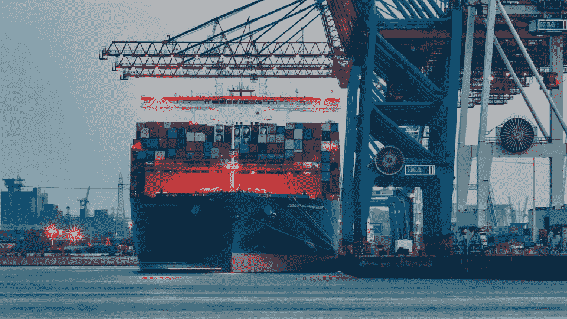

目前，一些出版物中提到了许多技术发展。这些关键词通常包括**云**、**开源**、**自动化部署**、**高度可扩展**、**容器化应用**。

在这种背景下，具体的技术如 [Python](https://www.python.org/) 、 [Docker](https://www.docker.com/) 、[云平台](https://en.wikipedia.org/wiki/Category:Cloud_platforms)和类似 [Kubernetes](https://kubernetes.io/) 的容器编排平台 *s* 经常被命名。

为了更好地理解提到的技术，我决定基于 [Flask](https://www.palletsprojects.com/p/flask/) 和 [Dash by Plotly](https://plot.ly/dash/) 构建一个仪表板，它运行在 Google 云平台上的 Kubernetes 集群上，因此具有高度的可伸缩性。

你会在 GitHub 上的我的资源库中找到完整的代码和相关文件。

这篇文章是一个更大项目的一部分。如果你也对可扩展的 web 抓取感兴趣，或者对我们如何基于 Spark 用自然语言处理准备数据，在 Docker 中打包代码并通过 Kubernetes 部署感兴趣，你会在文章末尾找到相应的链接。

## 架构概述

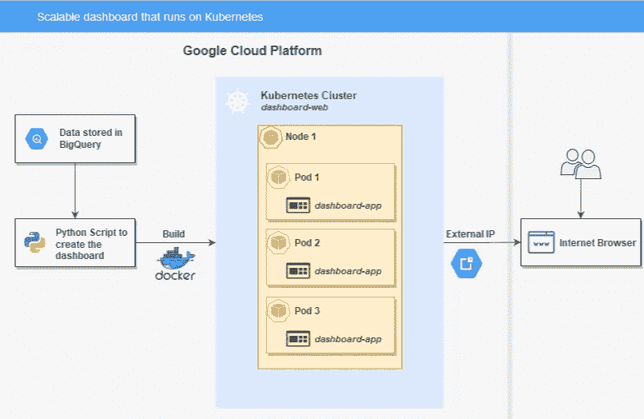

Kubernetes 上可扩展仪表板的架构

数据存储在 BigQuery 表中，由 python 脚本读取，该脚本在 Docker 容器中执行。Kubernetes 集群由一个节点组成，该节点包含 3 个执行应用程序逻辑(dashboard-app)的 pod。为了能够从 web 访问 dashboard-app，我们创建了一个公开部署的服务对象。我们在当前集群中提供一个负载平衡器，并为服务分配一个固定的外部 IP 地址。因此，最终用户可以通过互联网浏览器使用仪表板。

## **仪表板的实施**

在我描述 Kubernetes 中仪表板的部署过程之前，我想向您简要介绍一下仪表板的实现。如果您对应用程序本身不感兴趣，可以跳过这一部分，专注于 Kubernetes 中的部署过程。

仪表板本身是在 Flask 和 Dash by Plotly 的基础上构建的。

Flask 是用 Python 编写的 web 框架，它提供了 [Jinja2](https://jinja.palletsprojects.com/en/2.10.x/) 、模板引擎和 [Werkzeug](https://pypi.org/project/Werkzeug/) 作为构建 Web 服务器网关接口(WSGI)应用程序的库。Flask 的核心功能保持简单，优点是易于集成额外的库。

Dash 是一个开源 Python 框架，允许您创建最先进的仪表板。他们提供了许多[演示应用](https://dash-gallery.plotly.host/Portal/)，你可以用它们作为自己实现的灵感。

他们提供了许多鼓舞人心的想法来实现它们。

Dash 为[后端](https://dash.plot.ly/integrating-dash)使用了 Flask web 框架。这使得在现有 Flask 应用程序的特定路径上嵌入 Dash 应用程序变得相当简单。在这个仪表盘中，Dash app 挂载在 Flask app 的“/dash”路由([http://localhost:8080/Dash](http://localhost:8080/dash))下。

## **Kubernetes 中的部署流程**

因为这是我在这个环境中的第一次实现，所以我将一步步地向您介绍我所做的事情。我希望这些解释能帮助你在这个话题上有一个好的开始！开始了…:):

1.  首先，**我向 Google 云平台**申请了免费试用订阅。(也可以使用运行 Kubernetes 的任何其他平台)
2.  **创建一个 Kubernetes 集群**
    进入“Kubernetes 引擎”→“创建集群”→选择“您的第一个集群”

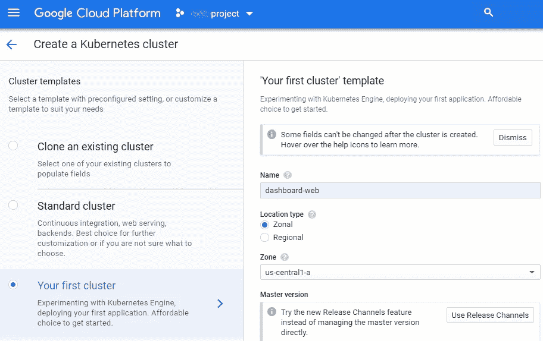

创建一个 Kubernetes 集群

将参数中的**名称**更改为 **dashboard-web** ，可以应用其余设置。然后点击**创建**来构建名为 **dashboard-web** 的 Kubernetes 集群。

现在创建了一个具有一个[节点](https://kubernetes.io/docs/concepts/architecture/nodes/)的集群，在其上可以创建多达 110 个[pod](https://kubernetes.io/docs/concepts/workloads/pods/pod-overview/)。

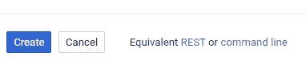

通过 REST 或命令行创建 Kubernetes 集群

**提示:**您所做的集群配置以脚本的形式存储和提供，可以通过 REST-API 或命令行来执行。因此，可以自动创建集群。下面是一个可以在云 Shell 中使用的命令行代码示例:

```
gcloud beta container --project "<YOUR-PROJECT>" clusters create "dashboard-web" --zone "us-central1-a" --no-enable-basic-auth --cluster-version "1.15.4-gke.22" --machine-type "g1-small" --image-type "COS" --disk-type "pd-standard" --disk-size "30" --scopes "https://www.googleapis.com/auth/devstorage.read_only","https://www.googleapis.com/auth/logging.write","https://www.googleapis.com/auth/monitoring","https://www.googleapis.com/auth/servicecontrol","https://www.googleapis.com/auth/service.management.readonly","https://www.googleapis.com/auth/trace.append" --num-nodes "1" --no-enable-cloud-logging --no-enable-cloud-monitoring --enable-ip-alias --network "projects/<YOUR-PROJECT>/global/networks/default" --subnetwork "projects/<YOUR-PROJECT>/regions/us-central1/subnetworks/default" --default-max-pods-per-node "110" --addons HorizontalPodAutoscaling,HttpLoadBalancing --enable-autoupgrade --enable-autorepair
```

3.**容器化一个 Python 应用**
要获得 dashboard——它是用 Python 开发的——在 docker 容器中运行，需要 3 个文件:

*   [**index.py**](https://github.com/ArnoldLutsch/master/blob/master/dashboard/index.py) (包含仪表盘 python 代码的文件)
*   [**docker file**](https://github.com/ArnoldLutsch/master/blob/master/dashboard/Dockerfile)*(*通过读取该文件中的指令自动构建图像)
*   [**requirements . txt**](https://github.com/ArnoldLutsch/master/blob/master/dashboard/requirements.txt)*(包含应用需要运行的依赖项列表)*

*4.**创建一个 Docker 镜像，推送到 google 容器注册表** 启动云壳，然后启动编辑器。*

*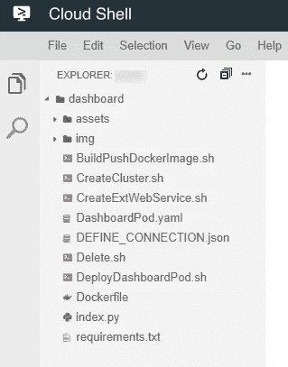*

*云壳编辑器*

*我已经在云外壳提供的浏览器中创建了我的仪表板结构。你会在我的 [git 库](https://github.com/ArnoldLutsch/master/tree/master/dashboard)中找到完整的代码。*

*将文件复制到云外壳编辑器后，可以创建 Docker 映像。为此，您必须转到**仪表板**目录。*

```
***cd dashboard***
```

*从这个目录中，您可以运行 bash 脚本[**buildpushdockerimage . sh**](https://github.com/ArnoldLutsch/master/blob/master/dashboard/BuildPushDockerImage.sh)，*

```
***bash BuildPushDockerImage.sh***
```

*它依次执行以下命令:*

*构建 Docker 映像并将其推送到 Google 容器注册表*

*Docker 映像现在是基于 3 个文件(index.py、Dockerfile、requirements.txt)构建的，可以在 Google 容器注册表中找到。*

*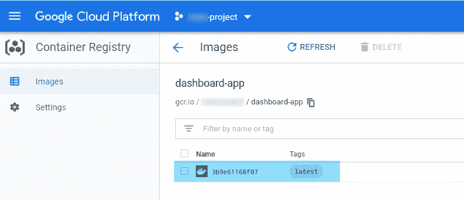*

*谷歌容器注册*

*5.**创建一个部署，该部署创建一个复制集以显示三个“dashboard-app”窗格***

*要开始部署，可以执行以下 bash 脚本:*

```
***bash DeployDashboardPod.sh***
```

*它依次执行以下命令:*

*部署三个吊舱*

*第一步是确保我们被允许为我们的项目运行[**ku bectl**](https://kubernetes.io/docs/reference/kubectl/overview/)**。Kubectl 是一个命令行界面，用于对我们的 Kubernetes 集群运行命令。***

***之后，我们使用 **DashboardPod.yaml** 模板创建我们的“dashboard-app”窗格。***

***部署仪表板应用程序以调出 3 个窗格***

***创建窗格后，我们可以使用以下命令详细检查它们:***

```
*****kubectl get pods -o wide*****
```

***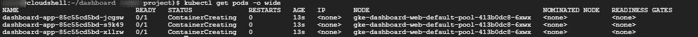***

***命令的输出***

***部署中有 3 个 pod(Status = container creating)，所以让我们再等几秒钟，然后再次执行命令:***

***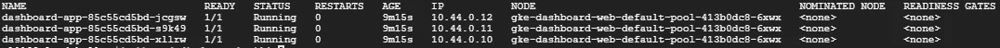***

***再次执行该命令后的输出***

***我们看到容器现在处于就绪状态(1/1)和状态=正在运行。此外，它们都被分配了一个内部 IP 地址。如上所述，我们可以在这个节点上运行的最大 pod 数量是 110，这意味着如果仪表板上的负载增加，我们可以在这个节点上再创建 107 个容器。如果我们需要更多的容器，我们可以订购一个包含更多节点的更大的集群，每个集群运行 110 个容器。这种方法使我们有可能实现一个高度可伸缩的环境。***

***6.**创建一个暴露外部 IP 地址的服务对象，以允许通过互联网浏览器访问仪表板*****

***为了能够从 web 访问 dashboard-app，我们创建了一个公开部署的服务对象。“type=LoadBalancer”在当前集群中创建一个负载平衡器，并为该服务分配一个固定的外部 IP 地址。该服务在端口 80 上运行，并连接到端口 8080 上的容器。***

***要公开部署，可以执行以下 bash 脚本:***

```
*****CreateExtWebService.sh*****
```

***它执行以下命令:***

***显示有关仪表板应用程序服务的信息:***

```
*****kubectl get service dashboard-app*****
```

***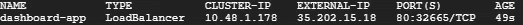***

***命令的输出***

***现在可以通过外部 IP 地址访问“dashboard-app”服务。***

***要获得更多服务信息，您可以执行以下命令:***

```
*****kubectl describe services dashboard-app*****
```

***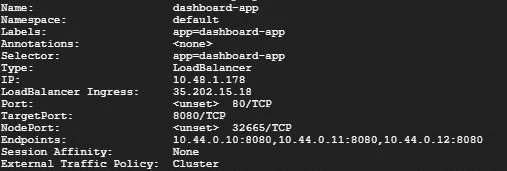***

***命令的输出***

***记下 dashboard-app 服务公开的外部 IP 地址(`LoadBalancer Ingress`)。在本例中，外部 IP 地址是 35.202.15.18。此外，您可以看到该服务有几个端点:10.44.0.10:8080，10.44.0.11:8080，10.44.0.12:8080。这些是运行**仪表板应用**的 pod 的内部地址。***

***您可以使用外部 IP 地址(`LoadBalancer Ingress`)访问 **dashboard-app** 应用。由于应用程序运行在“/dash”目录中，因此这种情况下的调用如下:***

```
***http://<LoadBalancer Ingress IP>/dash/***
```

***仪表板现在显示在互联网浏览器中:***

***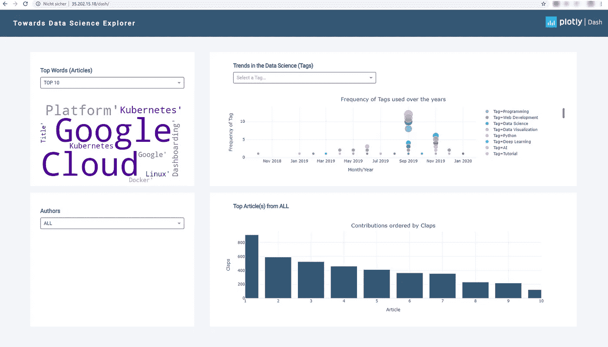***

***仪表板-通过外部 IP 调用的应用程序***

***仪表板分为四个区域:***

*   *****热门词汇(文章):**对应[到数据科学](https://towardsdatascience.com/)文章的“前 10”或“前 100”词汇显示为词云。***
*   *****作者:**提供了一个包含所有已爬网作者的下拉列表。***
*   *****来自…的热门文章:**根据所选作者，将显示热门文章及其元数据(点击次数、阅读时间等)。如果没有选择作者，则显示所有作者的“前 10 篇”文章。***
*   *****数据科学趋势(标签):**显示文章中使用的标签，以便您可以随着时间的推移分析哪些术语在何时被频繁使用，以及是否可以从中得出趋势。***

*****提示:**云的优势在于，只要你使用它，你就只需要为基础设施付费。在一次成功的测试运行之后，为了节省成本，我删除了我的“dashboard-web”集群；)***

*****结论:**
这样一来，我们现在就有了一个在云平台上运行的仪表盘，它是用 Python (Flask & Dash)开发的，打包在 Docker 中，部署在 Kubernetes 上。整个过程已经公开，可以通过网络浏览器浏览。***

***我觉得很棒，希望你也是:)！***

*****相关文章:*****

> ***如果你想知道我们如何从[向数据科学](https://towardsdatascience.com/)爬取数据，那么查看 Philipp Postels 的文章:[通过使用 python](https://medium.com/@Postiii/9c0c23e3ebe5) 用 Selenium 为向数据科学爬取构建一个可伸缩的网络爬虫***
> 
> ***如果你想知道我们如何使用基于 Spark 的自然语言处理来准备数据，如何在 Docker 中打包代码，如何通过 Kubernetes 部署它，请查看 Jürgen Schmidl 的文章:[Spark in Docker in Kubernetes:A practical approach for scalable NLP](https://medium.com/@js.schmidl/9dd6ef47c31e)***