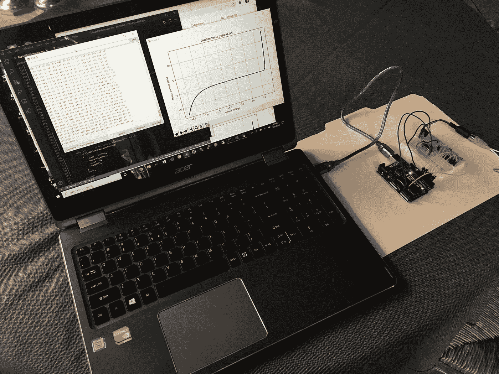
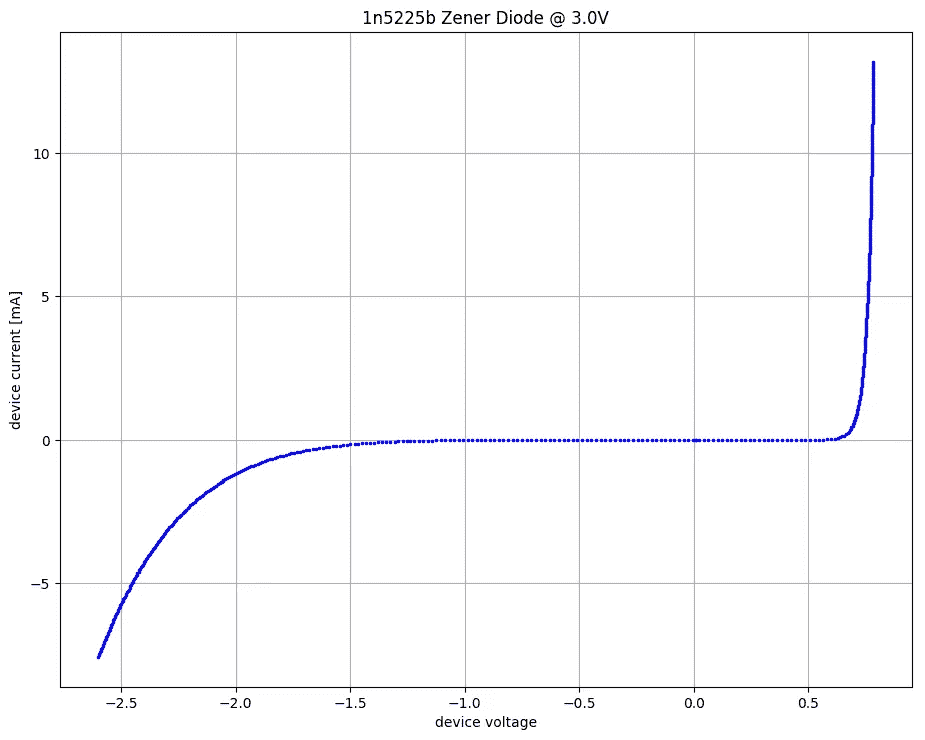
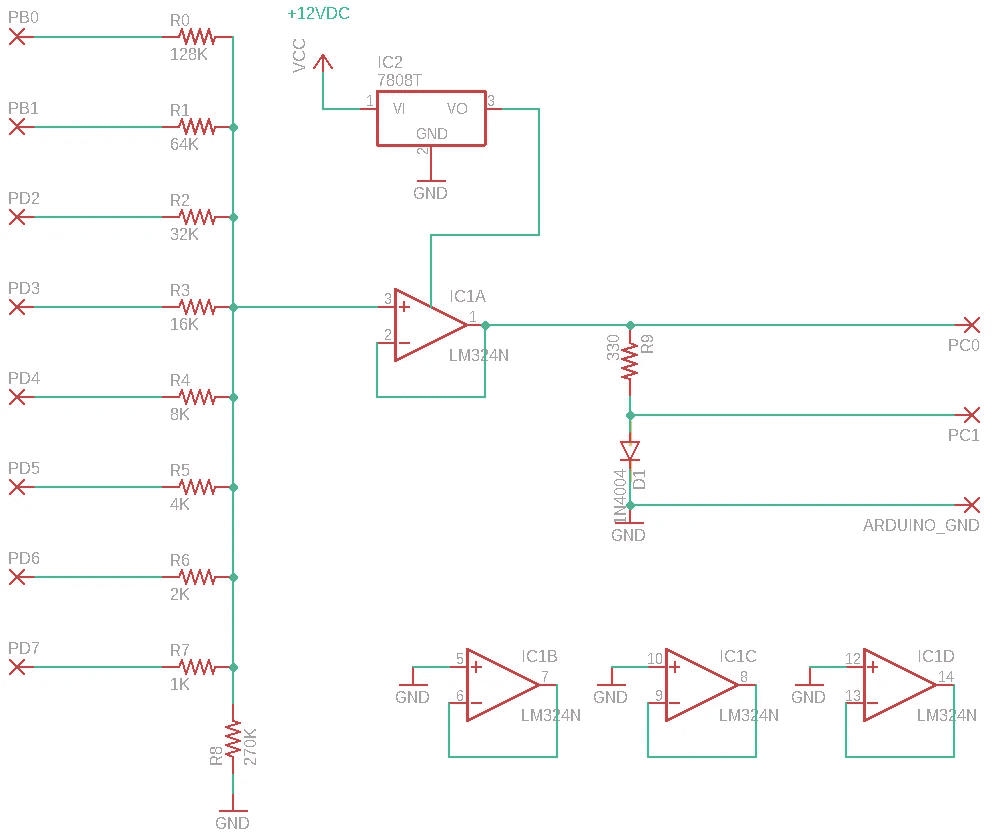
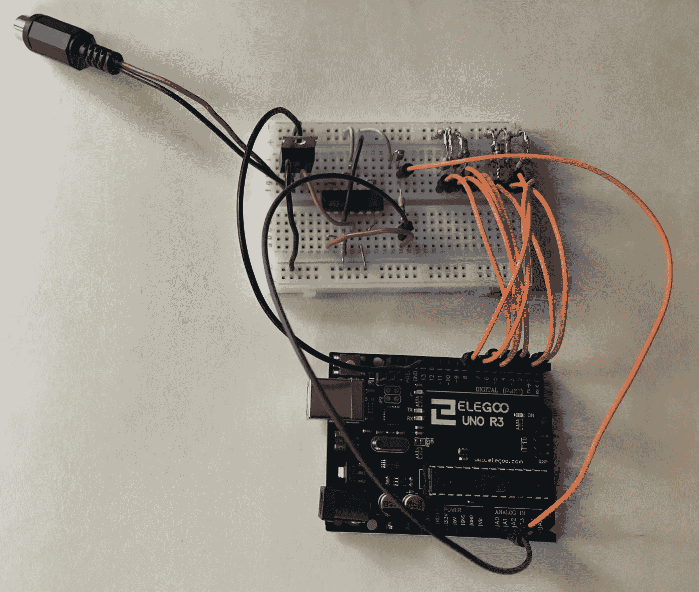
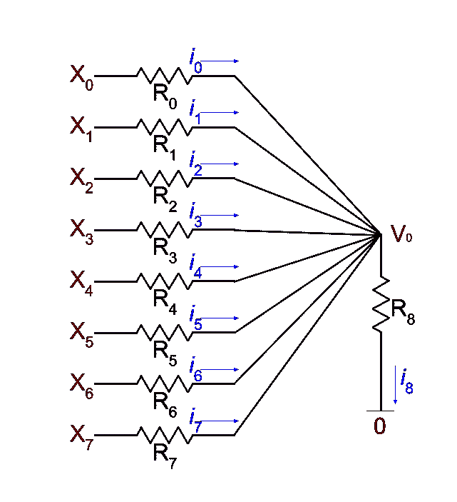
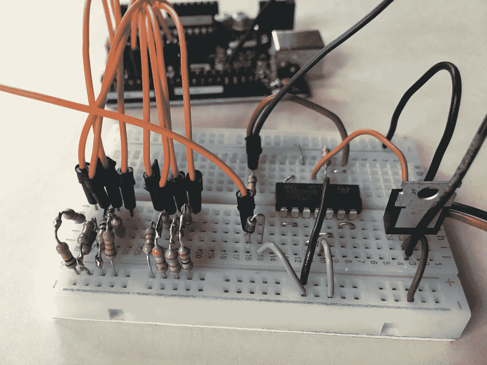
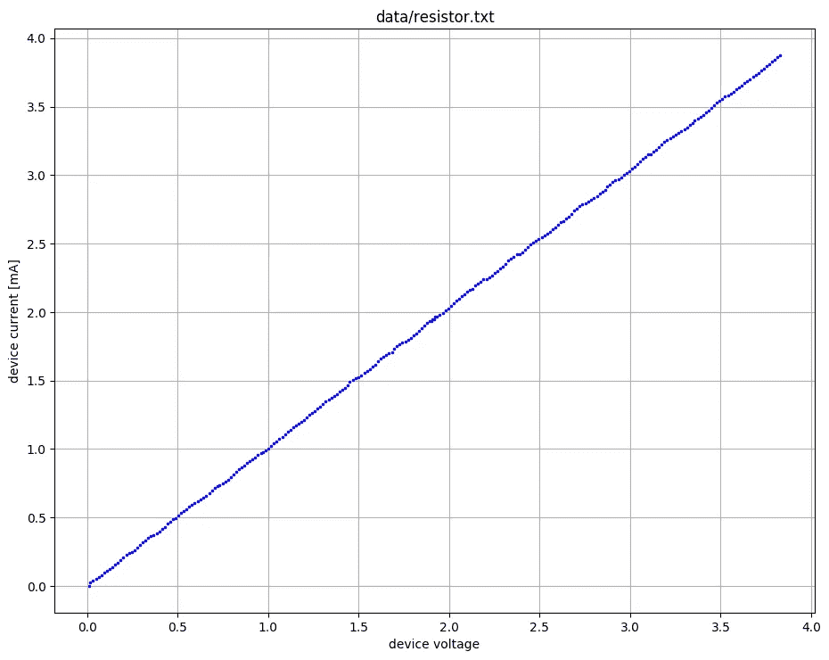
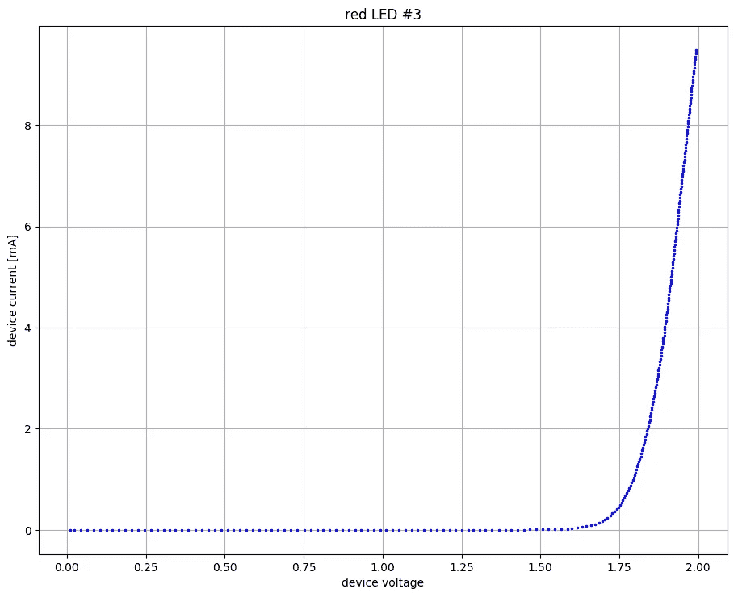

# 制作自制电流/电压绘图仪

> 原文：<https://towardsdatascience.com/build-a-homebrew-current-voltage-plotter-88413dfa44d0?source=collection_archive---------48----------------------->

## 设计和编程您自己的数据采集硬件



最近我在思考二极管的非线性行为。在大学里，我了解到通过二极管的电流可以用施加在其上的电压的指数函数来近似表示。我想知道指数函数如何描述真实二极管的电流/电压行为。

我认为这将是一个有趣的项目，建立一些测量和绘制二极管的行为。我有一个备用的 Arduino Uno，还有一块试验板和一些基本的电子零件。

现在，三天后，我有了一个比我想象的更好的系统。它捕获数据并根据数据制作图表，如下所示。以下是如何制作自己的电流/电压分析仪。我提供源代码和硬件设计作为开源。



## 零件清单

*   一个小试验板和电线。
*   Arduino Uno 或兼容板，带 USB 电缆。
*   产生 12 至 15 伏 DC 的电源，电流至少为 100 毫安。您可以为这部分寻找一个旧的“墙砖”电源适配器。
*   LM7808 稳压器。这就产生了一个稳定的 8 伏 DC 信号。(你可以用产生 9 伏信号的 LM7809 调节器来代替；它将同样有效。)
*   LM324N 四路运算放大器芯片。
*   各种电阻器，如下面更详细解释的。

## 电路设计

对于这个项目，我需要一种方法来产生从 0V 到 5V 的不同电压，并精确控制增量。将数字数据转换成模拟电压电平的设备称为*数模转换器*，简称 DAC。虽然更先进的 Arduino Due 带有内置 DAC，但 Due 的成本几乎是 Arduino Uno 的两倍。我决定从头开始构建自己的 DAC，并与 Uno 一起使用。这本身就具有教育意义和回报。

DAC 设计如下所示:



关于硬件设计的一些注意事项:

*   LM324N 芯片上有四个运算放大器。仅使用其中一个，在原理图中标为 IC1A。三个未使用的运算放大器如图所示进行布线，以防止它们因不必要的振荡而产生干扰。
*   DAC 本身由左侧的电阻网络和运算放大器 IC1A 组成。(有关 DAC 工作原理的更多信息，请参见下文。)
*   原理图上标有`X`的端子表示电路连接到 Arduino Uno 板(未显示)的位置。
*   Uno 板由主机的 USB 连接供电。您将需要此连接来通过 Arduino IDE 串行监视器捕获数据，因此没有必要为 Uno 提供另一个电源。
*   电阻 R0 和 R1 连接到 PB0 和 PB1，但其余的电阻 R2-R7 连接到 PD 引脚，而不是 PB 引脚。(PD0 和 PD1 不能使用，因为串行通信需要它们。)
*   原理图中的二极管 D1 是您想要测试的任何元件的占位符。我已经成功测试了一个 1K 电阻(一种验证整个系统的好方法)、不同种类的 led 和各种其他二极管，包括肖特基二极管、齐纳二极管、整流器和锗检测二极管。

这是我的最终版本的样子:



## DAC 理论

我使用来自 Uno 的 8 个数字输出来选择 256 个不同电压电平中的一个。九个电阻组成的网络和运算放大器共同实现 DAC。

每个输出(PB0、PB1、PD2、… PD7)产生 0V 或 5V 的独立电压，由 Uno 上运行的固件控制。因为这是 8 个独立的输出，所以有 2⁸=256 独特的输出组合。

电阻选择为 2 的幂，从 1K 一直到 128K。输出 PD7 通过相连的 1K 电阻 R7 对正运算放大器电压的贡献是 8 路输出中最大的，因为电阻最小。每个电阻值增加一倍，到达运算放大器的电压就会减半。

为了证明这是真的，考虑这张图，重新绘制以使当前的流动更清晰。



X₀至 X₇代表 8 个 Uno 输出引脚的电压。在给定时间，每个可以是 0V 或 5V。通过电阻器 R₀和 R₇流入 V₀节点的总电流必须等于通过 R₈.流出的电流(我们可以忽略任何进入运算放大器正输入端的电流，因为运算放大器设计具有极高的输入阻抗。)因此:

根据欧姆定律，每个电流等于每个电阻上的压降除以相应的电阻值:

拆分分数后，收集等式一边的 V₀项，求解 V₀，我们发现:

分母可以用常数 R’≈500ω代替，它代表所有九个电阻的并联等效电阻:

最后一个等式表明，运算放大器正输入端的电压 V₀是八个输入电压的线性加权和。

通过将运算放大器的输出连接到其负输入，它充当一个[电压缓冲器](https://en.wikipedia.org/wiki/Buffer_amplifier#Op-amp_implementation)，输出与其输入相同的电压 V₀。这被称为*单位增益*配置。运算放大器向测试元件提供高达 20 mA 的电流，同时将电阻网络与该元件隔离。

## 电阻调谐

为了使自制 DAC 尽可能线性，需要选择接近 2 的幂的电阻。这有一个小问题。电阻器通常不以 2K、4K 等值出售。

然而，有可能找到串联或并联的电阻对，以接近匹配目标值。电阻器的实际值很少与其标称值相符。你必须测量它们！我坐下来，用我的数字欧姆表试着组合，直到我得到正确的数值。仅仅这个电阻调谐步骤就花了我几个小时。

例如，对于我的 4K 电阻，我发现一个标称值为 180ω的电阻测量值为 176.8ω。我还发现了一个标称值为 3.9K 的电阻，测量值为 3.83K。将它们串联焊接在一起，我的欧姆表测得的总电阻为 4.00K。我发现，在试验板上串联(或并联)不同的电阻并测量它们，直到得到足够接近的结果，这比做数学计算更容易。

你不需要为了获得完美的阻力而把自己逼疯。这不会影响最终电流/电压图的准确性。正如您将看到的，成品器件将使用 Uno 的两个模拟输入来测量电压，因此结果图的准确性不涉及任何计算或猜测。重点是尽量平滑地覆盖可能的电压范围，不要让 DAC 产生的电压出现任何大的缺口。每次阻力在 1%以内就足够好了。

如果你觉得用这种方式组合固定电阻太麻烦，你可以买一组八个微调电阻，用螺丝刀调整它们，直到它们测量正确。

这里有一个特写镜头，可以更好地观察试验板上的 DAC。你可以看到我的一些复合电阻，大部分是串联的，一对是并联的。



## 安装和测试固件

您需要将这个项目的 GitHub 库克隆到您的计算机上。我已经验证了一切都可以在 Debian Linux 和 Windows 10 上运行。我没试过 Mac，但应该可以用。

[https://github.com/cosinekitty/diodeplot](https://github.com/cosinekitty/diodeplot)

固件是一个名为`DiodePlotFirmware.ino`的 Arduino 草图。它设计用于 Arduino IDE 的串行监视器。一旦您构建了硬件并用固件对其进行了编程，您就可以执行快速诊断。我建议您第一次运行时使用 1K 电阻作为测试元件。将其放在电路中，而不是二极管 D1 中。打开 Arduino IDE 串行监视器。当您引导系统时，您应该会看到以下提示:

```
# READY
```

要验证 DAC 是否正常工作，可以将数字万用表连接到 DAC 输出，并在输入一系列命令的同时测量其电压。将您的万用表负极探针连接到 GND(我喜欢将其夹在 LM7808 的金属标签上)。将正极探针连接到运算放大器输出。它的测量值应该非常接近 0V。

接下来，输入一系列命令来手动更改电压水平。每个命令将是一个从 0 到 255 的数字，后跟字母`v`。按 enter 键提交命令。让我们从告诉电路板达到最大电压开始:

```
255v
```

您应该会在串行监视器中看到如下内容:

```
# READY
**255 1020 767**
```

第一个数字确认值 255(二进制 1111111)已经馈入进入 DAC 的 8 个引脚。第二个数字是 DAC 输出的模拟读数。它应该接近 Arduino 模拟输入的 10 位范围的高端，即 0..1023.你的万用表应该跳到+5.0 伏附近。

假设你安装了一个 1K 的电阻而不是 D1，第三个数字应该接近显示的值。它是测试组件顶部的电压。

如果一切检查完毕，您就可以继续了。否则，就是出问题了；拔掉你的电源和 USB 电缆，然后花些时间检查你的线路。在继续之前，您需要诊断并修复任何错误。

一旦你的最大电压检查出来，尝试几个中间值。例如，通过输入以下命令尝试 50%的电压。

```
128v
```

现在，串行监视器应该打印出与这些数字相近的数字(新输出以粗体显示):

```
# READY
255 1020 767
**128 507 380**
```

第一个数字应该正好是 128，剩下的两个数字应该大约是之前`255v`测试值的一半。此外，您的万用表读数应该约为+2.5V。

## 捕捉电压/电流曲线数据

现在是时候找点乐子了！让我们验证 DAC 的线性行为，仍然使用 1K 电阻代替 D1。

首先，按下显示屏右下角的“清除输出”按钮，清除串行监视器输出。然后输入以下命令:

```
1000m
```

`m`命令运行自动数据收集程序，扫描每个 DAC 输入，从 0 到 255。对于每个 DAC 值，`m`前面的`1000`告诉固件对每个 DAC 设置进行 1000 次过采样。固件连续读取 1000 次两个电压:DAC 输出本身和测试元件顶部的电压。

测试将需要几分钟时间来运行。完成后，您将得到如下所示的输出:

```
0 0 [1000] 0 [1000]
1 3 [2 231 766 1 0] 1 [8 755 237]
2 6 [1 153 846] 5 [590 409 1]
3 10 [1 119 880] 7 [0 5 491 498 6]
4 15 [41 957 2] 11 [3 247 748 2 0]
5 19 [60 934 6] 13 [0 1 145 849 5]
...
250 1000 [0 1 832 166 1] 751 [0 999 1]
251 1005 [3 790 205 2 0] 754 [0 984 16]
252 1009 [1 604 393 2 0] 757 [0 940 60]
253 1012 [0 2 567 430 1] 760 [0 931 69]
254 1017 [451 548 1] 763 [0 935 65]
255 1021 [360 630 10] 766 [0 838 162]
# FINISHED
```

## 数据格式的解释

此部分是可选的。如果你只是想用我提供的软件来绘制数据，你可以跳到下一节。但是如果你想编写自己的软件来处理数据，这里我解释一下所有这些数字的含义。

典型的一行如下所示:

```
2 6 [1 153 846] 5 [590 409 1]
```

第一个数字`2`是馈入 DAC 的 8 位值。就像我们之前看到的`v`命令一样，这是一个从 0 到 255 的值。

第二个数字 6 是 DAC 测得的模拟电压的中间值。就像在`v`命令中一样，它是一个从 0 到 1023 的值，从 0V 到 5V 线性缩放。

现在情况不同了。您将看到方括号`[]`中的数字列表。括号中的值总是奇数。这些值是读取不同电压值的次数。因为我们对每个值进行了 1000 次过采样(在`1000m`命令中)，所以这些数字的总和总是 1000。也就是 1+153+846=1000。

中间的数字，在本例中为 153，表示测量的电压是 6 的多少倍(括号左边的数字)。所以对`6 [1 153 846]`的解读方式是:

*   1000 次中有 1 次，电压读数为 6–1 = 5。
*   1000 次中有 153 次，电压读数是 6。
*   1000 次中有 846 次，电压读数是 6+1=7。

类似地，线的剩余部分`5 [590 409 1]`表示在测试部件处测量的电压的过采样结果。

## 准备绘图仪软件

现在，使用剪贴板将这些数据复制并粘贴到您喜欢的文本编辑器中。在 GitHub repo 的克隆版本的`data`目录中，将文件保存为`resistor.txt`。打开命令提示符，转到克隆的目录。

如果您的系统上还没有 Python3，您需要安装它。验证方式:

```
$ **python3 --version**
Python 3.5.3
```

您还需要安装 Python 包`matplotlib`来渲染图形。在 Linux 上，该命令是:

```
sudo pip3 install matplotlib
```

要确认绘图仪软件准备就绪，请输入以下命令:

```
$ **./plot.py**USAGE:  plot.py x y datafile.txt [outfile.png]Where x and y are each one of the following: n  = the value 0..255 that is fed into the resistor network.
    v1 = measured voltage coming out of the op-amp.
    v2 = measured voltage fed into the test component.
    i  = deduced current calculated as (v1-v2)/R.If outfile.png is provided on the command line, the image
is saved directly to that file.
Otherwise, the graph is shown interactively.
```

虽然数据文件只包含`n`、`v1`、`v2`，但是在这个帮助文本中可以看到`plot.py`可以利用欧姆定律推导出电流`i`。

## 绘制电流/电压曲线

让我们将电流`i`绘制成元件电压`v2`的函数。输入以下命令:

```
./plot.py v2 i data/resistor.txt
```

这将产生一个显示线性关系的图形。毕竟电阻遵守欧姆定律，所以电流应该和电压成正比。这是我的样子:



现在，您可以测试非线性元件了。从 LED 开始很有趣，因为你也可以看到随着电压增加超过其照明阈值，它会慢慢变亮。用 LED 替换电阻器，确保将其阳极连接到电阻器 R9，阴极连接到 GND。如果你把它弄反了，就不会有坏事发生；它就是不亮，你会得到一个平坦的零电流曲线。把它翻过来再做一次测试。

确保在每次测试之前清除串行输出，这样就不会在输出文件中混淆不同测试的数据。遵循与电阻测试相同的步骤，运行`1000m`命令，将输出保存到文件中，并运行`plot.py`绘制数据。

以下是我测试随机放置的红色 LED 时得到的结果:



## 绘制正负电压响应

请看下图，您会注意到它涵盖了齐纳二极管在正负输入电压下的电流/电压响应。但是这个电路只产生 0V 到+5V 的电压。我是如何制作这个图表的？

这需要一点手工操作，但是绘图仪程序`plot.py`自有妙招。您将运行两个测试，一个测试组件(如齐纳二极管)正向偏置。将数据复制并粘贴到一个文本文件中，并在该数据前单独手动键入单词`FORWARD`。

在所有的测试数据之后，在一行中单独输入`REVERSE`这个词。

然后在试验板上翻转元件，使其反向偏置。清除您的串行输出，再次运行测试，并将结果数据粘贴到单词`REVERSE`之后。在`data/zener3v.txt`中，您可以在克隆的 repo 中看到一个示例数据文件。为简洁起见，它看起来像这样:

```
# [1n5225b Zener Diode @ 3.0V]
**FORWARD**
0 0 [1000] 0 [1000]
1 2 [0 4 309 685 2]
2 [6 260 734]
...
253 1012 [0 3 756 236 5] 156 [4 695 173 88 40]
254 1016 [0 1 670 326 3] 156 [5 728 148 84 35]
255 1021 [553 442 5] 156 [4 685 184 90 37]
**REVERSE**
0 0 [1000] 0 [1000]
1 3 [5 316 677 2 0] 3 [6 288 703 3 0]
2 6 [5 215 780] 6 [0 6 187 806 1]
...
253 1012 [0 1 640 351 8] 525 [0 36 634 94 44 79 49 8 35 20 1]
254 1017 [533 462 5] 526 [6 241 507 67 52 64 14 16 27 6 0]
255 1021 [2 437 554 7 0] 526 [36 619 128 54 64 45 12 24 18]
```

`FORWARD`是可选的，但是它明确表示下面的数据是正向偏置的。缺省值是向前偏移的数据。`REVERSE`关键字表示其后的任何数据都应被视为反向偏置的负电压。

还要注意第一行中显示的语法，它允许您在图形的顶部放置一个标题:井号`#`后跟方括号内的任何文本`[]`。这个标题便于记录您测试了什么组件。

## 有趣的实验

探索不同二极管和晶体管结的行为会很有趣。尝试绘制几个同类 led 的数据，看看它们的行为有多匹配。或者你可以试着绘制不同颜色的 led 曲线，看看它们的“开启”电压有什么不同。

这个项目也可以是创建给定组件的数学模型的基础。我打算自己做这件事，看看如何用指数回归、切比雪夫多项式或其他技术最好地拟合实验曲线。看看软件是否可以通过与已知回归模型的数据库进行匹配来推断出哪个设备产生了曲线，这将是一件有趣的事情。

我希望这个项目能激发你思考创造性的改编。也许你可以将其中的一些想法用于你自己的发明和实验。