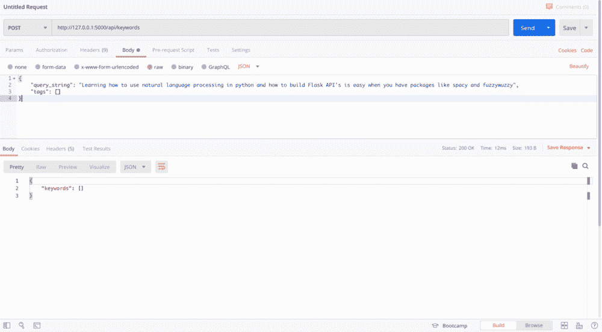
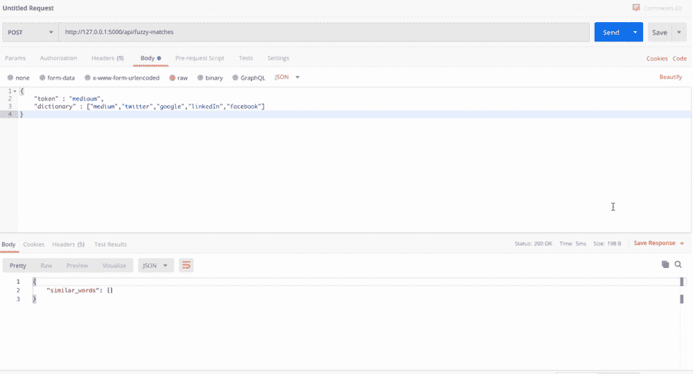

# 用 Spacy、Flask 和 FuzzyWuzzy 构建一个关键词提取 API

> 原文：<https://towardsdatascience.com/build-a-keyword-extraction-api-with-spacy-flask-and-fuzzywuzzy-4909d7ffc105?source=collection_archive---------9----------------------->

## 如何在 python 中构建一个轻量级的关键字提取和模糊词匹配服务？


[工地有限公司](https://unsplash.com/@worksite?utm_source=medium&utm_medium=referral)在 [Unsplash](https://unsplash.com?utm_source=medium&utm_medium=referral) 拍摄的照片

通常，在处理长文本序列时，您会希望将这些序列分解开来，并提取单个关键字来执行搜索或查询数据库。

如果输入文本是自然语言，您很可能不希望使用每个单词来查询数据库，相反，您可能希望从输入中选择一组唯一的关键字，并使用这些单词或单词短语来执行有效的搜索。

这项任务被称为关键词提取，多亏了像 [Spacy](https://spacy.io/) 这样的生产级 NLP 工具，只需几行 Python 代码就可以完成。在本文中，我们将涵盖:

*   如何使用 Spacy 构建一个简单而健壮的关键词提取工具
*   如何使用 [fuzzyWuzzy](https://github.com/seatgeek/fuzzywuzzy) 处理拼写错误并找到给定关键字(令牌)的模糊匹配
*   如何用 [Flask](https://flask.palletsprojects.com/en/1.1.x/) 将这两个函数包装成 REST API 端点

这个轻量级 API 旨在成为许多用例的通用关键字服务。当然，您也可以使用相同的通用结构将 Spacy 众多 NLP 函数中的任何一个构建到这个 API 中。

在我们开始之前，确保运行:`pip install flask flask-cors spacy fuzzywuzzy`来安装所有需要的包。

# 基于空间的关键词提取

对于关键字提取功能，我们将使用 Spacy 的两个核心思想——核心语言模型和文档对象。

Spacy [核心语言模型](https://spacy.io/models)有:

> 通用预训练模型，用于预测命名实体、词性标签和句法依赖性。可以开箱即用，并针对更具体的数据进行微调。

空间[文档](https://spacy.io/api/doc)对象为:

> 用于访问语言注释的容器……(和)是一个标记结构数组

因此，随着通过模型创建的文档对象的创建，我们可以访问大量非常有用(且强大)的 NLP 派生属性和功能，包括词类标签和名词块，它们将是关键字提取器功能的核心。

## 下载语言模型

使用 Spacy，我们必须首先下载我们想要使用的语言模型。到今天为止，Spacy 目前的`version 2.2.4`已经有了 10 种不同语言的语言模型，都有不同的大小。我将使用英文核心模型的小版本。我选择了小模型，因为对于 Heroku 部署来说，大模型的内存大小有问题。根据您部署该模型的位置/方式，您可能能够使用大型模型。要使用 Spacy 的 CLI 下载语言模型，请在终端中运行以下命令:

> `python -m spacy download en_core_web_sm`

当我们构建 flask API 时，我们将使用 python 内置的*子进程*包，在服务启动后在应用程序本身中运行这个命令。但是现在，我们可以在命令行中这样做。

现在下载好模型后，你可以加载它并创建`nlp`对象:

```
import spacynlp = spacy.load("en_core_web_sm”)
```

我们的语言模型`nlp`将作为参数传递给下面的`extract_keywords()`函数，以生成`doc`对象。

关键字提取函数有 3 个参数:

*   语言模型`nlp`
*   `sequence`我们要从中提取关键字的字符串。
*   以及可选的字符串列表`special_tags`。此参数允许用户指定一个特殊的单词/短语列表，如果它们存在于序列中，则默认情况下会添加到输出中。

下面的代码片段显示了该函数是如何工作的:

1.  通过语言模型传递字符串序列来创建`doc`对象。
2.  如果特殊记号出现在序列中，则将它们添加到最终结果中。
3.  迭代文档的[名词组块](https://spacy.io/usage/linguistic-features#noun-chunks)，如果所有组块的标记都在期望的`pos_tag`列表中，则向结果添加一个名词组块。
4.  最后，我们迭代所有的单个标记，并添加那些在期望的`pos_tag`集合中的标记，而不是语言模型的默认停用词列表的一部分。*如有需要，可将自定义停用词追加到该列表中。*

然后，该函数返回结果变量中结束的所有唯一单词**的列表。**

使用 Spacy 的关键字提取代码

# 带有 FuzzyWuzzy 的模糊字符串匹配

图片来源 [u/lawlesskenny](https://www.reddit.com/r/reddit.com/comments/k5vqa/are_you_sure/)

当人类打字时，错别字和错误是不可避免的。在关键字搜索/匹配的环境中，这是一个问题，但是使用模糊匹配算法可以很好地解决这个问题。

Python 包 FuzzyWuzzy 实现了一个非常有效的模糊匹配算法: [Levenshtein 距离](https://en.wikipedia.org/wiki/Levenshtein_distance)。

Levenshtein Distance 是一个公式，用于计算将源单词 *S* 转换为目标单词 *T.* 的成本。该算法会惩罚需要进行许多更改才能转换为目标单词的源单词，并支持需要较小转换的单词。关于 FuzzyWuzzy 如何实现这种检查的详细而直观的解释，请参见 Luciano Strika 的文章。

[](/fuzzywuzzy-how-to-measure-string-distance-on-python-4e8852d7c18f) [## FuzzyWuzzy:如何在 Python 上测量字符串距离

### FuzzyWuzzy 是一个 Python 库，用于测量两个字符串之间的相似性。以下是您开始使用它的方法…

towardsdatascience.com](/fuzzywuzzy-how-to-measure-string-distance-on-python-4e8852d7c18f) 

## 使用 FuzzyWuzzy

模糊匹配实现起来非常快。从包中导入`ratio`会导入默认的 Levenshtein 距离评分机制，而`process.extractBests()`允许我们计算一系列目标的 Levenshtein 距离，并返回高于定义的截止点的结果。为了获得最佳匹配结果，您可能需要对`score_cutoff`参数进行微调。

模糊匹配实现

# 烧瓶应用

差不多了，现在剩下要做的就是把所有东西都打包到两个非常简单的烧瓶端点中。对于下面的要点，请确保导入模糊匹配器和关键字提取服务，或者在 app.py 本身中声明它们。

如果你是 Flask 的新手，我建议看看他们的[文档](https://flask.palletsprojects.com/en/1.1.x/quickstart/#a-minimal-application)快速入门指南。它们提供了如何启动和运行的简单、最小的示例。

该应用程序有两个端点:

*   `api/keywords`
*   `api/fuzzy-matches`

两个端点都接收 POST 请求，因此参数通过请求体传递给每个端点。

您可能还注意到，我们使用前面提到的子流程模块在应用程序内部以编程方式调用 Spacy CLI。如果您需要将它部署到云服务，并且忘记通过 CLI 手动下载模型，这将非常有用。

我们在两个端点之外加载语言模型，因为我们希望这个对象在我们的服务运行时无限期地持久，而不必在每次发出请求时都加载它。这使得添加使用 Spacy 功能的新端点变得容易，因为它们可以共享相同的语言模型，该语言模型可以作为参数提供。

应该就是这样了，在项目目录的命令行中运行下面实现的代码`flask run`，这应该会在您的本地主机上启动 API。

您可以在 Postman 中测试端点，以确保它们的行为符合预期。



两个端点的邮递员请求

如果您想将 API 部署到云服务，如 Heroku，请查看:

[](https://medium.com/the-andela-way/deploying-a-python-flask-app-to-heroku-41250bda27d0) [## 在 Heroku 上部署 Python Flask 应用程序

### 在我之前的文章中，我描述了我是如何使用 Flask 开发 API 的。我简单讲了一下我是如何主持…

medium.com](https://medium.com/the-andela-way/deploying-a-python-flask-app-to-heroku-41250bda27d0) 

上面的文章是几年前的了，原理还是一样的，你也可以直接在 heroku 的网站上设置一个应用程序，然后通过 CLI 推送。

# 结论

这应该有望帮助您启动并运行这个简单的 API。我发现在很多情况下，我需要这样一个简单的服务来处理文本输入或执行某种 NLP 任务。这个设置*希望*有所帮助的是，它应该很容易允许添加额外的空间 NLP 服务作为端点，而无需任何重大更改。

如果你有任何问题或者在我提供的任何代码中发现了一个**错误**,请告诉我，感谢阅读！

[1]空间文档。模特。[https://spacy.io/models](https://spacy.io/models)

[2]空间文档。文档对象。[https://spacy.io/api/doc](https://spacy.io/api/doc)