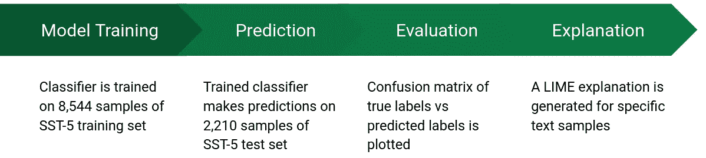
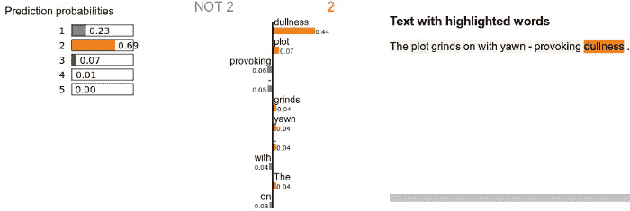
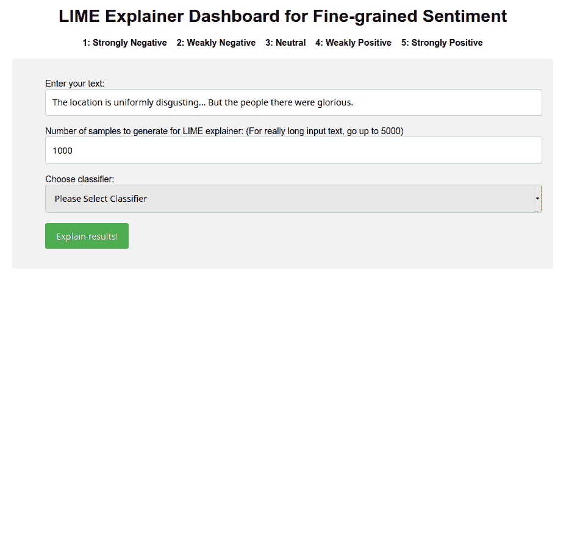
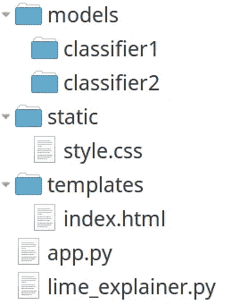
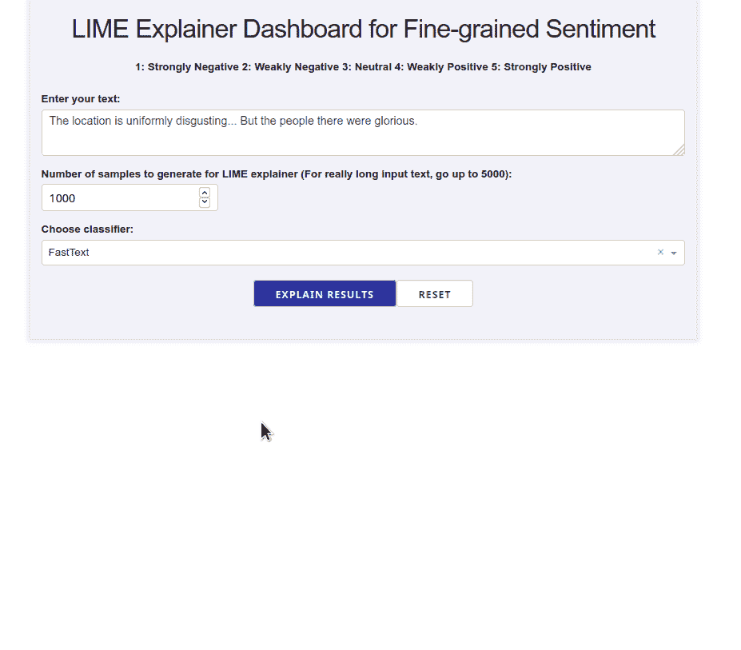
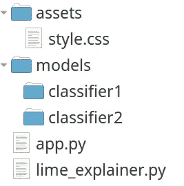
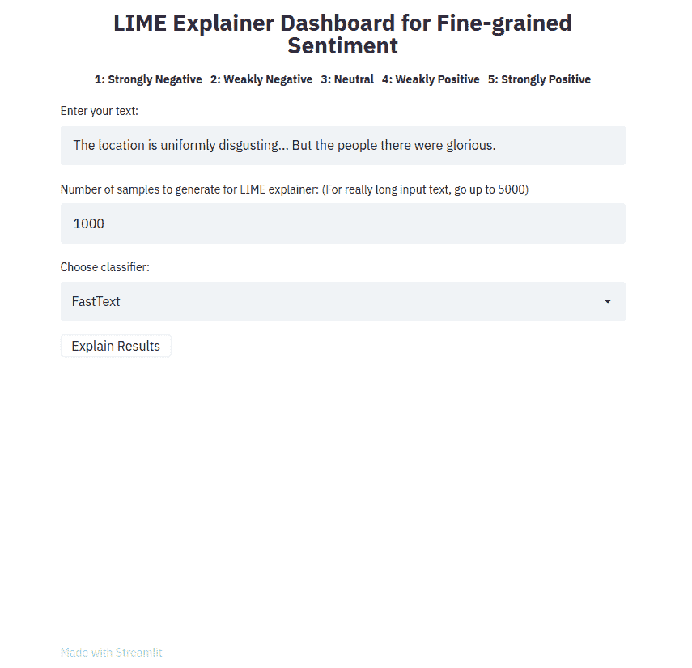

# 用最少的代码行构建一个 LIME explainer 仪表板

> 原文：<https://towardsdatascience.com/build-a-lime-explainer-dashboard-with-the-fewest-lines-of-code-bfe12e4592d4?source=collection_archive---------13----------------------->

## [实践教程](https://towardsdatascience.com/tagged/hands-on-tutorials)

## Flask、Plotly Dash 和 Streamlit 的比较，以构建仪表板，为分类结果提供石灰解释

图片来源:[Pixabay 上的奇摩诺](https://pixabay.com/photos/doors-choices-choose-open-decision-1767563/)

在[早先的一篇文章](/fine-grained-sentiment-analysis-in-python-part-2-2a92fdc0160d)中，我描述了如何使用 LIME(**L**ocal**I**interpretable**M**model-agnostic**E**explanations)来解释一个细粒度情感分类器的结果。概括地说，以下六个模型用于在斯坦福情感树库(SST-5)数据集上进行细粒度情感类别预测。

*   基于规则的模型:**文本块**和 **VADER**
*   基于特征的模型:**逻辑回归**和**支持向量机**
*   基于嵌入的模型: **FastText** 和 **Flair**

使用线性工作流来分析和解释使用每种方法的情感分类结果。每个模型被训练成 5 类情绪(1 到 5)，1 是“强烈负面”，3 是“中性”，5 是“强烈正面”。

这篇文章的目标是展示如何构建一个解释器仪表板(使用三个框架中的任何一个),它接受一个经过训练的模型，并为模型做出的预测输出及时的解释。

# 示例石灰说明

简而言之，LIME 生成一个包含可视化效果(作为嵌入式 JavaScript)的解释对象，该对象可以输出到一个 HTML 文件，然后可以在任何浏览器中打开。LIME 的典型输出如下所示。

# 为什么要构建交互式仪表板应用程序？

要使用 LIME 解释分类器的结果，每次需要解释时都必须写出单独的 HTML 文件，这可能很麻烦。接受用户输入的交互式仪表板是实时快速迭代多个测试样本的非常有效的手段，为用户提供即时反馈。此外，拥有一个仪表板允许非技术用户(他们可能知道也可能不知道如何执行 Python 脚本)能够按需做出自己的时间解释。

以下部分展示了我们如何使用三种不同的框架构建 LIME explainer 仪表板:Flask、Dash 和 Streamlit。

# 解释器类

为了方便地引用每个分类器的预测方法，下面的面向对象的模板被应用来支持代码重用，在项目的 GitHub repo 中[可用。简而言之，定义了一个 Python 类，它接受由 LIME 生成的变量列表(标记空白的随机文本样本)，然后我们将每个样本的类概率输出为一个 Numpy 数组。](https://github.com/prrao87/fine-grained-sentiment/blob/master/explainer.py)

一旦每个变化的类概率被返回，这可以被馈送到`LimeTextExplainer`类(如下所示)。启用词包(`bow`)意味着 LIME 在生成变体时不考虑词序。然而，FastText 和 Flair 模型分别考虑 n 元语法和上下文排序进行训练，因此为了模型之间的公平比较，SST-5 上的所有解释都禁用了`bow`标志选项。

LIME 解释器返回的`exp`对象是通过 LIME 内部的`explain_instance`方法，将本地线性模型的预测(以数字形式)转换成可视的、可解释的形式。这可以输出为 HTML。

以下部分描述了如何将所有这些功能封装到一个交互式仪表板应用程序中。

# 选项 1:烧瓶

LIME explainer 仪表板的烧瓶版本如下所示。用户输入一段文本，选择要为 LIME 生成的随机样本的数量，然后使用下拉菜单从给定的分类器列表中进行选择。点击`Explain results!`按钮，然后生成一个 LIME 解释 HTML 对象，它呈现在一个 HTML Iframe 中。

虽然 Flask 不是一个数据仪表板工具(它是一个 [WSGI](https://wsgi.readthedocs.io/) web 框架，最初是围绕 [Werkzeug](https://werkzeug.palletsprojects.com/) 和 [Jinja](https://palletsprojects.com/p/jinja/) 的包装器)，但它提供了一个简单的基于插件的架构，开发人员可以从这个架构中为复杂的应用程序构建和扩展接口。Flask 的关键优势在于它在生产环境中的健壮性，以及在 Python 生态系统中围绕它的大量扩展。

要使用 Flask 构建 LIME explainer 仪表板，需要了解以下技术:

*   HTML/JavaScript :页面的整体结构和内容是用 HTML 定义的。任何需要基于字段值或用户输入触发的操作都需要使用 JavaScript 来定义，要么通过 HTML 文件本身，要么从外部源加载。
*   **CSS** :使用 CSS 文件定义页面的样式和布局。
*   **Jinja2** :这是一个模板引擎，从 Python 中动态生成页面的 HTML。出于安全原因，这是必要的(不使用模板和传递未转义的静态 HTML 会导致跨站点脚本攻击)。模板引擎由 Python 控制，最终的 HTML 使用 Flask 方法呈现。

## Flask 应用程序:目录结构

Flask 应用程序使用的目录结构如下所示。所需的样式在`static/style.css`文件中用 CSS 配置，要渲染的 HTML 模板在`templates/index.html`中定义。任何经过训练的情感分类器模型都会进入`models`目录。解释器类在`lime_explainer.py`中定义，烧瓶路径在`app.py`中定义。

烧瓶石灰解释器应用程序的目录结构

对于这个用例，Flask 中的应用程序代码是用最简单的方式编写的。定义了两条路线(默认路线`'/'`和时间结果路线`'result'`)。请注意，结果路由使用了一个`POST`请求，这意味着它只在用户向应用程序输入一些信息并与之交互时才生成 HTML(通过 Jinja)。

Flask LIME explainer 应用程序的代码可从 GitHub 获得:

 [## prrao 87/细粒度情感应用程序

### 这个报告包含一个用 Flask 编写的交互式应用程序的初始原型，它解释了…

github.com](https://github.com/prrao87/fine-grained-sentiment-app) 

# 选项 2:破折号

设计 LIME 仪表板的另一种方法是使用 Plotly 的 [Dash](https://plotly.com/dash/) 库。Dash 是一个用 Python 构建分析性 web 应用程序的框架。使用 Dash 的好处是双重的:开发人员可以只使用 Python(不需要 JavaScript)设计应用程序，并且他们可以通过 CSS 完全控制应用程序的设计和结构。下面演示了一个使用 Dash 编写的 LIME explainer 应用程序。就像 Flask 应用程序的情况一样，单击`Explain results`按钮生成一个 LIME 解释 HTML 对象，该对象通过 Dash 的 HTML Iframes 包装器呈现。

# Dash 应用程序:目录结构

Dash 应用程序使用的目录结构如下所示。使用 CSS 在`assets/style.css`文件中配置所需的样式。与 Flask 示例不同，在`app.py`中，应用程序的 HTML 布局和路线/交互是使用纯 Python 定义的。任何经过训练的情感分类器模型都会进入`models`目录。解释器类在`lime_explainer.py`中定义。

Dash LIME 解释器应用程序的目录结构

Dash 应用程序代码的关键组件如下所述。首先是应用程序布局，它是使用 Dash 的 HTML 包装器用 Python 编写的。

常见的 HTML 对象，如标题、标签、文本输入和 Iframes，可以使用 Python 结构轻松添加，如图所示。

下一个组件是*回调*，这是一段反应式的功能性代码，允许开发人员观察、修改和更新 UI 中任何组件的属性。在 Dash 中，回调是使用 Python 的装饰语法定义的。回调是编码应用程序交互性的非常强大的方法，因为它们跟踪按钮点击和数据更新的状态*。LIME 解释器中使用的主要回调如下所示。*

按照上面的构造，我们传递用户的按钮点击(或者是“提交”或者是“清除”按钮)，以及下拉菜单的*状态*，在文本输入中输入的样本数量，以及我们想要预测其情感的文本样本。这里跟踪每个文本字段的状态(而不仅仅是*值*)是很重要的——它允许我们将回调的执行与*按钮点击*联系起来，而不是每次文本输入中的值更新时都执行它。

Dash LIME explainer 应用程序的代码也可以在 GitHub 上找到:

 [## pr Rao 87/细粒度-情感-应用-破折号

### 这个报告包含了一个现有的交互式应用程序的 Plotly Dash 等价物，它解释了…

github.com](https://github.com/prrao87/fine-grained-sentiment-app-dash) 

# 选项 3:简化

另一种选择是使用 [Streamlit](https://www.streamlit.io/) 来构建解释器应用程序。这是目前最快的方法，需要非常基础的 web 开发知识和最少的代码行。与 Flask 和 Dash 方法不同，Streamlit 应用程序使用自己的样式和布局(不可能通过 CSS 进行定制，至少不能使用传统方法)。Streamlit LIME explainer 应用程序如下所示。

Streamlit LIME 解释器应用程序的目录结构

因为 Streamlit 是为帮助快速创建和共享 web 应用程序而从头设计的，所以 LIME dashboard 应用程序有一个非常简单的目录结构。web 应用程序的所有代码都写在一个文件中，`app.py` -这包括小部件、结构、交互和所有用户输入来进行时间预测。这种设计的显著之处在于，即使将所有这些功能都塞进了一个文件中，它仍然非常简洁(大约 40 行代码！).因此，我们只对特定于应用程序的实体使用单独的目录，比如模型和数据。

Streamlit 仪表板的完整代码如下所示。

标题是用 markdown 语法编写的。请注意，因为 Streamlit 的 API 是为速度和易用性而设计的，所以它不像 Flask 和 Dash 那样允许轻松访问底层 HTML。因此，在这种情况下，我们需要显式地使用原始 HTML 字符串的不安全呈现(使用`unsafe_allow_html`关键字)来获得居中对齐的标题。然后使用一个 [Streamlit HTML 组件](https://docs.streamlit.io/en/stable/develop_streamlit_components.html)呈现 LIME explainer 的 HTML 输出，这是一个定制组件，在 Iframe 中显示 HTML 字符串。

和往常一样，Streamlit LIME explainer 应用程序的代码可以在 GitHub 上获得:

 [## prrao 87/细粒度-情感-应用程序-简化

### 此回购包含现有交互式应用程序的 Streamlit 等价物，它解释了…

github.com](https://github.com/prrao87/fine-grained-sentiment-app-streamlit) 

# 部署

出于本文的目的，这三个应用都是使用 [Heroku](https://www.heroku.com/what) 部署的，这是一个 PaaS 系统，允许开发者在云上构建、运行和操作应用。用于构建应用程序的三个框架都有很好的 Heroku 部署指南，如下所示。

*   Flask: [将 Flask 应用程序部署到 Heroku](https://stackabuse.com/deploying-a-flask-application-to-heroku/)
*   Dash: [部署 Dash 应用](https://dash.plotly.com/deployment)
*   Streamlit: [如何在 Heroku 上部署 Streamlit](/deploy-streamlit-on-heroku-9c87798d2088)

然而，使用生产级 WSGI web 服务器，如 [gunicorn](https://gunicorn.org/) 和负载平衡器，如 [Nginx](https://www.nginx.com/) ，部署 Flask 或 Dash 应用程序也相对简单。在部署期间，Nginx [充当位于 web 服务器](https://www.digitalocean.com/community/tutorials/how-to-deploy-python-wsgi-apps-using-gunicorn-http-server-behind-nginx)前面的反向代理，以高度的可靠性处理大量请求。类似地，Streamlit 还提供了一种使用 Docker 和/或 Nginx 的组合来[手动部署应用](https://docs.streamlit.io/en/stable/streamlit_faq.html)的方法。

# 关于 Python web 框架中可伸缩性的一个注释

web 服务器网关接口(WSGI)是作为 Python web 框架与 Web 服务器交互的标准而开发的一个 [Python 规范](https://www.python.org/dev/peps/pep-3333/)。有了这样的系统，开发人员可以轻松地将 Nginx 之类的服务放在 Python web 应用程序的前面(例如，用 Flask 或 Dash 编写),作为将所有请求转发给 web 应用程序的反向代理。**兼容 WSGI 的服务器的一个关键特性是它们是同步的**。这意味着每个请求*阻塞*服务器，直到它收到来自应用程序的响应，称为*阻塞操作*。WSGI 服务器合并可伸缩性的典型方式是通过使用多线程，其中为每个请求创建一个新线程，以便能够同时处理多个请求。然后，这与运行 web 服务器的多个工作进程相结合，这确实具有很好的伸缩性，但是受到给定机器上可用的物理内核数量的限制。

像 Flask 和 Dash 这样的框架所使用的 WSGI 方法，如果有非常大量的请求进入，就可以在伸缩方面达到极限。在生产系统中解决这个问题的方法是水平扩展*，即添加越来越多的服务器，并使用类似 Nginx 的负载平衡服务，这些服务可以在高请求量期间在所有服务器之间平均分配负载。*

*最近的 Python web 应用框架，如 Streamlit，完全依赖于不同的并发系统。Streamlit 在幕后使用了一个 [Tornado](https://www.tornadoweb.org/en/stable/) web 服务器，它被从头设计为使用[异步事件循环](https://www.tornadoweb.org/en/stable/guide/async.html)。在这个系统中，使用了一个单线程，它实现了按照到达顺序执行的*非阻塞*功能。这种方法可以很容易地在 web 应用程序中实现非常高的并发度，这在很大程度上依赖于 I/O 绑定操作的应用程序中，可以真正帮助扩展系统，以同时处理大量请求。*

*和往常一样，没有单一的规则来决定哪种并发方法更好。根据确切的用例以及手边的应用程序，基于 WSGI 或异步事件循环驱动的服务可能是合适的选择。*

> **延伸阅读:* [*WSGI 已经不够用了*](https://www.475cumulus.com/single-post/2017/04/03/WSGI-Is-Not-Enough-Anymore) *—第一、二、三部**

# *什么时候使用每个框架最有意义？*

*本节讨论每个框架最适合当前任务的情况。*

## *瓶*

*Flask 的强大之处在于它允许开发人员使用任何前端工具的组合来创建 web 应用程序。这包括表单输入扩展，如 [WTForms](https://wtforms.readthedocs.io/en/stable/) 和 [Flask-Login](https://flask-login.readthedocs.io/en/latest/) ，以及 JavaScript 可视化库( [Highcharts](https://www.highcharts.com/) 或 [D3](https://d3js.org/) )。此外，Flask 通过 HTML、CSS、jQuery 和 [Bootstrap](https://pythonhosted.org/Flask-Bootstrap/) 为开发人员提供了对底层页面结构和用户交互的完全访问，允许基于项目需求构建非常复杂的应用程序的巨大灵活性。*

*关于本文中显示的 LIME explainer 仪表盘，Flask 是以下任何一种场景的绝佳选择:*

*   *该应用程序由一个在 JavaScript、HTML 和 CSS 以及不同的 HTTP 请求方法(GET、POST 等)方面拥有专业知识的团队编写。)*
*   *该应用是一个更大的仪表板的一部分，由前端的 JavaScript 框架提供支持*
*   *处理和服务数据的多个 RESTful 端点已经存在(在这之后，LIME explainer 可以作为另一个端点被写入前端)*

## *破折号*

*对于主要在 Python 环境中工作的应用程序需要高度可定制性的开发人员来说，Dash 是一个很好的选择。许多强大的前端可视化工具(来自 [Plotly.js](https://plotly.com/javascript/) JavaScript 库)都是现成的，允许开发人员主要关注应用程序的样式和添加用户交互。因为 Dash 构建在 Flask 之上，所以它遵循与 Flask 相似的部署策略，这使得已经有在生产中实现 Flask 应用的经验的团队可以非常容易地使用它。*

*一般来说，在以下任何一种情况下，Dash 都是构建 LIME explainer 仪表板的绝佳选择:*

*   *需要编写应用程序来与现有的 Flask 应用程序集成*
*   *开发和部署该应用程序的团队在 Python 方面经验丰富(但在 JavaScript 方面不太精通)*
*   *仪表板需要很好的定制程度(Dash 允许开发者访问底层 CSS)*

## *细流*

*作为生态系统的相对新人，Streamlit 在数据科学家需要通过交互式应用程序与更大的团队快速分享他们的工作的情况下大放异彩。对于数据科学家个人来说，它也非常有用，可以快速、交互式地探索数据集或模型对单个样本的性能。*

*对于 LIME explainer 仪表板，Streamlit 是在以下任何场景中使用的一个很好的替代方案:*

*   *该应用程序是由一个团队(或个人)编写的，只有很少的 web 开发经验*
*   *应用程序需要在最短的时间内快速构建，并尽可能使用最少的代码行*
*   *开发人员希望花更多的时间构建交互式工具，尽可能少的时间定制应用程序的外观*

# *结论*

*这篇文章强调了构建 LIME explainer 交互式仪表板应用程序的三种不同方法。Streamlit 是所有选项中最简单、最容易学习的。Flask 需要最大的前期时间投入，学习各种组合在一起的部分(HTML、CSS、jQuery/JavaScript、Jinja2 和 HTTP 请求方法)。Plotly Dash 很好地介于 Flask 和 Streamlit 之间，就复杂性和启动并运行仪表板的初始工作而言。根据承担此类项目的团队的组成和技能，这三个选项中的任何一个都可能是最合适的。*

*构建如图所示的 LIME 仪表板的主要原因是允许非数据科学家的人检查 NLP 分类器的结果。至少在某种程度上，提供一种交互式方法来动态测试单个样本的结果可以帮助诊断 NLP 模型的问题，并提高模型的可解释性。为您自己的用例从每个回购(如下所示)中体验和定制代码的乐趣吧！*

*   *[石灰讲解器 app:烧瓶](https://github.com/prrao87/fine-grained-sentiment-app)*
*   *[石灰解说 app: Dash](https://github.com/prrao87/fine-grained-sentiment-app-dash)*
*   *[石灰解说 app: Streamlit](https://github.com/prrao87/fine-grained-sentiment-app-streamlit)*

**原载于 2020 年 10 月 24 日*[*https://prrao 87 . github . io*](https://prrao87.github.io/blog/lime-explainer-dashboards/)*。**