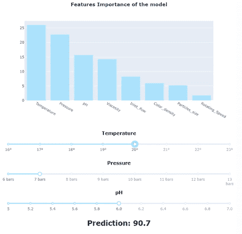
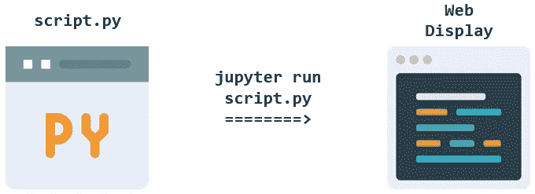
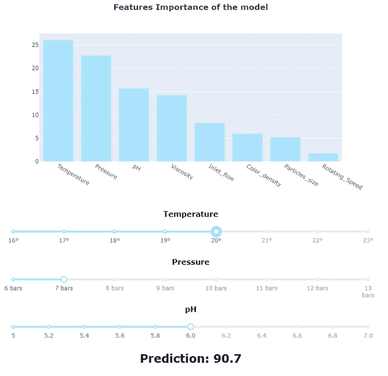

# 用 Dash 构建机器学习模拟工具

> 原文：<https://towardsdatascience.com/build-a-machine-learning-simulation-tool-with-dash-b3f6fd512ad6?source=collection_archive---------26----------------------->

## 了解如何使用 Plotly/Dash 库构建交互式仿真工具，并动态探索您的机器学习模型行为以提高其可解释性。


丹·洛马尔在 [Unsplash](https://unsplash.com/s/photos/cockpit?utm_source=unsplash&utm_medium=referral&utm_content=creditCopyText) 上拍摄的照片

你做到了！这一切都始于您的同事提出的一个业务问题，您经历了数据整合、清理、特性工程和建模的黑暗山谷。您的模型的稳健性已经过检查，您希望分享您的发现。

> 然而，并不是每个人都熟悉 RMSE、混淆矩阵或 Shapey 值…

例如，行业中的运营团队每天都面临着优化生产或供应链的挑战，机器学习提供了一种新的方式来理解复杂的流程行为……只要它可以转化为可理解的分析。当分享人工智能带来的一些见解时，Python 笔记本可能不是最佳选择！



> 除了模型预测能力本身，团队总是热衷于了解在众多相关生产参数中最重要的因素是什么，以及每个因素如何影响模型的行为。

## **Dash libraries 为您提供了一种创建动态仪表板的方法，可通过具有交互功能的 Web 浏览器访问。**

这个概念非常简单:

*   您创建一个. py 脚本，其中您的“经典”机器学习任务与编码的网页布局设计结合在一起，从 HTML 代码中关闭。
*   当执行时，python 脚本在本地地址( [http://127.0.0.1:8050/](http://127.0.0.1:8050/) )上生成一个动态 web 页面，组件在此进行交互。



*图标由* ***像素佛*** *和****Pixelmeetup****(来源:flaticon.com)*

## 你想得到一个快速演示吗？开始了。

首先，我们需要设计一个“看起来像”的工业用例！Scikit-learn 的“make_regression”将生成我们的数据源。我们将微调一些功能，以获得示例中的真实人物:

数据生成和建模阶段

一旦“机器学习”任务完成，我们仍然需要准备要在我们的网络浏览器上显示的动态信息。对于此示例，我们将创建:

*   **显示模型特征重要性的条形图**
*   **三个滑块**允许用户更改三个最重要特征的值，并了解它们对模型预测的影响

*您可能已经注意到条形图的创建与 Plotly 中使用的相似，除了。未调用 show()函数。原因是图表将在“布局”部分呈现。*

“布局”一节(下面)要求不熟悉 Python 和 HTML 的用户进行一些练习。

这里的理念是将 HTML 元素(由 htm.xxx 调用)与动态破折号组件(dcc.xxx)结合起来。

我们将保持这个例子非常简单:

```
**<H1>  Title
<DCC> Features Importance Chart
<H4>  #1 Importance Feature Name
<DCC> #1 Feature slider
<H4>  #2 Importance Feature Name
<DCC> #2 Feature slider
<H4>  #2 Importance Feature Name
<DCC> #2 Feature slider
<H2>  Updated predictions**
```

接下来是脚本中“最棘手”的部分: **app.callback 函数**允许您封装一个标准的 python 函数，这样它就可以与上面设计的 web 页面组件进行交互。其机理可以简化如下:

```
[**@app**](http://twitter.com/app)**.callback**(Output_on_webpage,
              Input_1_from_webpage,
              Input_2_from_webpage,
              Input_3_from_webpage)**python_function**(Input_1, Input_2, Input_3): Output = model_evaluation([Input_1, Input_2, Input_3]) return Output
```

您可能已经注意到，我们在这里认为只有三个最重要的特性值得更新。因此，当模型评估阵列时，我们考虑了所有其他特征的平均值。这显然是出于简化目的的设计选择。

## 然后“瞧”！

我们打开命令提示符并键入" **python dashboard.py** "

```
(base) PS C:\Users\...\> **jupyter dashboard.py**
 * Serving Flask app "__main__" (lazy loading)
 * Environment: production
 * Debug mode: off
 * Running on [**http://127.0.0.1:8050/**](http://127.0.0.1:8050/) (Press CTRL+C to quit)
```

现在，我们只需在 [**打开我们最喜欢的网络浏览器 http://127 . 0 . 0 . 1:8050/**](http://127.0.0.1:8050/)**并检查结果:**

****

**每次滑块移动，app.callback 函数都会运行 python 脚本来重新评估预测！**

**完整的脚本存储在 GitHub 上的[这里](https://gist.github.com/pierrelouisbescond/6609149bab1cb36f2f33552dd33954ab)。**

**正如您所想象的，让非数据科学家团队与模型进行交互并理解其行为成为了一个非常强大的工具。这也是测试模型准确性的一个非常好的平台:运营团队将能够检查并确认模型的行为确实符合他们的现场经验。**

**在我们结束这篇文章之前，有几个建议:**

*   **如果您不熟悉 Plotly 和 Dash，您应该从标准 Plotly 图表开始训练自己(步骤解释得非常清楚):**

**[](https://plotly.com/python/) [## Plotly Python 图形库

### Plotly 的 Python 图形库制作出交互式的、出版物质量的图形。如何制作线图的示例…

plotly.com](https://plotly.com/python/) 

*   下面的在线课程设计得非常好，它将指导你学习 Python 基础知识(Pandas / NumPy)、Plotly 图表语法以及 Dash 设计。我不推荐它:

[](https://www.udemy.com/course/interactive-python-dashboards-with-plotly-and-dash/) [## 互动课程:使用 Python 仪表盘和 Plotly & Dash

### 本课程将教授您使用 Python 创建交互式仪表盘所需的一切知识

www.udemy.com](https://www.udemy.com/course/interactive-python-dashboards-with-plotly-and-dash/) [](https://pl-bescond.medium.com/pierre-louis-besconds-articles-on-medium-f6632a6895ad) [## 皮埃尔-路易·贝斯康德关于媒介的文章

### 数据科学、机器学习和创新

pl-bescond.medium.com](https://pl-bescond.medium.com/pierre-louis-besconds-articles-on-medium-f6632a6895ad)**