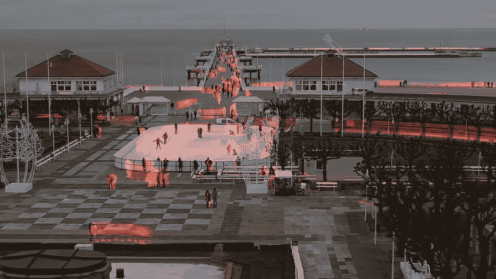
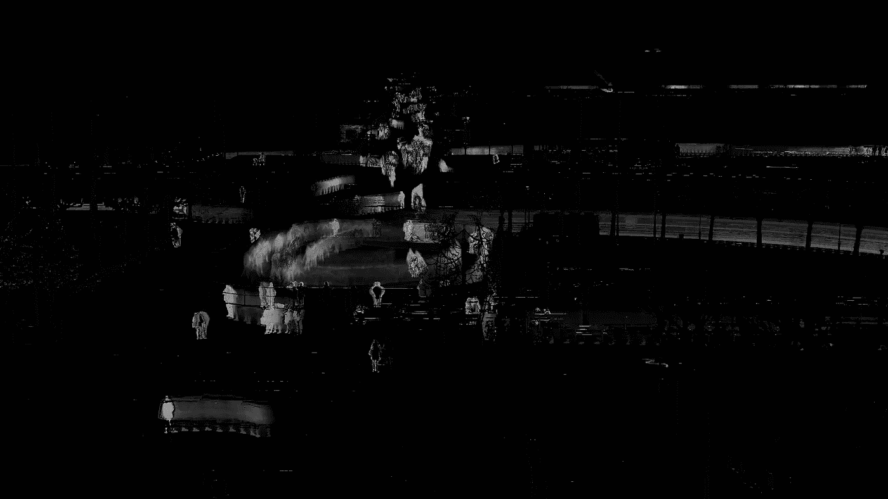
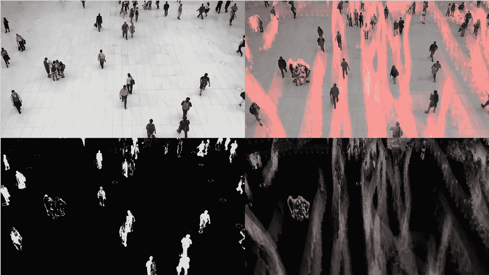
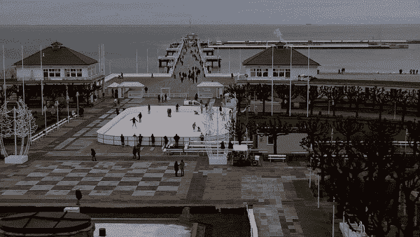

# 使用 OpenCV 和 Python 构建运动热图视频

> 原文：<https://towardsdatascience.com/build-a-motion-heatmap-videousing-opencv-with-python-fd806e8a2340?source=collection_archive---------6----------------------->

## OpenCV 是一个强大的图像和视频操作库，在这个故事中，我想创建一个运动热图，用于检测运动，物体或人的流动方向，例如，在投影公共区域时为建筑师提供帮助。



本指南中描述的最终结果的屏幕截图。

# 简介:

OpenCV，或(*开源计算机视觉*)是英特尔在 1999 年开发的主要针对计算机视觉和实时视频操作的库，它是用 C++编写的，但它支持不同的语言，其中包括 Python。

# 工作流程:

这个程序是基于一种被称为高斯背景减法的技术。这种技术广泛用于用稳定的摄像机检测运动物体。

背景减法创建一个表示帧背景(图像的静态部分)的遮罩，并且对于每一帧，它减去前一帧。

让我们对该算法如何工作的两个主要步骤有一个简单的概述:

*   背景初始化:在这个第一步中，通过*冻结*第一帧来计算背景的模型。
*   更新:在该第二步骤中，从前一帧中减去下一帧，因此，如果在两帧之间发生了变化(运动),则帧的差异将反映该变化，这可以通过应用过滤器来实现。

以下是应用于从城市摄像机录制的短视频的背景遮罩示例:



# 代码:

对于整个项目库，请在此处勾选[](https://github.com/robertosannazzaro/motion-heatmap-opencv/blob/master/README.md)****。****

**代码从读取输入视频文件开始，并初始化一些需要的变量:**

```
capture = cv2.VideoCapture('input.mp4')background_subtractor = cv2.bgsegm.createBackgroundSubtractorMOG()
length = int(capture.get(cv2.CAP_PROP_FRAME_COUNT))
```

**然后，`for`循环开始遍历帧:**

```
for i in range(0, length):

    ret, frame = capture.read()

    # If first frame
    if first_iteration_indicator == 1:

        first_frame = copy.deepcopy(frame)
        height, width = frame.shape[:2]
        accum_image = np.zeros((height, width), np.uint8)
```

**第一个`if`块检查该帧是否是视频的第一帧，这样做是为了初始化我们的背景，以便进行背景减法，然后用对应于该帧尺寸的尺寸初始化`accum_image`阵列。**

```
filter = background_subtractor.apply(frame)  # remove the background

threshold = 2
maxValue = 2
ret, th1 = cv2.threshold(filter, threshold, maxValue, cv2.THRESH_BINARY)

accum_image = cv2.add(accum_image, th1)

color_image_video = cv2.applyColorMap(accum_image, cv2.COLORMAP_HOT)
```

**为了去除少量的运动，如风、小鸟飞翔或一些噪音，一个`threshold`和`maxValue`一起应用到遮罩上。**

**屏蔽的结果然后被添加到`accum_image`阵列，该操作对每一帧执行。结果由`accum_image`数组组成，用于存储视频中发生的每个动作。**

**此外，因此，在最后，当已经对每一帧完成了先前描述的操作时，色彩映射表被应用于遮罩，并且遮罩与当前帧合并。**

****

**从上到下，从左到右:当前帧、当前最终帧、过滤后的当前帧、应用了从帧 0 开始的所有遮罩的帧。**

**更进一步，可以制作一个视频，显示热图逐帧淡入淡出。为了实现这一点，每一帧都被导出，并且再次使用`cv2`，通过将所有帧合并在一起来生成视频:**

```
video = cv2.VideoWriter('output.avi', fourcc, 30.0, (width, height))for image in images:
    video.write(cv2.imread(os.path.join(image_folder, image)))

cv2.destroyAllWindows()
```

****最终结果:****

****

```
**I have a newsletter 📩.**Every week I’ll send you a brief findings of articles, links, tutorials, and cool things that caught my attention. If tis sounds cool to you subscribe.*That means* ***a lot*** *for me.*
```

 **[## 米尔斯形式

### 编辑描述

无情-创造者-2481.ck.page](https://relentless-creator-2481.ck.page/68d9def351)**