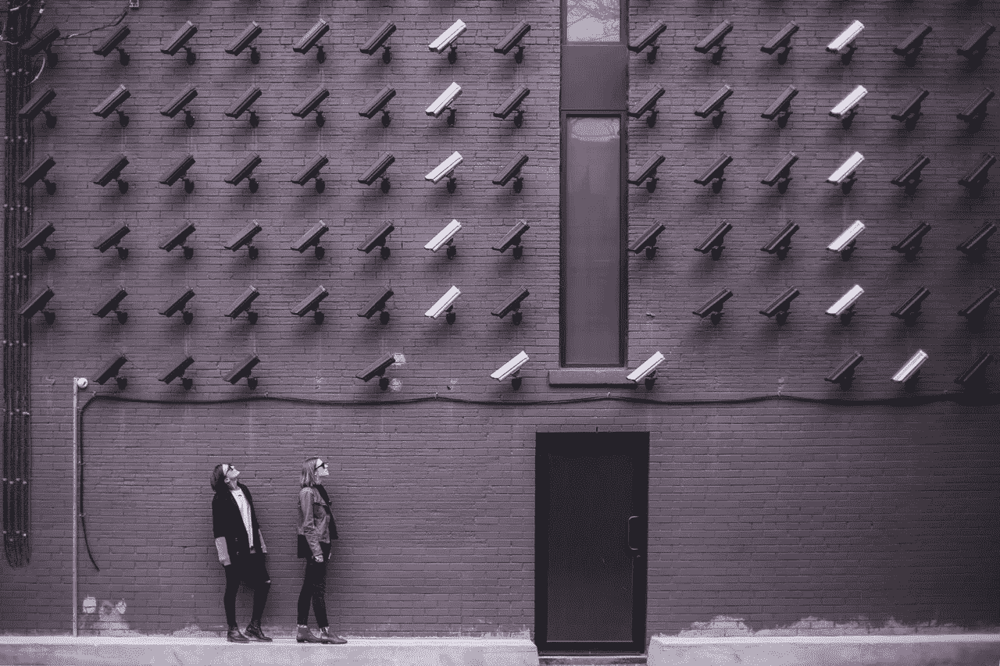
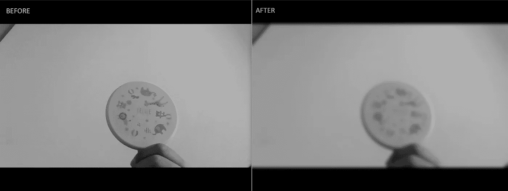

# 用 Python 构建运动检测报警系统

> 原文：<https://towardsdatascience.com/build-a-motion-triggered-alarm-in-5-minutes-342fbe3d5396?source=collection_archive---------9----------------------->

## 使用 OpenCV 进行运动检测的初学者友好指南

在我之前的一篇关于 Open-CV 的文章中，([*10 行中的人脸检测*](/face-detection-in-10-lines-for-beginners-1787aa1d9127) *)* ，我们探讨了一幅图像或视频中人脸检测的基础知识。在此基础上，我们将看到如何检测帧中的任何移动对象。当你外出度假时，你可以使用这种运动检测逻辑编写一个程序，然后发出警报或向你的手机发送消息。在本文中，我们将重点关注使用[***open-cv***](https://docs.opencv.org/trunk/index.html)识别和跟踪来自网络摄像头的视频提要中的任何移动对象，并使用离线文本到语音模块[***pyttsx 3***](https://pypi.org/project/pyttsx3/)库播放音频消息。让我们看看它是否足以吓跑窃贼！



照片由[突发](https://www.pexels.com/@burst?utm_content=attributionCopyText&utm_medium=referral&utm_source=pexels)发自[像素](https://www.pexels.com/photo/two-person-standing-under-lot-of-bullet-cctv-camera-374103/?utm_content=attributionCopyText&utm_medium=referral&utm_source=pexels)

# 概观

这个程序中有两个独立的模块，你可以根据你要实现的想法单独使用:

> 1.检测运动(使用 OpenCV)
> 2。播放音频/文本到语音(使用 pyttsx3)

我们将从使用 pip 安装以下 Python 库开始。

```
pip install pyttsx3
pip install pywin32
pip install numpy
pip install opencv-python
```

# 方法

方法很简单。当程序启动时，我们将捕获一个名为 *baseline_image 的图片。*这是没有任何物体/入侵者的图像。我们的程序将不断比较新的帧和这个基线图像。如果没有人进入或退出框架，将不会有任何区别。然而，当有人进入画面时，图像的内容会有所不同，如果这种差异超过某个阈值，我们的程序会将其视为入侵者并播放音频。

# 1.检测运动

为了检测运动，我们将使用 Open-CV 模块。我们从 baseline_image 开始，它是在没有任何移动对象的情况下捕获的帧。摄像机一启动，第一张图像就被设置为我们的 baseline_image，这意味着当我们的程序第一次启动时，我们不希望有移动的物体。接下来，当有人进入该帧时，该帧中的某些像素将会不同。我们使用“cv2.absdiff”方法推导出这种差异。

我们将采取几个步骤来实现这一目标。

> **1** 。捕捉基线 _ 帧(无对象)
> 1.1 将帧转换为灰色
> 1.2 平滑帧以去除噪声
> 
> **2** 。捕捉新帧(带对象)
> 2.1 将帧转换为灰色
> 2.2 平滑帧以去除噪声
> 
> **3** 。计算两帧之间的差异
> 3.1 **如果**差异大于阈值，则假定检测到运动
> 3.2 **否则**假定没有检测到运动

首先，我们将图像转换为灰度，并使用低通滤波器(LPF)柔化(模糊)图像。LPF 通常用于图像处理以平滑图像(例如:-用于皮肤平滑、背景模糊)，而高通滤波器(HPF)用于锐化图像(例如:-锐化眼睛和其他细节)。如果你曾经使用过像 Photoshop/GIMP 等图片编辑工具。，你一定很熟悉这个。这有助于通过消除噪声来提高精度。为此，我们使用了高斯布鲁。GaussianBlur 之前和之后的图像如下所示。



信用: [Arindom Bhattacharjee](https://medium.com/u/c5b77fc1811c?source=post_page-----342fbe3d5396--------------------------------)

如果你仔细观察图像的底部中心，你会注意到在“之前”图像中我手指的较暗一侧，我的手指有不同程度的灰度(一些区域没有其他区域暗)。然而，在“后”图像中，整个较暗的一面几乎是灰色的一种变体。模糊的程度由我们自己决定。这里我有高斯内核大小宽度和高度为(25，25)和一个标准偏差 0。宽度和高度应该是正奇数。可以把它想象成改变图像编辑工具中模糊量的滑块。执行此操作的代码如下所示。

```
**#Gray conversion and noise reduction (smoothening)**
gray_frame=cv2.cvtColor(frame,cv2.COLOR_BGR2GRAY)
gray_frame=cv2.GaussianBlur(gray_frame,(25,25),0)
```

下一步是推导基线和新帧之间的差异。我们将这两个图像传递给 cv2.absdiff()函数。这是使用一种叫做 [***图像阈值***](https://opencv-python-tutroals.readthedocs.io/en/latest/py_tutorials/py_imgproc/py_thresholding/py_thresholding.html) 的方法转换成的二进制图像，也就是说，如果一个特定的像素值大于某个阈值(我们在这里指定为 35)，它将被赋予白色的值(255)或者黑色的值(0)。现在我们有一个只有两种像素的图像(纯黑或纯白，中间没有)。这样做是为了使我们能够识别检测对象周围的轮廓区域。我们将用它在框架中的对象周围画一个绿色的方框。

现在我们将在我们的二值图像中找到所有的轮廓。 ***轮廓*** 简单来说就是沿着具有相同颜色或强度的周界或边界绘制的曲线。本质上，它会在黑色背景上的白色区域周围绘制一条曲线。它期望背景为黑色，前景对象为白色。使用 cv2.findContours()方法，我们将识别图像中的所有轮廓。该方法期望 3 个参数， **(a)** 图像， **(b)** 轮廓检索模式和 **(c)** 轮廓逼近方法。

该方法返回已识别轮廓的列表。我们使用 cv2.contourArea()方法过滤掉我们不感兴趣的小轮廓。cv2.boundingRect()返回左上角的(x，y)坐标以及包含特定轮廓的矩形的宽度和高度。然后我们画一个矩形在屏幕上显示它。

```
**#Calculating the difference and image thresholding**
delta=cv2.absdiff(baseline_image,gray_frame)
threshold=cv2.threshold(delta,35,255, cv2.THRESH_BINARY)[1]**# Finding all the contours**
(contours,_)=cv2.findContours(threshold,cv2.RETR_EXTERNAL, cv2.CHAIN_APPROX_SIMPLE)**# Drawing rectangles bounding the contours (whose area is > 5000)**
for contour in contours:
    if cv2.contourArea(contour) < 5000:
        continue
    (x, y, w, h)=cv2.boundingRect(contour)
    cv2.rectangle(frame, (x, y), (x+w, y+h), (0,255,0), 1)
```

# 2.播放音频(文本到语音)

为了播放音频，我们将使用"[***pyttsx 3***](https://pypi.org/project/pyttsx3/)" python 库来将文本转换为语音。您可以选择自己的声音(男/女)、讲话速度和音量。下面分享了我在这里使用的一段示例代码。

```
import pyttsx3engine = pyttsx3.init()
voices = engine.getProperty('voices')
engine.setProperty('voice', voices[1].id)
engine.setProperty('rate', 150)
engine.say("Object Detected")
engine.runAndWait()
```

最终的输出程序存在于 [**Github**](https://github.com/arindomjit/Motion_Detected_Alarm) 库中以供参考。您可能会注意到，播放音频的功能是在一个单独的线程中执行的。这样做是为了在播放音频警报消息时，视频馈送没有延迟。

让我们看看我们最终的工作版本是什么样的。

阿林多姆·巴塔查尔吉

在结论中，本文演示了如何使用 Python OpenCV 库来检测帧之间的差异，从而检测视频馈送中的运动对象。我们还探索了另一个 Python 库 pyttsx3，它可以将文本转换为语音，以及如何通过结合这两者来构建一个程序，在新对象进入框架时发送语音警报。我希望您发现本文中的信息很有用，并以自己的方式使用它。**感谢**阅读！

[](/face-detection-in-10-lines-for-beginners-1787aa1d9127) [## 面向初学者的 10 行人脸检测

### 使用 Python OpenCV 在图像和视频中检测人脸的介绍。

towardsdatascience.com](/face-detection-in-10-lines-for-beginners-1787aa1d9127) [](/generate-qrcode-with-python-in-5-lines-42eda283f325) [## 用 Python 生成 5 行二维码

### 也许在你的简历中使用它来链接到你的网站或 LinkedIn 个人资料

towardsdatascience.com](/generate-qrcode-with-python-in-5-lines-42eda283f325) [](/build-a-voice-controlled-mouse-keyboard-in-5-minutes-952bc8f101fc) [## 在 5 分钟内制作一个声控鼠标

### Python 中语音识别和 GUI 自动化的初学者指南

towardsdatascience.com](/build-a-voice-controlled-mouse-keyboard-in-5-minutes-952bc8f101fc) 

# 参考资料:

[1]图像过滤，[https://docs . opencv . org/2.4/modules/imgproc/doc/Filtering . html](https://docs.opencv.org/2.4/modules/imgproc/doc/filtering.html)

[2]图像阈值，[https://opencv-python-tutro als . readthedocs . io/en/latest/py _ tutorials/py _ img proc/py _ Thresholding/py _ Thresholding . html](https://opencv-python-tutroals.readthedocs.io/en/latest/py_tutorials/py_imgproc/py_thresholding/py_thresholding.html)

[3]了解轮廓，[https://docs . opencv . org/trunk/D4/d73/tutorial _ py _ Contours _ begin . html](https://docs.opencv.org/trunk/d4/d73/tutorial_py_contours_begin.html)