# 使用 Scikit-Learn、Flask 和 Heroku 构建一个电影推荐 API

> 原文：<https://towardsdatascience.com/build-a-movie-recommendation-api-using-scikit-learn-flask-and-heroku-bee239dc96e3?source=collection_archive---------6----------------------->

## 创建您自己的电影推荐 API，供其他开发者在他们的应用程序或网站中使用


Noom Peerapong 在 [Unsplash](https://unsplash.com/?utm_source=medium&utm_medium=referral) 上拍摄的照片

推荐系统无处不在。一些最好的例子是 **YouTube、网飞、Spotify** 。网飞和 YouTube**非常依赖他们的推荐系统来让用户在他们的平台上停留更长时间。 **Spotify** 根据用户的兴趣向用户推荐精选的歌曲列表。推荐系统发挥关键作用的例子还有很多。**

## 但是等等，什么是推荐系统？

> 简而言之，推荐系统是一种算法，旨在基于用户过去给出的偏好或评级向用户建议相关数据，或者基于项目的属性向用户建议相关数据。

要了解更多关于推荐系统的信息，请点击下面的链接

*   [**关于推荐系统**](https://en.wikipedia.org/wiki/Recommender_system)

# 目标:-

> **建立一个基本的基于内容的电影推荐系统，用 Flask 做一个 API，部署到 Heroku。**

随着本文的深入，我们将详细讨论**基于内容的推荐系统、API** 和 **Heroku** 。

***现在，我们来看看这篇文章的内容。***

# 内容:-

1.  **数据集描述**
2.  建立一个基于内容的推荐系统
3.  **使用 Flask** 构建一个 REST API
4.  **在本地主机— 127.0.0.1** 上测试
5.  **部署到 Heroku — API 上线**

我们将逐步介绍这些主题，最后，我们将构建一个**电影推荐 API** ，任何人都可以使用它在应用程序或网站中向他们的用户提供相关的电影建议。

# 那么，让我们开始吧。


杰瑞米·毕晓普在 [Unsplash](https://unsplash.com/?utm_source=medium&utm_medium=referral) 上的照片

# ***1。数据集描述***


弗兰基·查马基在 [Unsplash](https://unsplash.com/?utm_source=medium&utm_medium=referral) 上拍摄的照片

## 关于数据集

我们首先需要的是数据。关于电影的数据，比如**类型、演员阵容、剧情**等等。在这个任务中，我从 Kaggle 获取了数据。我们有两个数据来源。

*   [**TMDB 5000 部电影数据集**](https://www.kaggle.com/tmdb/tmdb-movie-metadata)
*   [**印度电影数据库**](https://www.kaggle.com/pncnmnp/the-indian-movie-database)

现在，由于我们想要一个非常基本的推荐系统来查看 API 在应用程序或网站中使用时的外观，因此我们根据我们的需要组合并修改数据集。

数据集的修剪和预处理部分是在我的一个 Jupyter 笔记本上单独完成的，这将在以后讨论。但是，如果您仍想了解修剪数据集所涉及的步骤，请访问下面的链接。

*   [**Jupyter 笔记本预处理。**](https://github.com/dD2405/BioScope-Recommendation-API/tree/master/Jupyter%20Notebook)

笔记本可能有点不整洁，因为它从来没有打算上网。因此，如果任何人都难以理解的话，我道歉。

下面是数据集的链接，该数据集将用于构建我们的**基于内容的推荐系统。**下载这个数据集，我们就可以开始了。

*   [**组合预处理后的电影数据集**](https://github.com/dD2405/BioScope-Recommendation-API/tree/master/dataset)

## 数据集概述

**因此，我们的数据集中有 6477 部电影，具有以下属性:-**

*   演员阵容:电影前三名男女演员
*   **流派:**电影的前 3 大流派
*   好莱坞和宝莱坞电影的 **movie_id: TMDb** 和**IMDb**id
*   **原创 _ 标题:**电影的标题
*   **剧情:**电影基本概况

我们已经准备好了数据集。让我们进入下一部分，即**构建基于内容的推荐系统。**

# **2*。构建基于内容的推荐系统***

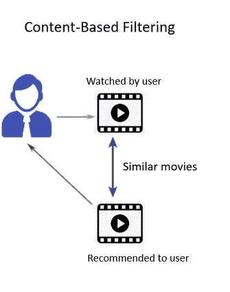

## 好了，现在什么是基于内容的推荐系统？

> 基于内容的推荐的工作原理是，如果用户喜欢某个项目，那么我们根据项目的特征或属性向用户推荐类似的项目。所以在我们的例子中，如果一个用户喜欢一部特定类型的电影或者一个演员，那么我们就向用户推荐一部类似的电影。因此，如果用户已经观看了电影**小丑**，那么我们的推荐系统将预测与**小丑**相似的电影，或者如果我们考虑电影的演员阵容，与**小丑**具有相同演员阵容的电影。

现在我们对什么是基于内容的推荐系统以及它是如何工作的有了一个基本的概念，让我们来编码一下。

## 文件 1 — recommendation.py

## **导入所需的包**

**recommendation.py** 中有 5 个函数。让我们逐一讨论它们。

## **i) get_data()**

***get _ data()****用于获取电影的相关数据，并将数据集及其属性作为结果返回，以便进一步预处理。*

*   **第二行:**我们使用 **pandas.read_csv()** 读取 **movie_data.csv.zip** 文件。
*   **第 3 行:**将所有电影的标题转换成小写字母。
*   **第 4 行:**返回数据集作为函数的结果。

**get _ data()的返回值:-**

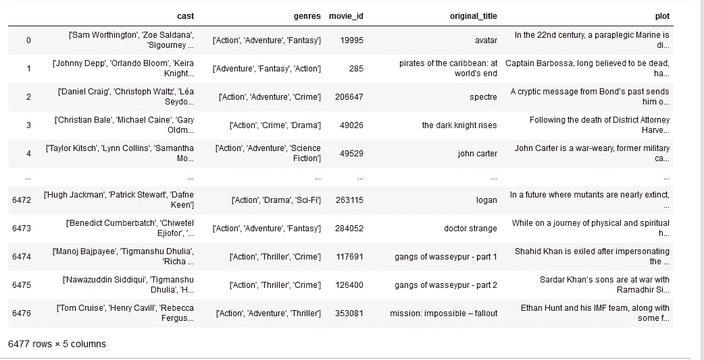

## ii)合并数据()

***combine _ data()****删除特征提取不需要的列，然后合并****cast****和* ***流派*** *列，最后返回****combine****列作为该函数的结果。*

**第 2 行:**删除特征提取不需要的属性。

**第 3 行:**将两列**演员**和**流派**合并成一列。

**第 5 行:**我们有一个带有**造型**和**流派**值的组合列，因此我们从数据集中删除了单独存在的**造型**和**流派**列。

**第 6 行:**返回带有**合并**列的数据集。

**combine _ data()的返回值:-**

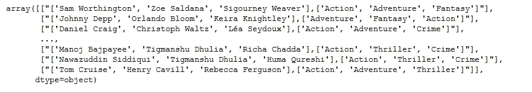

演员表和流派栏合并

在继续下一步之前，请浏览下面提到的主题及其链接。在我们进入下一部分，即 ***transform_data()之前，对这些主题有一个基本的了解将会很有帮助。***

*   [**稀疏矩阵**](/handling-sparse-matrix-concept-behind-compressed-sparse-row-csr-matrix-4fe6abe58a7a)
*   [**包话**](https://docs.google.com/document/d/1QDDOoU0zo-uf9hGXHcOdNWiG7sq-pUPk0vAWLFeVi84/edit?usp=sharing)
*   [**Tf-Idf 矢量器**](https://docs.google.com/document/d/1afbxNmhKSQrLCAHHjmjr7_Wqin31gj_xbkhIBvBDFlg/edit?usp=sharing)
*   [**余弦相似度**](https://www.machinelearningplus.com/nlp/cosine-similarity/#5softcosinesimilarity)

## iii)转换数据()

***transform _ data()****取****combine _ data()****和****plot****column from****get _ data()****并应用* ***计数矢量器*** *和*

*   ***第 2 行:**为 **CountVectorizer** 创建一个对象，并使用 **stop_words** 参数开始删除英文停用词。*
*   ***第 3 行:**将**计数矢量器**对象**计数**拟合到 **combine_data()** 返回的值上，即 **cast** 和**流派**的组合列值。在这之后，我们得到一个**稀疏矩阵**，如我们在关于**单词袋**的讨论中所示，带有每个单词的计数值。*

*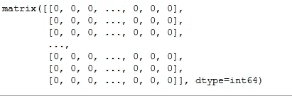*

*计数矢量器稀疏矩阵输出*

*   ***第 5 行:**为 **TfidfVectorizer** 创建一个对象，并使用 **stop_words** 参数开始移除英文停用词。*
*   ***第 6 行:**将**tfidf 矢量器**对象 **tfdif** 拟合到我们从 **get_data()得到的 **plot** 列上。**在此之后，我们得到一个**稀疏矩阵**，如我们讨论的 **Tf-Idf 矢量器**所示，其中包含每个单词的值。*

*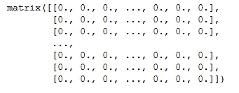*

*tfidf 矢量器稀疏矩阵输出*

*   ***第 8 行:**我们将通过**计数矢量器**和 **TfidfVectorizer** 得到的两个**稀疏矩阵**组合成一个单一的**稀疏矩阵**。*
*   ***第 10 行:**我们现在对我们组合的稀疏矩阵应用**余弦相似度**。*
*   ***第 12 行:**返回作为 **transform_data()** 的结果生成的余弦相似度矩阵*

***transform _ data()的返回值:-***

*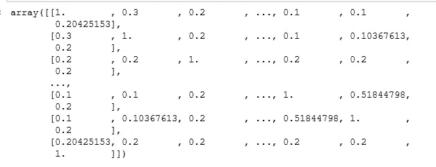*

*余弦相似性*

**我们将****Tf Idf 矢量器*** *用于* ***图*** *列，因为****Tf-Idf****将较低的值分配给特定文档中具有较高频率的词，而将较高的值分配给具有较低频率的词。**

**例如**

> *在星际军阀灭霸瓦解了半个宇宙后，复仇者们必须重新团结起来，重振他们被击败的盟友，恢复平衡。*

**在这部来自* ***复仇者联盟 4：终局之战*** *的电影情节中，我们将赋予诸如* ***灭霸*** *和* ***复仇者联盟*** *等词语更高的价值，因为它们出现的次数更少，但在确定电影的主旋律方面具有更高的意义。**

## *四)推荐 _ 电影()*

***推荐 _ 电影()**需要四个参数。*

*   ***标题:**电影名称*
*   ***数据:**返回值为 **get_data()***
*   ***combine:****combine _ data()**的返回值*
*   ***transform:****transform _ data()**的返回值*

*   ***第 3 行:**创建一个**熊猫系列**，包含我们数据集中所有电影的索引。*

*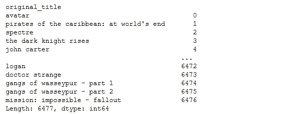*

*熊猫系列*

*   ***第 4 行:**在**标题**参数中获取传递给我们的**推荐 _ 电影()**函数的输入电影的索引。*

**例如，我们通过电影* ***Logan*** *作为我们的输入电影。这一行给了我们熊猫系列电影****Logan****的索引。**

**

*我们输入电影的索引*

*   *第 6 行:这里我们存储每部电影相对于输入电影的余弦值。*

**比如我们输入的电影是* ***黑暗骑士。*** *这行代码的作用是计算所有电影相对于我们输入的电影的余弦值。**

*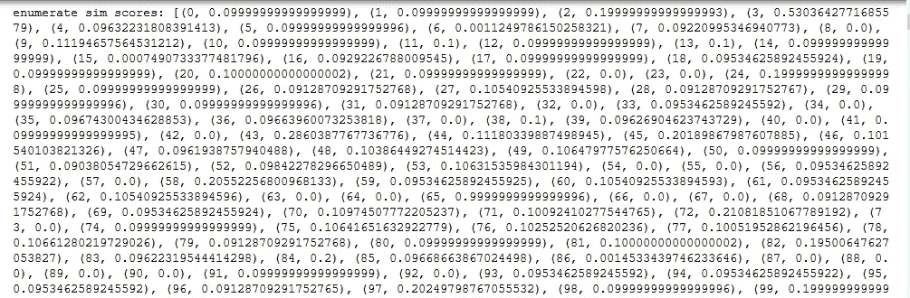*

*关于**黑暗骑士**的余弦值*

*   ***第 7 行:**得到余弦值后，我们以逆序排序。正如我们从余弦相似性主题的简介中读到的，文档离源越近，余弦值越高。*

*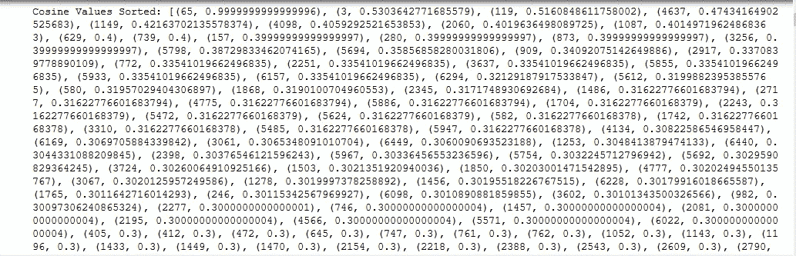*

*相对于**黑暗骑士**排序的余弦值*

**在上面的图像中，我们看到了输入电影的所有余弦值。输入的电影将是最相似的，所以它的值是****0.99****。之后我们看到对于* ***索引 3*** *我们的余弦值是* ***0.530。*** *现在如果你把它和我们之前的熊猫系列输出* ***【黑暗骑士崛起】*** *处于* ***指数 3*** *不出所料这是最类似于* ***黑暗骑士*** *的电影。**

*   ***第 8 行:**我们需要输入电影的前 20 部电影。因此，我们存储了与输入电影最相似的 20 部电影*

*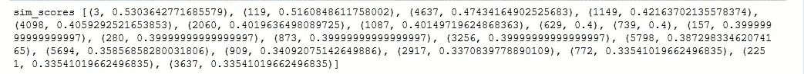*

*关于**黑暗骑士**的前 20 个余弦值*

*   ***第 10 行:**我们将按照余弦值排序的前 20 部电影存储在一个列表中。*

*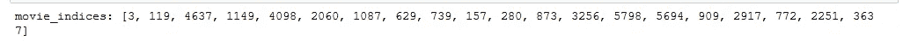*

*20 大电影指数*

*   ***第 12–14 行:**在这几行中，我们将电影索引存储在它们各自的列中。*

*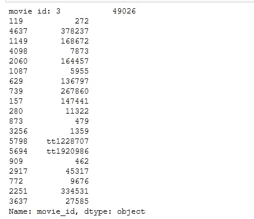*

*movie_id 及其索引*

*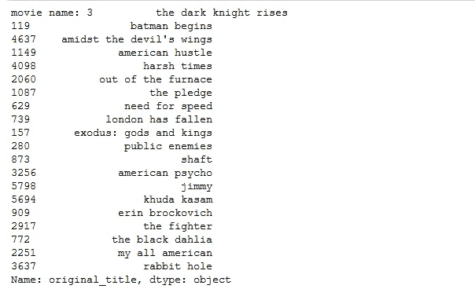*

*电影标题及其索引*

*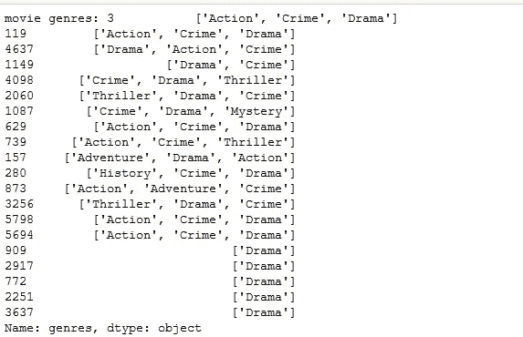*

*电影类型及其索引*

*   ***第 16 行:**我们创建一个熊猫数据帧，以**电影 Id、名称、类型**为列。*
*   ***第 18 — 20 行:**我们在刚刚创建的熊猫数据帧中存储了所有 20 部与我们的输入电影相似的电影，即**黑暗骑士**。*
*   ***第 22 行:**返回推荐前 20 部电影的熊猫数据帧。*

***推荐 _ 电影()**返回值为 ***黑暗骑士* :-***

*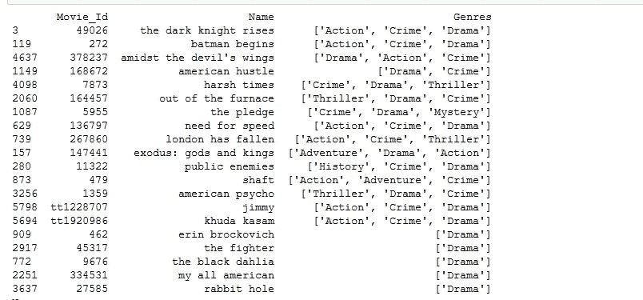*

## *五)结果()*

****result()****取一个* ***电影的片名*** *作为输入，返回前 20 个推荐。**

*   ***第 2 行:**将 **movie_name** 转换为小写，因为在我们的数据集中所有的电影都是小写。我们这样做是作为预防措施。如果用户同时用小写字母和大写字母输入电影名称，这不会有问题，因为我们的函数仍然会返回结果。*

****例如:*** *如果输入的是****Logan****或****Logan****或****Logan****我们还是得到我们的推荐。**

*   ***第 4–6 行:**我们存储 **get_data()、combine_data()和 transform_data()返回的值。***
*   ***第 8–9 行:**检查输入电影是否存在于我们的数据集中。如果在我们的数据集中没有找到，那么我们返回没有找到电影。*
*   ***第 11–12 行:**如果我们的电影出现在数据集中，那么我们调用我们的 recommend_movies()函数并传递 **get_data()、combine_data()和 transform_data()** 的返回值以及电影名称作为函数的参数。*
*   ***第 13 行:**我们以 Python 字典格式返回电影结果。*

***结果的返回值():-***

*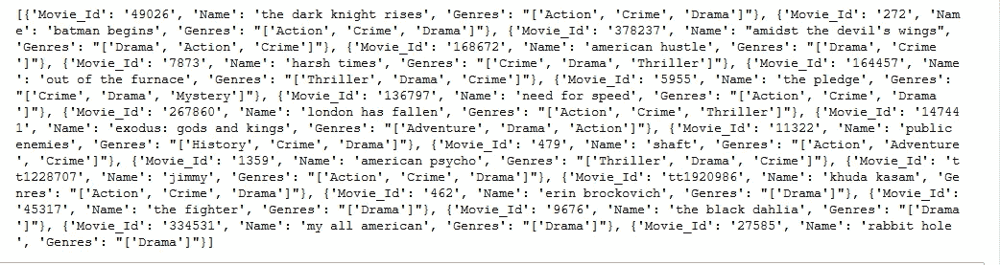*

*既然我们的推荐系统已经准备好了，让我们进入下一部分，即**使用 Flask 构建一个 REST API。***

# *3.**使用 Flask** 构建一个 REST API*

**

*[Marvin Meyer](https://unsplash.com/@marvelous) 在 [Unsplash](https://unsplash.com/?utm_source=medium&utm_medium=referral) 上拍摄的照片*

## *烧瓶:-*

*为了理解文章的这一部分，我建议你对 Flask 有一个基本的概念。对于我们的任务，我们只需要了解一些初级功能。*

*要在您的系统上安装 Flask，请打开终端/命令提示符，键入 ***pip install Flask。*** 就这样，Flask 现在已经安装在你的系统上了。*

*要了解一个简单的 Flask 应用程序的基本知识，请点击下面的链接。*

*   *[**烧瓶你好世界**](https://flask.palletsprojects.com/en/1.1.x/quickstart/#quickstart)*

*如果你喜欢视频讲座，请仔细阅读视频中关于**烧瓶**的简要说明。*

*[**烧瓶你好世界—视频讲座**](https://youtu.be/tvRnBbwQwvs?list=PLXmMXHVSvS-AjwTOtiW1DXFYTgUlrUmHV)*

*现在，我们对 Flask 有了一个基本的概念，让我们进入下一个主题，即**REST API。***

## *REST API:-*

*我强烈建议你们对**API**和 **API** 的设计原则之一(即 **REST API)有一个基本的了解。***

*浏览下面提到的链接。它将为您提供关于**API**和**REST API 的基本概述。***

*   *[**理解和使用 REST API**](https://www.smashingmagazine.com/2018/01/understanding-using-rest-api/)*

*如果你喜欢视频讲座，请仔细阅读 Telusko 提供的关于**API**和**REST API 的简要说明。***

*   *[**什么是 REST API？**](https://www.youtube.com/watch?v=qVTAB8Z2VmA&list=PLsyeobzWxl7ps4Z1C4VMtvZEx5-PgyoYI)*

*要了解如何创建一个 **REST API** ，如果我们先编写一些基本的应用程序，并了解更多关于 **GET** 方法及其工作原理，这将非常有用。*

*下面提到的链接使用 Flask 和 **GET** 方法构建了一个 **REST API** 来向客户端显示数据。把这些代码写出来，理解基础知识，然后继续我们的 **app.py** 文件中的代码。*

*   *[**用 Flask 创建 RESTful API—GET 请求**](https://youtu.be/CjYKrbq8BCw?list=PLXmMXHVSvS-AFMUmbBeIfL3PqTvgw8ygb)*

## *文件 2 — app.py*

*在这个文件中，我们将编写 Flask 应用程序，并使用我们之前构建的推荐系统。*

## *导入所需的包*

***第 1 行:**我们导入**烧瓶**类，然后**请求**库发送 **HTTPS** 请求，最后我们导入 **jsonify** 以 **JSON** 格式返回我们的结果。*

***第 2 行:**我们导入 **flask_cors** 来为我们的 API **启用跨来源请求。***

*什么是**跨来源请求**？*

> ***跨源资源共享** ( **CORS** )是一种机制，允许从提供第一资源的域之外的另一个域请求网页上的受限资源。*

*要了解更多关于 CORS 的政策，请点击下面的链接。它解释了你需要知道的关于 CORS 政策的一切。*

*   *[**什么是 CORS？**](https://www.codecademy.com/articles/what-is-cors)*

***第 3 行:**我们导入我们的**推荐. py** 文件作为一个模块，在我们的 **app.py** 文件中使用它。*

## *烧瓶代码:-*

*   *第 1 行:我们创建了这个类的一个实例。第一个参数是应用程序的模块或包的名称。*
*   ***第 2 行:**我们使用 **CORS()** 方法在我们的 API 上启用 **CORS** 策略。*
*   ***第 4 行:**然后我们使用 **route()** decorator 告诉 Flask 哪个 URL 应该触发我们的函数。在这种情况下，我们使用带有基本 URL 的 **/movie** 端点。*
*   ***第 5 行:**现在，我们定义一个名为 **recommend_movies()** 的函数，它将用于返回前 20 个推荐。*
*   ***第 6 行:**在这一行中，我们从 **recommendation.py** 文件中调用 **results()** 函数，并将推荐存储在一个名为 **res.** 的变量中。使用**request . args()**将电影名称作为**查询字符串**传递给我们的 **results()** 函数，参数名称为 **title。***
*   ***第 7 行:**最后我们将从 **recommendation.py** 接收到的结果以字典格式返回到 **app.py** 并转换成 **JSON** 格式返回结果。*
*   ***第 9 行:**这一行表示如果我们直接从终端/命令提示符调用我们的 **app.py** 文件，那么它将执行后面的内容。*
*   ***第 10 行:**我们在终端/命令提示符下直接调用我们的 **app.py** 文件后运行 app。当在***localhost****上运行时，我们将端口号设置为 5000，并设置 **debug=True** 来追溯运行我们的应用程序时发生的任何错误。**

# ****4。在 localhost — 127.0.0.1** 上测试**

****

**由[大卫·特拉维斯](https://unsplash.com/@dtravisphd)在 [Unsplash](https://unsplash.com/?utm_source=medium&utm_medium=referral) 上拍摄的照片**

**现在，我们已经完成了编码部分，让我们在 ***localhost*** 上测试我们的应用程序，看看它是否工作。**

**如果你想用 Postman 测试我们的 API，那么从下面的链接下载。**

*   **[**下载邮差**](https://www.postman.com/)**

**如果你喜欢用浏览器而不是邮递员，你也可以用浏览器来测试。我们将对他们两个进行测试，你将会看到结果。**

## **测试我们的 API:-**

****步骤— 1:** 如果在 Windows 中，请打开命令提示符；如果使用 Linux，请打开终端。**

****步骤— 2:** 使用命令行导航到存储数据集、 **recommendation.py** 文件和 **app.py** 文件的文件夹。**

**我们将文件存储在名为**建议 2.0 的文件夹中。下面是我们的目录结构。****

**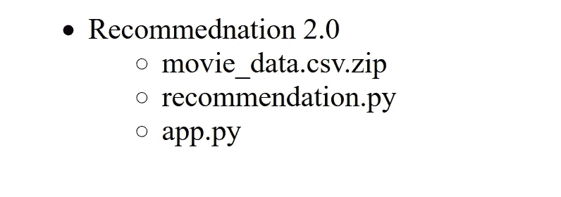**

**我们的目录结构**

**开发应用程序时，所有文件和数据集都应该放在一个文件夹中，以便于使用。**

****步骤 3:** 当我们在**建议 2.0** 文件夹中时，在命令行中键入以下命令。**

```
****set FLASK_APP=app.py****
```

****运行应用程序:-****

```
****flask run****
```

**执行完这两个命令后，我们将看到我们的应用程序运行在 **localhost** 上。**

**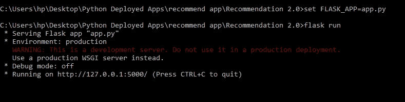**

****烧瓶应用程序启动并运行****

****步骤 4:** 使用 Postman 或任何浏览器在 ***localhost*** 上测试我们的 API。**

**当我们将一部电影传递给我们的 API 时，让我们看看我们的结果。**

## ****邮递员:-****

**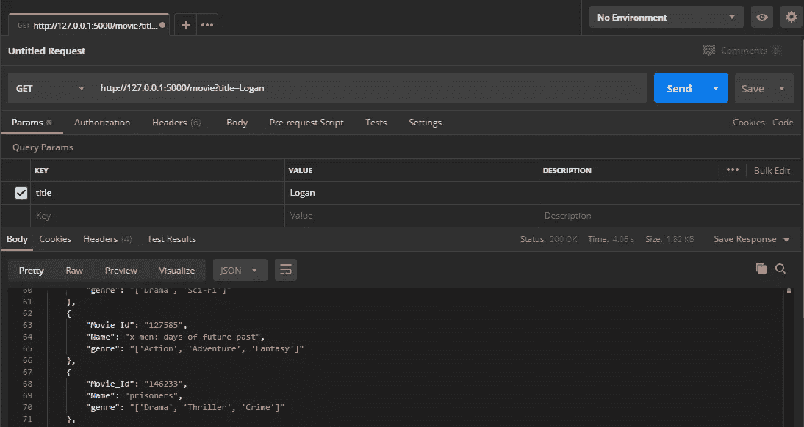**

**对**洛根**的建议**

## **浏览器:-**

**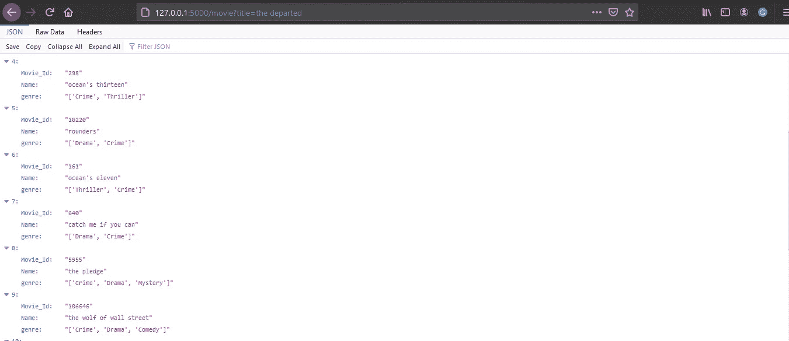**

**对**逝者的推荐****

**我们已经在 ***localhost*** 上完成了对我们的 API 的测试，它工作得非常好。**

**让我们进入最后一部分，即将我们的 API 部署到 Heroku。**

# ****5。部署到 Heroku — API 上线****

****

**莱昂·塞伯特在 [Unsplash](https://unsplash.com/?utm_source=medium&utm_medium=referral) 上拍摄的照片**

## **GitHub 存储库:-**

**在我们进入部署部分之前，我们需要对 **GitHub 有一个基本的了解。**您应该能够**创建一个新的存储库，添加文件，删除文件**和**在存储库中创建文件夹**如果需要的话。**

*   ****步骤 1:** 创建一个存储库，可以使用您喜欢的任何名称。我已经把我的库命名为 **BioScope，**因为我和我的朋友们认为这是一个很酷的名字。**

**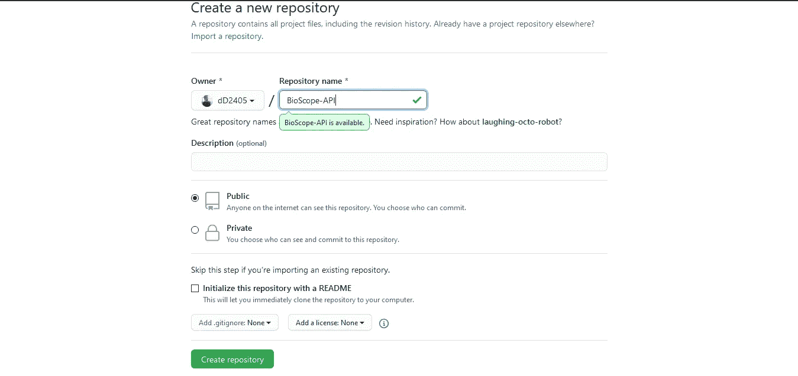**

*   ****第二步:** **创建过程文件****

> **Heroku 应用程序包括一个 **Procfile** ，它指定了应用程序在启动时执行的命令。您可以使用 Procfile 来声明各种进程类型，包括:您的应用程序的 web 服务器。**

**要创建一个，在工作目录中打开一个名为 **Procfile(无扩展名)**的新文件，并粘贴以下内容。**

```
****web: gunicorn app:app --max-requests 2****
```

**我们添加了 **max requests** 来确保我们的服务器在每第二次请求我们的 API 后重启。这样做是为了确保我们在使用 API 时不会超过 Heroku 分配的 512 MB 的 RAM 限制。**

*   ****第三步:** **创建需求. txt****

> **requirements.txt 文件将包含 flask 应用程序的所有依赖项。如果您不是在一个新的环境中工作，这个文件将包含您当前环境中的所有需求。**

**对于这个项目，你的 **requirements.txt** 至少应该包含:**

```
****Flask==1.1.2 
Flask-Cors==3.0.8 
Flask-RESTful==0.3.7 
gunicorn==20.0.4 
joblib==0.13.2 
jsonschema==2.6.0 
pandas==0.25.1 
pickleshare==0.7.5
requests==2.23.0 
requests-file==1.4.3 
scikit-learn==0.22.2 
scipy==1.4.1 
wcwidth==0.1.7 
webencodings==0.5.1
Werkzeug==1.0.1****
```

**将上述内容复制粘贴到您的 **requirements.txt** 文件中，并提交到存储库。**

****第四步:**提交**推荐. py，应用. py.****

****第五步:**在你的存储库中创建一个名为 **dataset/** 的文件夹，提交 **movie_data.csv.zip** 文件。**

****我们的存储库结构应该是这样的:-****

**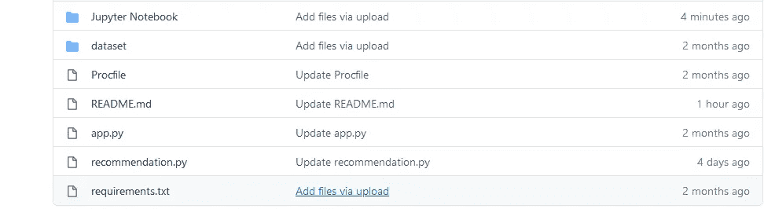**

**Jupyter 笔记本包含制作我们的 **movie_data.csv.zip** 文件所需的预处理部分。所以，这个文件夹是可选的。除此之外，所有其他文件和文件夹都是必要的。**

*   *****re commendation . py*****
*   ****app . py****
*   ****requirements . txt****
*   *****Procfile*****

**N**ote:****以上所有文件都应该在工作目录级别，而不是在另一个文件夹中。****

## **部署到 Heroku:-**

> **我们可以使用 **Heroku CLI** 或 **GitHub** 部署我们的应用程序。在本文中，我们将讨论如何使用 **GitHub 部署我们的应用程序。****

****步骤— 1:** 在[**www.heroku.com**](https://www.heroku.com)**创建自由账户。****

****第二步:**选择一个名称，点击**“创建应用”**，创建一个新的应用。这个名称并不重要，但它必须是唯一的。**

**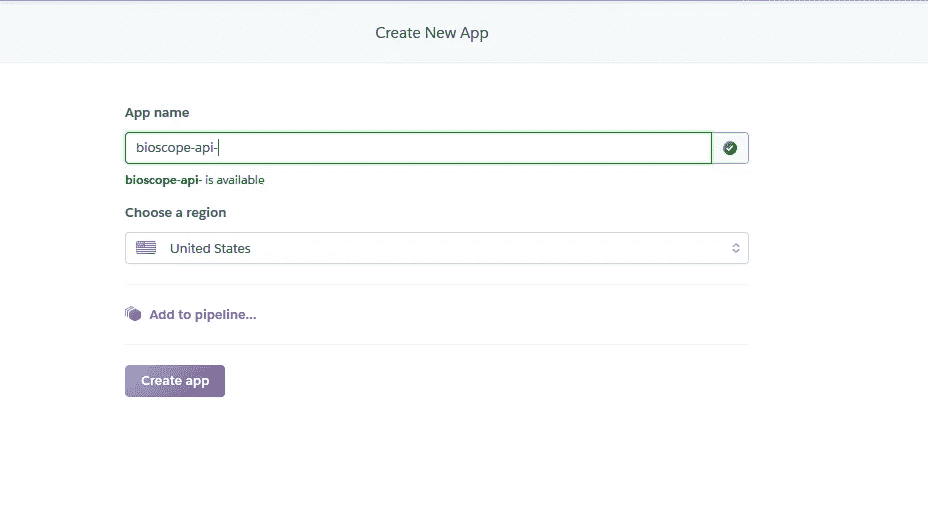**

****第三步:**点击下面的 **GitHub** 图标，连接您的 **GitHub** 账户。**

****

****步骤 4:** 搜索正确的存储库并单击连接。**

****

****第五步:**滚动到页面底部，点击**“部署分支”。****

**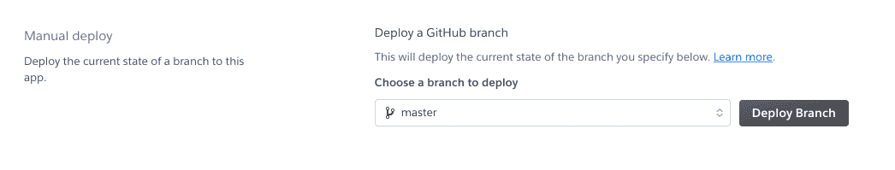**

## **如果一切正常，您应该会看到这条消息。**

**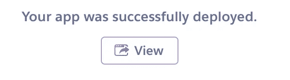**

**如果出现问题，检查你的 **requirements.txt** ，删除给你带来问题的依赖项，然后再试一次。**

## **部署后测试我们的 API**

*   **注意我们发送 **GET** 请求的链接。**

**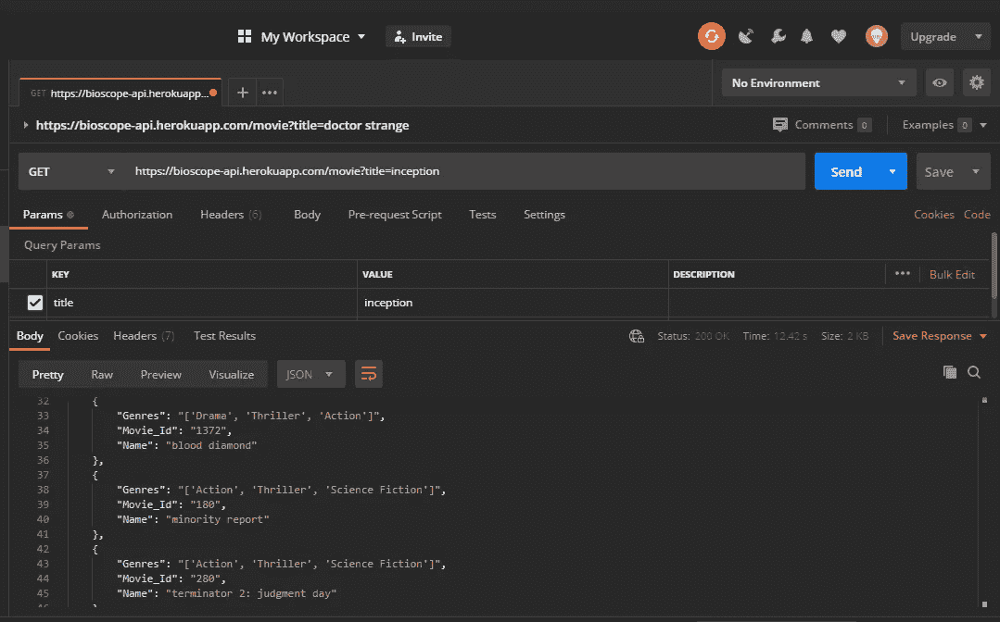**

## **最后，我们的电影推荐 API 现已上线。**

****

**[亚伦·保尔](https://unsplash.com/@aaronpaulos)在 [Unsplash](https://unsplash.com/?utm_source=medium&utm_medium=referral) 上的照片**

**任何拥有 Heroku 链接的人现在都可以访问电影推荐 API，并向他们的用户显示电影建议。**

***就这样，我们到了这篇文章的结尾。我希望你们已经学到了一些新的东西，我当然希望你们都使用这个 API 或者构建类似的东西。***

***我们刚刚构建了一个基本的* ***基于内容的推荐系统*** *。可以做的比这多得多，比如构建一个* ***协同推荐系统*** *或者甚至构建一个* ***混合推荐系统。我们会详细讨论这个问题，但那是另一篇博文的内容了。*****

## **API 链接:-**

*   **[**BioScope 电影推荐 API**](https://bioscope-api.herokuapp.com/movie?title=insert-movie-name)**

## **完整代码:-**

*   **[**GitHub 资源库**](https://github.com/dD2405/BioScope-Recommendation-API)**

## ****你可以打:-** 找到我**

*   **[**领英**](https://www.linkedin.com/in/deepak-das-profile/)**
*   **[**GitHub**](https://github.com/dD2405)**

# **快乐阅读！！！**