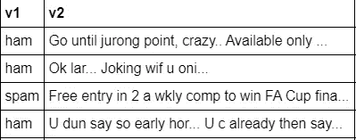
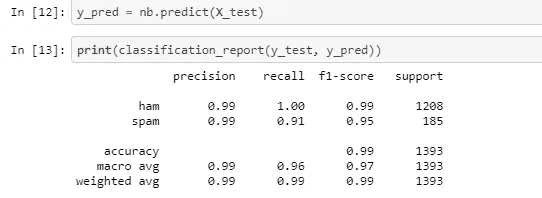
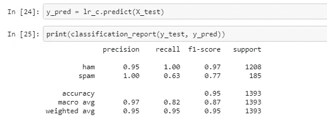

# 用 SciKit-Learn 构建 NLP 管道:火腿还是垃圾邮件？

> 原文：<https://towardsdatascience.com/build-a-nlp-pipeline-with-scikit-learn-ham-or-spam-b2cd0b3bc0c1?source=collection_archive---------61----------------------->

## 使用 Scikit-Learn 的自然语言处理库制作简单的垃圾邮件检测器模型的初学者指南。

作者:[爱德华·克鲁格](https://www.linkedin.com/in/edkrueger/)和[道格拉斯·富兰克林](https://www.linkedin.com/in/douglas-franklin-1a3a2aa3/)。

在我们的 [GitHub 库](https://github.com/edkrueger/spam-detector)中查看代码！


安娜·阿尔尚蒂在 Unsplash 上的照片

## 问题是

像许多 NLP 问题一样，决定哪些电子邮件属于垃圾邮件，哪些是你可能想要阅读的是一个分类问题。

我们可以问，电子邮件属于哪一类，是垃圾邮件还是非垃圾邮件？因此，我们有两个类来分类我们所有的电子邮件。从哪里开始？

为了解决这个问题，我们将使用监督机器学习。这意味着我们有一个已经被标记为垃圾邮件的电子邮件集合。被认为是非垃圾邮件的电子邮件。大致上，我们的模型将通过查看电子邮件的内容并将该内容与任一标签相关联来学习对这些电子邮件进行分类。

经过训练后，我们的模型可以接收一封未标记的电子邮件，并对其进行分类。

## 数据

在我们开始之前，让我们看一下我们的数据。



用于监督学习的标记电子邮件数据

我们从包含垃圾邮件和非垃圾邮件的语料库或文本集合开始。数据包括标签列(v1)和文本列(v2)。这是我们的模型将读取的数据，用于将消息与类相关联。

听起来很简单，但是计算机不能像我们一样阅读和学习！然而，机器是优秀的计算器。所以让我们把我们的文本转换成一种我们的机器可以进行数学运算的结构，向量。

在完成一些基本的文本清理以处理大小写和非字母字符之后，我们可以开始了。我们将讨论的矢量化的第一步称为标记化。

## 标记化

给定一个字符序列和一个定义的长度，标记化就是将文档分割成指定长度的片段，称为*标记*。

令牌不一定是术语或单词。一个*标记*是一些特定文档中的一个字符序列的实例，这些字符被分组为一个有用的语义单元用于处理。换句话说，标记是我们希望模型学习的有意义的语言。

**示例:**句子的标记化，将标记长度限制为**五个**字符。

```
**IN:** “moon river wider than a mile i am crossing you in style”**OUT:** [moon, river, wider, than, a, mile, i, am, cross, you, in, style]
```

通过标记化，我们已经从包含超过五个字符长的单词和空格的**字符串**变成包含五个字符或更少字符且没有空格的单词或标记的**数组**。

好了，我们现在有了一个字符串数组，我们如何把这些数组转换成向量呢？

## 矢量化:将单词映射为数值

Scikit-learn 的 CountVectorizer 提供了一种简单的方法来标记一组文本文档并构建已知单词的词汇表。

我们看到的任何文档都可以被编码为一个固定长度的向量，其长度为已知单词的词汇表的长度。向量中每个位置的值可以用文档中每个单词的计数或频率来填充。

用 CountVectorizer 将句子转换成向量

对我们来说，这给了每封邮件一个整数向量。向量将是语料库中不同单词数量的长度。给定一个冗长的语料库，这些向量在计算过程中会变得相当长且麻烦。

这就引出了我们的下一个想法，如何在不损失太多意义的情况下缩小语料库？

一旦我们用 CountVectorizer 将语料库转换成一个整数数组，我们就进入停用词。

## 停用词:模型中包含什么词汇？

在帮助确定文档是否是垃圾邮件方面似乎没有什么价值的常见单词被完全从词汇表中排除。这些词被称为*停止词*。决定停止列表的一般策略是根据*收集频率*(每个术语在文档集合中出现的总次数)对术语进行排序，然后将最常见的术语作为*停止列表，这些术语有时根据它们相对于被分析文档的领域的含义进行手动过滤。*然后在索引过程中丢弃该非索引列表的成员。

可以手动或自动将停用词添加到停用列表中。在 Scikit-learn 的计数矢量器中，有一个针对特定语料库的停用词的选项。您可以传递一个非索引词数组，或者使用最小和最大文档频率参数自动完成这个过程。

这个简化的矩阵将训练得更快，甚至可以提高你的模型的准确性。

缩小语料库对于减少模型的内存使用非常有用。这样会节省计算成本！

## 计数矢量器

CountVectorizer 标记、矢量化并创建我们的非索引列表！所以我们要做的就是在模型管道中调用它。这个函数返回一个稀疏矩阵，我们将使用它来训练我们的 ML 模型。

## 构建模型管道

机器学习**管道**用于帮助机器学习工作流程自动化。这些管道的运行方式是，在一个模型中对一系列数据进行转换和关联，只需一个代码步骤就可以对这些数据进行测试和评估。

例如，看看我们的朴素贝叶斯管道。

```
nb = make_pipeline(
    CountVectorizer(binary=**True**),
    MultinomialNB()
)
```

我们只需调用`make_pipline`，添加 CountVectorizer 和我们的模型，然后调用`nb.fit`使用管道训练一个模型！

机器学习算法通常涉及一系列任务，包括预处理、特征提取、模型拟合和验证阶段。管道帮助我们将这些任务整合在一起。

## 模型度量:精确度和召回率

我们如何判断哪种模型最有效地解决了这个问题？首先，让我们看看我们的一些模型分数，精度和召回率。

**Precision** 试图回答以下问题:

*实际上有多少比例的肯定认同是正确的？*

Precision 测量被标记为垃圾邮件的**邮件被正确分类的百分比。**

**回想一下**试图回答以下问题:

*正确识别实际阳性的比例是多少？*

召回衡量被正确分类的实际垃圾邮件的百分比。

要全面评估一个模型的有效性，你必须同时检查**和**精度和召回率。不幸的是，精确度和召回率经常处于紧张状态。也就是说，提高精度通常会降低召回率，反之亦然。

所以你需要知道，对于你的问题，精确和召回哪个更重要？

让我们来看看我们的两个模型。这里我们有朴素贝叶斯模型的分数。



朴素贝叶斯

这是逻辑回归模型的分数。



逻辑回归

请注意，除了垃圾邮件精确度这一项之外，NB 模型在所有方面都优于 LR 模型。我们不能说一个模型总是比另一个好，但我们可以更多地选择正确的那个。

## 保存您的模型

一旦你决定了一个模型，把它保存为一个. joblib，就像下面我们对朴素贝叶斯模型所做的那样。

```
dump(nb, "clf.joblib")
```

现在您已经有了一个保存为 joblib 的垃圾邮件检测模型！

## 结论

在这里，我们已经涵盖了基本的 NPL 概念，记号化，向量化和停用词。然后，我们在模型管道中使用这些概念和 CountVectorizer 来比较模型之间的度量。在决定了朴素贝叶斯分类器之后，我们将它保存为一个 joblib，供以后在我们的应用程序中使用。

查看我们的 [GitHub Repositor](https://github.com/edkrueger/spam-detector) y 中的代码，获取一个模板开始使用！

要为您的模型提供应用程序并进行部署，请查看下面的进一步阅读资料！

本文讨论构建一个应用程序来服务我们的模型，以及如何将它部署到云中。我们涵盖了应用程序的构建和 docker 化，在 Google Container Registry 上存储 docker 映像，以及将应用程序部署到 Cloud run。

[](/deploy-a-scikit-learn-nlp-model-with-docker-gcp-cloud-run-and-flask-ba958733997a) [## 使用 Docker、GCP 云运行和 Flask 部署 Scikit-Learn NLP 模型

### 构建一个服务于自然语言处理模型的应用程序，将其容器化并部署的简要指南。

towardsdatascience.com](/deploy-a-scikit-learn-nlp-model-with-docker-gcp-cloud-run-and-flask-ba958733997a)