# 在不到 60 分钟的时间内建立一个推荐系统

> 原文：<https://towardsdatascience.com/build-a-recommender-system-in-less-than-an-hour-using-amazon-personalize-68bee9931c60?source=collection_archive---------21----------------------->


在泰国清迈拍摄的一只病狗的照片

## 使用 Amazon Personalize 建立推荐系统的分步指南。

B 公元时代！自从泰国政府宣布冠状病毒进入紧急状态，我们所有人都被鼓励在家工作。我被分配了一项具有挑战性的任务，主持一场主题为“提高新冠肺炎电子商务客户参与度”的网络研讨会。

因此，经过仔细考虑，并考虑到我在机器学习方面的基本背景，我决定将这次网络研讨会的主题定为在不到一个小时的时间内使用亚马逊个性化构建推荐系统。

说实话，我确实花了一些时间浏览 YouTube 上关于使用 Python 构建推荐系统的教程——关于余弦相似性等概念。起初，这很简单，但后来问题开始出现。以下是其中的一些:

*   我如何部署这个算法？我如何为模型服务？我需要调配哪个云基础架构？
*   我如何应对趋势和客户行为的快速变化？
*   我如何处理新用户和新项目？(经典的冷启动问题)

我偶然发现亚马逊个性化，它勾选了所有正确的框。

**我是这样做的！**

# **什么是亚马逊个性化？**

亚马逊个性化是一个实时个性化和推荐服务。这是一种即时解决方案，您只需添加数据，点击几下鼠标，我们就可以获得随时可用的推荐引擎。

> 如果你想跟进——我建议你下载传奇的 MovieLens 数据，其中包含用户和评级，这将是我们输入亚马逊个性化的数据

[](https://www.kaggle.com/prajitdatta/movielens-100k-dataset) [## MovieLens 100K 数据集

### 稳定的基准数据集。1000 名用户对 1700 部电影的 100，000 次评分

www.kaggle.com](https://www.kaggle.com/prajitdatta/movielens-100k-dataset) 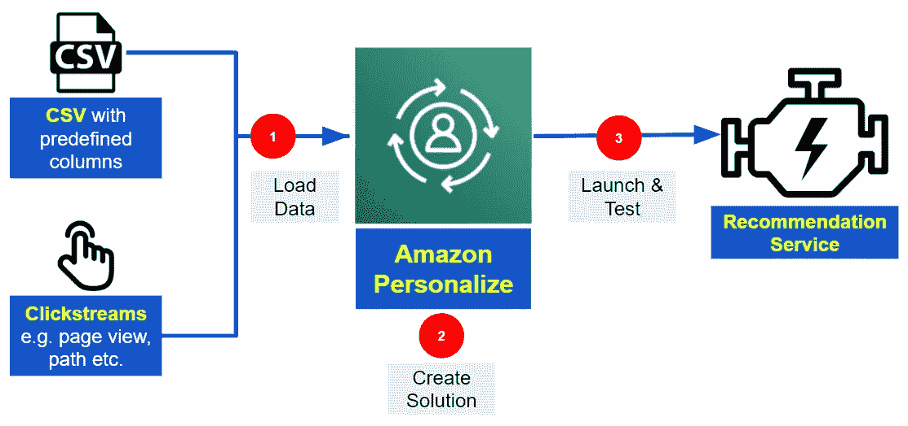

Shivek Sachdev 个性化亚马逊概述(*作者图片*)

# **第一步:数据准备&加载数据**

**注意:**为了描绘一幅更好的画面，让我们使用一个假想的电子商务网站来完成我们将使用 Amazon Personalize 构建推荐系统的 3 个步骤。

我必须准备一个带有预定义列的 CSV 文件，列中有“谁买了什么？”数据——这被称为“交互”。

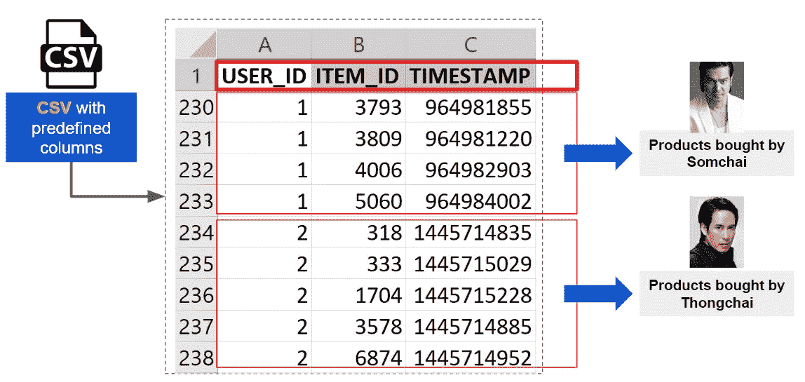

亚马逊个性化所需的列示例(*作者图片*)

所以我们需要 **USER_ID** 和 **ITEM_ID** ，以及**时间戳** (Unix 日期格式)。

我们需要将 CSV 文件转储到 S3 桶中，对于那些不熟悉 AWS 的人来说，S3 是一个对象存储。你想往里面倒什么都可以，但是你得付钱给杰夫！

因此，事不宜迟，我们推出了亚马逊个性化服务！

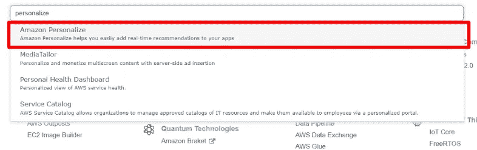

在 AWS 控制台中搜索“个性化”以启动该服务(*图片作者*)

在第一步中，我们将首先创建一个数据集组，以便将我们的数据导入 Amazon Personalize。

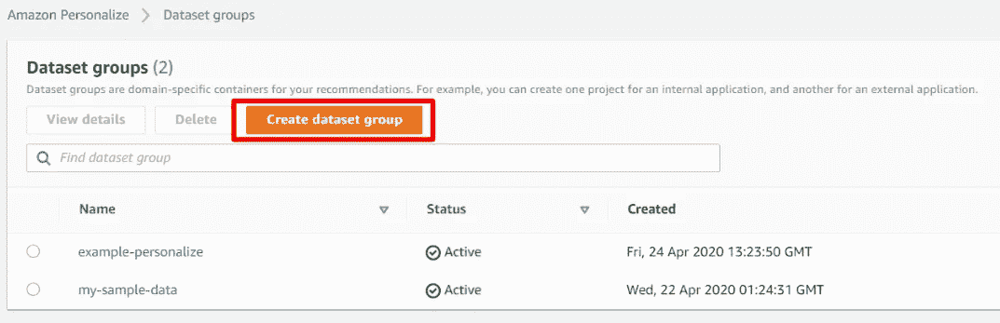

在 Amazon Personalize 中创建数据集组(*作者图片*

然后，我们将被重定向到 Amazon Personalize 控制台中的概览仪表板。确保点击导入用户-项目交互数据。我们将把我们的数据从 S3 导入到 Amazon Personalize dataset 组，只需将路径粘贴到 CSV 文件即可。

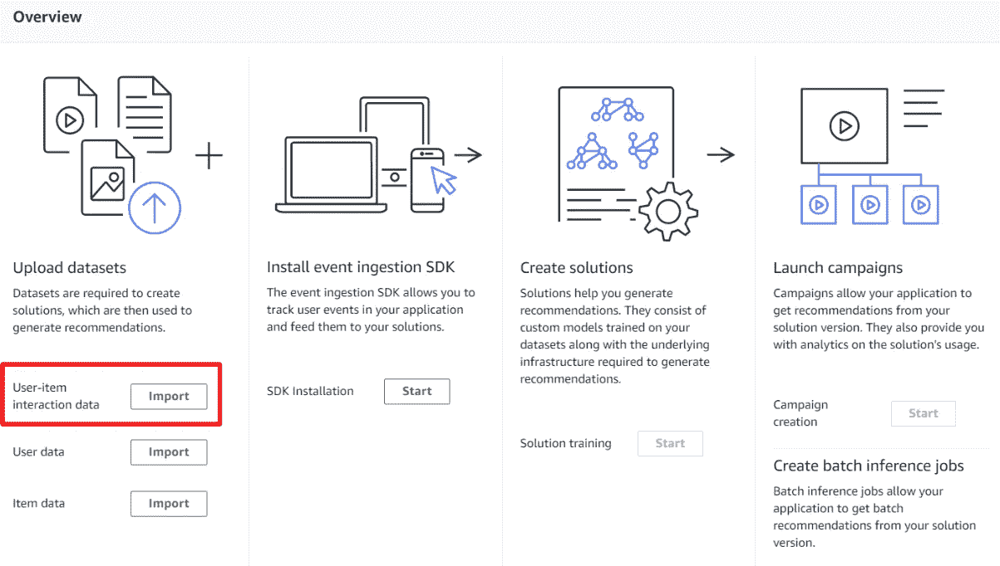

上传数据集:用户-物品交互数据(*图片作者*)

要导入我们的 CSV，我们必须创建一个数据集名称，并为 Amazon Personalize 提供一个 JSON 模式。这个 JSON 文件是一个模式定义，将用于在我们开始构建推荐系统之前提供所有必需的细节。

下面是我们如何可视化 JSON 模式文件，希望有所帮助！

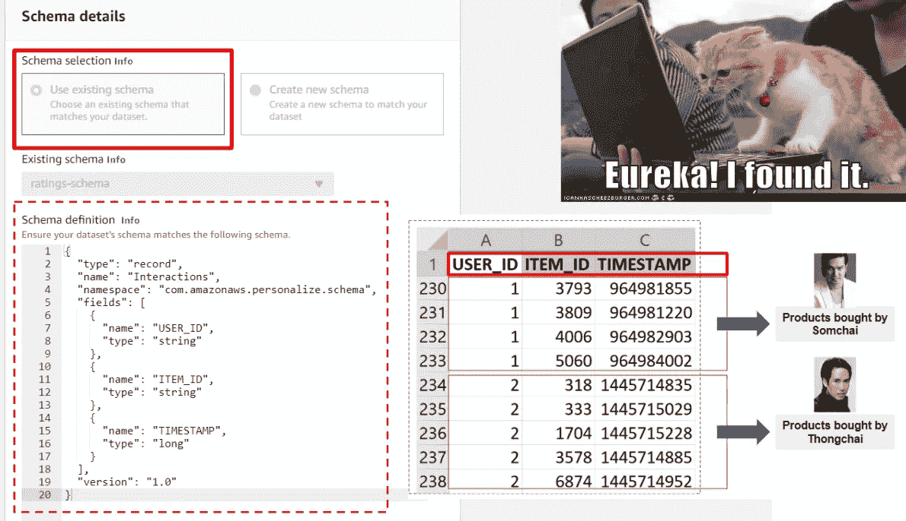

模式定义(JSON)与 CSV ( *作者图片*)

完成后，我们可以单击“开始导入”来导入 CSV 文件，以完成我们创建数据集的过程，这就结束了步骤 1！

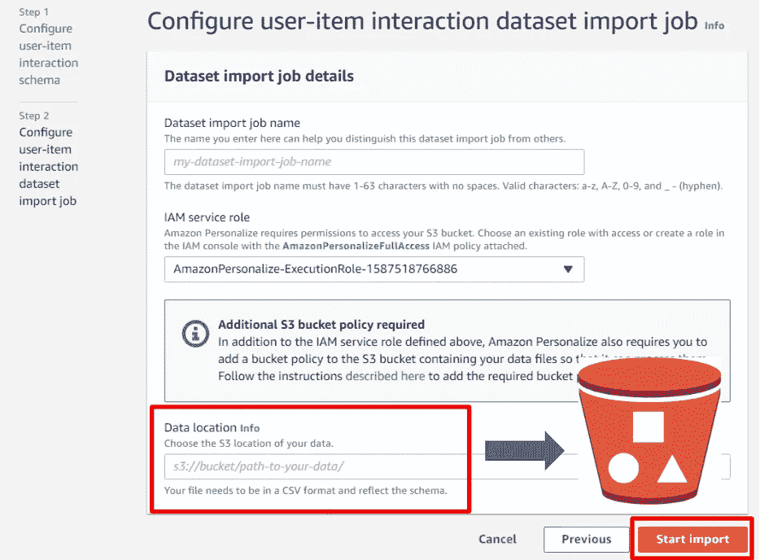

选择 CSV 数据的 S3 位置(*图片作者*)

# **步骤 2:创建解决方案(模型培训)**

继续第 2 步。在这里，您将创建一个解决方案，并从 Amazon Personalize 上的一系列预建推荐算法中进行选择。

**这样想:**

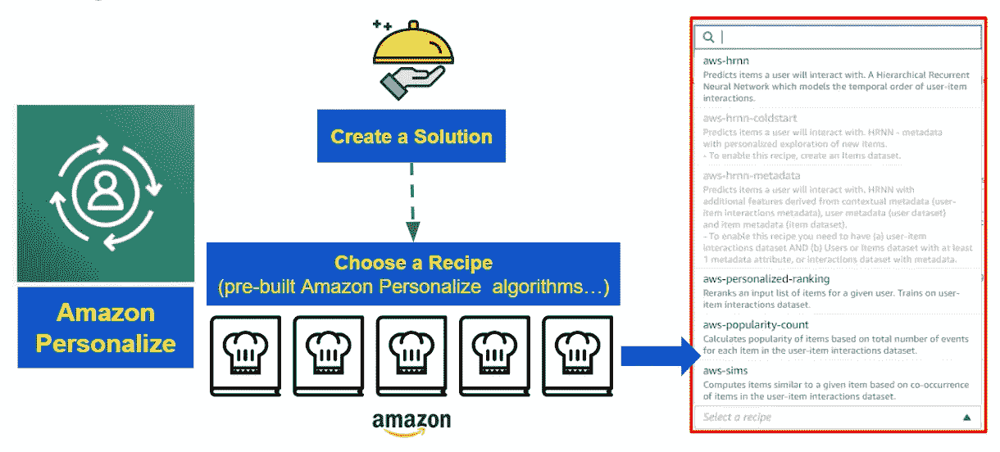

亚马逊个性化解决方案和食谱(*作者图片*)

要开始此流程，我们从上次离开的地方开始，从概览控制面板开始，但这次我们将单击“创建解决方案”。

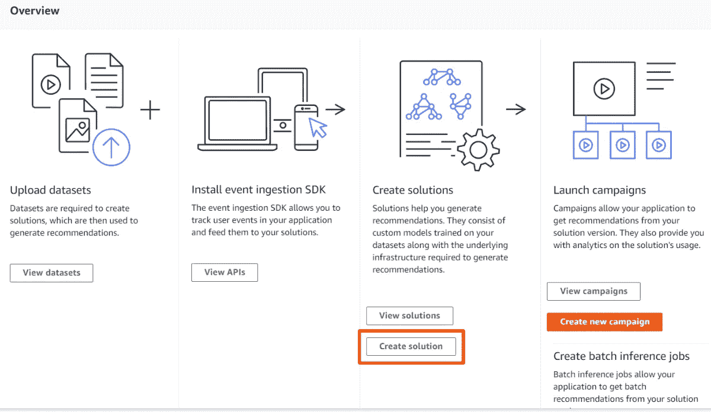

创建解决方案(*作者图片*)

由于我在机器学习方面有非常基本的知识，我选择了 AutoML 作为食谱——这意味着亚马逊个性化将检查我们的数据，并为我们建议最佳食谱。

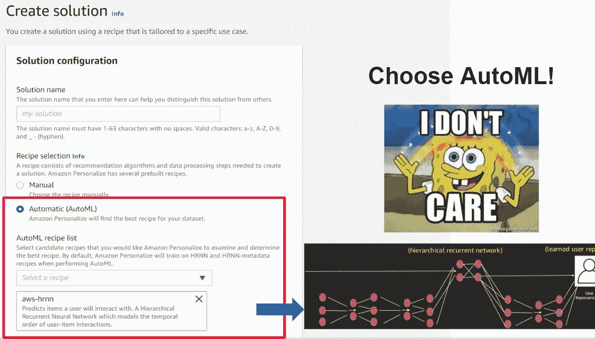

在亚马逊上创建一个个性化的解决方案

HRNN 代表**分层递归神经网络**。这种算法应该非常强大，可以处理消费者行为的变化——非常适合这个新冠肺炎时代！

HRNN 将是模拟行为变化并推荐更适合消费者/购物者的商品的完美解决方案。

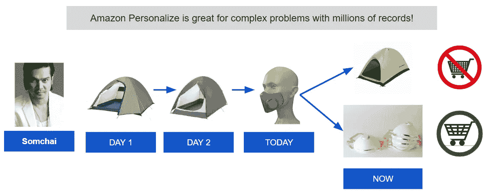

HRNN 可以模拟消费者/用户的行为变化，并推荐最佳产品选择

> 奇迹就在这里发生——不要惊讶，这可能需要一段时间。毕竟是魔法。

对于 ML 极客来说，这里是 HRNN 和其他人的基准对比。

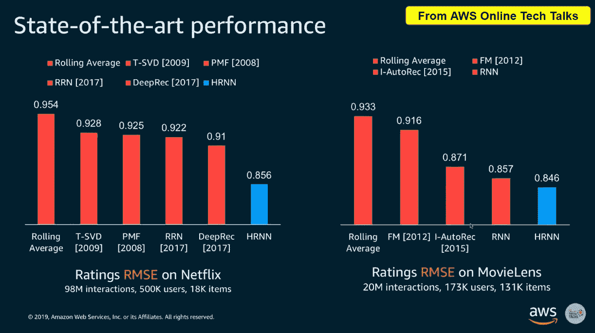

在 AWS 在线技术讲座上，HRNN 与其他人进行了最先进的表演

# 步骤 3:启动和测试活动

这是我们的最后一步——我们将在 Amazon Personalize 上发起一场“活动”,并最终看到我们推荐的系统将向我们的用户/客户展示哪些商品。创建营销活动是最简单的步骤，我们像往常一样从概览控制面板开始。

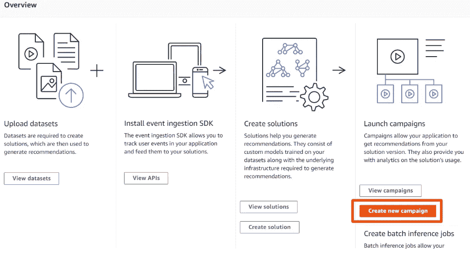

创建一个新的活动(*图片作者*

**请确保您选择了刚刚在第 2 步中创建的解决方案，然后点击“创建活动”。**

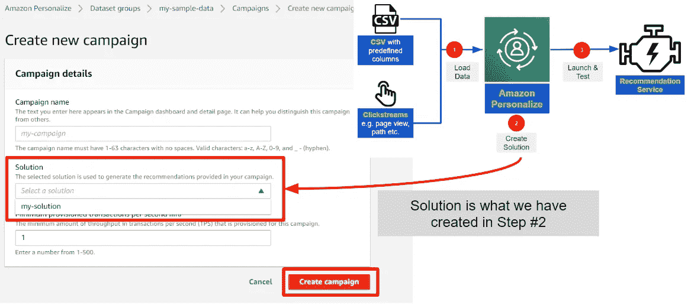

在亚马逊上创建一个活动个性化(*作者图片*)

现在是关键时刻，我们可以通过输入用户 ID 来测试该活动，然后单击“Get recommendations”来查看向我们的用户/客户推荐的商品 ID 列表。就这么简单！

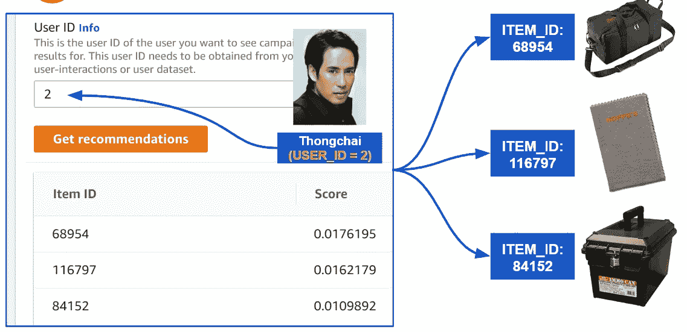

亚马逊个性化测试活动(*作者图片*)

# 额外收获:亚马逊个性化服务中的模特

通常当人们谈论将一个模型“投入生产”时，他们通常意味着执行**推理**，有时被称为模型评估或预测或服务。

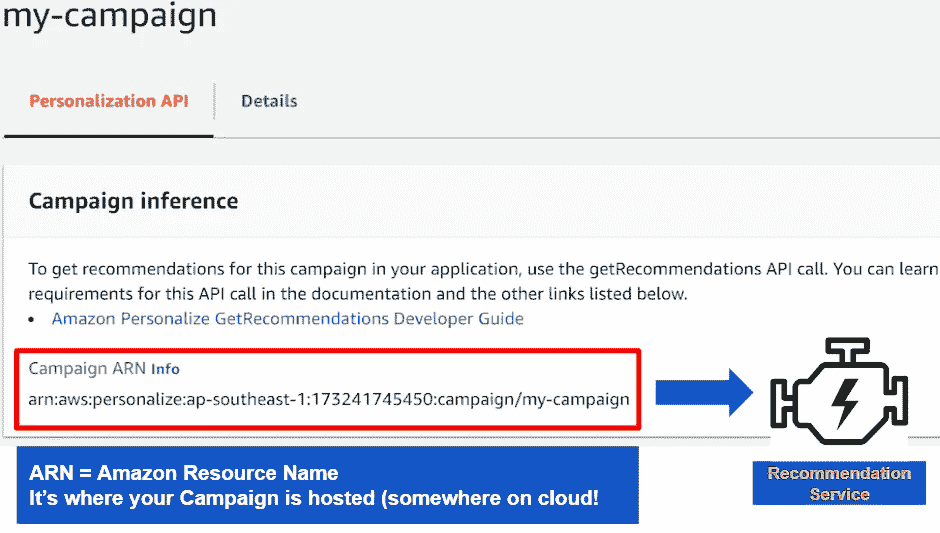

活动推断(*作者图片*)

在 Amazon Personalize 的例子中，一旦我们创建了我们的活动，它将自动为我们创建和部署一个活动推断端点。我们需要做的只是调用 getReccomendation API 来获得实时推荐！

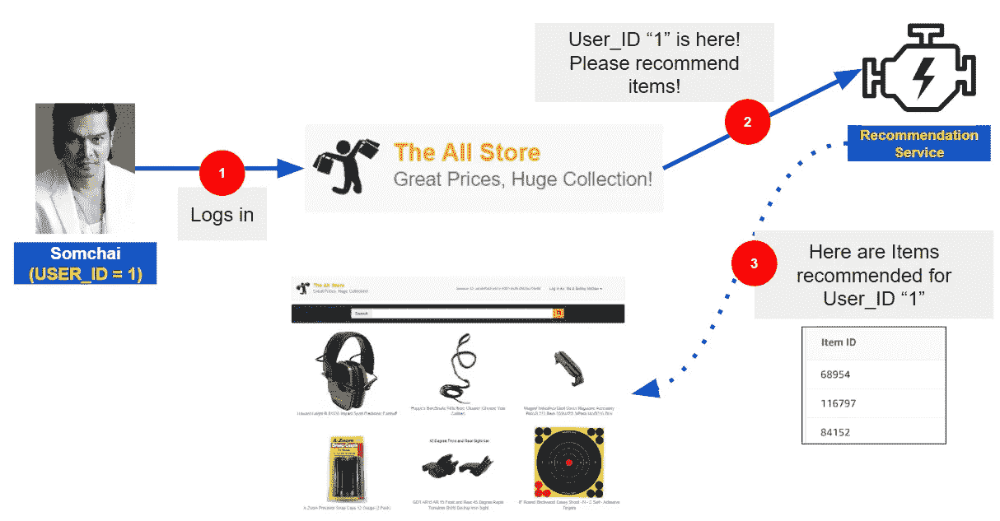

与亚马逊个性化活动 ARN 整合(*作者图片*)

下面是调用 API 所需的代码示例——我们只需要对用于 Python 的 AWS SDK(boto 3)有一个非常基本的了解。

**确保您安装了用于 Python 的 AWS SDK。**

1.  创建一个“响应”字典
2.  调用 get_recommendations API，传递一个 **userId** 变量来获取推荐
3.  显示推荐的项目(将显示 itemId)
4.  映射 itemId 并合并“项目名称数据框架”中的数据以显示项目名称(这是可选的)

```
**import** **boto3** personalize = boto3.client('personalize')
response = personalize.list_recipes()
**for** recipe **in** response['recipes']:
    print(recipe)
personalizeRt = boto3.client('personalize-runtime')
```

运行这个代码块，通过传递一个 user_Id(我在下面的例子中使用了 2)来获得商品推荐，并确保调用了正确的 campaignARN！

```
response = personalizeRt.get_recommendations(
campaignArn = 'arn:aws:personalize:***<insert region & campaign ARN>***:campaign/ratings-campaign',
userId = '2')
```

> 我们在没有任何 ML 知识的情况下完成了这件事！


我们做到了！庆祝的时间到了！[网络模因](https://sayingimages.com/celebration-meme/)

很棒的东西！这个博客将只涵盖亚马逊个性化的非常基础(入门级)的部分。这对那些有或没有 ML 背景的人来说都很好，但还有更多要学的。总之，我们使用 Amazon Personalize 在不到一个小时的时间内成功构建了一个最先进的推荐系统。说实话——我写这篇博客的时间可能比在 Amazon Personalize 上运行整个过程的时间还多！