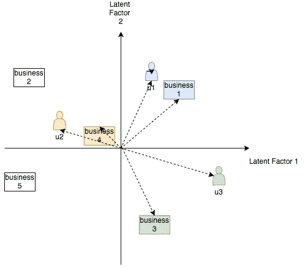

# 构建推荐系统:Yelp 评分预测实例——协同过滤

> 原文：<https://towardsdatascience.com/build-a-recommender-system-yelp-rating-prediction-example-collaborative-filtering-28a6e48a8cc?source=collection_archive---------12----------------------->

## 个性化

## 利用用户和项目与某些潜在特征的密切关系来预测用户对项目的评分。


图片来源: [Unsplash](https://unsplash.com/photos/i_xVfNtQjwI)

**本文内容:**我开始这一系列文章，通过解释它们的工作原理并展示它们在数据集上的应用来介绍几种流行的推荐系统技术 [Yelp Challenge 2019](https://www.yelp.com/dataset/challenge) 。每篇文章都有不同的关注点，这取决于复杂性是存在于数据预处理、模型概念还是实现中。在本文中，我将介绍一种最常用的模型——协同过滤(CF)及其通过矩阵分解技术奇异值分解(SVD)的实现。本文将主要侧重于解释概念，并附带关键代码演练。更多细节包含在发布在 [Github](https://github.com/jiangzl2016/yelp-rating-prediction/blob/master/1_baseline_and_collaborative_filtering.ipynb) 上的代码和评论中。

> **注:**本文是一个四人团队(邦威·周、James Jungsuk Lee、Ujjwal Peshin 和)的项目成果。非常感谢 [Brett Vintch](http://brettvintch.com/) 为这个项目提供指导和反馈。在每篇文章之后，完整的代码将会在[这个](https://github.com/jiangzl2016/yelp-rating-prediction) Github 库上提供。代码是用 Python 写的。

## 关于挑战和项目目标

Yelp 数据集挑战[1]为学生提供了一个对 Yelp 数据进行研究或分析并分享发现的机会。参与者可以以创新的方式使用这些数据，并找到对 Yelp 及其用户有意义的结果。

这个项目的目标是比较向用户推荐当地企业的不同方法。这包括根据用户的历史评级记录预测用户以前没有访问过的企业的评级值。我们模型的性能主要通过均方根误差(RMSE)来衡量。此外，还测量了其他类型的指标，如排名指标、覆盖率和新颖性，以评估排名质量、准确性分布和预测的多样性。此外，模型运行时间被测量。它们将在后面的文章中详细阐述。

## 资料组

数据以 zip 文件的形式出现，可以通过这个[链接](https://www.yelp.com/dataset)访问。该文件包含 6 个 JSON 数据文件，我们的模型主要使用以下内容:

*   reviews.json:包含来自 10 个大都市地区 19 万家企业的 160 万用户的 700 万条评论。每个记录都是用户在某个日期和时间对某个企业的评价和全文评论。
*   json:包含业务概要，包括位置数据、属性和类别。
*   user.json:包含用户资料，包括用户的朋友映射和所有与用户相关的元数据，例如评论数、帐户年龄、收到的酷投票数等。

## 数据准备

原始审查数据集很大(> 5GB)，因此建议开发一个代表整个数据集的较小数据集，以加快开发周期。此外，为了提供足够的每用户数据供模型学习，或者为了避免*冷启动*问题，少于 5 条评论的用户被过滤掉。请注意，解决冷启动的方法将在以后的文章中讨论，但不是本文的重点。

为了创建更小的数据集，基于用户 id 的**执行缩减采样。我们不对评分记录进行缩减采样的原因是，这可能会创建更多评分少于 5 的用户，这会干扰上面的过滤步骤。因此，我们对 20%的活跃用户(评论≥5 条)进行二次抽样，并保留他们的相关评级用于建模。与原始数据集相比，结果数据集的大小也缩小了约 20%。下面是数据准备过程:**

(I)加载数据——将数据压缩文件下载到本地存储库后，解压缩 review.json 文件并将 json 文件加载到 pandas 数据框架中。

```
import pandas as pd
import tarfile
from tqdm import tqdm
import json
import numpy as np
import time
from copy import deepcopyzf = tarfile.open('yelp_dataset.tar') 
zf.extract('review.json')line_count = len(open("review.json").readlines())
user_ids, business_ids, stars, dates, texts = [], [], [], [], []
with open("review.json") as f:
    for line in tqdm(f, total=line_count):
        blob = json.loads(line)
        user_ids += [blob["user_id"]]
        business_ids += [blob["business_id"]]
        stars += [blob["stars"]]
        dates += [blob["date"]]
        texts += [blob["text"]]
ratings_ = pd.DataFrame(
    {"user_id": user_ids, "business_id": business_ids, "rating": stars, "date": dates, "text": texts}
)
```

㈡仅保留活跃用户(≥ 5 个评分)

```
active_users = user_counts.loc[user_counts >= 5].index.tolist()
ratings_ = ratings_.loc[ratings_.user_id.isin(active_users)]
```

㈡随机抽取 1/5 的用户

```
SAMPLING_RATE = 1/5user_id_unique = ratings_.user_id.unique()
user_id_sample = pd.DataFrame(user_id_unique, columns=['unique_user_id']) \
                    .sample(frac= SAMPLING_RATE, replace=False, random_state=1)ratings_sample = ratings_.merge(user_id_sample, left_on='user_id', right_on='unique_user_id') \
                    .drop(['unique_user_id'], axis=1)
```

(iii)训练-测试-验证分离-我们根据每个用户给出的最新评级来评估模型性能。根据 [Tomas 的博客](/why-isnt-out-of-time-validation-more-ubiquitous-7397098c4ab6) [6】，这种创建测试集的方式被认为是*过时*方法，并且不同于正常的*及时*方法，在正常的*及时*方法中，训练、验证和确认是从同一时间段随机生成的。这实际上是合理的，因为我们经常使用用户的历史评分来预测他未来的评分。在数据模式的移位中可能存在关系，否则这些关系将被丢弃。因此，每个用户的最新评级被作为测试集。然后将第二个最新的评级作为验证集。

```
# hold out last review
ratings_user_date = ratings_sample.loc[:, [‘user_id’, ‘date’]]
ratings_user_date.date = pd.to_datetime(ratings_user_date.date)
index_holdout = ratings_user_date.groupby([‘user_id’], sort=False)[‘date’].transform(max) == ratings_user_date[‘date’]
ratings_holdout_ = ratings_sample[index_holdout]
ratings_traincv_ = ratings_sample[~index_holdout]ratings_user_date = ratings_traincv_.loc[:, [‘user_id’, ‘date’]]
index_holdout = ratings_user_date.groupby([‘user_id’], sort=False)[‘date’].transform(max) == ratings_user_date[‘date’]
ratings_cv_ = ratings_traincv_[index_holdout]
ratings_train_ = ratings_traincv_[~index_holdout]
```

处理完数据后，现在让我们看看我们将要使用的模型。

## **有偏基线模型**

让我们从介绍一个简单的基线模型开始。该模型的一个假设是，每个用户对他给出的评级都有一些自然的偏好，因此通常会给企业更高或更低的评级。该模型还假设每家企业对一般人都有较高或较低的吸引力。此外，数据具有一些潜在的偏差，因此，每个偏差源都包括在内，以使用以下等式对评级进行建模:

rᵤᵢ=μ + bᵤ +bᵢ

这里，μ是平均评分偏差，参数 bᵤ和 bᵢ分别表示用户和项目偏差。例如，假设我们想要找到用户 ABC 可能如何评价“ *SHAKE SHACK BURGERS* ”。假设数据中所有餐厅的平均评级为 3.4，一般来说， *SHAKE SHACK BURGERS* 是一家评级很高的餐厅，因此它的评级比平均值高 0.5。另一方面，“ABC”是一个有选择性的用户，通常给餐馆的评分比平均水平低 0.4 分。因此，用户“ABC”对餐馆“ *SHAKE SHACK BURGERS* ”的基线估计是 3.4+0.5–0.4 = 3.5。实施的基线函数估计 bᵤ和 bᵢ，以优化以下损失函数(*):

∑(rᵤᵢ(μ+bᵤ+bᵢ))+λ(bᵤ+bᵢ)其中 rᵤᵢ ∈ R_train，λ是正则化

实现 bias 模型的一个捷径就是使用 Python [surprise](https://surprise.readthedocs.io/en/stable/) 包，一个简单易用的推荐系统库。当加载一个熊猫数据帧作为一个特殊的数据集对象并尝试一些基本模型时，读者可能会发现这个教程[很有帮助。在本例中，带有超参数输入字典的 BaselineOnly()指定了有偏差的基线模型对象。algo.fit()在训练集上拟合模型，而 algo.test()在验证集上生成预测。](https://surprise.readthedocs.io/en/stable/getting_started.html#getting-started)

```
from surprise import SVD
from surprise import accuracy
from surprise import Reader
from surprise import Dataset
from surprise import BaselineOnlyreader = Reader(rating_scale = (0.0, 5.0))
train_data = Dataset.load_from_df(trainset[['userID','itemID','rating']], reader)
val_data = Dataset.load_from_df(valset[['userID','itemID','rating']], reader)
test_data = Dataset.load_from_df(testset[['userID','itemID','rating']], reader)train_sr = train_data.build_full_trainset()
val_sr_before = val_data.build_full_trainset()
val_sr = val_sr_before.build_testset()
test_sr_before = test_data.build_full_trainset()
test_sr = test_sr_before.build_testset()bsl_options = {'method': 'als', 'n_epochs':3}
bias_baseline = BaselineOnly(bsl_options)
bias_baseline.fit(train_sr)
predictions = bias_baseline.test(val_sr)
```

可能有人会注意到，我们将{'method': 'als '，' n_epochs': 3}指定为超参数。“方法”是指优化方法，而“als”是指[交替最小二乘法](https://www.quora.com/What-is-the-Alternating-Least-Squares-method-in-recommendation-systems-And-why-does-this-algorithm-work-intuition-behind-this)，一种通过在 bᵤ和 bᵢ交替迭代更新来接近基线模型损失函数(*)解的方法。

可以调整这些超参数，然后比较性能。一个简单的基线模型可能会给我们带来初步的评级预测，但还不够。由于偏差是跨所有用户或所有项目计算的，因此它无法捕捉特定用户或项目之间的粒度。因此，我们希望使用一种模型，更多地利用这些用户到用户或项目到项目的基础关系。在下一节中，我们将看看协同过滤。

## 基于矩阵分解的协同过滤

**协同过滤**

推荐系统中的常见问题涉及两种类型的数据:(I)用户-项目交互，例如评级、收视率(ii)用户或项目特定的属性，例如文本简档。使用前者的方法被称为*协同过滤*方法。它们属于一类强大的技术，因为它们以协作的方式使用来自多个用户的评级。基本思想是可以预测未指定的评级，因为观察到的评级通常与各种用户和项目高度相关[2]。通过识别相似的用户，人们可以通过查找相似用户给出的评级(对于同一项目)来推断未指定的评级。

常用的 CF 方法有两种:基于*邻域的*方法和基于*模型的*方法。基于邻域的方法旨在识别相似用户(或相似项目)并使用来自对等用户(或项目)组的加权平均评级进行预测，例如使用 K-最近邻。这些方法的价值在于实现和解释的简单性。然而，它们的性能是有限的，尤其是当评级矩阵稀疏时，因为很难识别出对同一项目进行了评级的足够相似的用户。另一方面，基于模型的方法将具有概括的机器学习模型，例如决策树、潜在因素模型等。并将评级预测视为广义回归或分类问题。例如，我接下来介绍的方法属于潜在因素模型:矩阵分解。

**矩阵分解和奇异值分解**

在这个项目中，我们使用矩阵分解(MF)，一类基于**模型的** CF 算法。也就是说，MF 将一个 m(用户数)* n(项目数)的用户-项目矩阵分解成两个矩阵——m * k 和 k * n，共享维数 k，如下:R = X* Y .具有维数 k 的空间称为*潜在空间*。但是分解和推荐任务有什么关系呢？一种更直观的理解方式是，这种方法的目标是将用户和项目都映射到维度为 k 的*联合潜在因素*空间中，从而将用户-项目交互建模为该空间中的内积[3]。让我们看一下下图:



每个用户 u 与向量 pᵤ ∈ ℝᵏ相关联，每个项目与向量 qᵢ ∈ ℝᵏ.相关联向量的每个维度表示该项目或用户与相应潜在因素或特征的*相似度*，例如，餐馆是高级餐厅还是休闲餐厅，其价格是贵还是便宜，等等。 [Nicholas Hug](http://nicolas-hug.com/blog/matrix_facto_2) 的博客提供了对潜在载体的很好解释【4】。有趣的是，很可能观察到具有相似品味的用户或具有相似特征的项目将在潜在空间中在几何上彼此靠近。此外，具有较高点积即 qᵢᵗ pᵤ的项目 I 和用户 u 指示用户 u 可能提供的较高评级 rᵤᵢ，因为用户和项目倾向于在相似的潜在因素集合上共享*相似性*。

现在的挑战是识别这样的映射(用户 u，pᵤ)和(项目 I，qᵢ)，因为在这之后，评级 rᵤᵢ可以通过它们的点积来近似，即 **rᵤᵢ ≃ qᵢᵗ pᵤ** 。注意这种形式如何与矩阵分解 R = X * Y 匹配。我们可以使用*奇异值分解* (SVD)来找到这种映射:

R = P ∑ Qᵗ

其中 P ∈ ℝᵐ ˣ ᵐ，∈ ℝᵐ ˣ ⁿ，Q ∈ ℝⁿ ˣ ⁿ，p，q 是列正交矩阵，∑是对角矩阵。如果我们分别查看 p 的每一行和 Qᵗ的每一列，那么我们会注意到 SVD 允许我们直接对 rᵤᵢ ≃ qᵢᵗ pᵤ关系建模，因为∑只是一组标量。

在实践中，SVD 通过正则化来实现，即正则化 SVD [5]，以避免在建模稀疏评级矩阵时过拟合。此外，还添加了基线中的偏差项，因此最终近似值如下所示[3]:

rᵤᵢ=μ + bᵤ +bᵢ + qᵢᵗ pᵤ

损失函数是

∑(rᵤᵢ(μ+bᵤ+bᵢ+qᵢᵗpᵤ))+λ(|pᵤ|+|qᵢ|+bᵤ+bᵢ)

这正是 surprise package 在后端实现 SVD 的方式。使用 surprise SVD()函数，我们可以构建、调整和测试模型，只需几行代码:

```
RMSE_tune = {}
n_epochs = [5, 7, 10]  # the number of iteration of the SGD procedure
lr_all = [0.002, 0.003, 0.005] # the learning rate for all parameters
reg_all =  [0.4, 0.5, 0.6] # the regularization term for all parametersfor n in n_epochs:
    for l in lr_all:
        for r in reg_all:
            algo = SVD(n_epochs = n, lr_all = l, reg_all = r)
            algo.fit(train_sr)
            predictions = algo.test(val_sr)
            RMSE_tune[n,l,r] = accuracy.rmse(predictions)algo_real = SVD(n_epochs = 10, lr_all = 0.005, reg_all = 0.4)
algo_real.fit(train_sr)
predictions = algo_real.test(test_sr)
```

## 估价

在这个项目中，几个评估指标被用来从不同的角度测量模型性能。它们是:

*   回归指标，如 RMSE、平均误差、R 平方
*   排名指标，例如前 k 名推荐、平均排名
*   新闻报道
*   新奇

最直接的是，回归度量告诉我们预测的评级与实际评级有多接近。尽管回归指标是我们用来评估预测总体质量的依据，但它们本身并不能向我们展示全貌。从一个稍微不同的角度来看，我们可以把我们的问题看作一个排名问题——我们有多大可能把一个企业推荐给一个他下一次访问的用户，然后发现它很好。在实践中，只有排名前 k 的企业作为列表推荐给用户，用户往往最关注它们，而不是在整个搜索结果底部的那些。因此，除了追求低预测误差，我们还关心热门推荐是否抓住了用户的口味，因为它们与用户体验最相关。值得注意的是，错误度量的小差异可能会导致排名度量的大差异。

此外，我们推荐的企业是否足够多样化，以覆盖所有现有企业的很大一部分，这是一个问题——通过覆盖指标来衡量。最后，我们希望衡量我们的模型是否向用户推荐了新颖的选项，以避免总是显示相同的企业集合。在以后的文章中，我们将进一步研究这些指标。我们的代码中也提供了这些指标的定义，供读者参考。

## 结果

比较两个模型在 20%训练数据上的结果:

```
# Bias Baseline
RMSE: 1.3811
MAE:  1.1598
R^2:  0.1661
Top_10: 0.1233
Coverage:0.2044
Serendipity: 0.9795
Avg_rank: 526.6
The algorithm takes 2.341 seconds.# Collaborative Filtering via SVD (CF-SVD)
RMSE: 1.3595
MAE: 1.1170
R^2: 0.1920
Top_10: 0.1140 
Coverage: 0.4760
Serendipity: 0.9672
Avg_rank: 541.1
The algorithm takes 83.351 seconds.
```

对于回归指标，CF-SVD 在较低的 RMSE、MAE 和较高的 R 方面表现更好。对于排名指标，结果喜忧参半。CF-SVD 推荐了更广泛的业务，而基线模型提供了更好地捕捉用户口味的 10 大推荐。

CF-SVD 的一个主要缺点是它需要长得多的运行时间，这可能成为扩展的一个问题。欢迎读者通过对 100%数据进行训练来进一步比较两个模型的性能。

## 结论

在本文中，我介绍了协同过滤——一种用于构建推荐系统的经典但强大的技术，以及它通过使用 Python surprise 库的奇异值分解的一种实现。该算法是强大的，因为它通过将用户和项目放置在相同的潜在空间中并利用它们与一些结构化的、潜在的、特征捕捉因素的相似性来对用户-项目交互进行建模。从矩阵的角度来看，该算法在因子分解过程中捕获行交互和列交互。这些都是将 CF 的性能带到一个体面的水平并使其成为最近研究中受欢迎的基准的原因。请注意，这只是一个开始，因为我们只使用评级数据。像用户简档、商业位置、类别和时间这样的其他信息也可以提供有用的信号来准确地预测评级。在下一篇文章中，我将介绍几个最先进的模型，当我们想要集成上述更多信息时，这些模型就会发挥作用。

## 参考:

[1] [Yelp 数据集挑战](https://www.yelp.com/dataset/challenge) (2019)

[2] C. C. Aggarwal，*推荐人系统教材* (2018)，湛:施普林格国际出版公司。

[3] Y. Koren，R. Bell，& C. Volinsky，[推荐系统的矩阵分解技术](https://datajobs.com/data-science-repo/Recommender-Systems-[Netflix].pdf) (2009)，*计算机*， *42* (8)，30–37。doi:10.1109/mc2009.263

[4] N. Hug，[理解矩阵分解求推荐(第二部分)SVD 背后的模型](http://nicolas-hug.com/blog/matrix_facto_2) (2017)，博文。

[5] B .韦伯，[网飞更新:在家试试这个](https://sifter.org/~simon/journal/20061211.html) (2006)，《控制论的进化》。

[6] T. Dvorak，[为什么超时验证不是更普遍？](/why-isnt-out-of-time-validation-more-ubiquitous-7397098c4ab6) (2019)，走向数据科学。