# 用 Selenium 和 Python 构建一个可伸缩的网络爬虫

> 原文：<https://towardsdatascience.com/build-a-scalable-web-crawler-with-selenium-and-pyhton-9c0c23e3ebe5?source=collection_archive---------7----------------------->

## 使用 Docker、Kubernetes 引擎和云数据存储在 Google 云平台中实现


图 1 —图片来自 Pixabay (Pixabay 许可证)

**免责声明:** 由于使用条款禁止抓取 Medium.com 服务，我想指出的是，我们立即使用 NLP 处理了项目中的底层数据，并且没有存储纯文本。因此，本文中展示的方法仅用于演示目的，可以用于其他允许 web 抓取的网站。

*本文是一个更大项目的一部分。如果您还对使用 PySpark 和 Kubernetes 对结果执行自然语言处理以提取技术名称感兴趣，或者对在 Python 中构建高度可伸缩的仪表板感兴趣，您会在本文末尾找到相应的链接。*

# 目录

1.  [简介](#44ed)
2.  [项目理念和方法](#82be)
3.  [来源检验和包装](#7fc2)
4.  [实施步骤](#ecb2)
5.  [结果](#7217)

# 1.介绍

数据科学家的生活可能很艰难。带来挑战的不仅仅是数据的获取和质量及其可解释性。技术的快速发展，以及企业不断提高的期望(关键词火箭科学)，也使工作变得更加困难。然而，根据我的经验，尤其是新技术的获取和应用，是大多数数据科学家的热情来源。出于这个原因，我用[通用技术](/most-in-demand-tech-skills-for-data-engineers-58f4c1ca25ab)构建了一个可扩展的网络爬虫来提高我的技能。

本文中引用的所有文件和代码片段都可以在我的 [GitHub 资源库](https://github.com/Postiii/twds-crawler)中找到。

# 2.项目理念和方法

走向数据科学(TWDS)是数据科学最著名和最有教育意义的地方之一。这是一份 medium.com 出版物，许多作者在上面发表了各种文章。引用了经常使用的技术，并在案例研究中介绍了它们的使用。因此，我决定构建一个网络爬虫，提取 TWDS 的内容，并将其存储在 NoSQL 的数据库“谷歌数据存储”中。为了使网络爬虫具有可伸缩性，我使用 Docker 来封装我的应用程序，使用 Kubernetes 来进行编排。

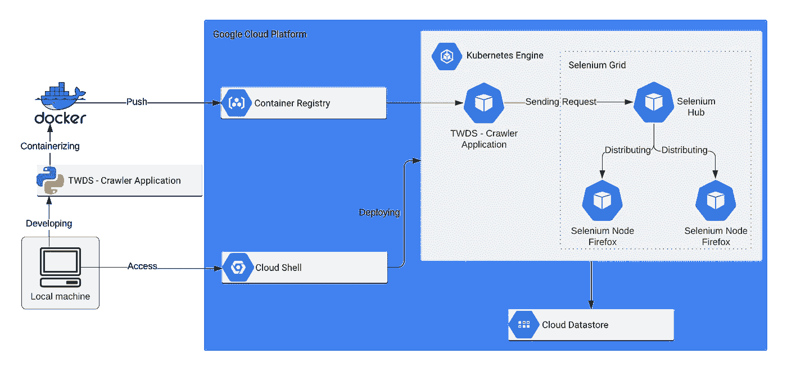

图 2 —可扩展基础设施的技术概述

方法是在我的本地机器上的 Jupyter 笔记本中开发网络爬虫，并不断专业化和增加项目(见图 2)。例如，我构建了一个 Python 应用程序，它有一个专用的爬虫类和所有基于 Jupyter 笔记本脚本的必要方法。但是让我们更详细地看看实现步骤。

# 3.来源检验和包装

## 3.1 来源检查

要开发一个正常运行的网络爬虫，提前熟悉网站结构、可用内容和不规则性是很重要的。

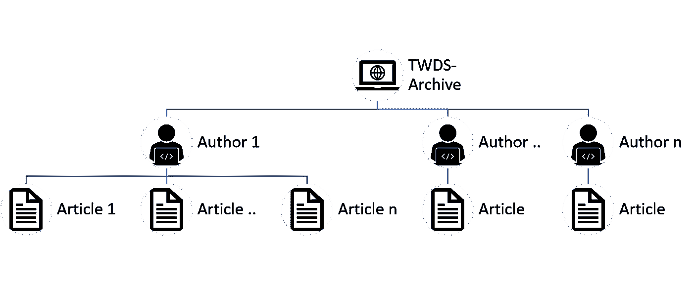

图 3 —相关实体的连接

《TWDS》是一本经典出版物，有许多作者和文章。由于有了一个[档案页面](https://www.towardsdatascience.com/archive)，很容易理解页面结构的细节(见图 3)。幸运的是，这里不仅列出了作者，还提供了指向这些作者的概述页面的链接。

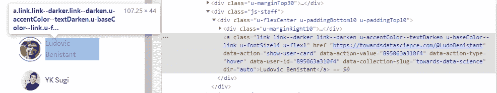

图 4-TWDS 档案上作者列表的页面源代码

所使用的 HTML 类是经常使用的，因此可以很容易地识别链接(见图 4)。

对于作者的概述页面，我发现最初
只列出了作者在 TWDS 发表的文章。作者发表的关于 Medium.com 的其他文章没有展示。因此，没有必要检查具体文章是否属于 TWDS 出版物。不幸的是，这些链接的 HTML 类是空的，无法识别这些链接。但是，这些链接包含完整的 URL，因此包含“朝向”一词。因此，对这些联系的识别也是毫不含糊的。然而，在检查页面时出现了另一个问题。并不是所有作者的文章都会直接显示，但是当网站向下滚动时，会使用 Javascript 动态地重新加载更多的内容。为了确保完整性，这必须考虑到网络爬虫的发展。

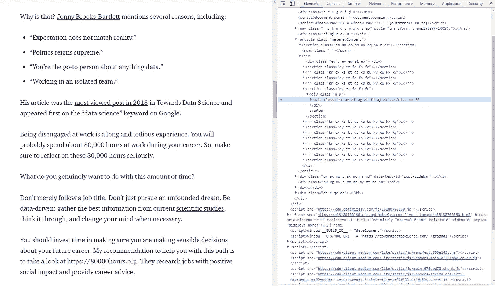

图 5 —来自 TWDS 文章的 HTML 源代码示例

最后，我必须检查每篇文章的结构，寻找相似之处和模式，以提取相关的数据字段。必需的属性是作者、URL、标题、文本、阅读时间、发布日期、标签、掌声和回复数量。如图 5 所示，HTML 源代码面临一些挑战。例如，类名似乎是动态生成的，并且在文章中只有很少的匹配。但也有希望之光，例如，阅读时间、标题、URL 和出版日期在页面标题中是标准化的。剩下的内容相当容易访问。

## 3.2 包装选择

起初，在 Jupyter 笔记本的开发过程中，我一直在寻找能够满足所有需求的 Python 包。我很快意识到，对于 web 抓取最常用的包之一的 Scrapy 来说，动态内容重新加载是很困难的。在关注这个需求后，我开始意识到[硒](https://pypi.org/project/selenium/)。Selenium 是一个用于 web 应用程序自动化软件测试的框架，可以与浏览器交互，例如向下滚动页面以加载动态 javascript 内容并接收完整的 HTML 源代码。

为了处理提取的 HTML 源代码，我找到了 Python 包 [BeautifulSoup4](https://pypi.org/project/beautifulsoup4/) ，它提供了各种方法来系统地搜索 HTML 树结构中的相关内容。选择了这些包，我就可以满足开发一个网络爬虫的所有要求。

# 4.实施步骤

## 4.1 开发基于 Python 的网络爬虫

在开发过程中，我现在使用如图 3 所示的页面结构。于是我从提取作者列表开始。

我定义了 URL“[https://towardsdatascience.com/archive](https://towardsdatascience.com/archive)”来抓取并用于启动 Selenium Webdriver。在下文中，我提取了运行 Selenium Webdriver 所需的所有代码部分。

```
# Import
from selenium import webdriver
from selenium.webdriver.chrome.options import Options# Define Browser Options
chrome_options = Options()
chrome_options.add_argument("--headless") # Hides the browser window# Reference the local Chromedriver instance
chrome_path = r'/usr/local/bin/chromedriver'
driver = webdriver.Chrome(executable_path=chrome_path, options=chrome_options)# Run the Webdriver, save page an quit browser
driver.get("https:/towardsdatascience.com/archive")
<scroll page snippet goes here>
htmltext = driver.page_source
driver.quit()
```

因为命令“driver.get()”只打开浏览器并加载引用的页面，所以我进一步使用了一个代码片段，该代码片段自动将页面向下滚动到末尾，从而允许保存完整的 HTML 源代码(“driver.page_source”)。

```
#imports
import time# Scroll page to load whole content
last_height = driver.execute_script("return document.body.scrollHeight")
while True:
    # Scroll down to the bottom.
    driver.execute_script("window.scrollTo(0, document.body.scrollHeight);")
    # Wait to load the page
    time.sleep(2)
    # Calculate new scroll height and compare with last height.
    new_height = driver.execute_script("return document.body.scrollHeight")
    if new_height == last_height:
        break
    last_height = new_height
```

*该代码片段完全独立于任何特定于网站的结构，也可以在另一个 web 爬行环境中轻松重用。*

由于输出仍然只有 HTML 源代码，而我在寻找所有作者的列表，我写了一个“for 循环”,通过使用我从源代码检查中获得的知识提取到作者简介的链接(见第 3.1 章)。

```
# Parse HTML structure
soup = BeautifulSoup(htmltext, "lxml")# Extract links to profiles from TWDS Authors
authors = []
for link in soup.find_all("a",
                          class_="link link--darker link--darken u-accentColor--textDarken u-baseColor--link u-fontSize14 u-flex1"):
    authors.append(link.get('href'))
```

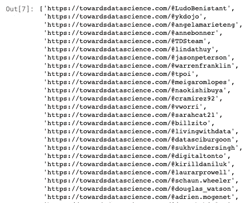

图 6 —作者列表的输出

现在的结果是一个列表，其中包含指向各个作者的链接，可以很容易地进一步利用这些链接(参见图 6)。我使用这个列表作为下一次迭代的输入，来接收每个作者的文章。因此，我将文章的链接和作者个人资料页面的链接作为一个键值对存储在一个字典中(见图 7)。

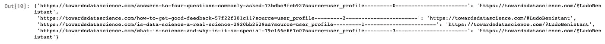

图 7 —提取文章的键值对示例

通过 access 中文章的链接，我遍历了不同的文章，提取了相关的字段内容，并将它们存储在一个字典(tempdic)中。在某些情况下，这可以通过在 HTML 结构中指定位置来实现。

```
# Extract field values and store them in json
tempdic = {}
tempdic['Article_ID'] = soup.find("meta", attrs={"name": "parsely-post-id"})["content"]
tempdic['Title'] = soup.title.string
tempdic['Author'] = soup.find("meta", attrs={"name": "author"})["content"]
```

在其他情况下，循环或正则表达式的使用是必要的，例如通过提取标签。

```
# Loop to extract tags
li = soup.select("ul > li > a")
tags = []
for link in li:
    tags.append(link.string)
tempdic['Tags'] = tags
```

因为我现在可以系统地将文章的数据存储在字典中，所以我必须找到一种合适的方法来存储数据。

## 4.2 将数据存储在谷歌云数据存储中

因为我已经为每篇文章准备了一个完美的字典，而且我的重点不是准备一个合适的 SQL 数据库，所以我选择了 Google Datastore 来存储我的数据。Google Datastore 是一个托管的、NoSQL 的、无模式的数据库，用于存储非关系数据——非常适合这个用例。

使用 Google Datastore，需要在 Google 云平台设置项目( [*如何设置 Google 云项目*](https://cloud.google.com/appengine/docs/standard/nodejs/building-app/creating-project)*)；当然也可以用其他云提供商来代替*。要使用 Python 访问 Google Datastore，可能需要在项目中设置一个对 Datastore 具有访问权限的服务帐户(角色:Cloud Datastore-Owner)。这可以通过生成访问密钥在菜单路径“API&Services>Credentials”中完成。

当从 JSON 文件调用数据时，使用生成的连接数据是最容易的。这是如何产生的，可以从下面的[链接](https://cloud.google.com/iam/docs/creating-managing-service-account-keys?hl=en#iam-service-account-keys-create-console)看出来。

在 web crawler 源代码中，必须首先初始化连接。特此引用 JSON 文件(“sa.json”)。

```
def initializeGDS(self):
    global credentials
    global client
    print("Setup Database Connection")
    credentials = compute_engine.Credentials()

    # Service account
    client = datastore.Client.from_service_account_json('sa.json')
```

添加所有相关信息后，实体最终可以存储在数据存储中。

```
Article = datastore.Entity(client.key('Article_ID', str_articlenumber), exclude_from_indexes=['Text'])
Article.update({
    "URL": str_URL,
    "Title": str_title,
    "Author": str_author,
    "PublishingDate": str_pubdate,
    "Text": str_text,
    "Claps": int_claps,
    "Tags": Tag_list,
    "No_Responses": int_responses,
    "Reading_time": int_reading_time
})
client.put(Article)
```

网络爬虫的功能现在完成了。由于实现仍然在 Jupyter Notebook 中运行，现在是时候重构代码并使用带有指定方法的爬虫类了(见 TWDS 爬虫)

## 4.3 用 Docker 封装您的应用程序

由于 Docker 是软件开发中最相关的容器平台，也是许多实现的一部分，所以我不会在本文中解释任何进一步的背景知识。然而，这是我第一次使用 Docker，我寻找了一个方便的分步教程来封装我的 Python 应用程序，它可能会使用。

[](https://www.wintellect.com/containerize-python-app-5-minutes/) [## 在 5 分钟内封装一个 Python 应用程序— Wintellect

### 不管是好是坏，Python 已经成为数据科学的通用语言。随着它越来越受欢迎…

www.wintellect.com](https://www.wintellect.com/containerize-python-app-5-minutes/) 

为了构建第一个容器映像，我只使用了这四个文件( [GitHub-Repository](https://github.com/Postiii/twds-crawler) ):

*   **应用文件:**在我们的例子中是 TWDS_Crawler.py
*   **sa.json:** 您在上一节中生成的 json 文件，其中包含您的 GCP 项目的连接细节
*   **Dockerfile:** 这个文件包含了用户可以在命令行上调用的所有命令来组合一个图像
*   **Requirements.txt:** 指定使用的 Python 包

要构建容器映像，需要在 shell 中输入包含引用文件的目录文件夹，并编写以下命令:

```
docker build -t twds-crawler .
```

这只是将容器映像的名称指定为“twds-crawler ”,并将映像放在当前目录文件夹(“.”).要运行容器，应该使用以下命令:

```
docker run twds-crawler
```

由于预先配置了 Dockerfile，容器内部的 Python 应用程序会在容器运行后自动启动。输出应该看起来像这样:

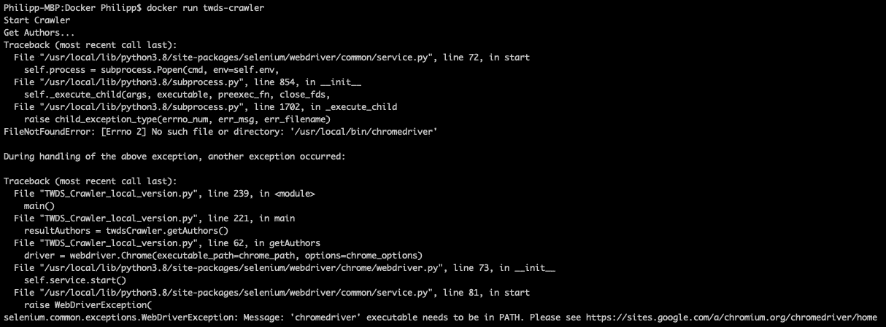

图 Docker 运行命令的输出

web crawler 应用程序启动(“Start Crawler”)并打开 getAuthors 方法(“Get Authors”)，但随后由于缺少浏览器实例而崩溃。现在，可以忽略这一点，因为我们的目标是在 Kubernetes 集群中运行这个容器。

## 4.4 在谷歌云平台上运行 Kubernetes 集群

Kubernetes 是一个开源系统，用于自动化(docker-)容器应用程序的部署、扩展和管理。由于它是由谷歌开发的，谷歌云平台提供了一个很好的实现，因此您可以通过使用浏览器内部的谷歌云外壳和以下脚本来构建一个仅**的集群。只需将<您的项目名称>替换为您的 Google 云平台项目名称。**


图 9 —谷歌云外壳的设置

*注意:*我建议使用编辑器的方式来显示所有存储的文件。

```
# Define project variable
export PROJECT_ID=<Your Project Name># Start Cluster
gcloud beta container — project ${PROJECT_ID} clusters create “twdscrawler” — zone “us-central1-a” — no-enable-basic-auth — cluster-version “1.13.11-gke.14” — machine-type “n1-standard-1” — image-type “COS” — disk-type “pd-standard” — disk-size “100” — metadata disable-legacy-endpoints=true — scopes “https://www.googleapis.com/auth/devstorage.read_only","https://www.googleapis.com/auth/logging.write","https://www.googleapis.com/auth/monitoring","https://www.googleapis.com/auth/servicecontrol","https://www.googleapis.com/auth/service.management.readonly","https://www.googleapis.com/auth/trace.append" — num-nodes “2” — enable-cloud-logging — enable-cloud-monitoring — enable-ip-alias — network “projects/${PROJECT_ID}/global/networks/default” — subnetwork “projects/${PROJECT_ID}/regions/us-central1/subnetworks/default” — default-max-pods-per-node “110” — enable-autoscaling — min-nodes “2” — max-nodes “8” — addons HorizontalPodAutoscaling,HttpLoadBalancing — no-enable-autoupgrade — enable-autorepair
```

要在部署完成后从 shell 访问集群，只需使用以下命令:

```
gcloud container clusters get-credentials twdscrawler — zone us-central1-a — project <Your Project Name>
```

创建的 Kubernetes 集群具有自动伸缩功能，最少使用 2 个节点，最多使用 8 个节点(*注*:为了节省资金，请确保在使用后删除集群，参见主菜单点“Kubernetes 引擎”)。

我们现在准备部署 selenium 网格和我们的容器化网络爬虫。

## 4.5 Kubernetes 上的硒网格

Selenium 网格是 Selenium 的一个集线器/节点结构，具有潜在的异构浏览器版本(节点)和一个控制单元(集线器),该控制单元分布或并行化工作项目，例如单元测试或爬行作业。为了连接这两个对象，还有一个中心服务。有关更详细的描述，请查看此[链接](https://itnext.io/scaling-selenium-test-execution-with-kubernetes-c79bc53979f5)。

为了使部署过程尽可能简单，并将必要的代码减到最少，我使用了 YAML 文件和 bash 脚本。YAML 文件描述 Kubernetes 对象，例如，在节点的情况下，要部署的不同 Selenium 节点的数量或特定的浏览器版本。bash 脚本以正确的顺序调用不同的 YAML 文件。

要在 Google Cloud shell 中工作，需要上传不同的文件。这可以很容易地通过拖放来完成。以下文件必须在其中(sa.json 需要单独添加，其余的可以在我的 [GitHub-Repository](https://github.com/Postiii/twds-crawler) 中找到)。

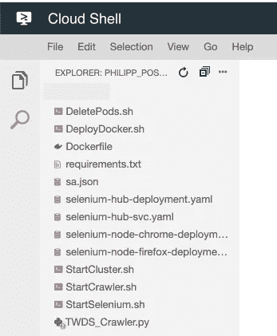

图 10 —云外壳中所需的文档

通过使用下面的命令，一个完整的 Selenium 网格和一个 Firefox 节点将被部署在 Kubernetes 集群上:

```
bash StartSelenium.sh
```

要检查一切是否正常，可以使用以下命令:

```
kubectl get pods
```

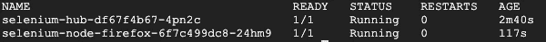

图 11-Kubernetes 上运行的 pod 概述

## 4.6 Kubernetes 上的网络爬虫

既然带有 Firefox 节点的 Selenium 网格已经在 Kubernetes 集群上运行，那么是时候继续使用 web 爬虫了。由于 web crawler 的本地开发以及本地 web 浏览器的使用，有必要针对 Selenium 网格调整 Webdriver:

```
# Define Remote Webdriver
driver = webdriver.Remote(
command_executor=’http://selenium-hub:4444/wd/hub',
desired_capabilities=getattr(DesiredCapabilities, “FIREFOX”)
)
```

*注:*调整后的版本可以在我的 [GitHub-Repository](https://github.com/Postiii/twds-crawler) 中找到。只需要替换 TWDS _ 爬虫. py 的代码或者把 docker 文件里面引用的文件改成“TWDS _ 爬虫 _ 集群. py”。

经过这次更改后，可以在 Google Cloud Shell 中构建一个新的 Docker 映像，并将其发布到 Google Cloud Container Registry 中(相当于一个存储库)。这可以通过以下命令完成:

```
export PROJECT_ID=<Your Project Name>
docker build -t gcr.io/${PROJECT_ID}/twds-crawler .
docker push gcr.io/${PROJECT_ID}/twds-crawler
```

如果一切正常，web 爬行器最终可以部署到 Kubernetes 集群中

```
bash StartCrawler.sh
```

要检查爬虫是否运行并查看日志(例如打印的行),您可以在 Google Cloud Shell 中使用以下命令:

```
kubectl get pods
```

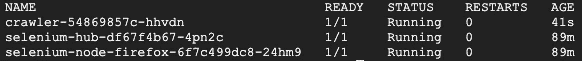

图 12 —在 Kubernetes 上运行的带有爬行器的吊舱概述

```
kubectl logs <crawler-pod-name>
```

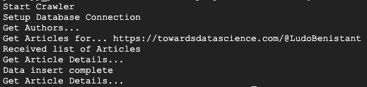

图 Crawler pod 的日志输出

网络爬虫现在正在运行。为了增加节点的数量，必须提前编辑 Firefox 节点的 YAML 文件，或者在运行时使用以下命令:

```
kubectl scale deployment selenium-node-firefox --replicas=10
```

Selenium 网格将在 web 爬行过程中自动使用部署的 Firefox 节点实例。

# 5.结果

如果一切都运行良好，那么当我选择增量方法在数据库中编写文章细节时，结果应该在 Google Cloud Datastore 中可见。

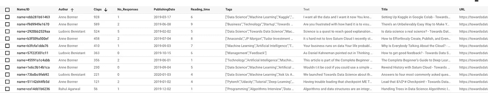

图 14——Google 云数据存储中实体 Article_ID 的结果概述

希望您喜欢阅读我的文章，并祝您的实现好运。

如果你在设置项目时有任何问题，也请看看我的 [GitHub-Repository](https://github.com/Postiii/twds-crawler) 中的故障排除区。

**相关文章:**

> 要了解如何使用 PySpark 和 Kubernetes 对结果进行自然语言处理并提取技术名称，请看一下 Jürgen Schmidl 的[项目。](/spark-in-docker-in-kubernetes-a-practical-approach-for-scalable-nlp-9dd6ef47c31e)
> 
> 要了解如何构建一个同样运行在 Kubernetes 上的高度可伸缩的 Python 仪表盘，请查看 Arnold Lutsch 的[项目。](/build-a-highly-scalable-dashboard-that-runs-on-kubernetes-fa2bc6271f1d)