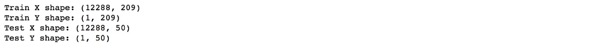
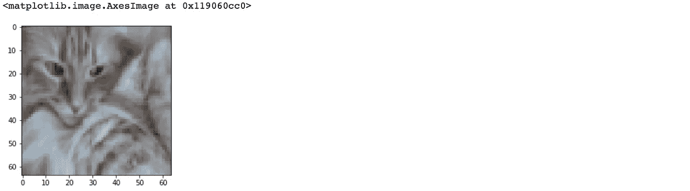
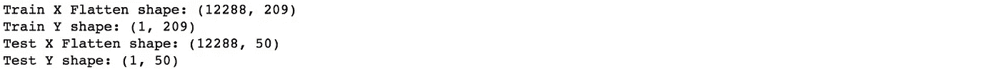
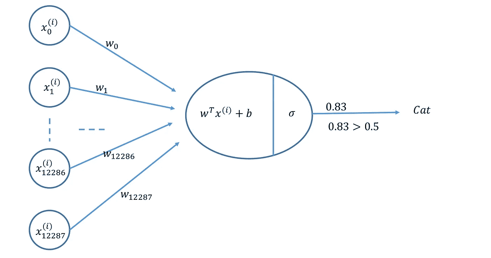
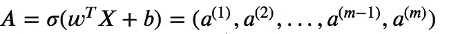
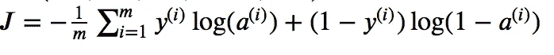
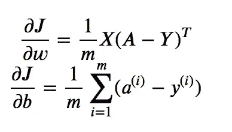
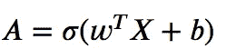
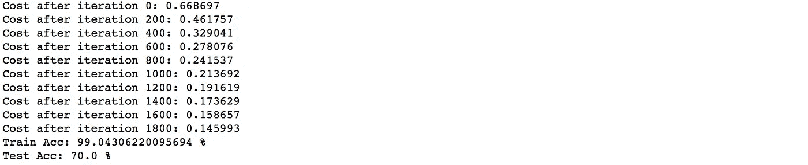
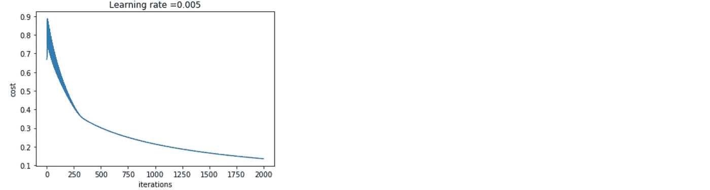

# 使用 Numpy 构建一个简单的神经网络

> 原文：<https://towardsdatascience.com/build-a-simple-neural-network-using-numpy-2add9aad6fc8?source=collection_archive---------19----------------------->

## 使用 NumPy 构建单个神经元进行图像分类。

在本文中，我们将讨论如何使用 NumPy 制作一个简单的神经网络。

1.  **导入库**

首先，我们将导入所有我们需要的包。我们将需要 ***numpy*** ， ***h5py*** (用于加载存储在 H5 文件中的数据集)，以及 ***matplotlib*** (用于绘图)。

```
**import** numpy as np
**import** matplotlib.pyplot as plt
**import** h5py
```

**2。数据准备**

数据以(" . h5 ")格式提供，包含标记为 cat 或非 cat 的训练和测试图像集。该数据集可从 [github repo](https://rpaudel42.github.io/datasets/NN.zip) 下载。使用以下函数加载数据集:

```
**def** **load_dataset**():
    train_dataset = h5py.File('datasets/train_catvnoncat.h5', "r")
    train_x = np.array(train_dataset["train_set_x"][:]) 
    train_y = np.array(train_dataset["train_set_y"][:])test_dataset = h5py.File('datasets/test_catvnoncat.h5', "r")
    test_x = np.array(test_dataset["test_set_x"][:]) 
    test_y = np.array(test_dataset["test_set_y"][:])classes = np.array(test_dataset["list_classes"][:]) 

    train_y = train_y.reshape((1, train_y.shape[0]))
    test_y = test_y.reshape((1, test_y.shape[0]))

    return train_x, train_y, test_x, test_y, classes
```

我们可以通过观察它们的形状来分析数据。

```
train_x, train_y, test_x, test_y, classes = load_dataset()print ("Train X shape: " + str(train_x.shape))
print ("Train Y shape: " + str(train_y.shape))print ("Test X shape: " + str(test_x.shape))
print ("Test Y shape: " + str(test_y.shape))
```



我们有 209 个训练图像，其中每个图像是正方形(高度= 64px)和(宽度= 64px)且具有 3 个通道(RGB)。类似地，我们有 50 个相同维度的测试图像。

让我们想象一下这个图像。您可以更改索引来查看不同的图像。

```
*# change index for another image*
index = 2
plt.imshow(train_x[index])
```



**数据预处理:**图像数据常见的数据预处理包括:

1.  算出数据的维度和形状(m_train，m_test，num_px，…)
2.  重塑数据集，使每个示例现在都是一个大小为(高度*宽度*通道，1)的向量
3.  将数据“标准化”

首先，我们需要使图像变平。这可以通过在形状的 numpy 数组(高度÷宽度÷通道，1)中重塑形状(高度、宽度、通道)的图像来完成。

```
train_x = train_x.reshape(train_x.shape[0], -1).T
test_x = test_x.reshape(test_x.shape[0], -1).Tprint ("Train X shape: " + str(train_x.shape))
print ("Train Y shape: " + str(train_y.shape))print ("Test X shape: " + str(test_x.shape))
print ("Test Y shape: " + str(test_y.shape))
```



**标准化数据:**机器学习中常见的预处理步骤是对数据集进行居中和标准化。对于给定的图片数据集，可以通过将数据集的每一行除以 255(像素通道的最大值)来完成。

```
train_x = train_x/255.
test_x = test_x/255.
```

现在我们将建立一个简单的神经网络模型，它可以正确地将图片分类为猫或非猫。

## 3.神经网络模型

我们将构建一个神经网络，如下图所示。



**关键步骤**:构建神经网络的主要步骤有:

1.  定义模型结构(如输入特征数量、输出数量等)。)
2.  初始化模型的参数(权重和偏差)
3.  循环:

*   计算电流损耗(正向传播)
*   计算电流梯度(反向传播)
*   更新参数(梯度下降)

**3.1 激活功能**

sigmoid 激活函数由下式给出


可以使用 *np.exp()计算 sigmoid 激活函数。*

```
def **sigmoid**(z):
    return 1/(1+np.exp(-z))
```

**3.2 初始化参数**

我们需要初始化参数𝑤(权重)和𝑏(偏差)。在下面的例子中，𝑤使用 *np.random.randn()* 初始化为一个随机数向量，而𝑏初始化为零。

```
def **initialize_parameters**(dim):
    w = np.random.randn(dim, 1)*0.01
    b = 0
    return w, b
```

**3.3 正向和反向传播**

一旦参数被初始化，我们就可以执行“向前”和“向后”传播步骤来学习参数。

*   给定一组输入特征(X)。
*   我们将如下计算激活函数。



*   我们将按如下方式计算成本。



*   最后，我们将如下计算梯度(反向传播)。



```
def **propagate**(w, b, X, Y):
    m = X.shape[1]

    #calculate activation function
    A = **sigmoid**(np.dot(w.T, X)+b) #find the cost
    cost = (-1/m) * np.sum(Y * np.log(A) + (1 - Y) * (np.log(1 - A)))  
    #find gradient (back propagation)
    dw = (1/m) * np.dot(X, (A-Y).T)
    db = (1/m) * np.sum(A-Y) cost = np.squeeze(cost)
    grads = {"dw": dw,
             "db": db} 
    return grads, cost
```

**3.4 优化**

在初始化参数、计算成本函数和计算梯度之后，我们现在可以使用梯度下降来更新参数。

```
def **gradient_descent**(w, b, X, Y, iterations, learning_rate):
    costs = []
    for i in range(iterations):
        grads, cost = propagate(w, b, X, Y)

        #update parameters
        w = w - learning_rate * grads["dw"]
        b = b - learning_rate * grads["db"]
        costs.append(cost)
        if i % 500 == 0:
            print ("Cost after iteration %i: %f" %(i, cost))

    params = {"w": w,
              "b": b}    
    return params, costs
```

**3.5 预测**

使用学习到的参数 *w* 和 *b，*我们可以预测训练或测试示例的标签。为了预测，我们首先需要计算如下给出的激活函数。



然后将输出(预测)转换成 0(if***A***<= 0.5)或 1(if***A***>0.5)存储在 *y_pred* 中。

```
def **predict**(w, b, X):    
    # number of example
    m = X.shape[1]
    y_pred = np.zeros((1,m))
    w = w.reshape(X.shape[0], 1)

    A = sigmoid(np.dot(w.T, X)+b)

    for i in range(A.shape[1]):
        y_pred[0,i] = 1 if A[0,i] >0.5 else 0 
        pass
    return y_pred
```

3.6 最终模型

我们可以按正确的顺序把所有的构件放在一起，制作一个神经网络模型。

```
def **model**(train_x, train_y, test_x, test_y, iterations, learning_rate):
    w, b = **initialize_parameters**(train_x.shape[0])
    parameters, costs = **gradient_descent**(w, b, train_x, train_y, iterations, learning_rate)

    w = parameters["w"]
    b = parameters["b"]

    # predict 
    train_pred_y = **predict**(w, b, train_x)
    test_pred_y = **predict**(w, b, test_x) print("Train Acc: {} %".format(100 - np.mean(np.abs(train_pred_y - train_y)) * 100))
    print("Test Acc: {} %".format(100 - np.mean(np.abs(test_pred_y - test_y)) * 100))

    return costs
```

我们可以使用下面的代码，使用上面构建的模型对图像数据集进行训练和预测。我们将使用 0.005 的 *learning_rate* ，并为 2000 次*迭代*训练模型。

```
costs = **model**(train_x, train_y, test_x, test_y, iterations = 2000, learning_rate = 0.005)
```



训练准确率在 99%左右，这意味着我们的模型正在工作，并且以高概率拟合训练数据。测试准确率在 70%左右。给定简单的模型和小的数据集，我们可以认为它是一个好的模型。

最后，我们可以画出成本图，看看模型是如何学习参数的。

```
plt.plot(costs)
plt.ylabel('cost')
plt.xlabel('iterations')
plt.title("Learning rate =" + str(d["learning_rate"]))
plt.show()
```



我们可以看到每次迭代的成本都在下降，这表明参数正在被学习。

在[下篇](/building-a-neural-network-with-a-single-hidden-layer-using-numpy-923be1180dbf)中，我们将讨论如何制作一个带隐藏层的神经。

> 在这里成为媒体会员[并支持独立写作，每月 5 美元，可以完全访问媒体上的每个故事。](https://medium.com/@rmesfrmpkr/membership)