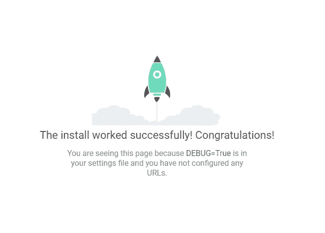
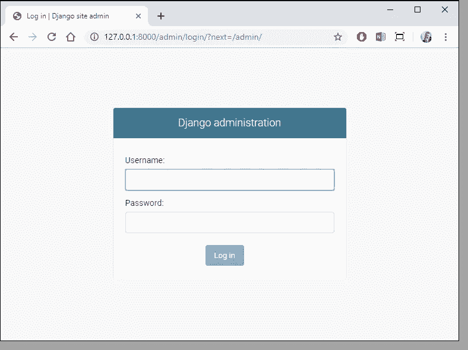
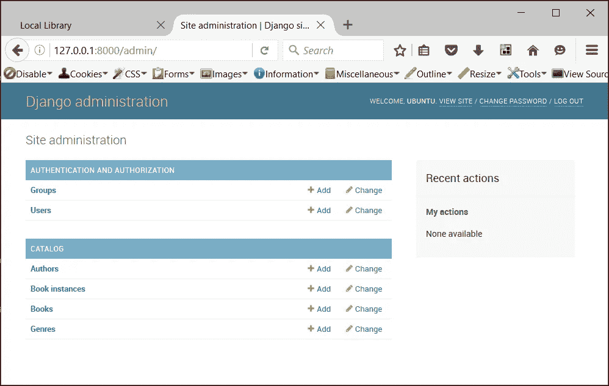

# 使用 Django 构建一个社交媒体网站——设置项目(第 1 部分)

> 原文：<https://towardsdatascience.com/build-a-social-media-website-using-django-setup-the-project-part-1-6e1932c9f221?source=collection_archive---------3----------------------->

## [Django 的社交媒体网站](https://towardsdatascience.com/tagged/bycetutorial)

## 重点放在设置项目和安装所需的组件与设置密码恢复后端


[图片由 Freepik 拍摄](https://www.freepik.com/vectors/background)

读者们好，我想做一些不同的事情，比如在 Medium 上制作一个多部分的教程。所以，现在我正在制作这个关于学习 Django 的系列教程。这个教程系列对初学者友好，将通过做一些实际的项目来帮助初学者学习 Django。

为了保持简单，我们不会在这个项目中使用任何前端框架。我们将在项目中使用 HTML、CSS (Bootstrap 和一些自定义 CSS)和 JQuery。

本教程系列的主要重点是学习 Django，所以我们将主要关注 Django。

那么，让我们来谈谈我们将要做的项目。这将是一个简单的社交媒体网站，用户可以做以下事情:

1.  张贴图片以及描述和标签。您可以随时更新或删除它们。
2.  查看其他人的个人资料并向他们发送好友请求，或者取消误发的好友请求。
3.  接受或拒绝来自其他用户的好友请求。
4.  取消现有朋友的好友关系。
5.  根据标签搜索帖子。
6.  根据用户名搜索用户。
7.  发现新的人部分推荐新的人添加为朋友的基础上相互联系。

这些都将是我们将要建立的网站的特点。所以，我们一部分一部分来。

因此，在第一个教程中，我们将设置 Django 项目。

## 建立一个新的 Django 项目

因此，建立一个新的 Django 项目非常简单。首先，如果你以前没有安装过 Django，你需要安装它。

要安装 Django，我们需要运行以下命令:

```
pip install django
```

这个命令将在我们的系统中安装 Django。现在，我们准备使用 Django。那么，现在让我们开始我们的 Django 项目。我们将使用下面的命令来创建一个新的 Django 项目。

```
django-admin startproject photoshare
```

这里，*照片分享*表示我们想给 Django 项目取的名字。

它将为我们创建和设置 Django 项目。如果你在创建的文件夹里找，里面会有很多文件。它会有一个 manage.py 文件和一个 *photoshare* 文件夹。您不应该重命名该文件夹。不过，您可以重命名外层文件夹。

在 *photoshare* 文件夹内，可以看到 urls.py、settings.py 等各种文件。你可以看到所有这些文件都写有代码。随着项目的进展，我们将向它们添加我们的代码。

我们可以在本地服务器上运行网站，检查是否一切正常。

为此，我们将在 CLI 上 manage.py 文件所在的同一文件夹中运行以下命令:

```
python manage.py runserver
```

这将呈现 Django 默认页面，如下所示:



姜戈祝贺页面

现在，运行以下命令进行数据库迁移，然后迁移以同步数据库。

它有一个内置的 SQLite3 数据库，我们将使用它进行开发和测试。以后进入生产时，您可以切换到功能更强的数据库，比如 Postgre SQL。

因此，您可以运行以下两个命令来执行迁移:

```
python manage.py makemigrations
python manage.py migrate
```

现在，我想告诉你姜戈的一个强大的部分。它带有一个内置的管理面板。因此，我们不需要建立一个自己的管理面板。如果我们愿意的话，我们当然可以在以后创建一个设计更好的自定义管理面板，但是默认面板对我们来说已经足够了。

因此，要访问管理面板，我们必须创建一个超级用户。超级用户将有权访问管理面板，并可以编辑数据库元素。

要创建超级用户，我们可以运行以下命令:

```
python manage.py createsuperuser
```

运行此命令后，将在 CLI 中要求您输入用户名、电子邮件和密码。然后它会为你创建超级用户。

现在，您可以访问管理面板，您可以通过再次运行服务器来访问它。服务器启动并运行后，您可以在 **/admin** 页面访问管理面板。通过将 **/admin** 添加到默认 URL 来访问它，默认 URL 看起来像 **localhost:8000/admin** 或 **127.0.0.1:800/admin** 。



Django 管理员登录页面-[https://djangobook.com/mdj2-django-admin/](https://djangobook.com/mdj2-django-admin/)

输入您的凭证后，您将被带到 Django 管理仪表板，如下所示:



Django 管理主页-[https://developer . Mozilla . org/en-US/docs/Learn/Server-side/Django/Admin _ site](https://developer.mozilla.org/en-US/docs/Learn/Server-side/Django/Admin_site)

您的管理员主页目前只有“组和用户”字段。当您创建新模型并将其添加到管理面板时，它们会出现在这里。

现在，正如您将看到的，将有一个用户，即您，您可以看到您拥有超级用户访问权限，因为您会在管理控制面板的用户配置文件中看到超级用户访问权限旁边的绿色勾号。

现在，我们很乐意创建所需的应用程序(Django 中项目的一小部分被称为应用程序)。我们将有两个独立的应用程序——用户和 Feed。

用户应用程序将处理所有关于认证、用户配置文件、朋友和发送、接收请求、搜索用户和结交新朋友的模型、表单和视图，即与用户相关的一切。

Feed 应用程序将处理关于帖子的所有模型、视图和表单，即帖子、对帖子的喜欢和评论、搜索帖子、显示特定用户的帖子等。

为了在 Django 项目中创建这两个应用程序，我们将借助 CLI 并键入以下命令:

```
python manage.py startapp feed
python manage.py startapp users
```

运行以上两个命令将创建两个应用程序——feed 和 users。两者都包含一些 python 文件。我们稍后将向这些文件添加内容。

现在，让我们在内部 photoshare 文件夹的 settings.py 文件中注册我们的应用程序。在您喜欢的文本/代码编辑器中打开 settings.py 文件，并将以下代码行添加到文件中的已安装应用程序列表中。

因此，将这两个元素添加到已安装应用程序列表中:-

```
'users.apps.UsersConfig',
'feed.apps.FeedConfig',
```

它现在看起来像这样:-

```
INSTALLED_APPS = [
    'users.apps.UsersConfig',
    'feed.apps.FeedConfig',
    'django.contrib.admin',
    'django.contrib.auth',
    'django.contrib.contenttypes',
    'django.contrib.sessions',
    'django.contrib.messages',
    'django.contrib.staticfiles',
]
```

不要删除已安装应用程序列表中的任何内容。

此外，我们将使用*crisp forms*来风格化我们稍后将创建的 Django 表单，所以让我们也安装它。

```
pip install django-crispy-forms
```

此外，由于它也是一个应用程序，我们必须将其添加到 settings.py 文件中的已安装应用程序列表中。添加后，我们的 INSTALLED_APPS 列表将如下所示:

```
INSTALLED_APPS = [
    'users.apps.UsersConfig',
    'feed.apps.FeedConfig',
    'crispy_forms',
    'django.contrib.admin',
    'django.contrib.auth',
    'django.contrib.contenttypes',
    'django.contrib.sessions',
    'django.contrib.messages',
    'django.contrib.staticfiles',
]
```

此外，由于 crispy_forms 默认使用 Bootstrap 3，我们希望将其设置为使用 Bootstrap 4。为此，请在 settings.py 文件的末尾添加这一行。

```
CRISPY_TEMPLATE_PACK = 'bootstrap4'
```

此外，我们需要指定静态和媒体路径。为此，我们需要将操作系统导入到设置文件中。

为此，我们将在 settings.py 文件中添加以下行(如果已经存在，跳过任何一行):

```
STATIC_ROOT = os.path.join(BASE_DIR, 'staticfiles')
STATIC_URL = '/static/'

MEDIA_ROOT = os.path.join(BASE_DIR, 'media')
MEDIA_URL = '/media/'
```

现在，让我们再添加一些设置来帮助我们告诉 Django 在那些特殊的情况下应该做什么。

```
LOGIN_REDIRECT_URL = 'home'
LOGIN_URL = 'login'
```

第一行命令 Django 在成功登录后转到“home”页面。我们将在网站的第一页保留我们的“主页”。您可以选择要将用户重定向到的页面。

第二行指示 Django 在搜索显示登录页面所需的 URL 时使用“log in”URL 名称中指定的路径。你以后会明白的。

现在，让我们设置密码恢复系统。当用户请求重置密码时，我们将发送一封电子邮件。为此，我们将使用 Gmail。

获取 Gmail 主机用户(您的 Gmail id)和密码(通过访问[此链接](https://support.google.com/accounts/answer/6010255?hl=en)生成您的密码)。[本教程](https://medium.com/@_christopher/how-to-send-emails-with-python-django-through-google-smtp-server-for-free-22ea6ea0fb8e)将有助于完成这项任务。

```
EMAIL_BACKEND = 'django.core.mail.backends.smtp.EmailBackend'
EMAIL_HOST = 'smtp.gmail.com'
EMAIL_PORT = 587
EMAIL_USE_TLS = True
EMAIL_HOST_USER = os.environ.get('EMAIL_HOST_USER')
EMAIL_HOST_PASSWORD = os.environ.get('EMAIL_HOST_PASSWORD')
```

这些设置将确保您可以毫无问题地构建您的应用程序。身份验证系统可以很好地恢复密码。

所以，现在你已经建立了你的项目，现在在下一个教程中，我们将制作*用户*应用。

我希望你喜欢本教程的第一部分；这都是关于设置。下一部分将带你到网站的实际建设。

一个类似的以 Django 为中心的系列(建立一个求职门户)将教你一些惊人的新概念，它是:

[](https://shubhamstudent5.medium.com/build-a-job-search-portal-with-django-overview-part-1-bec74d3b6f4e) [## 用 Django 构建求职门户——概述(第 1 部分)

### 让我们使用 Django 建立一个工作搜索门户，它允许招聘人员发布工作并接受候选人，同时…

shubhamstudent5.medium.com](https://shubhamstudent5.medium.com/build-a-job-search-portal-with-django-overview-part-1-bec74d3b6f4e) 

如果你想在 Django 上更进一步，你可以尝试这个基于 Django Rest 框架的新系列，我们将使用 Django Rest 框架构建一个博客网站。

[](/build-a-blog-website-using-django-rest-framework-overview-part-1-1f847d53753f) [## 使用 Django Rest 框架构建博客网站——概述(第 1 部分)

### 让我们使用 Django Rest 框架构建一个简单的博客网站，了解 DRF 和 REST APIs 如何工作，以及我们如何添加…

towardsdatascience.com](/build-a-blog-website-using-django-rest-framework-overview-part-1-1f847d53753f) 

一系列关于建立一个电子商务系列与 MERN 堆栈在这里:-

[](https://shubhamstudent5.medium.com/build-an-e-commerce-website-with-mern-stack-part-1-setting-up-the-project-eecd710e2696) [## 用 MERN 堆栈构建一个电子商务网站——第 1 部分(设置项目)

### 让我们使用 MERN 堆栈(MongoDB，Express，React 和 Node)建立一个简单的电子商务网站，用户可以在其中添加项目…

shubhamstudent5.medium.com](https://shubhamstudent5.medium.com/build-an-e-commerce-website-with-mern-stack-part-1-setting-up-the-project-eecd710e2696) 

如果您有兴趣学习 React，这个系列很适合您:

[](https://javascript.plainenglish.io/build-a-blog-app-with-react-intro-and-set-up-part-1-ddf5c674d25b) [## 使用 React 构建一个博客应用程序——介绍和设置(第 1 部分)

### 在第一部分中，我们处理项目的基础并设置它。

javascript.plainenglish.io](https://javascript.plainenglish.io/build-a-blog-app-with-react-intro-and-set-up-part-1-ddf5c674d25b) 

本教程的下一部分是:-

[](/build-a-social-media-website-with-django-users-app-part-2-7f0c0431ccdc) [## 用 Django-Users App 建立一个社交媒体网站(第二部分)

### 在这一部分中，我们将重点创建用户应用程序以及与用户配置文件、身份验证等相关的所有模型

towardsdatascience.com](/build-a-social-media-website-with-django-users-app-part-2-7f0c0431ccdc) [](/build-a-social-media-website-with-django-part-3-users-app-templates-c87ad46682be) [## 用 Django 构建一个社交媒体网站——第 3 部分(用户应用模板)

### 在第三部分中，我们将着重于为我们在上一个教程中定义的用户应用程序构建模板。

towardsdatascience.com](/build-a-social-media-website-with-django-part-3-users-app-templates-c87ad46682be) [](https://shubhamstudent5.medium.com/build-a-social-media-website-with-django-feed-app-backend-part-4-d82facfa7b3) [## 用 Django 构建一个社交媒体网站——Feed 应用后端(第 4 部分)

### 在这一部分中，我们将重点放在构建 Feed 应用程序及其所有与喜欢、评论、帖子和所有相关的模型上

shubhamstudent5.medium.com](https://shubhamstudent5.medium.com/build-a-social-media-website-with-django-feed-app-backend-part-4-d82facfa7b3) [](/build-a-social-media-website-with-django-part-5-feed-app-templates-66ddad5420ca) [## 用 Django 构建一个社交媒体网站——第 5 部分(Feed 应用程序模板)

### 在第五部分中，我们将着重于为我们在上一个教程中定义的 Feed 应用程序构建模板。

towardsdatascience.com](/build-a-social-media-website-with-django-part-5-feed-app-templates-66ddad5420ca) 

另外，你可以看看这些文章

[](https://medium.com/javascript-in-plain-english/build-a-simple-todo-app-using-react-a492adc9c8a4) [## 使用 React 构建一个简单的 Todo 应用程序

### 让我们用 React 构建一个简单的 Todo 应用程序，它教你 CRUD 的基本原理(创建、读取、更新和…

medium.com](https://medium.com/javascript-in-plain-english/build-a-simple-todo-app-using-react-a492adc9c8a4) [](https://medium.com/javascript-in-plain-english/build-a-rest-api-with-node-express-and-mongodb-937ff95f23a5) [## 用 Node，Express 和 MongoDB 构建一个 REST API

### 让我们使用 Node、Express 和 MongoDB 构建一个遵循 CRUD 原则的 REST API，并使用 Postman 测试它。

medium.com](https://medium.com/javascript-in-plain-english/build-a-rest-api-with-node-express-and-mongodb-937ff95f23a5) 

如果你想看完整的代码，请查看[项目的 GitHub Repo](https://github.com/shubham1710/ByteWalk) 。另外，你可以通过访问[这个链接](http://bytewalk.me)来试用这个应用程序。它托管在 Heroku 上，媒体和静态文件在 Google 云存储上。