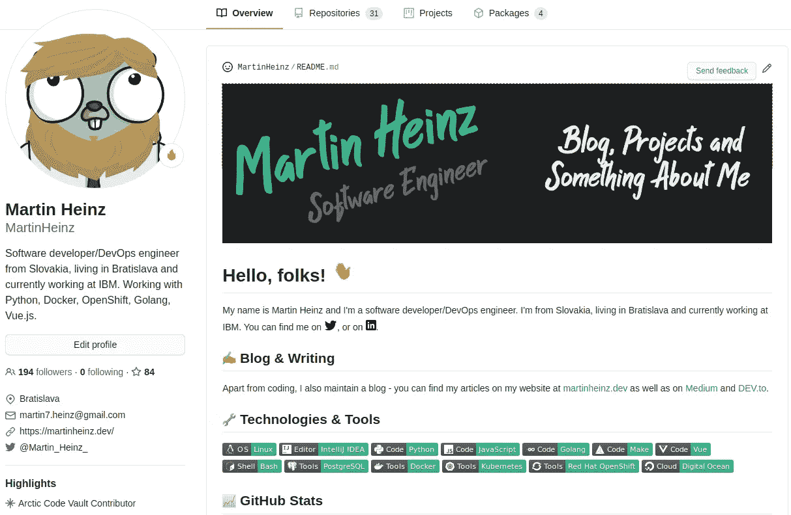
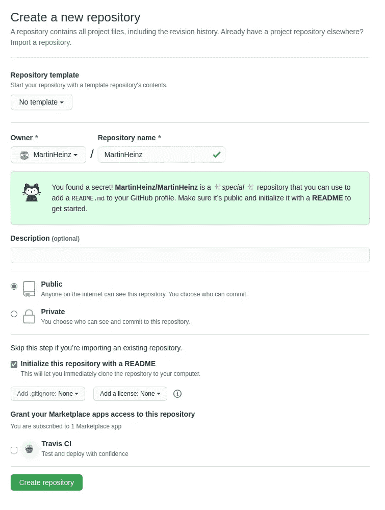
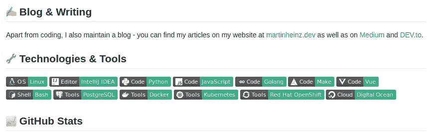
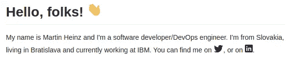
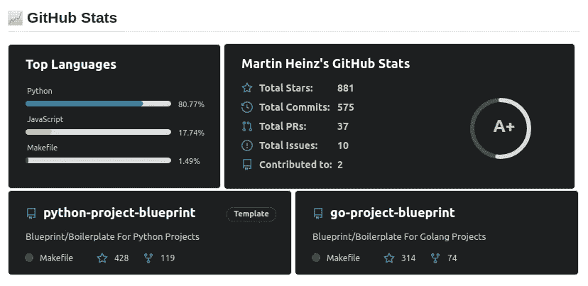
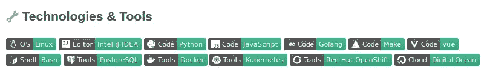

# 为您的 GitHub 档案创建一个精彩的自述文件

> 原文：<https://towardsdatascience.com/build-a-stunning-readme-for-your-github-profile-9b80434fe5d7?source=collection_archive---------1----------------------->

## 使用 GitHub 隐藏的新功能— GitHub Profile READMEs，在 GitHub 上展示您的项目和技能！

如果你经常访问其他人的 GitHub 个人资料，你可能最近已经注意到，一些人在他们的个人资料中有一些漂亮的图片、描述和统计数据。这些是新的 GitHub 配置文件，它们是一种隐藏的新特性，在这篇文章中，我将向你展示如何创建一个，以及如何使用一些很酷的技巧和工具让它脱颖而出！

GitHub 个人资料自述文件

# 如何创造你自己的

创建 GitHub 概要文件`README`非常简单，但是您可能自己找不到它。要创建它，请转到[https://github.com/new](https://github.com/new)与您想要创建普通存储库时一样。用你的用户名命名这个库——在我的例子中是`MartinHeinz/MartinHeinz`。你一输入它，就会看到一条消息告诉你这个*秘密/特殊的*库:

创建新存储库

这就是你在这里需要做的，但是我建议当你在做你喜欢的`README`的时候，把库设置为 *private* ，这样就不会在你的个人资料中显示一些不完整的内容。

您也可以勾选*用自述文件*初始化该存储库，因为它需要出现在您的个人资料中。也就是说，您可以包含任何其他文件，如代码、gif、图片等。说到这个…

# 让它突出

我们有一个带有`README`的存储库，但是内容呢？你可以提供一些关于你自己的信息，你的电子邮件联系方式，然后就到此为止，但是我们可以做得更好。

我建议添加一个漂亮的标题，让它更加个性化。你可以在上面写上你的名字或职位，内容由你决定。有很多非常好的有创意的标题的例子，例如:

*   [https://github.com/WaylonWalker/WaylonWalker](https://github.com/WaylonWalker/WaylonWalker)
*   [https://github.com/stephenajulu/stephenajulu](https://github.com/stephenajulu/stephenajulu)
*   [https://github.com/jh3y/jh3y](https://github.com/jh3y/jh3y)

现在，如何将其添加到`README`？首先，将标题图片添加到您的存储库中，这样您就可以公开托管它了。接下来，在`README.md`的顶部包含以下行:

这只是嵌入图片的基本降价。它还包括 URL，这样你就可以——例如——将图片链接到你的个人网站。

# gif 和表情符号

另一个让你的`README`更有趣的方法是添加各种 gif 或表情符号。我个人喜欢在每个标题的开头添加表情符号，例如:

我发现获得相关表情符号的最简单的方法是在[https://emojipedia.org/emoji/](https://emojipedia.org/emoji/)上搜索表情符号名称，然后在[https://www.fileformat.info/index.htm](https://www.fileformat.info/index.htm)上查找它的 HTML 实体。这些 HTML 实体可以包含在 markdown 中，您的浏览器应该能够很好地呈现它们。

如果表情符号对你来说还不够，你想在你的`README`中加入一些动作，那么你也可以添加 gif。当添加 gif 时，你需要实际的`.gif`文件，要么放在你的存储库中，如标题图片，要么放在外部网站上，如[https://imgur.com/](https://imgur.com/)。无论托管在哪里，您都可以使用以下方式将其包括在内:

GitHub markdown 中可以使用一些 HTML 标签，``就是其中之一。这使得在我的`README`中添加像这样的图片和 gif 变得很容易:

大家好！👋

# 展示您的回复

Everyones GitHub profile 实际上只是一个展示你的库和突出你的活动/贡献的地方。有了 GitHub profile `README`，你可以使用[*GitHub-readme-stats*](https://github.com/anuraghazra/github-readme-stats)更好地突出这些东西。GitHub Readme Stats 是一个工具，允许你为你的贡献和库生成 GitHub stats，并将它们附加到你的`README`上。如果你决定使用所有可用的统计卡，你可能会得到这样的结果:

GitHub 统计

每张卡片都有一堆定制选项——包括主题、图标或显示语言。要生成这些卡片，您可以使用以下模式:

其中`CARD_TYPE`可以是顶级语言列表的`top-langs`或固定存储库的`pin`。如果留空，它将默认为聚集的 GitHub 用户统计。要查看更多定制选项，请参见 github-readme-stats 库中的文档，或者您可以从我的[中获得一些灵感，因为我使用了几乎所有可用的选项来匹配我的`README`的其余部分。](https://github.com/MartinHeinz/MartinHeinz/blob/master/README.md)

# 突出你的技能

另一件经常出现在人们个人资料中的事情是他们喜欢使用的技能和技术的列表。为了很好地形象化这些，人们可以使用 [shields.io](https://shields.io/) 徽章。它们有很多种风格，但我最喜欢的是这样的:

GitHub 徽章

要创建这种徽章，您需要在以下模式中包含降价行:

如果你不喜欢这种风格，你可以试试 [shields.io](https://shields.io/) 上显示的颜色、格式和风格。如果你像我一样喜欢徽章上的图标，那么你可能会发现[simpleicons.org](https://simpleicons.org/)很方便，因为它列出了许多可以在这里使用的图标。如果这些徽章没有直接提供，您仍然可以通过在`base64`中下载和编码来手动添加。降价将会是这样的:

# 包括社交媒体

你绝对应该在你的个人资料中加入某种联系方式，无论是电子邮件、Twitter 账号、LinkedIn 还是其他社交媒体。无论你选择包含什么，你可能想使用图标链接，使人们更容易找到/注意到。

要在文本中包含这些内容，您可以使用以下降价:

渲染后，上面的减价看起来会像这样:

GitHub 降价图标

# 结论

> 使它简洁，有创意和原创性，但最重要的是让它成为你自己的。

希望这篇文章给了你足够的灵感来创建你自己的 GitHub 简介`README`。除了这篇文章，你可能还会发现我的`README`有用——你可以在[https://github.com/MartinHeinz/MartinHeinz](https://github.com/MartinHeinz/MartinHeinz)查看。如果你需要更多的例子来开始，那么我推荐你浏览一下[awesome-github-profile-readme](https://github.com/abhisheknaiidu/awesome-github-profile-readme)中的一些`README`。

如果你喜欢这篇文章，你应该看看我下面的其他文章！

*本文最初发布于*[*martinheinz . dev*](https://martinheinz.dev/blog/29?utm_source=tds&utm_medium=referral&utm_campaign=blog_post_29)

 [## 你可以用 GitHub API 和 Python 做的所有事情

### GitHub REST API 允许您管理问题、分支、回购、提交等等，所以让我们看看您如何使用…

towardsdatascience.com](/all-the-things-you-can-do-with-github-api-and-python-f01790fca131)  [## 自动化 Python 项目的各个方面

### 每个 Python 项目都可以从使用 Makefile、优化的 Docker 映像、配置良好的 CI/CD、代码…

towardsdatascience.com](/automating-every-aspect-of-your-python-project-6517336af9da)  [## 下一个 Python 项目的最终设置

### 从零开始任何项目都可能是一项艰巨的任务…但如果您有这个最终的 Python 项目蓝图就不会了！

towardsdatascience.com](/ultimate-setup-for-your-next-python-project-179bda8a7c2c)