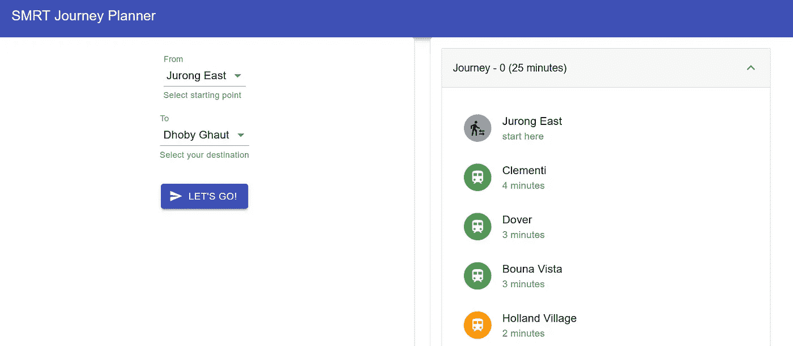

# 使用 Neo4j 构建地铁旅程规划器

> 原文：<https://towardsdatascience.com/build-a-subway-journey-planner-using-neo4j-566b1a53670a?source=collection_archive---------22----------------------->

## 使用流行的图形数据库计算出两个地铁站之间的最佳行驶路径


照片由[卢卡·布拉沃](https://unsplash.com/@lucabravo?utm_source=unsplash&utm_medium=referral&utm_content=creditCopyText)在 [Unsplash](https://unsplash.com/s/photos/subway?utm_source=unsplash&utm_medium=referral&utm_content=creditCopyText) 上拍摄

在我之前的教程中，我已经介绍了如何使用 Neo4j 构建一个餐馆推荐引擎。在本教程中，我们将进一步探索用户定义的过程和函数。这样的实现通常用 Java 实现，可以通过 Cypher 直接调用。这为您提供了一种方便的方法，可以创建您喜欢的任何图形算法的自定义实现，并在 Neo4j 中查询数据集时使用它。

从版本 4.1.1 开始，Neo4j 自带[APOC(Cypher 上的牛逼程序)库](https://github.com/neo4j-contrib/neo4j-apoc-procedures)。有两种版本可供选择:

*   `APOC Core` —没有外部依赖性或不需要配置的过程和功能
*   `APOC Full`—包括`APOC Core`中的所有内容，以及额外的过程和函数。

此外，Neo4j 还为从事机器学习工作流的开发人员提供了自己的 [GDSL(图形数据科学库)](https://neo4j.com/graph-data-science-library/)。在撰写本文时，这个库中的一些算法仍处于 alpha 阶段。

我们的示例项目将是关于地铁/地铁/大众捷运的旅程规划。在后台，它稍后将使用`APOC Core`提供的路径查找算法来查找从起点到终点的最短路径。

让我们继续下一部分，开始安装必要的模块。

# 1.设置

在继续之前，如果您是 Neo4j 的新手，强烈建议您阅读下面的指南[Neo4j 图形平台初学者指南](https://medium.com/better-programming/the-beginners-guide-to-the-neo4j-graph-platform-a39858ccdeaa)。

## APOC 核心

默认情况下，Neo4j 的安装附带了`APOC Core` jar 文件。您可以很容易地在以下目录中找到 jar 文件。`NEO4J_HOME`指您本地机器中 Neo4j 的主目录。

```
$NEO4J_HOME/labs
```

您需要做的就是将 jar 文件复制并粘贴到以下目录中

```
$NEO4J_HOME/plugins
```

记住之后通过下面的命令重新启动 Neo4j 以使其生效。

```
neo4j console
```

如果要将其作为后台服务启动，请使用以下命令。

```
neo4j start
```

您可以通过以下 URL 访问 Neo4j 浏览器

```
[http://localhost:7474/browser/](http://localhost:7474/browser/)
```

## Neo4j 驱动程序

为了将您的 web 应用程序连接到 Neo4j 图形数据库，您需要根据您使用的编程语言安装以下驱动程序之一:

*   `.NET`——。网络标准 2.0
*   `Java` —Java 8+(最新补丁发布)。
*   `JavaScript` —所有 [LTS 版本的节点。JS](https://github.com/nodejs/LTS) ，特别是 4.x 和 6.x 系列运行时。
*   `Python` — CPython 3.5 及以上。
*   `Go` —工作正在进行中。目前没有官方发布日期。

对于本教程，我将在 FastAPI 中为我们的 web 应用程序使用 Python 驱动程序。您可以通过[下面的链接](https://neo4j.com/docs/driver-manual/current/get-started/#driver-get-started-installation)找到其余驱动程序的完整安装步骤。

强烈建议您在安装软件包之前创建一个虚拟环境。在终端中运行以下命令。

```
pip install neo4j
```

## FastAPI

我们的后端服务器将建立在 FastAPI 之上。如果你是 Flask 用户，请随意修改它，因为你可以随时[将它从 Flask 迁移到 FastAPI](https://medium.com/better-programming/migrate-from-flask-to-fastapi-smoothly-cc4c6c255397) 。通过 pip install 安装，如下所示:

```
pip install fastapi
```

此外，你还需要一台`ASGI`服务器。我将使用推荐的名为`Uvicorn`的`ASGI`服务器。在同一个终端中，运行以下命令进行安装

```
pip install uvicorn
```

## 资料组

我将使用下面的网络图作为我的用例的数据集。它基于新加坡[公共交通运营商之一](http://SMRT Corporation website)的实际网络图。

为了简化我们的项目，我们的数据集将只包含上面地图的精简版本。因此，我将忽略其余的线路，只保留以下 5 条 MRT 线路。

*   东西线(绿色)
*   南北线(红色)
*   东北线(紫色)
*   圆形线(圆形)
*   市区线(蓝色)

# 2.Neo4j 数据库

在本节中，我们将执行图形查询语言(Cypher ),用于向 Neo4j 图形数据库插入数据以及从其中查询数据。您可以使用现有的或新的数据库。

在我们继续之前，让我们列出用例的所有节点和关系。我们将使用它来建模我们的领域，并在稍后创建 Cypher 查询。

## 假定

为了使事情简单而简短，我将为我们的用例做以下假设。

*   每站之间没有等待时间。在实际使用情况下，应该有乘客排队上车的等待时间。
*   当在换乘站之间改变线路时，没有行驶时间。在实际使用案例中，当改变线路时，你必须从一个平台走到另一个平台。
*   从`Station A`到`Station B`花费的时间总是相同的，不管你是否在不同的线路上旅行。在实际使用案例中，从`Raffles Place`经`East-West Line`到`City Hall`所用的时间与经`North-South Line`所用的时间不同。
*   我们的旅程规划工具所使用的指标仅仅基于两个站点之间的总旅行时间。在实际使用案例中，您必须考虑影响旅行费用的进出站需求。

根据您自己的用例随意修改和建模领域。

## 站(节点)

每个站代表一个具有以下属性的`Node`:

*   `name` —车站名称。所有的名字都是小写的。
*   `mrt` —代表车站所在的线路。我用的是简称。因此，`East-West Line`将是`ew`，而`Circle Line`将是`cc`。对于立体交叉，将改为标记为`x`。该属性将决定 React 应用程序中图标的颜色。

## 旅行目的地(关系)

两个`Station`之间的关系由具有以下属性的`TRAVEL_TO`表示:

*   `time` —代表从一个站点到另一个站点所需的时间。它不包括从一条捷运线换乘到另一条捷运线的步行时间。车站间隔时间的数据集基于 [TransitLink](https://www.transitlink.com.sg/eservice/eguide/rail_idx.php) 网站的输出结果。稍后，它将被用作路径查找算法的成本函数。

## 清除数据库

您可以运行以下密码来清理数据库。任何现有节点及其关系都将从数据库中完全删除。

```
MATCH (n) DETACH DELETE n
```

## 创建数据集

您可以创建两个`Station`节点，并用如下关系将它们链接起来。我使用小写作为名称来标准化稍后 API 调用的输入参数。

```
CREATE (tuaslink:Station {name:"tuas link", mrt:"ew"})-[:TRAVEL_TO {time: 2}]->(tuaswestroad:Station {name:"tuas west road", mrt:"ew"})
```

它将创建两个带有`Station`标签的独立节点，并在它们之间建立`TRAVEL_TO`关系。现在，您应该注意到关系是单向创建的。这是默认行为，因为 Neo4j 只允许您在节点之间创建单向关系。但是，您可以指定在查询时忽略方向，以获得所需的双向结果。

随后，您可以通过声明的名称重用旧的`Station`节点，并将它链接到一个新的`Station`节点，如下所示。

```
(tuaswestroad)-[:TRAVEL_TO {time: 8}]->(tuascrescent:Station {name:"tuas crescent", mrt:"ew"})
```

链接节点时需要小心，因为如果从`Station A`到`Station B`存在两种不同的关系，会导致结果重复。例如，您可以通过`East-West Line`和`North-South Line`从`Raffles Place`连接到`City Hall`。一旦你为`East-West Line`声明了以下密码。

```
(rafflesplace:Station {name:"raffles place", mrt:"x"})-[:TRAVEL_TO {time: 2}]->(cityhall:Station {name:"city hall", mrt:"x"})
```

您不能为`North-South Line`再次声明它。

```
(rafflesplace)-[:TRAVEL_TO {time: 2}]->(cityhall)
```

如果您打算将两个工作站建模为不同的实体，只需为同一个工作站创建两个不同的节点，并正确地链接它们。

让我们将所有数据集合并到一个查询中。下面的[要点](https://gist.github.com/wfng92/fb08e2aee22f7dd79150fc99bef50b7d)包含该项目的完整密码查询。可以直接在 Neo4j 控制台运行。

一旦执行了 Cypher 查询，您应该会看到下面的用户界面


作者图片

## 获取全部

事实上，您可以运行以下查询来获取所有节点及其关系

```
MATCH (n) RETURN (n)
```

在您的 Neo4j 浏览器中，您应该会得到以下结果。


作者图片

## Dijkstra(寻路算法)

`APOC Core`附带了一些有用的寻路算法，比如`dijkstra`和`astar`。在本教程中，我将使用`dijkstra`，因为我们只有一个成本函数。基于[官方文件](https://neo4j.com/labs/apoc/4.1/overview/apoc.algo/apoc.algo.dijkstra/)，它接受以下输入参数

*   `startNode` —寻路算法的起始节点。
*   `endNode` —寻路算法的结束目的节点。
*   `relationshipTypesAndDirections` —字符串表示节点之间的关系。您也可以指定方向。
*   `weightPropertyName` —代表成本函数的属性名称的字符串。
*   `defaultWeight` —属性在节点中不存在时的默认权重。
*   `numberOfWantedPaths` —要返回的路径数。默认值为 1。

并返回两个输出参数

*   `path` —寻路旅程的路径。
*   `weight` —寻路旅程的总成本。

如果您只是从算法中寻找最佳路径，您可以忽略`defaultWeight`和`numberOfWantedPaths`参数。

## 从 A 到 B 的最佳路径

下面的例子说明了获得从`Jurong East`到`Dhoby Ghaut`的最佳路径的密码。

```
MATCH (start:Station {name: 'jurong east'}), (end:Station {name: 'dhoby ghaut'})
CALL apoc.algo.dijkstra(start, end, 'TRAVEL_TO', 'time') YIELD path, weight
RETURN path, weight
```

您应该得到以下输出


作者图片

## 从 A 到 B 的前三条路径

假设您想从算法中获得前 3 条最佳路径。你应该使用下面的密码

```
MATCH (start:Station {name: 'jurong east'}), (end:Station {name: 'dhoby ghaut'})
CALL apoc.algo.dijkstra(start, end, 'TRAVEL_TO', 'time', 5, 3) YIELD path, weight
RETURN path, weight
```

执行后，Neo4j 浏览器将显示以下结果


作者图片

# 3.Python 驱动程序

在本节中，我们将创建一个简单的 FastAPI 后端，它通过 Python 驱动程序连接到 Neo4j 数据库。在您的工作目录中，创建一个新的 Python 文件。我打算把它叫做`journey.py`。

## 导入

在 Python 文件的顶部添加以下导入声明。

```
from neo4j import GraphDatabase
import logging
from neo4j.exceptions import ServiceUnavailable
```

## 旅程等级

接下来，创建一个新类，并在其中初始化以下函数

```
class Journey:
    def __init__(self, uri, user, password):
        self.driver = GraphDatabase.driver(uri, auth=(user, password)) def close(self):
        self.driver.close()
```

该类负责以下功能:

*   返回数据库中所有电台的名称列表
*   使用`dijkstra`寻路算法返回基于起点和终点的最佳路径

## 获取电台名称

继续在`Journey`类中追加以下代码。第一个功能通过上下文管理器初始化会话。在函数内部，我们将调用`read_transaction()`方法并传入第二个函数，该函数将返回一个字典作为结果。

第二个函数主要负责通过`run()`函数执行查询字符串。我使用 dict comprehension 和`title()`函数将名字作为`Title` case 返回。基于官方文档，建议将该功能声明为`staticmethod`。

## 获取最佳路径

让我们再创建两个函数，使用`dijkstra`算法获得最佳路径。它接受以下参数:

*   `start_node` —旅程的起点
*   `end_node` —旅程的终点
*   `count` —返回的路径数

# 4.FastAPI 服务器

正如我前面提到的，我们的后端服务器基于 FastAPI。在与`journey.py`相同的目录下创建一个名为`myapp.py`的新 Python 文件。

## 导入

在文件的顶部，添加以下导入语句。

```
from fastapi import FastAPI
import journey
import atexit
from fastapi.middleware.cors import CORSMiddleware
```

`journey`是我们之前创建的模块的名称。如果这两个文件不在同一个目录中，请相应地修改它。

当退出网络服务器时，我使用`atexit`来执行`close()`功能。要了解更多信息，请看下面关于如何为 Python 应用程序创建退出处理程序的教程。

当您从任何前端应用程序发出`AJAX`或`fetch`调用时，需要`CORSMiddleware`来防止问题。

## 初始化

初始化以下变量，这些变量是向 Neo4j 数据库进行身份验证的凭据。

```
uri = "neo4j://localhost:7687"
user = "neo4j"
password = "neo4j"neo_db = journey.Journey(uri, user, password)
```

## 退出处理程序

然后，添加下面的代码来关闭与 Neo4j 数据库的连接。

```
def exit_application():
    neo_db.close()atexit.register(exit_application)
```

## FastAPI

完成后，创建一个新的 FastAPI 实例。除此之外，让我们为`origins`指定一个变量，并在调用`add_middleware()`函数时将其作为输入参数传递。

```
app = FastAPI()origins = [
    "[http://localhost:3000](http://localhost:3000)"
]app.add_middleware(
    CORSMiddleware,
    allow_origins=origins,
    allow_credentials=True,
    allow_methods=["*"],
    allow_headers=["*"],
)
```

`origins`由将调用您的 FastAPI 服务器的 URL 列表组成。假设您有一个在端口 3000 上本地运行 React 应用程序。您应该将以下 URL 添加到列表中

```
[http://localhost:3000](http://localhost:3000)
```

创建一条新的`GET`路线，返回所有站点的名称。

```
@app.get('/get-station')
async def get_station():
    result = neo_db.find_all()return result
```

之后，创建另一条`GET`路线以获得最佳路径。我们将把它与接受三个参数的`find_journey()`函数连接起来。每行包含一个字典对象，该对象包含`path`和`weight`参数。需要注意的一点是，`path`内部的节点是无序的，你可以通过`id`链接它们。第一个节点可以是起点，也可以是终点。

## 运行 FastAPI

运行以下代码启动 FastAPI 服务器:

```
uvicorn myapp:app
```

它应该在几秒钟后开始。让我们测试一下我们的 API，以获得从`Jurong East`到`Dhoby Ghaut`的最佳路径。在您的浏览器中浏览以下网址。

```
[http://localhost:8000/get-journey?start=jurong%20east&end=dhoby%20ghaut&count=3](http://localhost:8000/get-journey?start=jurong%20east&end=dhoby%20ghaut&count=3)
```

您应该会得到以下结果。

```
[{"path":[{"name":"Jurong East","mrt":"x","time":"start here"},{"name":"Clementi","mrt":"ew","time":"4 minutes"},{"name":"Dover","mrt":"ew","time":"3 minutes"},{"name":"Bouna Vista","mrt":"ew","time":"3 minutes"},{"name":"Holland Village","mrt":"cc","time":"2 minutes"},{"name":"Farrer Road","mrt":"cc","time":"3 minutes"},{"name":"Botanic Gardens","mrt":"cc","time":"2 minutes"},{"name":"Stevens","mrt":"dt","time":"2 minutes"},{"name":"Newton","mrt":"dt","time":"3 minutes"},{"name":"Little India","mrt":"dt","time":"1 minutes"},{"name":"Dhoby Ghaut","mrt":"dt","time":"2 minutes"}],"weight":25.0},{"path":[{"name":"Jurong East","mrt":"x","time":"start here"},{"name":"Clementi","mrt":"ew","time":"4 minutes"},{"name":"Dover","mrt":"ew","time":"3 minutes"},{"name":"Bouna Vista","mrt":"ew","time":"3 minutes"},{"name":"Commonwealth","mrt":"ew","time":"2 minutes"},{"name":"Queenstown","mrt":"ew","time":"2 minutes"},{"name":"Red Hill","mrt":"ew","time":"3 minutes"},{"name":"Tiong Bahru","mrt":"ew","time":"2 minutes"},{"name":"Outram Park","mrt":"ew","time":"3 minutes"},{"name":"Chinatown","mrt":"ew","time":"2 minutes"},{"name":"Clarkequay","mrt":"ne","time":"2 minutes"},{"name":"Dhoby Ghaut","mrt":"ne","time":"2 minutes"}],"weight":28.0},{"path":[{"name":"Jurong East","mrt":"x","time":"start here"},{"name":"Clementi","mrt":"ew","time":"4 minutes"},{"name":"Dover","mrt":"ew","time":"3 minutes"},{"name":"Bouna Vista","mrt":"ew","time":"3 minutes"},{"name":"Holland Village","mrt":"cc","time":"2 minutes"},{"name":"Farrer Road","mrt":"cc","time":"3 minutes"},{"name":"Botanic Gardens","mrt":"cc","time":"2 minutes"},{"name":"Stevens","mrt":"dt","time":"2 minutes"},{"name":"Newton","mrt":"dt","time":"3 minutes"},{"name":"Orchard","mrt":"ns","time":"3 minutes"},{"name":"Somerset","mrt":"ns","time":"2 minutes"},{"name":"Dhoby Ghaut","mrt":"ns","time":"2 minutes"}],"weight":29.0}]
```

第一个推荐建议我们从`Jurong East`到`Bouna Vista`，然后一直坐`Circle Line`到`Botanic Gardens`。之后，沿着`Downtown Line`一直走到`Little India`，然后换乘`Dhoby Ghaut`。

第二条路径将我们从`Jurong East`引向`Outram Park`。然后，换乘`North East Line`，一直走到`Dhoby Ghaut`。

此外，我们的第三个建议指引我们在`Bouna Vista`换乘到达`Botanic Gardens`。之后，通过`Downtown Line`继续`Newton`。与第一趟不同，它建议我们从`Orchard`换乘`North South Line`前往`Dhoby Ghaut`。

# 5.从前端呼叫

你现在需要做的就是把它连接到任何一个前端应用。你可以根据自己的喜好使用任何框架或计算机语言。在本教程中，我将简单介绍如何将 React 与 FastAPI 服务器集成。为了避免过于冗长，我将不涉及用户界面。

## 例子

如果你正在寻找灵感，看看[以下网站](http://journey.smrt.com.sg/)提供的功能。以下示例显示了从`Jurong East`到`Dhoby Ghaut`的示例输出。


图片由作者基于 [SMRT 旅程规划](http://journey.smrt.com.sg/)中提供的功能绘制。

如你所见，与我们的结果相比，它只提供了两种选择。第一个选项与我们的路径查找算法提出的第二个建议路径完全相同。

您可以创建具有以下功能的 React 应用程序:

*   将内容分成两部分的网格布局。左侧包含输入，而右侧将显示结果。
*   起点和终点的两个选择输入
*   确认按钮
*   结果将显示为手风琴，连同总时间的旅程。每个旅程将包含站点名称以及每个站点之间的旅程时间。

最终的 React 应用程序可能看起来像这样。该用户界面基于 React 材质用户界面。



作者图片

## AJAX 调用

对于集成，您可以通过`AJAX`或`fetch`调用轻松实现。在本教程中，我将展示如何对 FastAPI 服务器进行`AJAX`调用。

# 结论

祝贺您完成本教程。

让我们回顾一下你今天所学的内容。我们首先简要介绍了 Cypher Library 上令人惊叹的程序。

之后，我们继续安装必要的模块，从 Neo4j Python 驱动程序到 FastAPI。此外，我们为我们的旅程规划应用程序制作和建模了我们的域。

一旦我们完成了它，我们启动 Neo4j 作为控制台应用程序，并与 Cypher 一起玩。我们清理了数据库，创建了新记录，并尝试运行`djikstra`寻路算法来获得最佳路径。

随后，我们构建了一个新的 Journey 类，作为通过 Python 驱动程序连接到 Neo4j 数据库的模块。我们还创建了一个 FastAPI 服务器，作为后端服务器。

最后，我们进一步探讨了如何通过 AJAX 调用将其与 React 应用程序集成。

感谢你阅读这篇文章。希望在下一篇文章中再见到你！

# 参考

1.  [Neo4j 网站](https://neo4j.com/)
2.  [Neo4j Python 驱动](https://neo4j.com/docs/api/python-driver/4.1/)
3.  [反应材质 UI](https://material-ui.com/)