# 如何使用 IBM Watson NLC 服务构建文本分类器

> 原文：<https://towardsdatascience.com/build-a-text-classification-model-using-watson-autoai-3650c461642?source=collection_archive---------22----------------------->

## 使用 Watson Studio 训练文本分类器，无需编码

图片由罗曼·维涅斯拍摄

## 文本分类

文本分类是属于数据科学和机器学习的另一项任务，我们为每个文档/句子/推文分配一个或多个类别或类别(用相关类别标记自然语言文本)。例如，将这句话“**莱昂内尔·梅西在世界足球奖中获得年度最佳球员”**归类为**“体育”**陈述。

## 构建模型

我们将构建一个分类器，将 StackOverflow 问题分类到[前 20 个标签](https://stackoverflow.com/tags)之一。使用的数据可在 [BigQuery](https://bigquery.cloud.google.com/dataset/bigquery-public-data:stackoverflow?pli=1) 上获得，或者您可以[点击此处下载。](https://storage.googleapis.com/tensorflow-workshop-examples/stack-overflow-data.csv)该数据包含带有单个标签的 StackOverflow 帖子。每个标签有 2000 个帖子，所以总共有 40，000 个帖子。

首先，您需要创建一个项目:

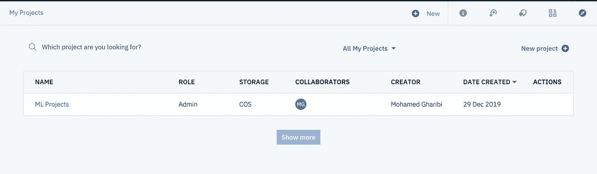

选择项目后，应该会出现一个类似的视图。点击*“添加到项目”*按钮开始我们的旅程。

使用 AutoAI 可以建立许多不同的模型。要构建文本分类器，点击*“自然语言分类器”*

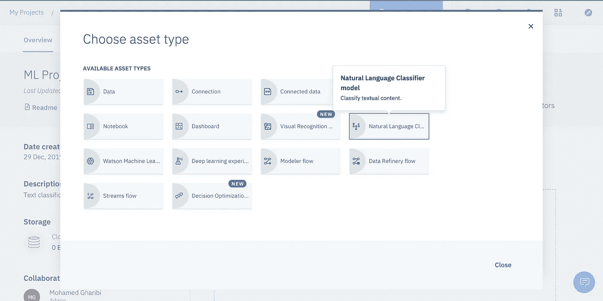

训练分类器需要服务。如果您是第一次使用，请点击*【此处】*获取一个。

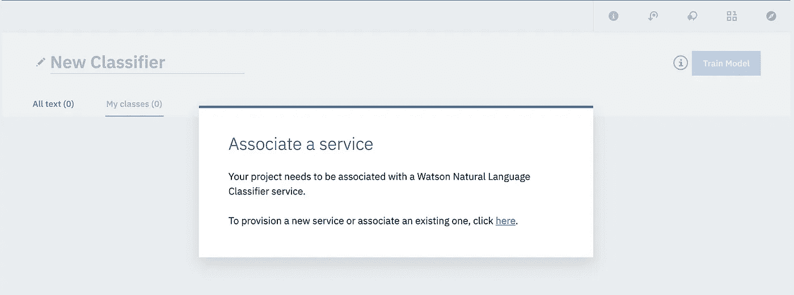

选择一个计划。

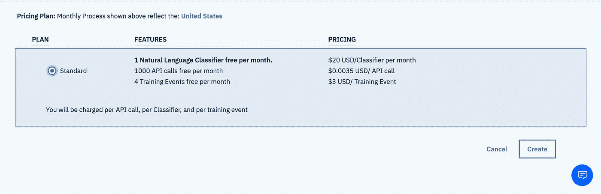

如果是第一次，选择默认设置，点击*“确认”*

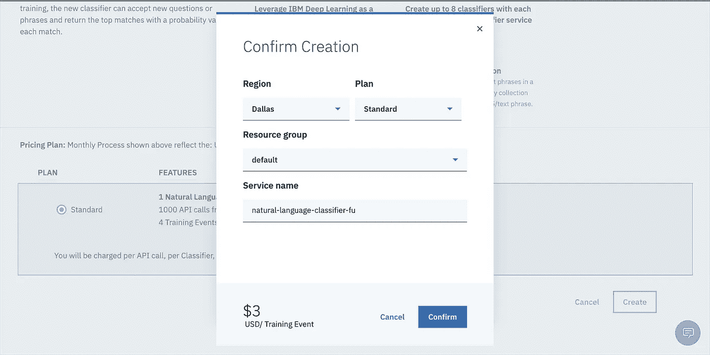

否则，您将被重定向到一个页面，在那里您可以选择您的服务之一

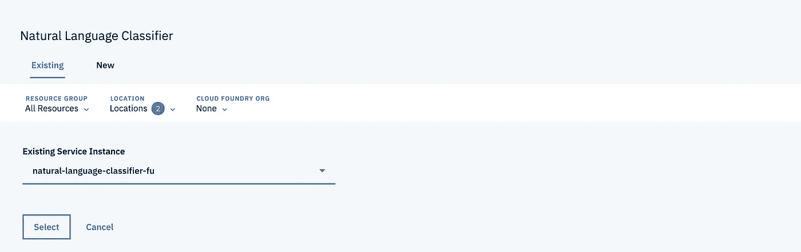

这是主页面，点击右上角的*【浏览】*上传您的文件。在左侧，将出现您所有标签和帖子的列表。允许你编辑文章，添加，删除，重命名等等。

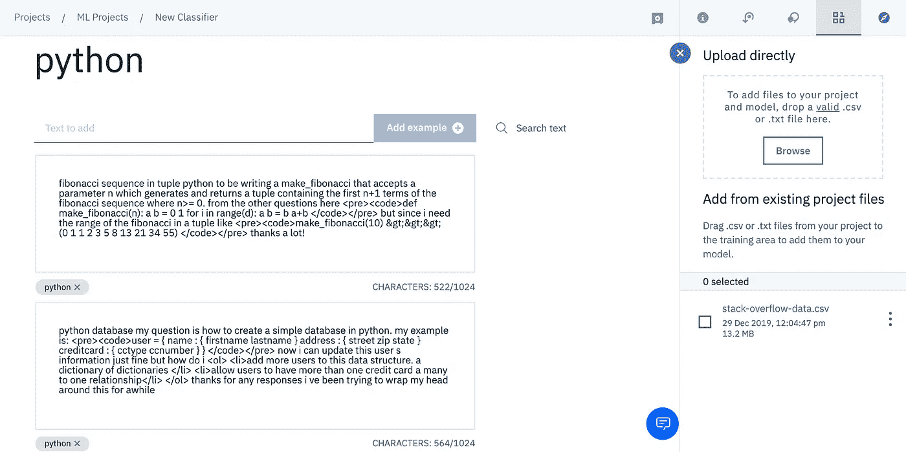

当你点击*“火车模型”时，魔法就开始了。*

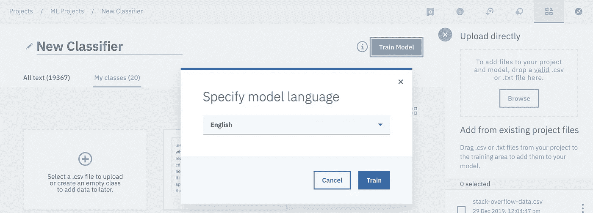

培训阶段结束后，您应该会收到通知。点击*【此处】*

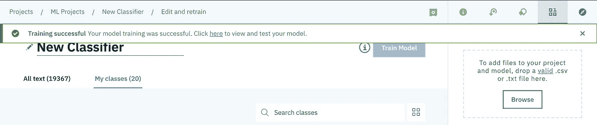

您将被重定向到一个新页面，该页面包含三个选项卡:*概述、测试、实施*

点击“测试”来测试模型。写一句话，点击*“分类”。*您可以更改阈值以获得特定概率的结果。

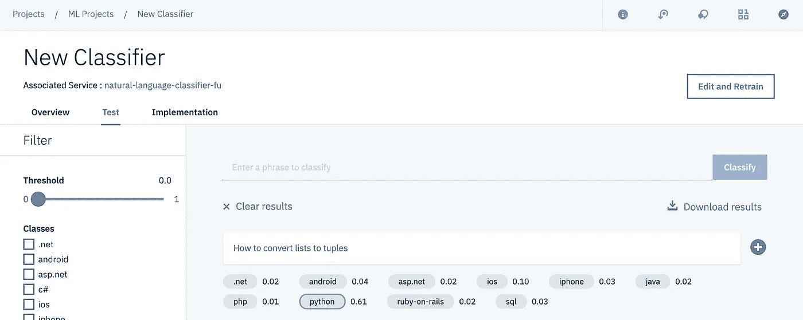

最后，点击*“Implementation”*，您将获得如何向模型发送推理请求的说明。

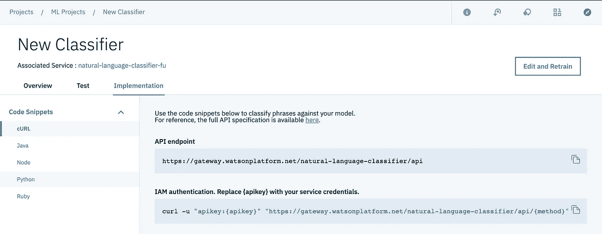

感谢阅读。如果您有任何问题，请告诉我！

# 资源

*   [AutoAI 文档](https://dataplatform.cloud.ibm.com/docs/content/wsj/analyze-data/autoai-overview.html)
*   [IBM Watson 在 Youtube 上](https://www.youtube.com/watch?v=DBRGlAHdj48&list=PLzpeuWUENMK3u3j_hffhNZX3-Jkht3N6V)
*   [StackOverflow 数据集](https://cloud.google.com/blog/products/gcp/intro-to-text-classification-with-keras-automatically-tagging-stack-overflow-posts)