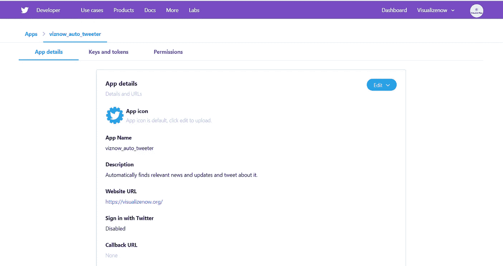
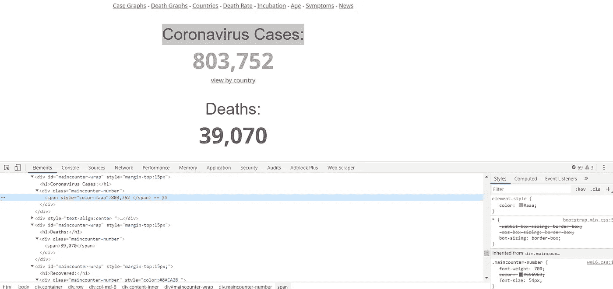

# 为冠状病毒更新构建一个 Twitter 机器人

> 原文：<https://towardsdatascience.com/build-a-twitter-bot-for-coronavirus-update-8cfec4314b0d?source=collection_archive---------29----------------------->

## 在本文中，我们将学习如何使用 Python 和 Tweepy 构建一个 twitter 机器人来发布冠状病毒的统计数据。


照片由[于切尔·莫兰](https://unsplash.com/@yucelmoran?utm_source=medium&utm_medium=referral)在 [Unsplash](https://unsplash.com?utm_source=medium&utm_medium=referral) 上拍摄

***编者按:*** [*走向数据科学*](http://towardsdatascience.com/) *是一份以数据科学和机器学习研究为主的中型刊物。我们不是健康专家或流行病学家，本文的观点不应被解释为专业建议。想了解更多关于疫情冠状病毒的信息，可以点击* [*这里*](https://www.who.int/emergencies/diseases/novel-coronavirus-2019/situation-reports) *。*

Twitter 提供了一个 API ，用户可以通过它与平台进行交互。Tweepy 是一个 python 库，它提供了一种方便访问 twitter API 的方法。它是底层 API 的高级包装器。

如果想直接上码，[点这里](https://github.com/sagunsh/corona_twitter_bot)。

# 装置

我们将在这个项目中使用 Python 3。我们首先需要的是 tweepy。让我们使用 pip 安装它。

```
pip install tweepy
```

> Linux 和 Mac 用户可能必须使用 pip3，而不是 Python 2 使用的 pip

# Twitter API

为了访问 twitter API，我们需要有一个 twitter 帐户。如果还没有，就创建一个吧。为了使用 API，请确保您已经验证了您的电子邮件和电话号码。

然后转到[开发者页面](https://developer.twitter.com/en)并点击左上角的**应用**或直接转到[应用页面](https://developer.twitter.com/en/apply-for-access)。然后点击“申请开发者账号”。根据您的需要选择适当的选项，然后单击“下一步”回答问题。Twitter 会询问一些基本信息，比如你将如何使用 API，你来自哪个国家，等等。一旦一切都完成了，你可能要等一两天才能得到验证。

验证完成后，转到[应用页面](https://developer.twitter.com/en/apps)并创建一个应用。为您的应用程序命名(确保它是唯一的)，添加描述和网站 url。在底部，你必须详细描述你将如何使用该应用程序。然后按创建。



Twitter 应用程序

一旦你进入如图所示的应用程序页面。转到“密钥和令牌”。生成访问令牌和访问令牌密码。显示密钥时，将密钥复制到某个文本文件中。

现在创建一个文件 config.py 并添加所有 4 个键，如下所示。

配置. py

现在，在 config.py 所在的同一个文件夹中创建另一个文件 twitter_bot.py，并添加以下代码。

twitter_bot.py

现在使用命令运行该文件

```
python twitter_bot.py
```

代码非常简单。我们正在导入 tweepy 库和所有需要的键。然后我们通过传递我们的键来创建一个 api 对象。如果成功，将打印“认证成功”，否则将打印“认证 API 时出错”。我希望你得到正确的认证。去看看你的推特账户，你会看到一条推文。

# 收集冠状病毒统计数据

我发现了 https://www.worldometers.info/coronavirus/[的这个网站，上面显示了受影响、死亡和康复的总人数。我们将从该页面抓取数据，创建一条推文，并从我们的帐户发布。](https://www.worldometers.info/coronavirus/)

让我们安装请求和 lxml 库。

```
pip install requests lxml
```

requests 用于向 web 页面发送 HTTP 请求，lxml 用于使用 Xpath 解析返回的 HTML 内容。如果您不熟悉 Xpath，我将链接下面的一些资源来了解更多。顺便说一下，你也可以使用 BeautifulSoup 来解析 HTML 而不是 lxml。

所有这些依赖项都在 github repo 的 requirements.txt 文件中。您可以使用以下命令一次性安装所有程序

```
pip install -r requirements.txt
```

打开 https://www.worldometers.info/coronavirus/的，右键点击“冠状病毒病例”正下方的数字，点击**检查**。



检查 HTML

数据位于 span 标记中，该标记位于具有 maincounter-number 类的 div 中。如果你检查死亡和恢复部分，你会看到结构是相同的。让我们打开 python 外壳，看看是否能得到数据。在您的 cmd/终端中，键入 python。

```
>>> import requests
>>> from lxml import html
>>> response = requests.get('[https://www.worldometers.info/coronavirus/'](https://www.worldometers.info/coronavirus/'))
>>> doc = html.fromstring(response.content)
>>> doc.xpath('//div[[@class](http://twitter.com/class)="maincounter-number"]/span/text()')
['805,377 ', '39,469', '172,436']
```

这里，我们向目标页面[发送请求，并解析返回的 HTML。如果你看最后一行，xpath 是不言自明的。它说，找到所有带有类 maincounter-number 的 div，并提取该 div 中 span 元素的文本。这里我们有 3 个匹配的元素，因此打印了 3 个值。](https://www.worldometers.info/coronavirus/)

现在我们可以在脚本中实现相同的逻辑。打开 twitter_bot.py，创建一个名为 **create_tweet()** 的函数，并在 import 语句的正下方添加抓取代码。

我们正在使用 [Python 的 f 字符串](https://realpython.com/python-f-strings/#f-strings-a-new-and-improved-way-to-format-strings-in-python)创建一条推文。我添加了一些相关的标签，但是你可以根据自己的需要随意设置推特的格式。不要忘了给世界计程仪积分。

添加完所有内容后，我们的最终代码应该是这样的。

现在从终端/cmd 运行您的代码。

```
python twitter_bot.py
```

然后检查你的推特账户，你会看到一条这样的推文

通过 visualizenoworg 发布推文

如果你想在脚本中添加更多的功能，比如每隔 X 分钟从一个无限循环中发出 tweet。或者安排这个脚本每隔 Y 分钟从 cron 运行一次。你可以创建一个完全不同的机器人，从你的账户发布最新消息。可能性是无限的。还要确保检查[速率限制](https://developer.twitter.com/en/docs/ads/general/guides/rate-limiting)。

Twitter API 允许你与应用程序交互，收集数据，分析推文等等。要了解更多信息，你可以查看 twitter 的官方文档。

# 资源

1.  官方文件:[https://developer.twitter.com/en/docs](https://developer.twitter.com/en/docs)
2.  十二份文件:[http://docs.tweepy.org/en/latest/](http://docs.tweepy.org/en/latest/)
3.  Xpath 教程:[https://docs . scrapy . org/en/XPath-tutorial/topics/XPath-tutorial . html](https://docs.scrapy.org/en/xpath-tutorial/topics/xpath-tutorial.html)
4.  另一个推特机器人:[https://realpython.com/twitter-bot-python-tweepy/](https://realpython.com/twitter-bot-python-tweepy/)
5.  代码:[https://github.com/sagunsh/corona_twitter_bot](https://github.com/sagunsh/corona_twitter_bot)