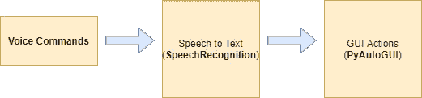
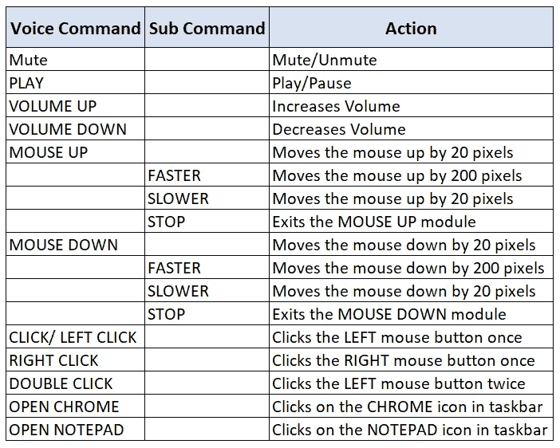

# 在 5 分钟内制作一个声控鼠标

> 原文：<https://towardsdatascience.com/build-a-voice-controlled-mouse-keyboard-in-5-minutes-952bc8f101fc?source=collection_archive---------19----------------------->

## Python 中语音识别和 GUI 自动化的初学者指南

在这个故事中，我们将使用 Python 构建一个应用程序，它将接受来自用户的语音命令，并使用鼠标和键盘执行某些基于 GUI 的操作。你可以把它想象成你自己的语音数字助理。它可以播放媒体，打开应用程序，发送电子邮件，移动鼠标指针等等，所有这些都由你的语音命令触发。我们将通过使用以下两个 python 库来完成—[](https://pypi.org/project/PyAutoGUI/)*&[***Speech _ Recognition***](https://pypi.org/project/SpeechRecognition/)。你只需要一台安装了 Python 的笔记本电脑和一个麦克风。*

**

*由 [Marek Levák](https://unsplash.com/@designmesk?utm_source=medium&utm_medium=referral) 在 [Unsplash](https://unsplash.com?utm_source=medium&utm_medium=referral) 拍摄的照片*

*在详细介绍如何在本演示中使用上述工具之前，让我们看看它们是如何适应我们的应用程序设计的。*

*下图非常简单明了。用户将语音命令输入麦克风(内置或外置)，然后使用*语音识别*模块将其转换为相应的文本。然后，转换后的文本被映射到使用 *PyAutoGUI* 模块执行的某些 GUI 动作(鼠标/键盘事件)。为了方便起见，我画了下图。*

**

*端到端流程的流程图*

*让我们更详细地看看这两个库！*

# ***1。演讲人认可:***

**

*照片由[freestocks.org](https://www.pexels.com/@freestocks?utm_content=attributionCopyText&utm_medium=referral&utm_source=pexels)从[派克斯](https://www.pexels.com/photo/black-microphone-64057/?utm_content=attributionCopyText&utm_medium=referral&utm_source=pexels)拍摄*

*语音识别特征在家庭自动化系统、语言学习、数字助理等领域具有各种应用。使用这个库，我们可以把我们的讲话转换成文本。它支持几种 API(在线和离线)。在我们的例子中，我们将使用在线 google API。您可能会注意到在语音到文本的转换过程中有时会有一些延迟，但是，在这个模块支持的其他 API 中，我发现 Google API 在我的情况下是最准确的。可以使用以下 pip 命令下载它。使用麦克风需要 pyaudio。*

```
*pip install SpeechRecognition
pip install pyaudio*
```

*在下面的代码片段中，我们正在初始化 recognizer 对象，监听来自麦克风的输入语音，并使用“recognize_google”函数将其转换为文本。我们只在用*粗体字母标记的行中做了所有这些。对 recognizer . adjust _ for _ ambient _ noise()函数的调用是可选的。该功能监听输入声音，并根据房间内的噪音量改变 ***energy_threshold*** 值。它可以被认为是识别器灵敏度的度量。该值取决于环境噪声，较高的值通常意味着不太敏感。该参数的范围可以是 50–4000 之间的任何值。**

```
****import speech_recognition****recognizer = speech_recognition.Recognizer()****with speech_recognition.Microphone() as src:**
    try:
        **audio = recognizer.adjust_for_ambient_noise(src)**
        print("Threshold Value After calibration:" + str(recognizer.energy_threshold))
        print("Please speak:")
        **audio = recognizer.listen(src)**
        **speech_to_txt = recognizer.recognize_google(audio)**.lower()
        print(speech_to_txt)
    except Exception as ex:
        print("Sorry. Could not understand.")**
```

**比方说，代替麦克风，您的输入是一个音频文件(file.wav)，行号 3 可以替换如下:**

```
**with speech_recognition.WavFile("file.wav") as src:**
```

# **2.PyAutoGUI:**

****

**照片由[凯特琳·贝克](https://unsplash.com/@kaitlynbaker?utm_source=medium&utm_medium=referral)在 [Unsplash](https://unsplash.com?utm_source=medium&utm_medium=referral) 上拍摄**

**Python 为 **GUI 自动化**提供了一个名为[***PyAutoGUI***](https://pyautogui.readthedocs.io/en/latest/)*的库，可以模拟鼠标点击和按键，就像人类用户正在执行它们一样。例如，模拟鼠标移动，击键，截屏，最大化窗口，有很多事情可以做。完整列表可以参考 [*官方文档链接*](https://pyautogui.readthedocs.io/en/latest/index.html) 。为了这个演示的目的，我使用了像鼠标移动、鼠标点击、键盘按压&在屏幕上查找图像这样的功能。***

```
**pip install PyAutoGUI**
```

****鼠标控制:**要在屏幕上移动鼠标光标，我们需要(x，y)坐标。将显示器想象成一个具有 x，y 坐标的[二维平面](https://pyautogui.readthedocs.io/en/latest/mouse.html)(如此处所示)，其中左上角是(0，0)。向右移动，x 的值增加，而向底部移动，y 的值增加。函数的作用是:返回屏幕的尺寸。**

**您可以检查您的屏幕尺寸，如下所示:**

```
**>>> import pyautogui
>>> pyautogui.size()
Size(width=1920, height=1080)**
```

**下面的命令将鼠标指针从当前位置移动到(100，100)位置，需要 0.25 秒。下一个命令模拟双击，两次单击之间的间隔为 0.25 秒。**

```
**pyautogui.**moveRel**(100, 100, duration=0.25)
pyautogui.**click**(button='left', clicks=2, interval=0.25)**
```

****键盘控制:**为了模拟按键，使用了以下函数。它按下多媒体“静音”按钮。所有支持的键的完整列表可以在[这里](https://pyautogui.readthedocs.io/en/latest/keyboard.html#the-hotkey-function)找到。**

```
**pyautogui.**typewrite**(['volumemute'])**
```

****定位功能:**有时我们并不知道想要点击的点(比如一个按钮)的(x，y)坐标。但是如果我们将按钮的图片存储为图像文件，pyautogui.locateOnScreen()函数可以逐个像素地查找该图像并返回坐标。关于 locateOnScreen()特性需要注意的一点是，即使单个像素不匹配，它也无法检测图像并返回一个 *None* 对象。然后，我们可以简单地将鼠标移动到给定的位置并执行单击。例如:-我把 Chrome 应用程序固定在我的 windows 电脑的任务栏上。我已经采取了图标截图(Chrome.PNG)如下:**

****

**我的 Windows 任务栏中 Chrome 图标的屏幕截图**

**现在，locateOnScreen()函数的用法如下**

```
**icon_location = **pyautogui.locateOnScreen**(r'screenshots\Chrome.PNG')
print(icon_location)
>>> Box(left=446, top=1023, width=74, height=52)#Using the left & top values as x & y to click at that location
**pyautogui.click(x=446, y=1023, duration=0.25)****
```

**我们只需要知道这些。现在，剩下的唯一事情就是将文本映射到 GUI 动作。这是我选择的贴图。**

****

**我的命令的屏幕截图**

**我附上了最终应用的演示视频和代码上传 [**这里**](https://github.com/arindomjit/Voice_Controlled_Mouse) 供参考。**

**功能演示**

**如果您碰巧阅读了我以前的一篇关于使用神经网络 进行手势识别的文章，我打算添加 PyAutoGUI 功能作为补充部分，以便根据预测的手势采取行动，这些动作基于这里 PyAutoGUI 部分讨论的相同原则。**

# **结论**

**在这个演示中，我们看到了如何使用语音识别库将语音转换为文本，以及如何使用 PyAutoGUI 实现 GUI 自动化。通过结合这两种功能，我们建立了一个语音控制鼠标和键盘的基本版本。我希望您发现这些信息很有用，并以自己的方式使用它们。**

**[](/face-detection-in-10-lines-for-beginners-1787aa1d9127) [## 面向初学者的 10 行人脸检测

### 使用 Python OpenCV 在图像和视频中检测人脸的介绍。

towardsdatascience.com](/face-detection-in-10-lines-for-beginners-1787aa1d9127) [](https://medium.com/swlh/artificial-neural-networks-for-absolute-beginners-a75bc1522e1d) [## 绝对初学者的神经网络

### 用简单的英语介绍感知器

medium.com](https://medium.com/swlh/artificial-neural-networks-for-absolute-beginners-a75bc1522e1d) 

**参考文献:**

[1] PyAutoGUI CheatSheet，【https://pyautogui.readthedocs.io/en/latest/quickstart.html 

[2]语音识别 Python，【https://pypi.org/project/SpeechRecognition/ **