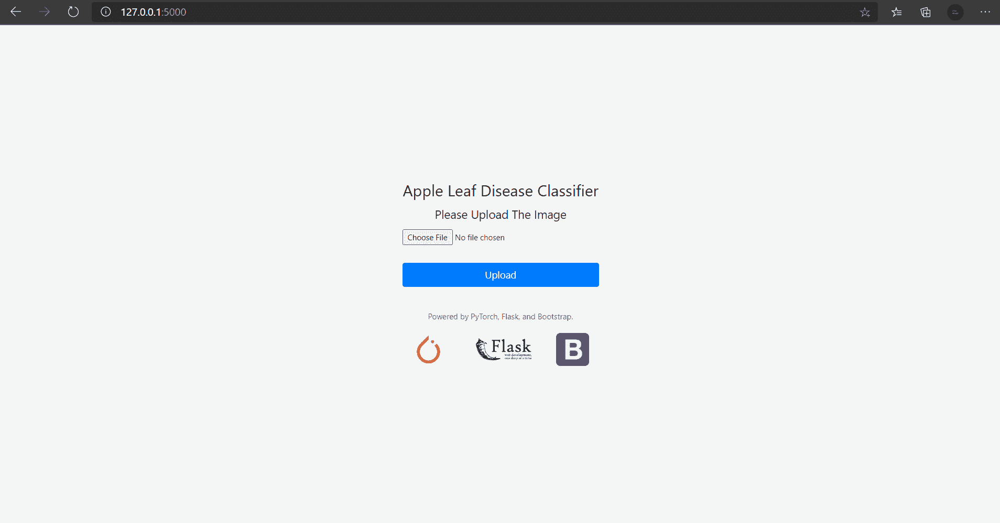
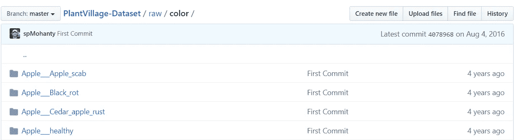
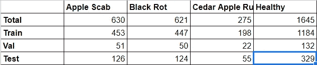
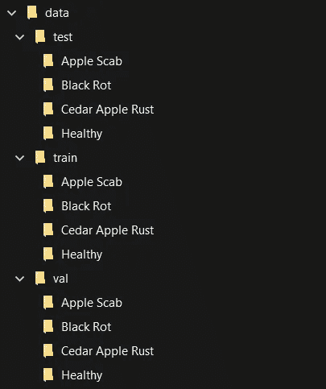
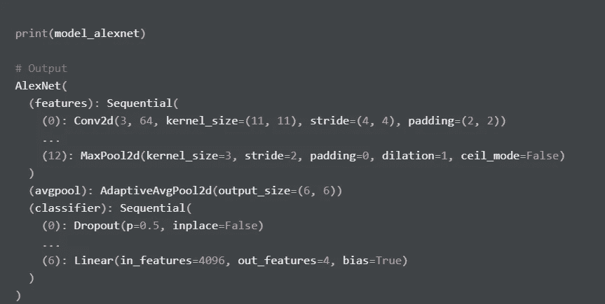
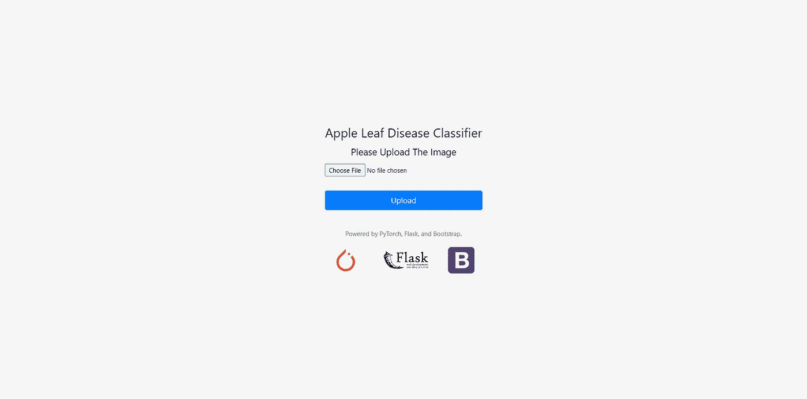

# 使用 PyTorch 和 Flask 构建预测苹果叶部病害的 Web 应用程序

> 原文：<https://towardsdatascience.com/build-a-web-application-for-predicting-apple-leaf-diseases-using-pytorch-and-flask-413f9fa9276a?source=collection_archive---------34----------------------->


照片由[约瑟夫芬](https://unsplash.com/@josefin?utm_source=unsplash&utm_medium=referral&utm_content=creditCopyText)在 [Unsplash](/s/photos/leaf?utm_source=unsplash&utm_medium=referral&utm_content=creditCopyText) 上拍摄

## 使用预先训练的模型(VGG-16、雷斯网-18 和 AlexNet 架构)构建图像分类器 web 应用。

深度学习是处理非结构化数据的一个很好的模型，尤其是在图像上。这个领域的进展真的很快，其中一个进展就是一个叫迁移学习的东西。

迁移学习是一种训练已经在不同数据集上训练过的神经网络的方法，所以我们不必从头开始训练它，因为训练它们可能需要几天或几周的时间。

如果我们对我们的数据集使用迁移学习，只需要几个小时的训练，因为我们只训练最后一层。因此，我们可以使用它在其他数据集上训练已经预先训练好的模型及其给定的架构。

为了使模型有用，我们必须部署它们，例如通过构建一个 web 应用程序，使其对用户更加友好。幸运的是，我们可以使用 PyTorch 来构建深度学习模型，使用 Flask 来构建 web 应用程序。

在本文中，我将向您展示如何构建一个 web 应用程序来对苹果叶子进行图像分类，以分类它是否健康，如果不健康，叶子患了什么病。为此，我们可以使用 PyTorch 进行迁移学习，以及如何使用 Flask 构建一个简单的 web 应用程序。这是 web 应用程序的预览，



# 大纲

我们要做的第一件事是建立一个图像分类器。它由几个步骤组成，它们是:

*   **下载数据，**
*   **准备数据，**
*   **建立模型，**
*   **测试模型，**
*   **保存模型。**

# 分析

## 检索数据

对于数据集，我们可以使用 PlantVillage 数据集来检索我们要使用的数据集。你可以从这个 GitHub 库[这里](https://github.com/spMohanty/PlantVillage-Dataset/tree/master/raw/color)下载数据集。

## 准备数据

下载完数据后，我们可以先准备数据集。首先，我们必须将数据集组织到单独的文件夹中。

如果我们看到我们已经下载的数据集，我们可以看到有这么多来自不同植物的图像。在这种情况下，我们只选择与苹果相关的植物。

所以，我们把包含苹果叶子图片的文件夹带过去。



然后，我们将每个文件夹分成 3 个不同的文件夹，它们是 train、val 和 test。然后，我们将每组数据分成 80%用于训练数据(以 90:10 的比例将它们分成训练和验证数据)和 20%用于测试数据。每个文件夹的数量看起来像这样，



最后，该文件夹的结构将如下所示，



有了如上的文件夹结构后，我们就可以建立图像分类的模型了。在我们构建之前，我们必须导入数据集，我们还必须转换数据，以便它具有进入模型的相同表示。代码看起来会像这样，

正如我们在上面看到的，关于如何准备数据集有几个步骤。首先，我们必须转换数据集。这是必须的，因为模型无法处理没有所需大小的数据。因此，我们必须调整它的大小，并且用与模型的第一层相同的维度裁剪数据集。

然后，在我们转换图像之后，我们可以使用 ImageFolder 方法将其加载到我们的代码中。此外，我们将对数据集的转换应用于它。我们可以通过使用所有的训练数据集来训练模型，但这将花费很多时间。因此，我们必须创建批处理来减少计算时间。为了确保批次是随机的，我们必须将 shuffle 参数设置为 true。

最后，我们检索图像的数量和类名，还可以使用 torch.device 函数启用 GPU。完成所有步骤后，我们可以进入建模部分。

## 建立模型

因为我们是基于预先训练好的模型来构建模型的，所以我们要做的第一件事就是下载模型。在这种情况下，我只使用 VGG-16、ResNet-18 和 AlexNet 架构，然后我们比较哪个模型是最好的，并确保您将预训练参数设置为真。

因为我们使用它，所以我们必须设置参数，以便除了完全连接的最后一层之外，不计算梯度。然后，我们可以根据数据集上类的数量来改变最终层的输出神经元。然后，我们可以训练这个模型。

这是代码，

请确保您知道最终层的位置，因为每个模型都有不同的方法来访问它。使用 ResNet，我们可以访问 fc 索引来访问最终层，但在 VGG 和 AlexNet 上，我们通过索引分类器和索引号 6 来访问它。

通过在块代码上调用它，您可以看到每个模型的轮廓，这是代码和输出，



当我们训练模型时，它发生在几个时期。时期描述了训练模型的迭代次数。在每个时期，有几个步骤来训练模型。首先，模型前馈图像，并获得最佳输出。然后，它比较输出和真实标签，并计算损失。然后，它计算每个参数的梯度，然后根据模型的梯度更新每个权重。它不断重复，直到到达最后一个纪元，我们将从所有纪元中获得最佳模型。

这是每个型号的最佳结果，

```
**""" 
For VGG-16, 
Training complete in 27m 4s 
Best val Acc: 0.964706** **For ResNet-18, 
Training complete in 10m 7s 
Best val Acc: 0.968627** **For AlexNet, 
Training complete in 7m 40s 
Best val Acc: 0.976471 
"""**
```

要确定使用哪种模型，我们必须根据我们的需求来考虑。当然，我们需要一个非常精确的模型。但是如果我们想要部署到 web 应用程序，请确保您的模型具有较小的尺寸，以便我们可以在 GitHub 和 Heroku 上部署它。

基于这些结果，我们得出结论，AlexNet 是在 7 分 40 秒内对苹果上的疾病进行分类的最好和最快的模型。此外，我们可以看到，VGG-16 模型是最慢和最低的准确性得分。ResNet-18 位于中间位置。它不比 AlexNet 慢，而且它的精确度也比 VGG-16 高。但是，当我们部署这些型号时，ResNet-18 的尺寸最小。因此，我们将使用 ResNet-18 模型作为我们的分类器。

## 测试模型

如果要测试模型，可以在测试数据集上调用 dataloader 来测试模型是否能准确预测图像。代码看起来会像这样，

在那之后，我们得到了这样的输出，


```
**""" 
GroundTruth:  Cedar Apple Rust, Healthy, Black Rot, Healthy Predicted:  Cedar Apple Rust, Healthy, Black Rot, Healthy
"""**
```

## 保存模型

所以，如果我们对我们的新模型有信心，我们可以挽救它。为此，我们可以使用下面的代码，

```
**# Save The Model** 
PATH = ‘./fix_resnet18.pth’ 
torch.save(model_resnet.state_dict(), PATH)
```

它会将您的模型保存到。pth 格式。如果我们想在另一个会话中使用它，我们可以使用这个命令，

这就是如何使用 PyTorch 构建图像分类器！

# 构建 Web 应用程序

在我们创建模型之后，我们可以使用 Flask 构建 web 应用程序。总的来说，我们将做两件事。他们在服务器上工作，并创建页面来显示它。

## 构建服务器(app.py)

首先，我们要构建一个名为 [app.py](http://app.py) 的文件。它将处理网站，它包括显示页面，也将处理输入。在这种情况下，我们有一个图像输入。里面的代码看起来像这样，

让我解释它的每一行。第 1–8 行导入了我们需要的库，包括 Flask、PyTorch、string 等等。第 10 行声明了一个 Flask 对象。第 12–36 行使用 PyTorch 完成建模任务。第 38–43 行声明了一个显示预测结果的字典。第 46–58 行是我们 web 应用程序的主要流程。第 60–61 行使用下面的命令来确保我们的应用程序能够运行，

```
python app.py
```

你们中的一些人可能是第一次接触烧瓶。让我向你解释它是如何工作的。第 46 行是在网站上设置我们的路线。在这种情况下，在我们的网站上，如果我们想要显示主页面，我们将像 [http://127.0.0.1:5000/](http://127.0.0.1:5000/) 一样转到那个根，在那里 URL 的最后一个字符描述了我们的路线。

里面还描述了 GET 和 POST 方法。它们描述了我们如何与网站互动。如果我们使用 GET 方法，我们只向服务器发出请求，不向那里发送任何文件。POST 方法将文件发送到服务器，并向服务器请求结果。

在第 47 行，它声明了一个名为 upload_file 的函数。它将对我们的数据起作用。如果我们首先打开 web，它将只使用 GET 方法来检索 web 页面。之后，我们给一个图像输入，然后上传它们。因为我们上传了数据，所以它将使用 POST 方法来处理我们的数据，从而预测叶子图像上存在的疾病。完成后，我们会收到一个新的页面，上面显示了叶子的疾病和描述。

## 构建页面

现在，我们创建描述主页和预测结果页面的网页。我们创建了三个文件，它们是 layout.html、index.html 和 result.html。等等，我们创建了两个页面，但是为什么还要创建另一个页面呢？

Flask 上有个概念叫模板。简而言之，我们不需要建立一个完整的网页。相反，我们构建附加页面作为所有页面的布局，所以我们不必为它编写完整的 HTML 代码。让我给你看看 layout.html 的档案，

正如我们所看到的，除了 body 标签中有一个命令之外，该网页没有任何内容。它被称为块，它将包含来自另一个文件的元素。让我给你看一下索引和结果页面，

从这两个文件中我们可以看到，我们没有对整个网页进行编码。相反，我们调用作为网站的模板。在它的下面，有块部分来填充它。这就是为什么我们不必从头开始构建，这使得我们的时间比以前更短。

在我们构建好代码并运行命令后，我们可以去 [http://127.0.0.1:5000/](http://127.0.0.1:5000/) ，它会在网站上显示页面，



# 最终想法

迁移学习是一个有用的概念，可以实现我们自己的分类器，而无需从头开始训练它们。在本文中，我已经向您展示了我们如何在 PyTorch 上使用迁移学习的概念来构建不同的架构。此外，我已经向您展示了如何使用 Flask 构建 web 应用程序。确保您的模型不会消耗大量的存储空间，但仍然具有很高的准确性，这样您就可以毫无问题地部署模型。

希望对你有用，感谢你看我的文章。想看代码可以看我的 GitHub repo [这里](https://github.com/khalidmeister/apple-leaf-disease-prediction)。