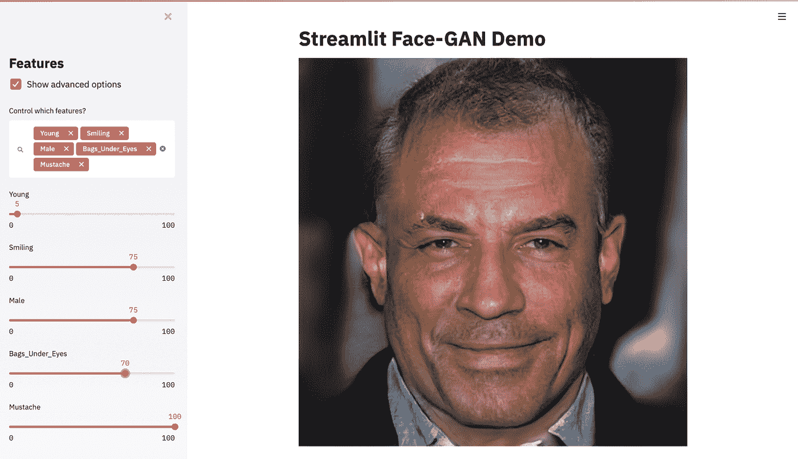
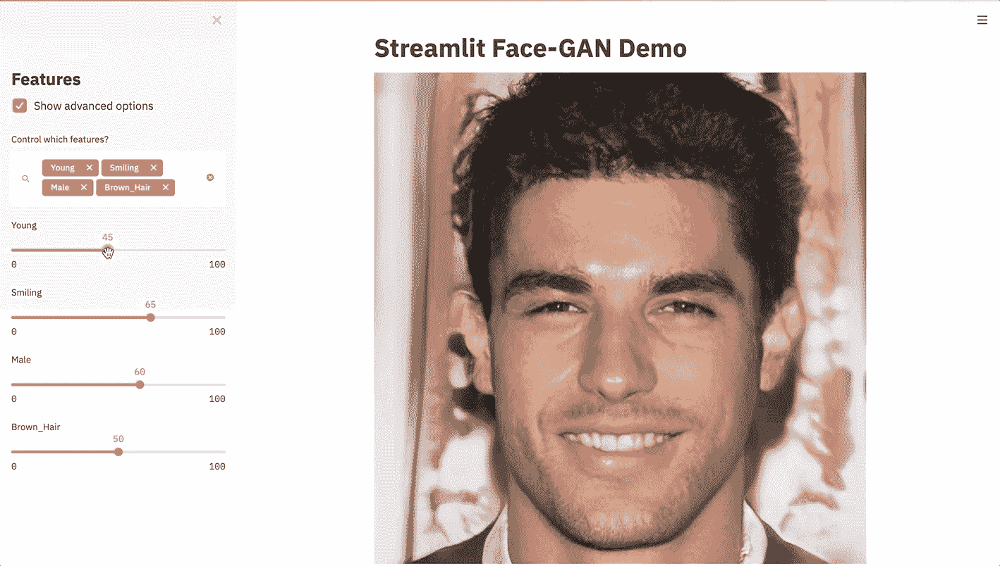
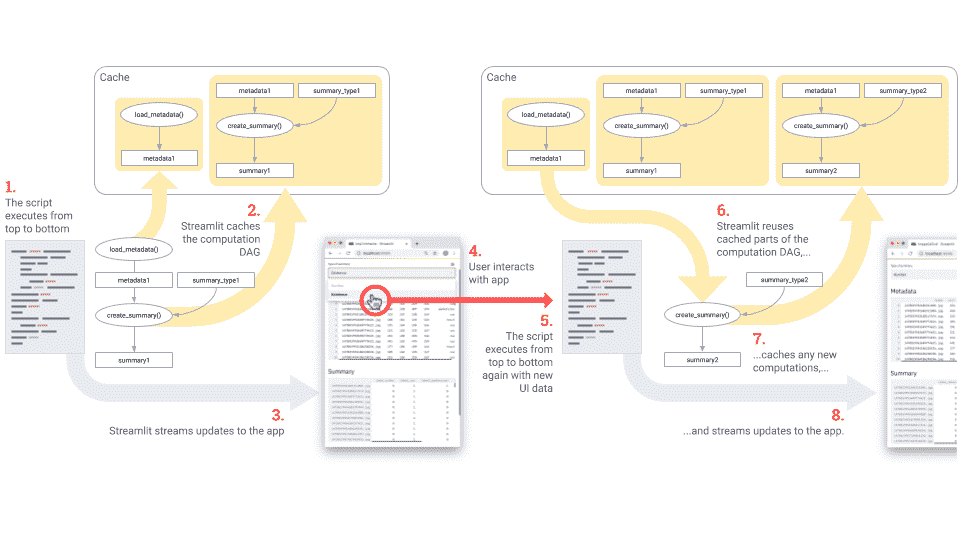
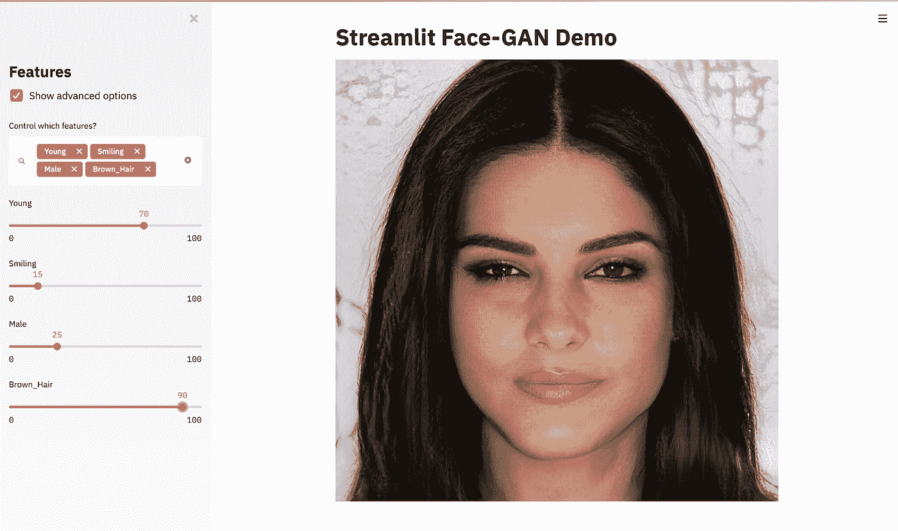
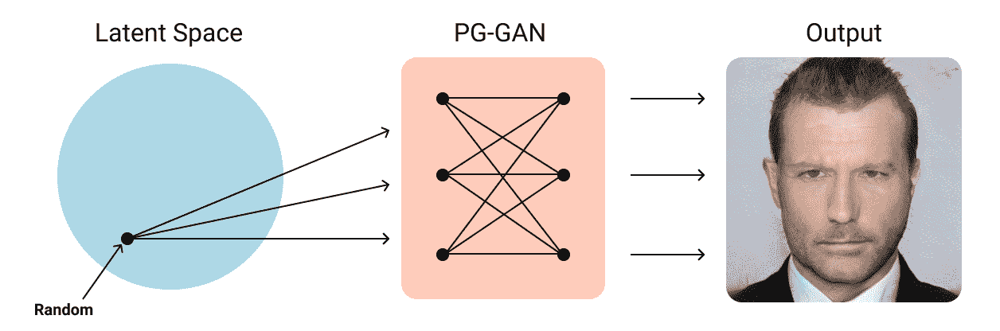
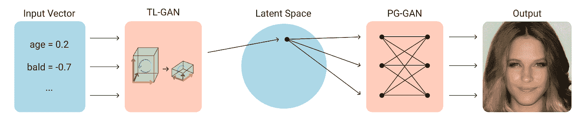

# 使用 TensorFlow 和 Streamlit 构建一个应用程序来生成逼真的人脸

> 原文：<https://towardsdatascience.com/build-an-app-to-synthesize-photorealistic-faces-using-tensorflow-and-streamlit-dd2545828021?source=collection_archive---------16----------------------->

## 我们将向您展示如何使用 GANs、Tensorflow 和 st.cache 快速构建一个 Streamlit 应用程序来合成名人面孔。



【GAN 合成脸】

机器学习模型是黑盒。是的，你可以在测试集上运行它们，并绘制出奇特的性能曲线，但是通常很难回答关于它们性能的基本问题。一个惊人的强大的洞察力来源是简单的**玩你的模型**！调整输入。观察输出。让你的同事和经理也和他们一起玩。这种互动的方法不仅是获得直觉的有力途径，也是让人们对你的工作感到兴奋的好方法。

制作交互式模型是启发 [Streamlit](http://streamlit.io) 的用例之一，Streamlit 是一个 Python 框架，它使[编写应用程序像编写 Python 脚本](/coding-ml-tools-like-you-code-ml-models-ddba3357eace?source=friends_link&sk=f7774c54571148b33cde3ba6c6310086)一样简单。这个概述将带你创建一个 Streamlit 应用程序，与最复杂、最黑箱化的模型之一一起玩:深度*生成对抗网络* (GAN)。在这种情况下，我们将想象 Nvidia 的 [PG-GAN](https://research.nvidia.com/publication/2017-10_Progressive-Growing-of) [1]使用 TensorFlow 从稀薄的空气中合成照片级真实感人脸。然后，使用关的惊人的 [TL-GAN](https://blog.insightdatascience.com/generating-custom-photo-realistic-faces-using-ai-d170b1b59255) 模型[2]，我们将创建一个[应用程序，让我们](https://github.com/streamlit/demo-face-gan)能够根据年龄、笑容、男性相似度和头发颜色等属性调整 GAN 合成的名人脸。在本教程结束时，你将拥有一个完全参数化的人类模型！(注意，我们没有创建属性。它们来自 [CelebA 数据集](http://mmlab.ie.cuhk.edu.hk/projects/CelebA.html)【3】，其中一些可能会变得有点奇怪……)

# Streamlit 入门

如果您尚未安装 Streamlit，可以通过运行以下命令来安装:

```
pip install streamlit
streamlit hello
```

如果你是一个经验丰富的简化者，你需要安装 0.57.1 或更高版本，所以一定要升级！

```
pip install --upgrade streamlit
```

# 设置您的环境

在我们开始之前，使用下面的命令来检查该项目的 GitHub repo 并亲自运行 [Face GAN 演示](https://github.com/streamlit/demo-face-gan)。这个演示依赖于 Tensorflow 1，它不支持 Python 3.7 或 3.8，所以您需要 Python 3.6。在 Mac 和 Linux 上，我们建议使用 [pyenv](https://github.com/pyenv/pyenv) 安装 Python 3.6 和您当前的版本，然后使用 venv 或 virtualenv 建立一个新的虚拟环境。在 Windows 上， [Anaconda Navigator](https://docs.anaconda.com/anaconda/navigator/) 允许你用点击界面[选择你的 Python 版本](https://docs.anaconda.com/anaconda/navigator/tutorials/use-multiple-python-versions/)。

设置完毕后，打开终端窗口并键入:

```
git clone [https://github.com/streamlit/demo-face-gan.git](https://github.com/streamlit/demo-face-gan.git)
cd demo-face-gan
pip install -r requirements.txt
streamlit run app.py
```

给它一分钟来完成下载训练好的 GAN，然后尝试玩滑块来探索 GAN 可以合成的不同面孔。很酷，对吧？



完整的应用程序代码是一个大约有 190 行代码的文件，其中只有 13 行是 Streamlit 调用。**没错，上面整个 UI 就是从那 13 行画出来的！**

让我们来看看这个应用程序是如何构建的:

现在你对它的结构有了一个概念，让我们深入上面的 5 个步骤，看看它们是如何工作的。

# 第一步。下载模型和数据文件

这一步下载我们需要的文件:一个预先训练的 PG-GAN 模型和一个预先适合它的 TL-GAN 模型(我们稍后会深入讨论这些！).

`download_file`实用功能比纯粹的下载器要聪明一点:

*   它检查文件是否已经存在于本地目录中，所以它只在需要时才下载它。它还检查下载文件的大小是否符合我们的预期，因此它能够修复中断的下载。这是一个很好的模式！

*   它使用`st.progress()`和`st.warning()`在文件下载时向用户显示一个漂亮的 UI。然后它调用这些 UI 元素上的`.empty()`来隐藏它们。

# 第二步。将模型载入内存

下一步是将这些模型载入内存。以下是加载 PG-GAN 模型的代码:

注意`load_pg_gan_model()`开头的`@st.cache`装饰器。通常在 Python 中，你可以运行`load_pg_gan_model()`并反复重用那个变量。然而，Streamlit 的[执行模型](https://docs.streamlit.io/main_concepts.html?highlight=execution%20model#data-flow)是独一无二的，因为每次用户与 UI 小部件交互时，你的脚本都会在*中完整地再次执行*。通过将`@st.cache`添加到昂贵的模型加载函数中，我们告诉 Streamlit 只在脚本第一次执行时运行这些函数——并在以后的每次执行中重用缓存输出。这是 Streamlit 最基本的特性之一，因为它允许您通过缓存函数调用的结果来高效地运行脚本。这样，大的合适的 GAN 模型将恰好被加载到存储器中一次；出于同样的原因，我们的 TensorFlow 会话也将恰好创建一次。(请参阅我们的[发布文章](/coding-ml-tools-like-you-code-ml-models-ddba3357eace?source=friends_link&sk=f7774c54571148b33cde3ba6c6310086)以重温 Streamlit 的执行模型。)**

**

*【图 1。缓存如何在 Streamlit 的执行模型中工作]*

*不过，有一个问题:TensorFlow 会话对象在我们使用它运行不同的计算时可能会发生内部变异。通常，[我们不希望缓存的对象发生变异](https://docs.streamlit.io/caching.html#example-6-mutating-cached-values)，因为那会导致意想不到的结果。因此，当 Streamlit 检测到这种突变时，它会向用户发出警告。然而，在这种情况下，我们碰巧知道，如果 TensorFlow 会话对象发生变异，这是可以的，因此[我们通过设置`allow_output_mutation=True`来绕过警告](https://docs.streamlit.io/troubleshooting/caching_issues.html#how-to-fix-the-cached-object-mutated-warning)。*

# *第三步。绘制侧栏用户界面*

*如果这是您第一次看到 Streamlit 用于绘制小部件的 API，下面是 30 秒速成课程:*

*   *您可以通过调用像`st.slider()`和`st.checkbox()`这样的 API 方法来添加小部件。*
*   *这些方法的返回值是 UI 中显示的值。例如，当用户将滑块移动到位置 42 时，您的脚本将被重新执行，在执行过程中，`st.slider()`的返回值将是 42。*
*   *你可以通过在侧边栏中添加`st.sidebar`来放置任何东西。比如`st.sidebar.checkbox()`。*

*例如，要在侧边栏中添加一个滑块——一个允许用户调整`brown_hair`参数的滑块，您只需添加:*

*在我们的应用程序中，我们想展示一下让 UI 本身在 Streamlit 中可修改是多么容易！我们希望允许用户首先使用多选小部件来选择一组他们希望在生成的图像中控制的功能，这意味着我们的 UI 需要以编程方式绘制:*

**

*使用 Streamlit，代码实际上非常简单:*

# *第四步。合成图像*

*现在我们有了一组特征来告诉我们合成什么样的脸，我们需要做合成脸的繁重工作。我们的方法是将特征传递给 TL-GAN，在 PG-GAN 的潜在空间中生成一个向量，然后将该向量传递给 PG-GAN。如果那句话对你来说没有意义，让我们绕道来谈谈我们的两个神经网络是如何工作的。*

# ***绕道进入甘斯***

*为了理解上面的应用程序如何从滑块值生成人脸，你首先必须了解 PG-GAN 和 TL-GAN 的工作原理——但是不要担心，**你可以跳过这一部分，仍然可以在更高的层次上理解该应用程序的工作原理！***

*PG-GAN 就像任何 GAN 一样，从根本上来说是一对神经网络，一个是生成性的，一个是鉴别性的，它们相互训练，永远锁定在致命的战斗中。生成网络负责合成它认为看起来像人脸的图像，而鉴别网络负责决定这些图像是否确实是人脸。这两个网络根据彼此的输出进行迭代训练，因此每个网络都尽最大努力学习愚弄另一个网络。最终结果是，最终的生成网络能够合成逼真的人脸，即使在训练开始时，它只能合成随机噪声。这真的很神奇！在这种情况下，我们使用的生成人脸的 GAN 是由 Karras *等人*使用他们的[GANs](https://github.com/tkarras/progressive_growing_of_gans)渐进生长算法(PG-GAN)在名人脸上训练的，该算法使用渐进的更高分辨率图像训练 GAN。[1]*

*PG-GAN 的输入是属于其所谓的*潜在空间*的高维向量。潜在空间基本上是网络可以生成的所有可能的脸的空间，所以该空间中的每个随机向量对应于一个唯一的脸(或者至少应该是这样！有时你会得到奇怪的结果…)你通常使用 GAN 的方式是给它一个随机向量，然后检查合成了什么面(图 2.a)。*

**

*[图 2.a]*

*然而，这听起来有点枯燥，我们宁愿对输出有更多的控制。我们想告诉 PG-GAN“生成一个有胡子的男人的图像”，或者“生成一个棕色头发的女人的图像”。这就是 TL-GAN 发挥作用的地方。*

*TL-GAN 是另一种神经网络，这种网络通过将随机向量输入 PG-GAN 进行训练，获取生成的面部，并通过分类器对其进行分类，例如“是否年轻”、“是否有胡子”、“是否有棕色头发”等。在训练阶段，TL-GAN 使用这些分类器标记来自 PG-GAN 的数千张人脸，并识别潜在空间中与我们关心的标签变化相对应的方向。因此，TL-GAN 学习如何将这些类别(即“年轻的”、“有胡子的”、“棕色头发的”)映射到适当的随机向量中，该向量应输入到 PG-GAN 中，以生成具有这些特征的人脸(图 2.b)。*

**

*[图 2.b]*

*回到我们的应用程序，此时我们已经下载了预训练的 GAN 模型并将其加载到内存中，我们还从 UI 中抓取了一个特征向量。因此，现在我们只需将这些特性输入 TL-GAN，然后输入 PG-GAN，就可以得到一幅图像:*

# *优化性能*

*上面的`generate_image()`函数可能需要一些时间来执行，尤其是在 CPU 上运行时。为了提高我们的应用程序的性能，如果我们可以缓存该函数的输出就太好了，这样我们就不必在来回移动滑块时重新合成我们已经看到的人脸。*

*嗯，你可能已经在上面的片段中注意到了，这里的解决方案是再次使用`@st.cache`装饰器。*

*但是请注意我们传递给`@st.cache`的两个参数:`show_spinner=False`和`hash_funcs={tf.Session: id}`。那些是干什么用的？*

*第一个很容易解释:默认情况下，`@st.cache`在 UI 中显示一个状态框，让您知道一个运行缓慢的函数正在执行。我们称之为“旋转器”。然而，在这种情况下，我们希望避免显示它，这样 UI 就不会意外地跳跃。所以我们将`show_spinner`设置为假。*

*下一个解决了一个更复杂的问题:TensorFlow 会话对象，作为参数传递给`generate_image()`，通常在这个缓存函数运行期间被 TensorFlow 的内部机制改变。这意味着`generate_image()`的输入参数总是不同的，我们实际上永远不会获得缓存命中。换句话说，`@st.cache` decorator 实际上什么都不会做！我们如何解决这个问题？*

# *哈希函数拯救世界*

*hash_funcs 选项允许我们指定定制的哈希函数，告诉`@st.cache`在检查这是缓存命中还是缓存未命中时应该如何解释不同的对象。在这种情况下，我们将使用该选项通过调用 Python 的`id()`函数而不是检查其内容来告诉 Streamlit 散列 TensorFlow 会话:*

*这对我们很有用，因为在我们的例子中，会话对象实际上是底层代码所有执行中的一个单独对象，因为它来自@st.cache'd `load_pg_gan_model()`函数。*

*关于`hash_funcs`的更多信息，请查看我们关于[高级缓存技术](https://docs.streamlit.io/api.html?highlight=cache#streamlit.cache)的文档。*

# *第五步。绘制合成图像*

*现在我们已经有了输出图像，绘制它是小菜一碟！只需调用 Streamlit 的`st.image`函数:*

```
*st.image(image_out, use_column_width=True)*
```

*我们完事了。*

# *包扎*

*现在你有了:在一个 190 行的 Streamlit 应用程序中使用 TensorFlow 进行交互式人脸合成，并且只有 13 个 Streamlit 函数调用！祝你在探索这两位 GANs 能画的人脸空间时玩得开心，非常感谢 Nvidia 和关让我们制作了他们超酷的演示。我们希望你能像我们一样享受构建应用程序和玩模型的乐趣。🎈*

*如需更多 Streamlit 应用示例，您可以查看我们在[https://www.streamlit.io/gallery](https://www.streamlit.io/gallery)的图库。*

**感谢 Ash Blum、TC Ricks、Amanda Kelly、Thiago Teixeira、Jonathan Rhone 和 Tim Conkling 对本文的有益贡献。**

***参考文献:***

*[1] T. Karras，T. Aila，S. Laine，J. Lehtinen。*为了提高质量、稳定性和多样性而逐步种植甘蔗*。学习代表国际会议(ICLR 2018)*

*[2] S .关。*使用新型 TL-GAN 模型控制图像合成和编辑*。洞察数据科学博客(2018)*

*[3]刘，罗，王，唐。*在野外深度学习人脸属性。*计算机视觉国际会议(ICCV 2015)*