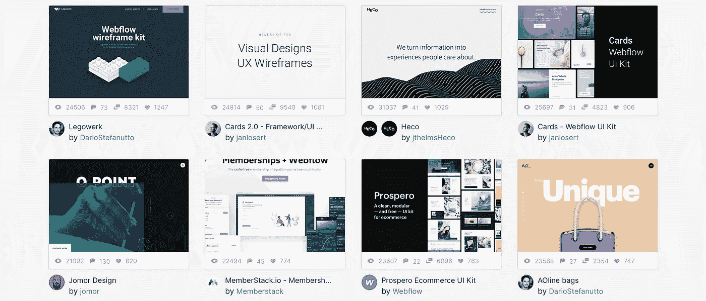
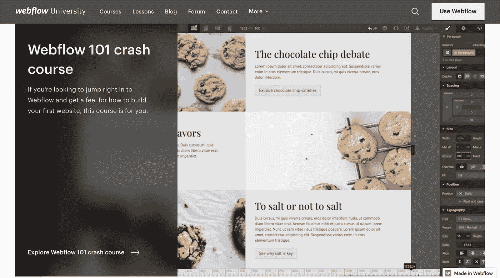
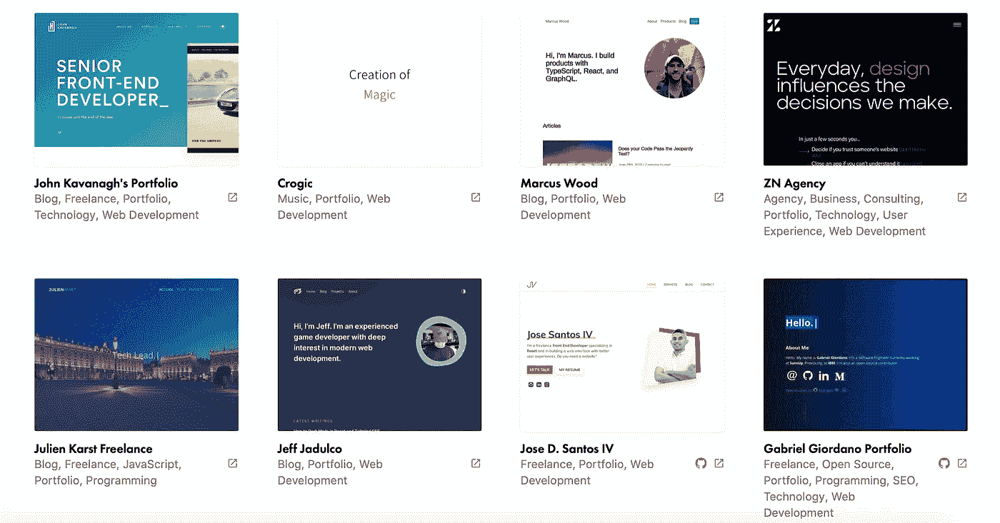
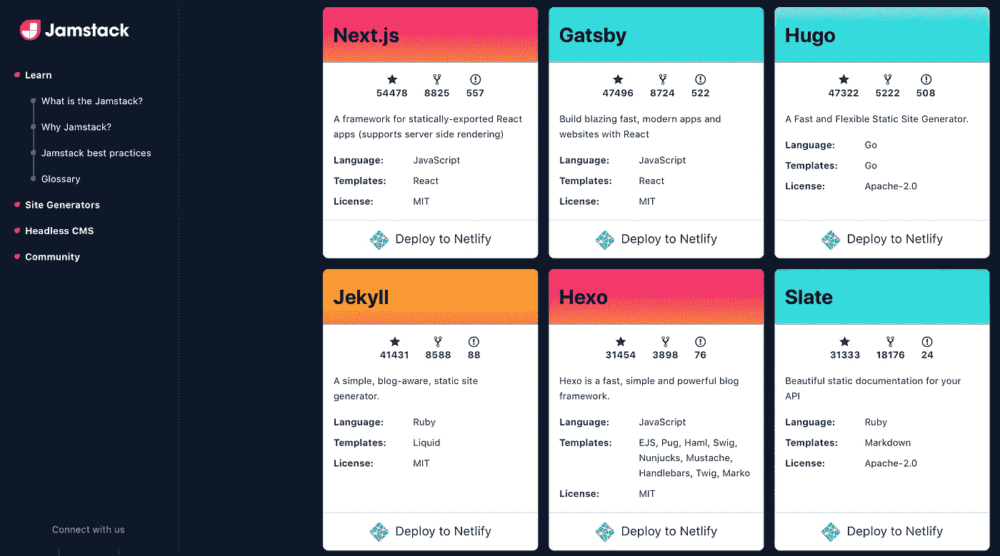
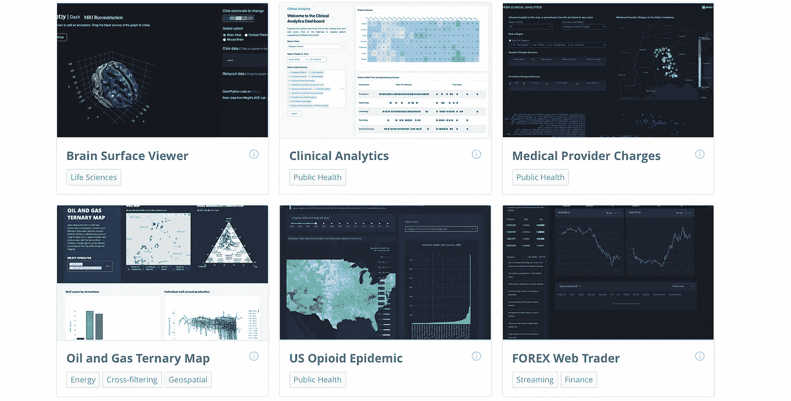
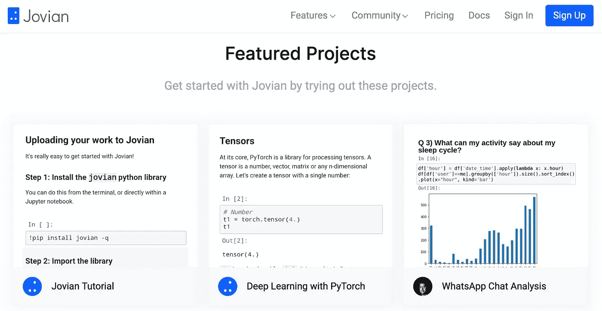
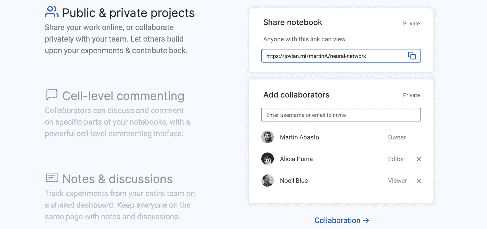
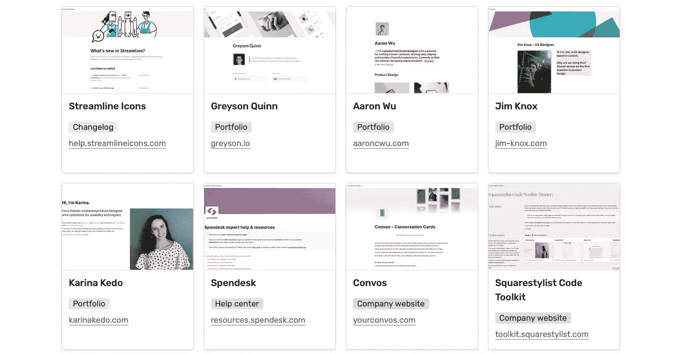
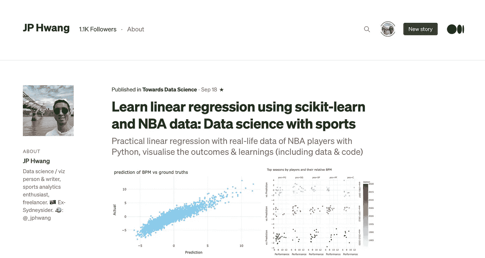

# 使用这些工具，立即构建一个令人敬畏的数据科学(或任何)投资组合

> 原文：<https://towardsdatascience.com/build-an-awesome-data-science-or-any-portfolio-in-no-time-with-these-tools-75ac95febf31?source=collection_archive---------15----------------------->

## 节省时间&建立一个漂亮的在线形象。大多数数据科学家对原始 HTML & CSS 有什么用？

安内特·lūsiņa 在 [Unsplash](https://unsplash.com/s/photos/computer-portfolio?utm_source=unsplash&utm_medium=referral&utm_content=creditCopyText) 上拍摄的照片

互联网被认为是一种民主化的力量。在很多方面都是如此。从某种程度上来说，这无疑是教育的民主化，以至于在某些领域，你可以成为一名高水平的从业者，跟上前沿的发展，甚至不需要脱掉睡衣。

但是在互联网上获得*地位*的门槛一直相对较高。要在网上构建任何值得他们称赞的东西，你必须编码。

当然，HTML 和 CSS 并不是最难学的语言，但它是另一种需要学习的语言。

耶，HTML/CSS(照片由 [Pankaj Patel](https://unsplash.com/@pankajpatel?utm_source=unsplash&utm_medium=referral&utm_content=creditCopyText) 在 [Unsplash](https://unsplash.com/s/photos/html?utm_source=unsplash&utm_medium=referral&utm_content=creditCopyText) 上拍摄)

如果你还不知道 web 编程，是否值得花时间去学习它，以至于你可以建立一个让你感到自豪的网站并向人们展示？

对于那些将 web 开发作为一项关键技能的人，或者那些好奇且有时间的人，去做吧。但是如果是一个你没什么用的技能呢？仅仅为了建一个网站，学习这些知识的痛苦值得吗？与部署和维护相关的所有麻烦怎么办？一定有更好的方法。

幸运的是，有许多工具可以提供帮助。实际上，据我所知，只有。所以。很多。工具。

这意味着有足够多不同的工具，无论你是谁，都可能有合适的工具。新的入门障碍实际上是费力地通过一堆工具包，并在每一个工具包中寻找，看看它是否是适合您的工具集。这听起来并不难，但也不像听起来那么简单。在一个软件激增的世界里，为你的确切用例研究一个 SaaS 服务或开源软件是很困难的，甚至不总是可能的。

所以在这篇文章中，我列出了一些我认为对我们大多数人来说是最好的选择的工具。希望你觉得有用。

> 注意:下面的一些链接是附属链接，这意味着在你没有额外费用的情况下，如果你买东西，我会给你一小笔佣金。

# 对于视觉思考者来说

## 这不是你想的那样

我将首先介绍这个工具，我认为对于大多数不熟悉 HTML/CSS(可能是 JS)的人来说，它确实是最好的工具，而且我也不在乎。

不幸的是，这不是我喜欢的(图片由[网络工厂有限公司](https://unsplash.com/@webfactoryltd?utm_source=unsplash&utm_medium=referral&utm_content=creditCopyText)在 [Unsplash](https://unsplash.com/s/photos/wordpress?utm_source=unsplash&utm_medium=referral&utm_content=creditCopyText) 上拍摄)

不，是*不是* WordPress。太… 2010 年了。

是的，它被广泛使用。但微软 Word 也是。是的，它是最受欢迎的，它的安装用户群、广泛(且廉价)可用的专业知识之间有着巨大的推动力。但是它有点过时了，它开始显示出它的年龄和事实，它是一个建立在一百万个插件上的城堡，被现在二十年的发展压得喘不过气来。

更重要的是，要真正定制它，你最终必须学习它的基本架构，在我看来，这实际上不如学习 HTML/CSS 有用，除非你想成为一名 WordPress 开发者。

并不是说这有什么错！但这不适合我。

相反，我建议…

## [Webflow](https://webflow.com/?rfsn=4805306.9a7c55&utm_medium=affiliate)

用 Webflow 制作的网站示例(截图: [Webflow 网站](https://webflow.com/discover/popular#popular))

鉴于我对 WordPress 的不满，你可能已经看到了这一点。 [Webflow](https://webflow.com/?rfsn=4805306.9a7c55&utm_medium=affiliate) 基本上是 DreamWeaver 在互联网早期想做的，也是假装的，但你知道，现在*是*。

它所能做的非常强大，而且它真的把整个 nocode 民族精神放在了心上。您想创建自定义滚动动画吗？互动？让元素基于用户的动作淡入/淡出或隐藏，并控制触发器、定时和视觉效果——所有这些都无需编码？没错。

包括电池吗？就像在，在研究了主要工具之后，我不需要搜索一堆不同的插件(例如 Webflow vs Wordpress vs Wix 等等。)?没错。

它是否创建了具有生产就绪/干净代码的站点？也是的。虽然我不能量化这一点，但通过像 Reddit 这样的公正论坛的搜索向我表明，Webflow 的代码与 Wix 这样的工具相距甚远。如果你愿意，Webflow 还允许你带着球回家(即导出代码)，这样你就不会留下看起来像计算机科学一年级学生吐在键盘上的代码。

我还喜欢 Webflow 有一套全面的教程来帮助你快速上手。

Webflow 的教程站点很棒(截图: [Webflow 大学](https://university.webflow.com/?utm_source=dashboard))

如果你和你的投资组合一起做一些事情，比如建立一个电子商务门户，你也可以用 Webflow 来做。您不需要迁移到新的平台。

基于**力量&相对较低的学习曲线**的平衡，从我个人的经验来说，我怎么推荐 Webflow 都不为过。现在，有一些更容易学习的工具，我们会回到这个话题。但是在 Webflow 上获得一个漂亮的网站仍然很容易，我稍后将讨论的一些选项没有提供太多的灵活性。

对于我们这些非 web 编程专家来说，Webflow 绝对是一个不错的选择。

[**点击这里查看 Webflow**](https://webflow.com/?rfsn=4805306.9a7c55&utm_medium=affiliate)

但是等等，我还没说完呢！仅举一个选项就够糟糕的了。根据您的需求，还有很多其他的好选择。

# 快速和免费-美国

> 首先，为这个糟糕的双关语道歉。但有时这是必须要做的。

不幸的是，Webflow 不是免费的。(你可以免费试用，但我相信你最终还是要付费的。)但是如果那对你很重要的话，确实有免费的解决方案，如果那是你所追求的，你必须做出令人惊讶的很少的妥协。

如果你属于这一类，静态网站建设者可能是你最好的选择，我个人推荐:

## [Netlify](https://www.netlify.com) + [盖茨比](https://www.gatsbyjs.com)(…或类似的——下文详述)

用盖茨比制作的网站示例(截图:[盖茨比网站](https://www.gatsbyjs.com/showcase/?filters%5B0%5D=Portfolio))

Gatsby 是少数领先的静态站点生成器之一，还有 Next.js、Hugo 和 Jekyll 等等。

静态站点生成器令人敬畏的原因是它们可以生成静态站点。

与动态网站不同，静态网站不需要任何后端处理，就像用户请求发送到服务器，服务器做一些事情，然后前端呈现服务器返回的输出。

唯一需要的是静态文件被托管在某个地方，用户访问它，然后主机只需要将文件交付给用户。

这减少了运行网站的大量计算需求，以至于相对容易找到免费托管这些网站的提供商。Netlify 和 GitHub 页面就是两个典型的例子。

静态网站的其他好处是速度和可伸缩性。由于其架构，它们的速度快如闪电，并且它们的低需求意味着服务器基本上可以处理任何事情。实际上，除了一群僵尸同时浏览你的网站寻找地球上最后一个大脑之外，任何事情都没问题。

你有没有注意到，虽然我推荐盖茨比和 Netlify，我还没有提到它？的确，盖茨比是我个人最喜欢的。但其他流行的软件包，如 Next.js、Hugo 或 Jekyll 都是优秀的工具，这也是事实(看看 Jamstack.org 的这个列表)。

只是一些美味的 Jamstack 选项(截图:【Jamstack.org】T2)

很大程度上，我认为选择一个是非常个人的决定，取决于对任何底层编程语言的熟悉程度。我选择了盖茨比，因为它听起来很棒，我想我会潜移默化地学到一些 JS，但是 ymmv。

**查看** [**盖茨比这里**](https://www.gatsbyjs.com) **，还有** [**Netlify 这里**](https://www.netlify.com)

# 代码，但保持 Python

作为 TDS 的读者，我打算假设你是 Python 用户(抱歉，R 用户)。有很多方法可以让你不用离开我们舒适的蛇朋友就可以上网工作。

你们中的许多人将会在你们的作品集中展示数据科学的成果，以各种形式，比如可视化或者可能是笔记本。那么，为什么不使用(并学习)那些被设计用来展示这些的工具，并去掉中间人呢？

## [破折号](https://plotly.com/dash/)或[流线型](https://www.streamlit.io) + [Heroku](https://www.heroku.com)

Dash 应用程序示例——看起来像是很棒的投资组合材料！(截图: [Plotly 网站](https://dash-gallery.plotly.host/Portal/))

我写过一些关于 Dash 和 Streamlit 的文章，正如我在那些文章中提到的，它们让创建 web 应用程序变得如此简单。没有规定说你的作品集不能用这些网络应用来建立。

事实上，这些工具可能会很好地展示您的数据科学和可视化能力，而不会超出 Python 的范围，因为这正是它们应该做的。

Dash 或 Streamlit 等 web 应用程序的一个缺点是，它们需要更多的资源，因此需要更多的服务器容量。话虽如此，Heroku 或 PythonAnywhere 等服务的免费层对于投资组合网站来说已经足够了，除非你是某种摇滚明星，否则我无法想象一个投资组合网站获得如此多的流量，以至于它会淹没那些免费层应用程序的容量。

至于这两者中的哪一个，Streamlit 可能更容易掌握和使用，但 Dash 提供了更多的可定制性，例如可以使用引导主题和样式。此外，正如我以前说过的，Dash 可能更有可能用于生产，而不是 Streamlit，后者更像是一种快速原型开发工具。

因此，如果是我，我可能会学习和使用 Dash，并使用 Heroku 进行部署，这在我看来是最容易的，利用他们的免费层。

**查看** [**破折号此处**](https://plotly.com/dash/)**[**细流此处**](https://www.streamlit.io) **，以及** [**Heroku 此处**](https://www.heroku.com)**

## **[威风凛凛的](https://www.jovian.ai)**

****

**Jovian 项目示例(截图: [Jovian.ai 网站](https://www.jovian.ai))**

**我怀疑你们中的一些人可能听说过木星，虽然可能不是大多数。这是一家相对年轻的初创公司，旨在简化 Jupyter 笔记本的共享和协作。**

**它允许共享整个笔记本，如下所示，或者将笔记本的某些部分嵌入到另一个媒体，如博客。**

****

**与 Jovian 分享笔记本(截图: [Jovian.ai 网站](https://www.jovian.ai))**

**因此，如果你的作品存在于笔记本中，Jovian 可能是以其原始形式展示你的作品的最佳方式，或者将它们托管在某个地方并嵌入其中的一部分。**

**[**查看这里威风凛凛的**](https://www.jovian.ai)**

# **保持平缓的学习曲线**

**这些解决方案不会给你最大的可定制性或最好看的网站，但你可能会得到一些东西，并在任何时间运行。**

## **[观念](https://www.notion.so) + [Super.so](https://super.so)**

****

**用 sites 和 Super.so 创建的示例站点(截图: [super.so 网站](https://demo.super.so/showcase))**

**观念是一个相对较新的平台，他们声称这是一个“写作、计划和组织”的工具。**

**这是一个工具，我会把它描述为互连的 Evernote、nocode 数据库、日历、看板……基本上是你能想到的任何东西。**

**这个功能强大的笔记本工具与建立投资组合有什么关系？**

**嗯，有一个名为 super 的第三方应用程序，它将把你的概念项目变成一个功能齐全的网站，拥有网站需要的东西——比如分析和部署到一个域上。**

**展示页面显示，相当多的人已经使用这个设置来组合他们的投资组合。这可能是将投资组合在一起的最简单的方法之一，而概念的局限性也使得做出一个不好看的投资组合变得更加困难。**

**[在这里查看概念，在这里查看 Super.so】](https://www.notion.so/)**

## **中等**

****

**对我来说，这看起来像是投资组合页面的良好开端(截图:[Medium.com/@_jphwang](https://medium.com/@_jphwang)**

**你可能会怀疑，但请听我说完。什么是投资组合？这是为了展示你的能力，无论你想为它建立一个品牌。Medium 提供了一个可靠、易用、美观的平台，它是免费的，你可以在其中嵌入各种格式的文档。**

**它有明显的局限性，主要是一个博客平台，它不是你自己的领域，但考虑到这种方法的准入门槛很小，它们是很好的权衡。**

**对于一些人来说，这可能会给他们一个更好的机会，有人有机地找到你的投资组合，而不是有一个搜索引擎优化分数低的网站。**

**对于策展，我建议创建你自己的“出版物”并在那里托管你的作品集，比如为我们这些幸运地需要多个作品集的人托管不同的作品集(比如数据科学作品集和 web 开发作品集)。**

**那就到此为止了。我希望你至少能找到其中一个适合你的选择。如果你跳到最后，TL；博士的意见是 [Webflow](https://bit.ly/37pKbNq) 是我推荐的工具，但是根据你的情况，其他人可能也适合。**

**我之前看了相当多的投资组合来整理这篇关于惊人投资组合的文章，所以我知道它们有各种形状和大小。**

** [## 这些数据科学产品组合将让您惊叹不已并深受启发(2020 年中期版)

### 使用这些来改进您自己的数据科学产品组合，学习新技能或发现新的有趣项目。

towardsdatascience.com](/these-data-science-portfolios-will-awe-and-inspire-you-mid-2020-edition-728e1021f60) 

所以如果我错过了你最喜欢的工具，请写信告诉我。

但是在你离开之前——如果你喜欢这个，在 [twitte](https://twitter.com/_jphwang) r 上打个招呼/关注，或者关注这里的更新。** 

****编辑**:我正在为**所有事物数据和可视化**开始一个**子堆栈**——这将是我与你直接接触的一种方式。我希望你能加入我。**

** [## 在噪音中引入视觉:所有的数据和视觉化

### 数据无处不在，并且随着媒体对“大数据”的大量报道而呈指数级增长

visualnoise.substack.com](https://visualnoise.substack.com/p/coming-soon) 

我也[写了一点为什么](https://medium.com/@_jphwang/introducing-the-visual-in-the-noise-b70d2c8f9b63)我开始一个子栈。** 

**ICYMI:我也写了这些文章，你可能会觉得有用:**

** [## 使用 Python 在几分钟内构建一个 web 数据仪表板

### 通过将您的数据可视化转换为基于 web 的仪表板，以指数方式提高功能和可访问性…

towardsdatascience.com](/build-a-web-data-dashboard-in-just-minutes-with-python-d722076aee2b)  [## Plotly Dash 与 Streamlit——哪个是构建数据仪表板 web 应用程序的最佳库？

### 用于共享数据科学/可视化项目的两个顶级 Python 数据仪表板库的比较——

towardsdatascience.com](/plotly-dash-vs-streamlit-which-is-the-best-library-for-building-data-dashboard-web-apps-97d7c98b938c) 

在外面注意安全！**