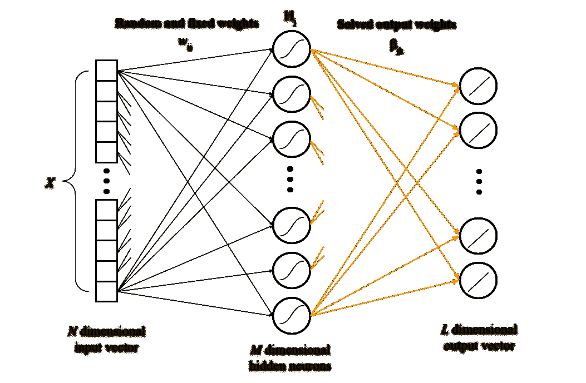
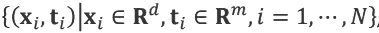
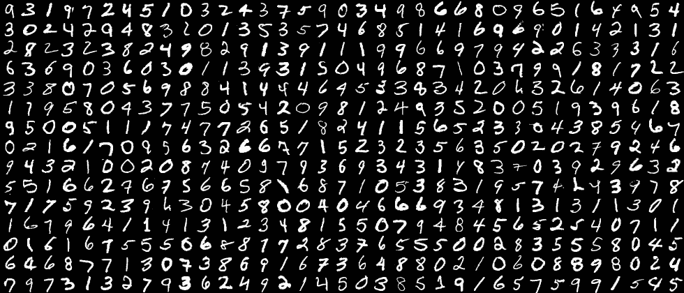
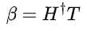
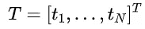
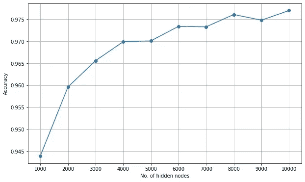

# 用 Python 构建一个极限学习机

> 原文：<https://towardsdatascience.com/build-an-extreme-learning-machine-in-python-91d1e8958599?source=collection_archive---------11----------------------->

## 无参数调整的神经网络构建指南。


乔希·里默尔在 [Unsplash](https://unsplash.com?utm_source=medium&utm_medium=referral) 上的照片

极端学习机(ELMs)是单隐层前馈神经网络(SLFNs ),与基于梯度的学习技术相比，能够更快地学习。这就像一个没有学习过程的经典的单隐层神经网络。这种神经网络不执行迭代调整，使得它比使用反向传播方法训练的网络更快，具有更好的泛化性能。

elm 基于通用近似定理，该定理指出:

> 在对激活函数的温和假设下，具有包含有限数量神经元的单个隐藏层的前馈网络可以逼近 R^n 的紧凑子集上的连续函数

这仅仅意味着，如果 ELMs 具有足够的隐藏神经元和训练数据来学习所有隐藏神经元，则 ELMs 可以以显著的准确度解决分类和回归任务。

为了理解 ELM 是如何工作的，让我向您展示一个插图和构建模型的步骤。



作者的极限学习机插图

因此，鉴于以下情况:

*   训练集



*   隐藏节点输出函数 *H* ( **w** ， *b* ， **x** )
*   隐藏节点数 *L*

我们可以通过三个简单的步骤来实现 ELM:

1.  随机分配隐藏节点 **( *w* ， *b* )** 的参数
2.  计算隐藏层输出矩阵 **H**
3.  计算输出权重 **β**

现在，让我们进入编程部分。我希望你知道如何用 python 编程，并且熟悉已经在机器学习中使用的包，例如 scikit-learn、numpy 和 pandas。



MNIST 手写数字数据集由 [stathwang](https://stathwang.github.io/) 在 [GitHub](https://stathwang.github.io/category/machine-learning.html) 上

我们将使用 MNIST 数据集训练网络来分类手写数字。

首先，我们需要导入必要的包来构建模型。

```
import numpy as np
import pandas as pd
from sklearn.model_selection import train_test_split
from sklearn.preprocessing import OneHotEncoder
from sklearn.preprocessing import MinMaxScaler
```

接下来，我们需要加载数据集来训练网络和测试模型。

```
train = pd.read_csv('mnist_train.csv')
test = pd.read_csv('mnist_test.csv')
```

作为一种预处理技术，我们将使用 scikit-learn 包中的 MinMaxScaler 和 OneHotEncoder 在(0，1)的范围内归一化我们的特征，并将我们的目标转换为 one-hot 编码格式。

```
onehotencoder = OneHotEncoder(categories='auto')
scaler = MinMaxScaler()X_train = scaler.fit_transform(train.values[:,1:])
y_train = onehotencoder.fit_transform(train.values[:,:1]).toarray()X_test = scaler.fit_transform(test.values[:,1:])
y_test = onehotencoder.fit_transform(test.values[:,:1]).toarray()
```

为了初始化我们的网络，我们需要识别以下内容:
1 .输入层的大小，即输入特征的数量
2。隐藏神经元的数量
3。隐藏权重
4 的输入。隐藏层激活功能

输入图层的大小是指数据集输入要素的数量。

```
input_size = X_train.shape[1]
```

让我们将隐藏神经元的数量初始化为 1000。

```
hidden_size = 1000
```

接下来，我们需要从高斯分布中随机初始化我们的输入权重和偏差。

```
input_weights = np.random.normal(size=[input_size,hidden_size])
biases = np.random.normal(size=[hidden_size])
```

我们将使用一个**整流线性单元(ReLU)** 作为我们的隐藏层激活函数。

注意:您可以使用不同的激活功能。

```
def relu(x):
   return np.maximum(x, 0, x)
```

我们完成了网络初始化！

接下来要做的是创建一个函数来计算输出权重，这就是我们的 ***β*** 。目标是使用范数最小二乘解最小化目标(训练标签)和输出(预测标签)之间的最小二乘误差:



其中 ***H*** (匕首)是矩阵 ***H*** ， ***T*** 是我们的目标。

我们的 ***H*** 这里是我们网络的隐藏层。让我们创建一个函数来计算我们的 ***H*** 向量。

```
def hidden_nodes(X):
    G = np.dot(X, input_weights)
    G = G + biases
    H = relu(G)
    return H
```

现在，我们只用一行代码就可以用 python 计算出我们的 ***β*** 。让我们将输出矩阵分配给一个变量名 **output_weights** 。

```
output_weights = np.dot(pinv2(hidden_nodes(X_train)), y_train)
```

代码使用函数 **pinv** 计算*的 Moore-Penrose 伪逆，我们得到*【dagger】和 ***T*** 的点积。结果是计算出的 ***β*** (隐藏为输出权重)。**

**最后，我们有了一个模型。我们没有应用任何技术来调整我们的权重，我们只是简单地计算它们。**

**为了确保我们的模型产生一个好的结果，我们必须首先测试它。让我们创建一个函数来处理测试。**

```
**def predict(X):
    out = hidden_nodes(X)
    out = np.dot(out, output_weights)
    return out**
```

**我们已经可以开始预测了。为此，让我们编写以下代码:**

```
**prediction = predict(X_test)
correct = 0
total = X_test.shape[0for i in range(total):
    predicted = np.argmax(prediction[i])
    actual = np.argmax(y_test[i])
    correct += 1 if predicted == actual else 0
accuracy = correct/total
print('Accuracy for ', hidden_size, ' hidden nodes: ', accuracy)**
```

**模型的精度是 **0.9439，**考虑到我们只有一个具有 1000 个隐藏节点的隐藏层，以及用于学习的非迭代调整，这是一个很好的结果，使得它比任何基于梯度的技术都快。**

****

**每增加一个隐藏节点的精度**

**参考上图，当将隐藏节点的数量扩展到 1000 ( **0.9439** 到 **0.977)** )时，ELM 的精度显著提高。这意味着，只要我们设置了正确的网络隐藏节点数，ELM 就能更好地进行归纳。**

**这个实现的 jupyter 笔记本可以在下面我的 GitHub 教程库中找到。**

**[](https://github.com/glenngara/tutorials) [## Glenn gara/教程

### 在 GitHub 上创建一个帐户，为 glenngara/tutorials 开发做出贡献。

github.com](https://github.com/glenngara/tutorials) 

## R 引用

[1]光，，秦，，萧启庆，[极限学习机:理论与应用](https://www.sciencedirect.com/science/article/abs/pii/S0925231206000385) (2006)，神经计算

[2]光，[极限学习机](https://www.ntu.edu.sg/home/egbhuang/)，南洋理工大学

[3]光，，秦，，萧启庆，[极限学习机:前馈神经网络的一种新的学习方案](https://ieeexplore.ieee.org/document/1380068) (2004)，IEEE 国际神经网络联合会议**