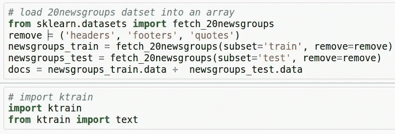
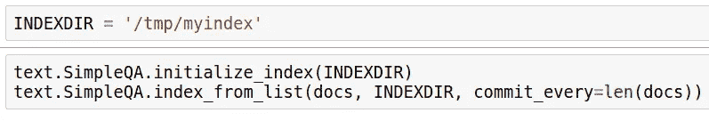
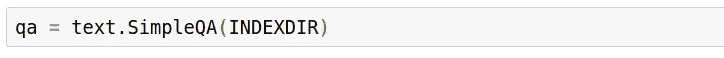
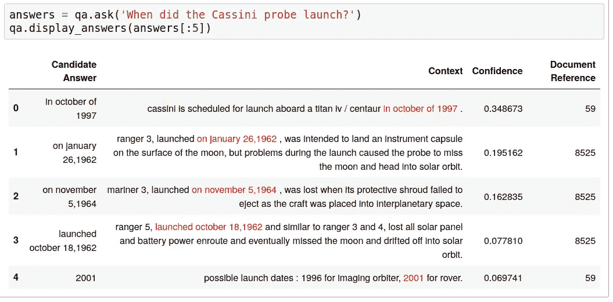
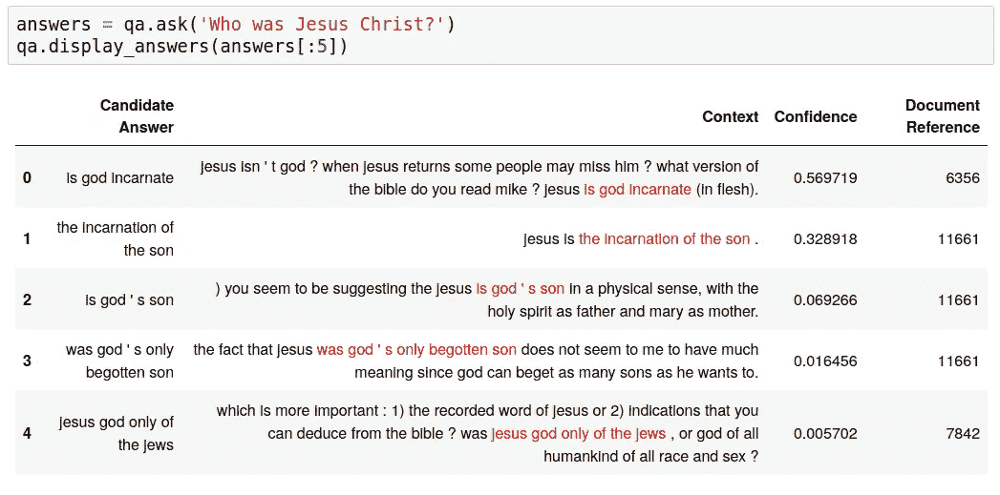
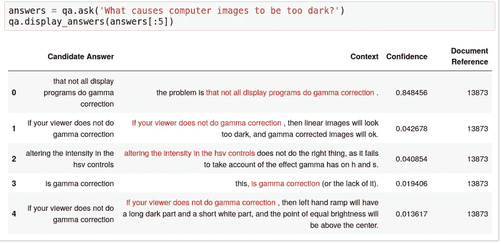

# 用 3 行代码用 BERT 构建一个开放领域的问答系统

> 原文：<https://towardsdatascience.com/build-an-open-domain-question-answering-system-with-bert-in-3-lines-of-code-da0131bc516b?source=collection_archive---------21----------------------->

## 拥抱脸变形金刚的端到端问答

来源: [Pexels](https://www.pexels.com/photo/questions-answers-signage-208494/)

**开放领域问答(QA)** 系统接受自然语言问题作为输入，并从大型文本语料库(如维基百科)中的内容返回准确的答案。这与标准搜索引擎非常不同，标准搜索引擎只是返回与搜索查询中的关键字匹配的文档。

为实际应用构建这样的系统在历史上是相当具有挑战性和复杂的。本文试图使这样的系统更容易实现和开发。在本教程中，我们将仅用 **3 行代码**构建一个全功能、端到端的开放领域 QA 系统。为了实现这一点，我们将使用 **ktrain** ，这是一个 Python 库和 TensorFlow 包装器，使深度学习和 AI 更容易访问和应用。ktrain 是免费的，开源的，这里有[的](https://github.com/amaiya/ktrain)。

这里的基本思想是将涵盖许多不同主题的文档集视为一种知识库，我们可以向其提交问题并获得准确的答案。在本文中，我们将使用 [20 个新闻组数据集](http://qwone.com/~jason/20Newsgroups/)作为知识库。作为包含大量观点、辩论和争论的新闻组帖子的集合，语料库远非理想的知识库。通常最好使用基于事实的文档，如维基百科文章，甚至新闻文章。然而， **20 个新闻组**数据集对于这个例子来说已经足够了，因为它提供了一个有趣且易于尝试的案例研究。它还强调了这样一个事实，即问答系统可以从任何文档集合中获得洞察力。

让我们首先使用 **scikit-learn** 将数据集加载到一个名为`docs`的数组中，并导入一些 *ktrain* 模块。

# 步骤 1:创建搜索索引

有了数据集，我们首先需要创建一个[搜索索引](https://en.wikipedia.org/wiki/Search_engine_indexing)。搜索索引将允许我们快速方便地检索包含问题中出现的单词的文档。这样的文档很可能包含答案，并且可以被进一步分析以提取候选答案。我们将首先初始化搜索索引，然后将 Python 列表中的文档添加到索引中。由于新闻组的帖子很小，可以放在主内存中，我们将把`commit_every`设置为一个大的值，以加快索引过程。这意味着直到最后才会写出结果。如果您遇到问题，可以尝试降低该值。

对于太大而无法加载到 Python 列表中的文档集，您可以使用`SimpleQA.index_from_folder`，它将抓取一个文件夹并索引所有找到的纯文本文档。

# 步骤 2:创建一个 QA 实例

接下来，我们将创建一个 QA 实例，它主要是来自优秀的[变形金刚库的预训练`BertForQuestionAnswering`模型的包装器。](https://huggingface.co/transformers/model_doc/bert.html#tfbertforquestionanswering)

就是这样！在大约 3 行代码中，我们构建了一个端到端的问答系统，可以随时接收问题。

# 提问！

我们将调用`qa.ask`方法向我们索引的文本语料库发出问题并检索答案。`ask`方法执行以下步骤:

1.  使用搜索索引查找问题中包含单词的文档
2.  从这些文档中提取段落用作**上下文**，并使用在[小队数据集](https://rajpurkar.github.io/SQuAD-explorer/)上预先训练的 BERT 模型解析出候选答案
3.  根据可信度分数对候选答案进行排序和删减，并返回结果

我们还将使用`qa.display`方法在我们的 Jupyter 笔记本中很好地格式化和显示前 5 个结果。由于模型正在对段落和句子进行梳理以寻找答案，因此可能需要一些时间来返回结果。

还要注意的是， **20 新闻组**数据集涵盖了 20 世纪 90 年代早期到中期的事件，因此不存在对近期事件的引用。然而，数据集涵盖了许多不同的领域类别。例如，有 **sci.space** 类别涵盖了有关太空的主题。先说一个空间问题！

**太空问题:**

> 卡西尼号探测器是什么时候发射的？

如你所见，第一个候选答案表明卡西尼太空探测器于 1997 年 10 月发射，看起来是正确的。其上下文中的特定答案在列**上下文**下以红色突出显示。请注意，正确答案不会总是最佳答案，但在这种情况下是这样的。

因为我们使用了`index_from_list`来索引文档，所以最后一列(由`answers`字典中的`reference`字段填充)显示了与包含答案的新闻组帖子相关的列表索引。此`reference`字段可用于细读包含有`print(docs[59])`答案的整个文档。如果使用`index_from_folder`来索引文档，那么`reference`字段将被替换为文档的相对文件路径。

**20 个新闻组**数据集也包含许多讨论和辩论基督教的帖子。让我们问一个关于这个主题的问题。

**宗教问题:**

> 耶稣基督是谁？

在这里，我们看到不同的观点对耶稣基督，因为辩论和讨论，在这个文件集。

最后， **20 新闻组**数据集还包含几个关于计算主题的新闻组类别，如计算机图形和 PC 硬件和软件。让我们问一个技术支持问题。

**技术支持问题:**

> 什么原因导致电脑图像太暗？

从候选答案来看，缺乏伽马校正的**似乎至少是报告问题的原因之一。**

# 关于部署质量保证系统的说明

要部署这个系统，唯一需要持久化的状态是我们在**步骤 1** 中初始化并填充的搜索索引。一旦搜索索引被初始化和填充，人们可以简单地从**步骤 2** 开始在生产环境中使用 QA 系统。

# 本文的源代码

本文的源代码有两种形式:

1.  GitHub repo 上提供的 Jupyter 笔记本
2.  谷歌 Colab 笔记本[此处有售](https://colab.research.google.com/drive/1tcsEQ7igx7lw_R0Pfpmsg9Wf3DEXyOvk)

您可以在自己的文档集中随意试用一下 *ktrain* **QA** 模块。要了解更多信息，请访问我们的 GitHub 知识库:

> 【https://github.com/amaiya/ktrain 