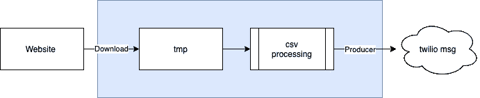
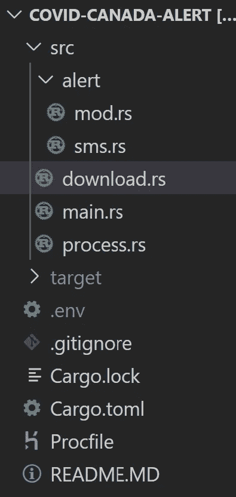
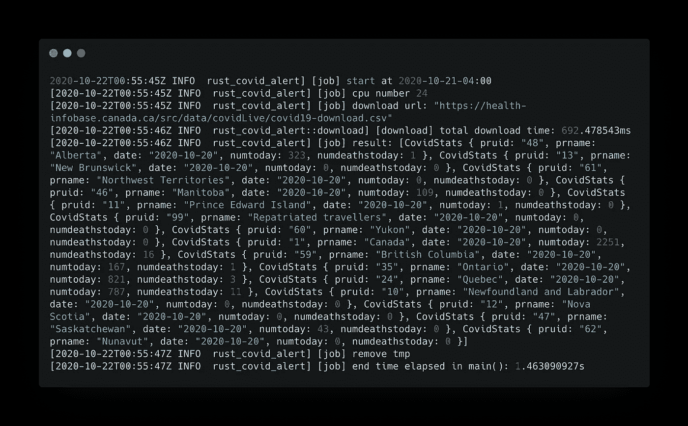
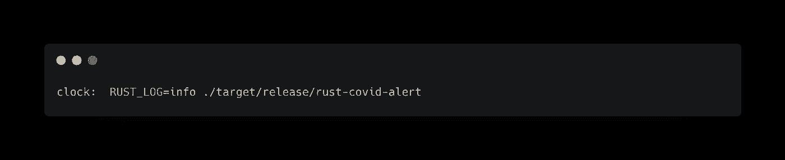
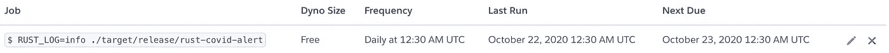

# 用 Rust 和零成本在周末建立一个短信提醒系统

> 原文：<https://towardsdatascience.com/build-an-sms-alert-system-for-canada-covid-19-cases-over-the-weekend-with-rust-and-zero-cost-235bb59ec5d?source=collection_archive---------26----------------------->

## 周末建设和学习。

> 加拿大安大略省新冠肺炎新病例短信提醒

在我们开始这个周末的构建和学习之前，我想花点时间感谢我所有的读者，他们总是支持我，给我提供一些建议和指导。

亲教会媒体在 [Unsplash](https://unsplash.com?utm_source=medium&utm_medium=referral) 上拍摄的照片

你是我继续这段旅程最重要的动力。如果你喜欢我的周末构建和学习系列，请在 Medium 上关注我。

 [## 魏黄-中号

### 声明:我在媒体上写的文章仅与我的学习和观点相关。不会代表或…

medium.com。](https://medium.com/@jayhuang75) 

# 用例

新冠肺炎改变了我们的许多日常生活；有了新常态，我们思考和做事都不一样了。

每天，我的妻子和儿子都试图从互联网上获得加拿大安大略省新冠肺炎净新增病例增长的最新情况，这已经成为他们的日常生活。

这一周，我儿子忙于他的学校作业。所以他错过了他的例行公事。当我妻子问他这个数字时，他突然意识到他忘记了这个重要的日常活动。当他冲到电脑前开始搜索号码时，他的一句话引起了我的注意。

> 如果能得到一些关于这些每日号码的推送通知，那就太棒了！

“对！你给了我一个新的想法，为我的下个周末，建立和学习系列。谢谢你，儿子。”

这个想法总是来自我们的日常生活。

由[绝对视觉](https://unsplash.com/@freegraphictoday?utm_source=medium&utm_medium=referral)在 [Unsplash](https://unsplash.com?utm_source=medium&utm_medium=referral) 上拍摄

# 非功能性需求

在把手放在键盘上之前，让我们看看我们想要构建什么，这是重要的一步。

1.  拉斯特·朗。
2.  性价比高。
3.  对于推送通知，让我们使用 SMS 作为初始用例，Twilio 提供了一些开箱即用的功能。最重要的是，还有免费订阅。
4.  能够扩展到不同的用例，比如电子邮件通知，甚至进一步的聊天机器人实现——设计模式。(依赖倒置原则和开放/封闭原则)
5.  及时调度程序— Cron 作业。
6.  易于构建和部署——我最喜欢的 Heroku。
7.  准确的数据来源——加拿大政府网站提供了一些公开可信的数据来源。

 [## 加拿大新冠肺炎病例流行病学总结 Canada.ca

### 更新:将鼠标悬停在各省和地区上以查看总案例数、活动案例数、已恢复案例数、人数…

health-infobase.canada.ca](https://health-infobase.canada.ca/covid-19/epidemiological-summary-covid-19-cases.html) 

# 架构和数据流

经过一些第一手的分析:

1.  网站上提供的数据是 CSV 文件。
2.  数据将在美国东部时间每天下午 7 点更新。有时会有一个小时的延迟。
3.  该模式涵盖了我们需要的所有内容，如日期、每个省的新病例总数等。为简单起见，我们只关注整个新病例数和唯一死亡总数。
4.  当我们完成处理后，我们需要清理 tmp 文件。减少不必要的空间和运营开销。

简单的数据流——作者截图

# 让我们开始编码部分。

> 手放在键盘上。

代码结构—作者截图

## 代码结构

该应用程序中的关键业务逻辑有 3 个主要部分:

1.  下载，基于 HTTP 请求以获取 csv 文件并返回文件路径以供将来处理。
2.  Process — **MapReduce** ，只针对安大略省的数字，似乎这就是我儿子想要的:)，这很容易扩展到不同的用例，如保存到数据库，或生产者到近实时，流等。
3.  警报组件，因为我们希望它可以基于**打开/关闭原则**进行扩展，打开扩展新的用例，但是，关闭对当前实现的修改。

此外，Procfile 是 Heroku 调度实现。

## 实际下载

**用 MapReduce 进行防锈处理**

## 警报组件

对于 alert 组件，我们将使用 Rust 特征，它模拟 Golang 接口实现。它的好处:我们可以选择一个特定的用例实现，比如 SMS、Email 或 chatbot，而一般的抽象工作流保持不变。(依赖倒置原则和开放/封闭原则)

摘要报告和生产者

关闭 SMS 实施发送到 Twilio API

下一次我们需要添加电子邮件用例时，我们只在 alert 文件夹中创建 **email.rs** ，而不在 alert 组件中创建 underline mod.rs。

## 决赛成绩

作业执行日志—按作者划分的屏幕截图

# 部署和 Cron 作业设置

对于我个人的项目，我通常使用 Heroku 进行部署；一个重要的方面是定价模式、规模和使用量。

我们还可以构建容器来部署到大多数云容器提供商，如 AKS、AWS 和 GKE。我写过一些关于这个话题的文章。

 [## 使用 Rust 处理 14 GB 文件—第 3 部分— Azure 堆栈

### 周末编码和写作

medium.com](https://medium.com/dev-genius/processing-14-gb-files-with-rust-part-3-azure-stacks-13dcf9dde014) 

然而，最终总是要做出“制造还是购买”的决定。对于一个构建者来说，我真的很喜欢在 Heroku 上开始开发、部署和设置 DevOps 功能是多么容易。

Heroku，所有必要的插件都是现成的，比如 build pack，cron jobs 的设置大多简单明了。

 [## Heroku 发展中心

### 了解如何在 Heroku 上构建、部署和管理您的应用。

devcenter.heroku.com](https://devcenter.heroku.com/) 

Heroku 中的 CRON 任务非常容易设置。在 Procfile 中简单添加

CRON 作业设置—按作者分类的屏幕截图

并根据需要进入 Heroku UI 配置您的调度程序。

设置用户界面-按作者截图

# 决赛成绩

最后，为了儿子，每天晚上八点半，短信到了。我还为 Heroku 和 Twilio 服务使用了免费层，因此总成本为 0 美元。

短信-作者截图

# 结束语

1.  建筑创意通常来源于现实生活。享受它，倾听它，感受它。
2.  当你建造的时候，你需要考虑规模。考虑为您的用例获得最大的好处；这又回到了我们的日常工作中。降低信息技术基础设施成本不是好事；这是必须要有的。你如何建造它的基础。一个很好的例子是为什么我总是跟踪容器构建大小，这是您的运行时足迹的最重要指标，它将影响您的云运行时成本。等等。
3.  正确编码，规模编码，低成本编码。

这就是这周的内容。顺便说一句，我儿子对我做的东西非常兴奋。现在我们将一起开始编写 python 代码。

再次感谢你花时间阅读我的周末建设和学习。下次见。

请看我下面的其他文章，了解更多你可能感兴趣的周末建设和学习。

 [## 魏黄-中号

### 声明:我在媒体上写的文章仅与我的学习和观点相关。不会代表或…

medium.com。](https://medium.com/@jayhuang75)